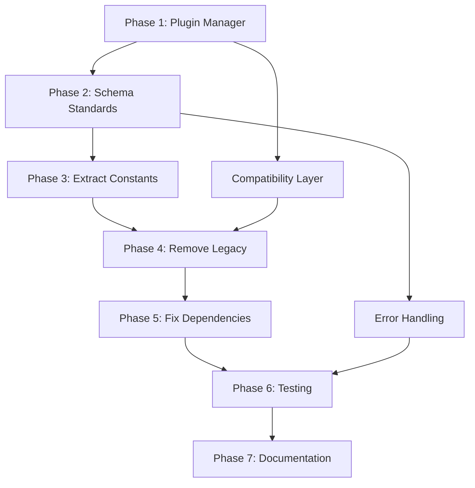

# Dependencies for Task 20250618: Legacy Code Removal

## Depends On

These tasks must be completed before starting legacy removal:

```yaml
depends_on:
  - TASK_001_SETUP_TEST_COVERAGE:
      description: "Ensure >90% test coverage before refactoring"
      status: "required"
      
  - TASK_002_BACKUP_CURRENT_STATE:
      description: "Create full backup of current working state"
      status: "required"
      
  - TASK_003_PERFORMANCE_BASELINE:
      description: "Establish performance benchmarks"
      status: "required"
```

## Blocks

These tasks cannot start until legacy removal is complete:

```yaml
blocks:
  - TASK_101_NEW_PLUGIN_ARCHITECTURE:
      description: "New plugin system depends on clean base"
      impact: "high"
      
  - TASK_102_ADVANCED_CONFIG_FEATURES:
      description: "New config features need standardized schemas"
      impact: "high"
      
  - TASK_103_PERFORMANCE_OPTIMIZATION:
      description: "Optimization requires clean codebase"
      impact: "medium"
      
  - TASK_104_DOCUMENTATION_OVERHAUL:
      description: "Docs need to reflect new architecture"
      impact: "medium"
```

## Related Tasks

These tasks are related but can proceed independently:

```yaml
related:
  - TASK_201_SECURITY_AUDIT:
      description: "Security review of configuration system"
      overlap: "config validation"
      
  - TASK_202_DOCKER_OPTIMIZATION:
      description: "Docker build improvements"
      overlap: "plugin system"
      
  - TASK_203_CI_CD_UPDATES:
      description: "Update CI/CD for new structure"
      overlap: "test coverage"
```

## Conflicts With

These tasks would conflict if done simultaneously:

```yaml
conflicts_with:
  - TASK_301_ALTERNATIVE_CONFIG_SYSTEM:
      description: "Alternative approach to config management"
      reason: "Mutually exclusive implementations"
      
  - TASK_302_QUICK_FIXES:
      description: "Band-aid fixes to current issues"
      reason: "Would be overwritten by refactoring"
```

## Sub-task Dependencies

Internal dependencies within this task:



## Critical Path

The minimum sequence for success:

1. **Week 1-2**: Generic Plugin Manager (blocks everything)
2. **Week 3-4**: Schema Standardization (parallel with constants)
3. **Week 5**: ConfigLoader Removal (requires compatibility layer)
4. **Week 6**: Dependency Resolution (requires clean imports)
5. **Week 7-8**: Testing & Validation (gates release)

## Risk Dependencies

External factors that could impact timeline:

```yaml
external_risks:
  - plugin_breaking_changes:
      impact: "high"
      mitigation: "Maintain compatibility layer"
      
  - user_adoption:
      impact: "medium"
      mitigation: "Gradual rollout with feature flags"
      
  - performance_regression:
      impact: "medium"
      mitigation: "Continuous benchmarking"
```

## Milestone Dependencies

Key milestones that unlock further work:

```yaml
milestones:
  - MILESTONE_1_PLUGIN_MANAGER_COMPLETE:
      week: 2
      unlocks: ["schema_work", "constant_extraction"]
      
  - MILESTONE_2_SCHEMAS_STANDARDIZED:
      week: 4
      unlocks: ["legacy_removal", "import_cleanup"]
      
  - MILESTONE_3_LEGACY_REMOVED:
      week: 6
      unlocks: ["performance_optimization", "new_features"]
      
  - MILESTONE_4_TESTS_PASSING:
      week: 8
      unlocks: ["production_release", "documentation"]
```

## Coordination Requirements

Teams/components that need coordination:

```yaml
coordination:
  - plugin_developers:
      notify: "2 weeks before changes"
      provide: "Migration guide and tools"
      
  - operations_team:
      notify: "1 week before deployment"
      provide: "Rollback procedures"
      
  - documentation_team:
      notify: "Week 6"
      provide: "Change summary and examples"
```

## Success Criteria for Unblocking

What must be achieved to unblock dependent tasks:

1. [ ] All tests passing (100% coverage maintained)
2. [ ] Performance benchmarks met (no regression)
3. [ ] Migration guide published
4. [ ] Compatibility layer tested
5. [ ] No breaking changes for existing plugins
6. [ ] Documentation updated
7. [ ] Code review approved
8. [ ] Integration tests passing