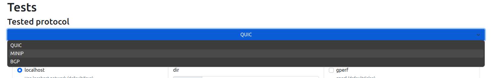
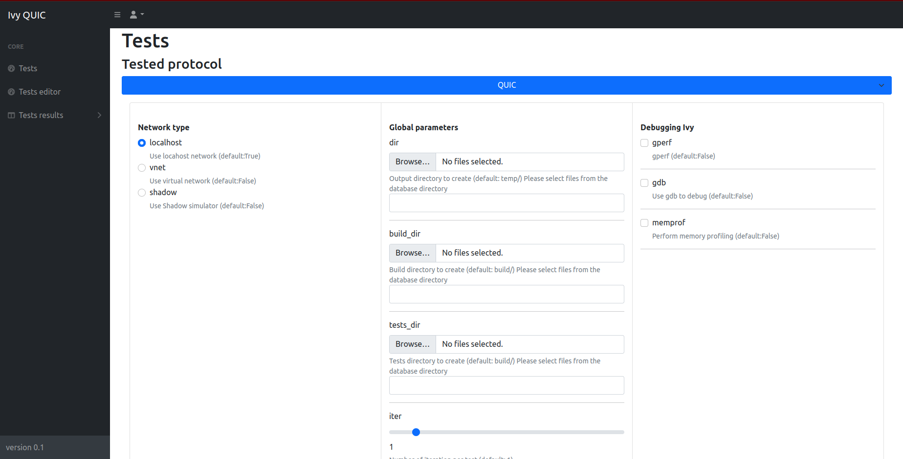
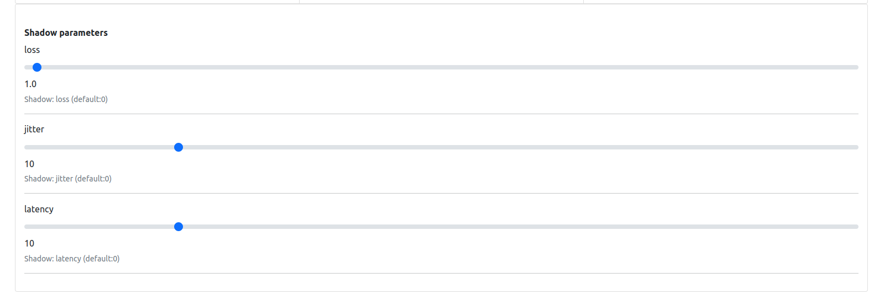
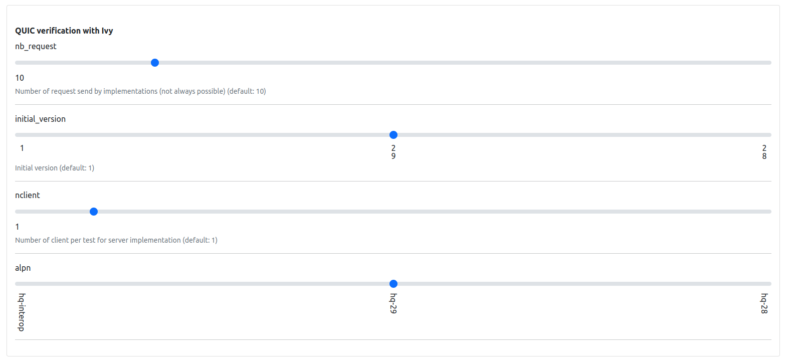
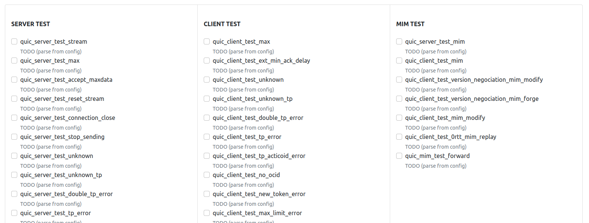
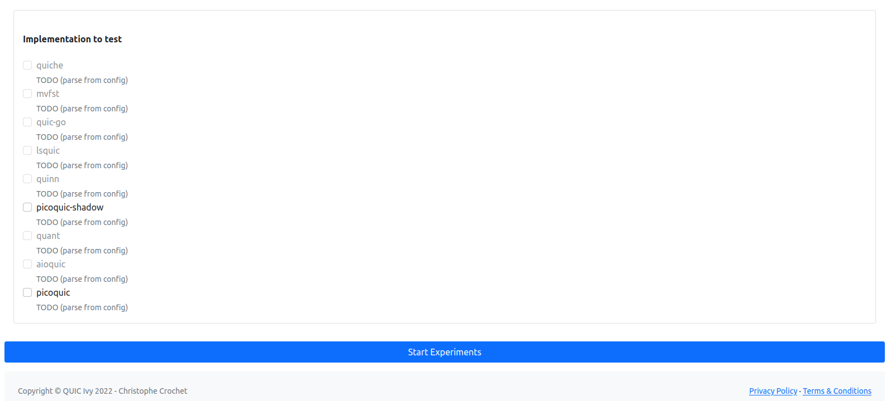

# :skull_and_crossbones: PFV (Protocols Formal Verification) :skull_and_crossbones:


[](https://doi.org/10.5281/zenodo.10819553)

  

## :rocket: Overview

PFV harnesses cutting-edge techniques in network protocol verification, merging the capabilities of the Shadow network simulator with the Ivy formal verification tool. This powerful combination facilitates the examination of time properties in network protocols. A specialized time module enhances Ivy, enabling it to handle complex quantitative-time properties with greater precision. PFV's effectiveness is highlighted through its application to the QUIC protocol. By refining QUIC's formal specification in Ivy, the tool not only verifies essential aspects of the protocol but also exposes real-world implementation errors, demonstrating its practical utility. This innovative integration paves the way for more thorough, efficient, and precise protocol testing and verification.

### :heavy_plus_sign: Multi-Protocol Support

PFV supports multiple protocols. Add new protocol specifications in the `protocols` directory, following the existing structure.
For now the following protocols are supported:
- [X] QUIC
- [X] MiniP
- [ ] BGP
- [ ] CoAP

---

## :wrench: Installation 

<details>
<summary>Click to expand</summary>

### :computer: Local Installation (Not Recommended)

<details>
<summary>Click to expand</summary>

See Dockerfile for dependencies and commands

</details>

### :whale: Single implementation 

<details>
<summary>Click to expand</summary>

```bash
# For a full installation including all dependencies and configurations:
IMPLEM="picoquic" make build-docker
```
</details>

### :whale: WebApp (Recommended) 

```bash
# For first installation 
make install

# For modification: 
## For major update in ivy:
make build-docker-compose-full
## For a minor update in some implementation:
make build-docker-compose
```

### :warning: Clean Up

<details>
<summary>Click to expand</summary>

```bash
# To clean Docker images and system:
make clean-docker-full
```
</details>

</details>

---

## :computer: Usage

<details>
<summary>Click to expand</summary>

### :book: Tests parameters

<details>
<summary>Click to expand</summary>

*Global parameters:*

| Argument               | Description                                                                                               | Default Value           |
|------------------------|-----------------------------------------------------------------------------------------------------------|-------------------------|
| `--dir`                | Output directory to create                                                                                | `temp/`                 |
| `--build_dir`          | Build directory to create                                                                                 | `build/`                |
| `--tests_dir`          | Tests directory to create                                                                                 | `build/`                |
| `--iter`               | Number of iterations per test                                                                             | `1`                     |
| `--internal_iteration` | Number of Ivy iterations per test                                                                         | `100`                   |
| `--getstats`           | Print all stats                                                                                           | `True`                  |
| `--compile`            | Compile Ivy tests                                                                                         | `True`                  |
| `--run`                | Launch or not the tested implementation                                                                   | `True`                  |
| `--timeout`            | Timeout                                                                                                   | `100 sec`               |
| `--keep_alive`         | Keep alive Ivy implementation                                                                             | `False`                 |
| `--update_ivy`         | Update `<include>` folder for picoTLS files of Ivy (defined by g++)                                       | `True`                  |
| `--docker`             | Use docker                                                                                                | `True`                  |
| `--gperf`              | gperf                                                                                                     | `False`                 |
| `--gdb`                | Use gdb to debug                                                                                          | `False`                 |
| `--memprof`            | Perform memory profiling                                                                                  | `False`                 |
| `--localhost`          | Use localhost network                                                                                     | `True`                  |
| `--vnet`               | Use virtual network                                                                                       | `False`                 |
| `--shadow`             | Use Shadow simulator                                                                                      | `False`                 |
| `--webapp`             | WebApp UI                                                                                                 | `False`                 |
| `--worker`             | Worker server mode                                                                                        | `False`                 |

*Simulator parameters:*
| Argument               | Description                                                                                               | Default Value           |
|------------------------|-----------------------------------------------------------------------------------------------------------|-------------------------|
| `--loss`               | Shadow: loss percentage                                                                                   | `0`                     |
| `--jitter`             | Shadow: jitter in milliseconds                                                                            | `10`                    |
| `--latency`            | Shadow: latency in milliseconds                                                                           | `10`                    |

*QUIC parameters:*
| Argument               | Description                                                                                               | Default Value           |
|------------------------|-----------------------------------------------------------------------------------------------------------|-------------------------|
| `--nb_request`         | Number of request send by implementations (not always possible)                                           | `10`                    |
| `--initial_version`    | Initial version for protocol testing                                                                      | `1`                     |
| `--nclient`            | Number of clients per test for server implementation                                                      | `1`                     |
| `--alpn`               | Application-Layer Protocol Negotiation options                                                            | `hq-interop`, `hq-29`, `hq-28` |

*BGP parameters:*

*CoAP parameters:*

</details>


### :computer: Single implementation (Command Line)

<details>
<summary>Click to expand</summary>

```bash
# Start a Docker container for interactive Bash access
IMPLEM="picoquic" make start-bash
python3 pfv.py --mode client --categories all --update_include_tls \
		--timeout 180 --implementations $(IMPLEM) --iter $(ITER) --compile  --initial_version 29 --alpn hq-29  
# Example: Runs a Docker container with 'picoquic' for interactive Bash access
```
</details>

### :whale: WebApp (Recommended) 

Update the `docker-compose.yml` file with the protocol implementation and run the following command:

```bash
# Compose the full Docker environment for all implementations
make compose
```

Then go to `172.27.1.10` to access the WebApp.

</details>

---

## :book: Tutorial

<details>
<summary>Click to expand</summary>

### :computer: WebApp (Recommended)

**Introduction**:

This quick guide assists you in using the Ivy QUIC web application for testing QUIC implementations.

First go to: `http://172.0.1.10/index.html`

**Configuration Steps**:

1. **Choose Protocol**: Start by selecting the protocol (QUIC, MINIP, BGP) you want to test.



2. **Set Network Type**: Opt for localhost, vnet, or shadow based on your network testing environment.

3. **Global Parameters**: Define directories for output, build, and tests using the 'Browse...' options and set the iteration count.

4. **Debugging Options**: Toggle performance and memory profiling tools like gperf, gdb, and memprof as needed.



5. **Adjust Test Settings**: Customize Shadow parameters such as loss, jitter, and latency for simulation accuracy.



6. **Protocol custom configuration**: Set the number of requests, initial version, number of clients, and ALPN for, e.g QUIC tests.



7. **Select Tests**: Choose from server, client, and MIM tests to target specific aspects of the QUIC protocol.



8. **Implementation Testing**: Pick the QUIC implementation you want to test from the available options.

9. **Start Experiments**: Hit 'Start Experiments' to begin the testing process with your configured settings.



**Running the Tests**:

After setup, monitor the tests' progress and analyze the results. Make adjustments and re-run as necessary to ensure thorough testing.

Refer to the in-app documentation for detailed instructions or contact support for troubleshooting assistance.

**Note that the similar approach can be used in the command line.**


### :computer: Adding new protocol

<details>
<summary>Click to expand</summary>

1. Add the corresponding configuration files in `src/pfv/configs/<new_protocol>/`:
    * Host related configurations:
        * `src/pfv/configs/<new_protocol>/implem-server/`: configuration files for the server implementation
        * `src/pfv/configs/<new_protocol>/implem-client/`: configuration files for the client implementation
        * (`src/pfv/configs/<new_protocol>/implem-<host_type>/`: configuration files for the <host_type> implementation)
    * Protocol related configurations:
        * `src/pfv/configs/<new_protocol>/[default_]<new_protocol>_config.ini`
        * `src/pfv/configs/<new_protocol>/default_<new_protocol>_implem.ini`
2. Create a folder in `src/implementations/<new_protocol>-implementations/` for the new protocol implementation
3. Add in `src/pfv/pfv.py` and in `src/pfv/pfv_runner/pfv_<new_protocol>_runner.py` the new protocol implementation Runner.
4. Add in `src/pfv/pfv_tester/pfv_<new_protocol>_tester.py` the new protocol implementation Tester.
5. Add in `src/pfv/pfv_stats/pfv_<new_protocol>_stats.py` the new protocol implementation stats collector.

</details>

### :computer: Adding new protocol implementation

<details>
<summary>Click to expand</summary>

1. Create the corresponding Dockerfile in `src/containers/Dockerfile.<implem>`, it should run over Ubuntu 20.04
```dockerfile
ARG image
FROM $image:latest
ADD src/implementations/<protocol>-implementations/<implem> /PFV/implementations/<protocol>-implementations/<implem>
WORKDIR /PFV/implementations/<protocol>-implementations/<implem>/

### Install dependencies

WORKDIR /PFV
```

2. Add the corresponding configuration file in `src/pfv/configs/<protocol>/.../<implem>.ini`
3. Build the docker image with `IMPLEM=<implem> make build-docker`
    * Also update the Makefile to add the new implementation (commit, building, etc)
4. Add the new implementation in `docker-compose.yml` file such as:
```yaml
  <implem>-ivy:
    hostname: <implem>-ivy
    container_name: <implem>-ivy
    image: "<implem>-ivy:latest"
    command: python3 pfv.py --update_ivy --getstats --worker --compile  --docker
    ports:
      - "<new_pôrt>:80"
    volumes:
      - ${PWD}/src/webapp/pfv_client.py:/PFV/webapp/pfv_client.py
      - ${PWD}/src/pfv/pfv.py:/PFV/pfv.py
      - ${PWD}/src/pfv/res/shadow/shadow_client_test.yml:/PFV/topo.gml
      - ${PWD}/src/pfv/res/shadow/shadow_client_test.yml:/PFV/shadow_client_test.yml
      - ${PWD}/src/pfv/res/shadow/shadow_server_test.yml:/PFV/shadow_server_test.yml
      - ${PWD}/src/pfv/res/shadow/shadow_client_test_template.yml:/PFV/shadow_client_test_template.yml
      - ${PWD}/src/pfv/res/shadow/shadow_server_test_template.yml:/PFV/shadow_server_test_template.yml
      - ${PWD}/data/tls-keys:/PFV/tls-keys
      - ${PWD}/data/tickets:/PFV/tickets
      - ${PWD}/data/qlogs:/PFV/qlogs
      - ${PWD}/src/pfv/pfv_utils/:/PFV/pfv_utils/
      - ${PWD}/src/pfv/pfv_stats/:/PFV/pfv_stats/
      - ${PWD}/src/pfv/pfv_runner/:/PFV/pfv_runner/
      - ${PWD}/src/pfv/pfv_tester/:/PFV/pfv_tester/
      - ${PWD}/src/pfv/ivy_utils/:/PFV/ivy_utils/
      - ${PWD}/src/pfv/logger/:/PFV/logger/
      - ${PWD}/src/pfv/argument_parser/:/PFV/argument_parser/
      - ${PWD}/src/pfv/configs/:/PFV/configs/
      - ${PWD}/src/Protocols-Ivy/protocol-testing/:/PFV/Protocols-Ivy/protocol-testing/
      - ${PWD}/src/Protocols-Ivy/doc/examples/quic:/PFV/Protocols-Ivy/doc/examples/quic
      - ${PWD}/src/Protocols-Ivy/ivy/:/PFV/Protocols-Ivy/ivy/
      - ${PWD}/src/Protocols-Ivy/ivy/include/1.7:/PFV/Protocols-Ivy/ivy/include/1.7
      - /tmp/.X11-unix:/tmp/.X11-unix
    networks:
      net:
        ipv4_address: 172.27.0.<TODO>
    privileged: true
    security_opt:
      - seccomp:unconfined
    cap_add:
      - NET_ADMIN
    tmpfs:
      - /dev/shm:rw,nosuid,nodev,exec,size=1024g
    environment:
      - DISPLAY=${DISPLAY}
      - XAUTHORITY=~/.Xauthority
      - ROOT_PATH=${PWD} 
      - MPLBACKEND='Agg'
    restart: always
    devices:
      - /dev/dri:/dev/dri
    depends_on:
      - ivy-standalone
```
</details>

### :computer: Ivy Model Creation

<details>
<summary>Click to expand</summary>

Follow these steps to create an Ivy model for protocol verification:

1. **RFC Analysis**: Carefully read the RFC to identify the protocol components, such as packet types and endpoints.

2. **Modeling Components**: Model the identified components without the requirements initially. Focus on their fields, potential events, etc.

3. **Serialization/Deserialization**: Implement serialization and deserialization functions for each event that could be transmitted over the network.

4. **Incorporating RFC Requirements**: Integrate the requirements specified in the RFC with the modeled components to complete the Ivy model.

</details>

<!-- ### :computer: Shadows

<details>
<summary>Click to expand</summary>

* **Configuration files:** TODO TOM
* ETC

</details> -->

<!-- ### :computer: Troubleshoting

<details>
<summary>Click to expand</summary>
TODO
</details>

---
</details> 
-->


<!-- ## :book: Some details

<details>
<summary>Click to expand</summary>

### :book: Ivy

<details>
<summary>Click to expand</summary>
TODO
</details>

### :book: Shadow

<details>
<summary>Click to expand</summary>
TODO
</details>
-->

</details>

--- 

## :open_file_folder: Project Structure

<details>
<summary>Click to expand</summary>

### :open_file_folder: Directory Structure

<details>
<summary>Click to expand</summary>

The PFV project is organized into the following key directories:

```
PFV/
└── data/
└── src/
    ├── Protocols-Ivy/
    │   ├── protocol-testing/
    │   │   ├── quic/
    │   │   ├── minip/
    │   │   ├── coap/
    │   │   └── [other protocols]
    │   └── ivy/[ivy-core]
    ├── implementations/
    │   ├── quic-implementations/
    │   │       ├── picoquic/
    │   │       ├── aioquic/
    │   │       ├── lsquic/
    │   │       └── [protocol implementations]
    │   └── [other protocols]
    ├── containers/
    │   └── [Dockerfile definitions]
    └── pfv/
        ├── pfv.py
        ├── pfv_runner/ [test preparation]
        ├── ...
        ├── pfv_tester/ [test execution]
        └── configs/
            └── [configuration files]
```
- `data/`: Data directory for storing results and logs.
- `pfv/`: Main PFV module.
- `Protocols-Ivy/`: Core of protocol specifications and testing.
- `implementations/`: Various QUIC implementation modules.
- `containers/`: Dockerfile definitions for different environments.


</details>

### :framed_picture: Architecture Diagrams

<details>
<summary>Click to expand</summary>

| Docker Compose Architecture | Docker Container Internal Architecture |
|:---------------------------:|:--------------------------------------:|
| %20project.%20It%20shows%20various%20Docker%20contain.png) | %20project.%20The%20diagram%20should%20show%20the%20layering%20of%20co.png) |

</details>


</details>

---

## :book: References

<details>
<summary>Click to expand</summary>

For further reading and context on the topics and methodologies used in this tool, refer to the following articles:
- Crochet, C., Rousseaux, T., Piraux, M., Sambon, J.-F., & Legay, A. (2021). Verifying quic implementations using ivy. In *Proceedings of the 2021 Workshop on Evolution, Performance and Interoperability of QUIC*. [DOI](10.1145/3488660.3493803)

- Crochet, C., & Sambon, J.-F. (2021). Towards verification of QUIC and its extensions. (Master's thesis, UCL - Ecole polytechnique de Louvain). Available at [UCLouvain](http://hdl.handle.net/2078.1/thesis:30559). Keywords: QUIC, Formal Verification, RFC, IETF, Specification, Ivy, Network.


For other useful resources, see the following:

- McMillan, K. L., & Padon, O. (2018). Deductive Verification in Decidable Fragments with Ivy. In A. Podelski (Ed.), *Static Analysis - 25th International Symposium, SAS 2018, Freiburg, Germany, August 29-31, 2018, Proceedings* (pp. 43–55). Springer. [DOI](10.1007/978-3-319-99725-4_4) - [PDF](SAS18.pdf)

- Taube, M., Losa, G., McMillan, K. L., Padon, O., Sagiv, M., Shoham, S., Wilcox, J. R., & Woos, D. (2018). Modularity for decidability of deductive verification with applications to distributed systems. In *Proceedings of the 39th ACM SIGPLAN Conference on Programming Language Design and Implementation, PLDI 2018, Philadelphia, PA, USA, June 18-22, 2018* (pp. 662–677). ACM. [DOI](10.1145/3192366.3192414)

- Padon, O., Hoenicke, J., McMillan, K. L., Podelski, A., Sagiv, M., & Shoham, S. (2018). Temporal Prophecy for Proving Temporal Properties of Infinite-State Systems. In *2018 Formal Methods in Computer Aided Design, FMCAD 2018, Austin, TX, USA, October 30 - November 2, 2018* (pp. 1–11). IEEE. [DOI](10.23919/FMCAD.2018.8603008) - [PDF](FMCAD18.pdf)

- Padon, O., McMillan, K. L., Panda, A., Sagiv, M., & Shoham, S. (2016). Ivy: safety verification by interactive generalization. In *Proceedings of the 37th ACM SIGPLAN Conference on Programming Language Design and Implementation, PLDI 2016, Santa Barbara, CA, USA, June 13-17, 2016* (pp. 614–630). ACM. [DOI](10.1145/2908080.2908118)

- McMillan, K. L. (2016). Modular specification and verification of a cache-coherent interface. In *2016 Formal Methods in Computer-Aided Design, FMCAD 2016, Mountain View, CA, USA, October 3-6, 2016* (pp. 109–116). [DOI](10.1109/FMCAD.2016.7886668)

- McMillan, K. L., & Zuck, L. D. (2019). Formal specification and testing of QUIC. In *Proceedings of ACM Special Interest Group on Data Communication (SIGCOMM’19)*. ACM. Note: to appear. [PDF](SIGCOMM19.pdf)
- [Ivy Documentation](https://microsoft.github.io/ivy/)
- [Ivy GitHub Repository](https://github.com/microsoft/ivy)

</details>
