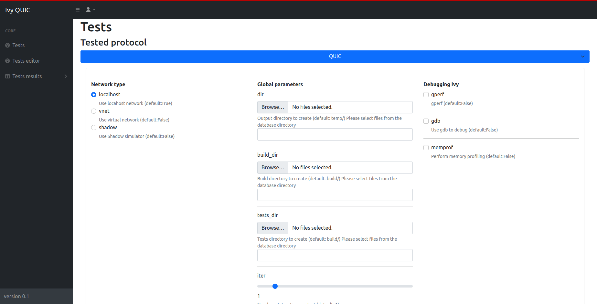
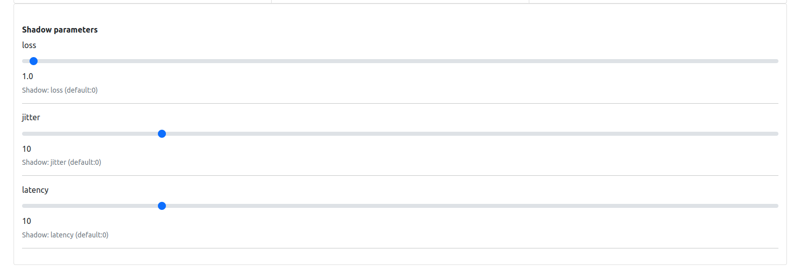
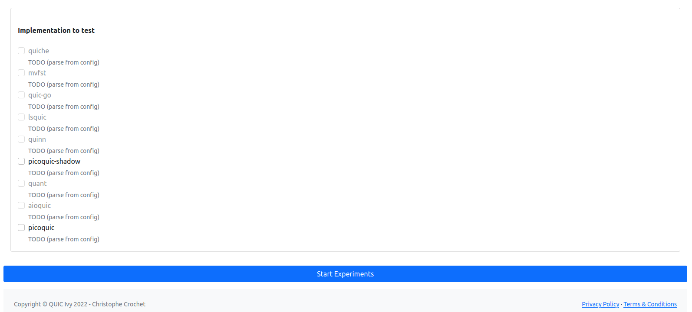

# :computer: Usage


## :book: Tests parameters


*Global parameters:*

| Argument               | Description                                                                                               | Default Value           |
|------------------------|-----------------------------------------------------------------------------------------------------------|-------------------------|
| `--dir`                | Output directory to create                                                                                | `temp/`                 |
| `--build_dir`          | Build directory to create                                                                                 | `build/`                |
| `--tests_dir`          | Tests directory to create                                                                                 | `build/`                |
| `--iter`               | Number of iterations per test                                                                             | `1`                     |
| `--internal_iteration` | Number of Ivy iterations per test                                                                         | `100`                   |
| `--getstats`           | Print all stats                                                                                           | `True`                  |
| `--compile`            | Compile Ivy tests                                                                                         | `True`                  |
| `--run`                | Launch or not the tested implementation                                                                   | `True`                  |
| `--timeout`            | Timeout                                                                                                   | `100 sec`               |
| `--keep_alive`         | Keep alive Ivy implementation                                                                             | `False`                 |
| `--update_ivy`         | Update `<include>` folder for picoTLS files of Ivy (defined by g++)                                       | `True`                  |
| `--docker`             | Use docker                                                                                                | `True`                  |
| `--gperf`              | gperf                                                                                                     | `False`                 |
| `--gdb`                | Use gdb to debug                                                                                          | `False`                 |
| `--memprof`            | Perform memory profiling                                                                                  | `False`                 |
| `--localhost`          | Use localhost network                                                                                     | `True`                  |
| `--vnet`               | Use virtual network                                                                                       | `False`                 |
| `--shadow`             | Use Shadow simulator                                                                                      | `False`                 |
| `--webapp`             | WebApp UI                                                                                                 | `False`                 |
| `--worker`             | Worker server mode                                                                                        | `False`                 |

*Simulator parameters:*

| Argument               | Description                                                                                               | Default Value           |
|------------------------|-----------------------------------------------------------------------------------------------------------|-------------------------|
| `--loss`               | Shadow: loss percentage                                                                                   | `0`                     |
| `--jitter`             | Shadow: jitter in milliseconds                                                                            | `10`                    |
| `--latency`            | Shadow: latency in milliseconds                                                                           | `10`                    |

*QUIC parameters:*

| Argument               | Description                                                                                               | Default Value           |
|------------------------|-----------------------------------------------------------------------------------------------------------|-------------------------|
| `--nb_request`         | Number of request send by implementations (not always possible)                                           | `10`                    |
| `--initial_version`    | Initial version for protocol testing                                                                      | `1`                     |
| `--nclient`            | Number of clients per test for server implementation                                                      | `1`                     |
| `--alpn`               | Application-Layer Protocol Negotiation options                                                            | `hq-interop`, `hq-29`, `hq-28` |

*BGP parameters:*

*CoAP parameters:*


## :computer: Single implementation (Command Line)


```bash
# Start a Docker container for interactive Bash access
IMPLEM="picoquic" make start-bash
python3 panther.py --mode client --categories all --update_include_tls \
		--timeout 180 --implementations $(IMPLEM) --iter $(ITER) --compile  --initial_version 29 --alpn hq-29  
# Example: Runs a Docker container with 'picoquic' for interactive Bash access
```


## :whale: WebApp (Recommended) 

Update the `docker-compose.yml` file with the protocol implementation and run the following command:

```bash
# Compose the full Docker environment for all implementations
make compose
```

Then go to `172.27.1.10` to access the WebApp.


---

## :book: Tutorial


### :computer: WebApp (Recommended)

**Introduction**:

This quick guide assists you in using the Ivy QUIC web application for testing QUIC implementations.

First go to: `http://172.27.1.10/index.html`

**Configuration Steps**:

1. **Choose Protocol**: Start by selecting the protocol (QUIC, MINIP, BGP) you want to test.


2. **Set Network Type**: Opt for localhost, vnet, or shadow based on your network testing environment.

3. **Global Parameters**: Define directories for output, build, and tests using the 'Browse...' options and set the iteration count.

4. **Debugging Options**: Toggle performance and memory profiling tools like gperf, gdb, and memprof as needed.



5. **Adjust Test Settings**: Customize Shadow parameters such as loss, jitter, and latency for simulation accuracy.



6. **Protocol custom configuration**: Set the number of requests, initial version, number of clients, and ALPN for, e.g QUIC tests.


7. **Select Tests**: Choose from server, client, and MIM tests to target specific aspects of the QUIC protocol.


8. **Implementation Testing**: Pick the QUIC implementation you want to test from the available options.

9. **Start Experiments**: Hit 'Start Experiments' to begin the testing process with your configured settings.



**Running the Tests**:

After setup, monitor the tests' progress and analyze the results. Make adjustments and re-run as necessary to ensure thorough testing.

Refer to the in-app documentation for detailed instructions or contact support for troubleshooting assistance.

**Note that the similar approach can be used in the command line.**


### :computer: Adding new protocol


1. Add the corresponding configuration files in `src/panther/configs/<new_protocol>/`:
    * Host related configurations:
        * `src/panther/configs/<new_protocol>/implem-server/`: configuration files for the server implementation
        * `src/panther/configs/<new_protocol>/implem-client/`: configuration files for the client implementation
        * (`src/panther/configs/<new_protocol>/implem-<host_type>/`: configuration files for the <host_type> implementation)
    * Protocol related configurations:
        * `src/panther/configs/<new_protocol>/[default_]<new_protocol>_config.ini`
        * `src/panther/configs/<new_protocol>/default_<new_protocol>_implem.ini`
2. Create a folder in `panther/panther_worker/app/implementations/<new_protocol>-implementations/` for the new protocol implementation
3. Add in `src/panther/panther.py` and in `src/panther/panther_runner/panther_<new_protocol>_runner.py` the new protocol implementation Runner.
4. Add in `src/panther/panther_tester/panther_<new_protocol>_tester.py` the new protocol implementation Tester.
5. Add in `src/panther/panther_stats/panther_<new_protocol>_stats.py` the new protocol implementation stats collector.


### :computer: Adding new protocol implementation


1. Create the corresponding Dockerfile in `src/containers/Dockerfile.<implem>`, it should run over Ubuntu 20.04
```dockerfile
ARG image
FROM $image:latest
ADD panther/panther_worker/app/implementations/<protocol>-implementations/<implem> /PANTHER/implementations/<protocol>-implementations/<implem>
WORKDIR /PANTHER/implementations/<protocol>-implementations/<implem>/

### Install dependencies

WORKDIR /PANTHER
```

2. Add the corresponding configuration file in `src/panther/configs/<protocol>/.../<implem>.ini`
3. Build the docker image with `IMPLEM=<implem> make build-docker`
    * Also update the Makefile to add the new implementation (commit, building, etc)
4. Add the new implementation in `docker-compose.yml` file such as:
```yaml
  <implem>-ivy:
    hostname: <implem>-ivy
    container_name: <implem>-ivy
    image: "<implem>-ivy:latest"
    command: python3 panther.py --update_ivy --getstats --worker --compile  --docker
    ports:
      - "<new_pôrt>:80"
    volumes:
      - ${PWD}/src/webapp/panther_client.py:/PANTHER/webapp/panther_client.py
      - ${PWD}/src/panther/panther.py:/PANTHER/panther.py
      - ${PWD}/src/panther/res/shadow/shadow_client_test.yml:/PANTHER/topo.gml
      - ${PWD}/src/panther/res/shadow/shadow_client_test.yml:/PANTHER/shadow_client_test.yml
      - ${PWD}/src/panther/res/shadow/shadow_server_test.yml:/PANTHER/shadow_server_test.yml
      - ${PWD}/src/panther/res/shadow/shadow_client_test_template.yml:/PANTHER/shadow_client_test_template.yml
      - ${PWD}/src/panther/res/shadow/shadow_server_test_template.yml:/PANTHER/shadow_server_test_template.yml
      - ${PWD}/data/tls-keys:/PANTHER/tls-keys
      - ${PWD}/data/tickets:/PANTHER/tickets
      - ${PWD}/data/qlogs:/PANTHER/qlogs
      - ${PWD}/src/panther/panther_utils/:/PANTHER/panther_utils/
      - ${PWD}/src/panther/panther_stats/:/PANTHER/panther_stats/
      - ${PWD}/src/panther/panther_runner/:/PANTHER/panther_runner/
      - ${PWD}/src/panther/panther_tester/:/PANTHER/panther_tester/
      - ${PWD}/src/panther/ivy_utils/:/PANTHER/ivy_utils/
      - ${PWD}/src/panther/logger/:/PANTHER/logger/
      - ${PWD}/src/panther/argument_parser/:/PANTHER/argument_parser/
      - ${PWD}/src/panther/configs/:/PANTHER/configs/
      - ${PWD}/src/Protocols-Ivy/protocol-testing/:/PANTHER/Protocols-Ivy/protocol-testing/
      - ${PWD}/src/Protocols-Ivy/doc/examples/quic:/PANTHER/Protocols-Ivy/doc/examples/quic
      - ${PWD}/src/Protocols-Ivy/ivy/:/PANTHER/Protocols-Ivy/ivy/
      - ${PWD}/src/Protocols-Ivy/ivy/include/1.7:/PANTHER/Protocols-Ivy/ivy/include/1.7
      - /tmp/.X11-unix:/tmp/.X11-unix
    networks:
      net:
        ipv4_address: 172.27.0.<TODO>
    privileged: true
    security_opt:
      - seccomp:unconfined
    cap_add:
      - NET_ADMIN
    tmpfs:
      - /dev/shm:rw,nosuid,nodev,exec,size=1024g
    environment:
      - DISPLAY=${DISPLAY}
      - XAUTHORITY=~/.Xauthority
      - ROOT_PATH=${PWD} 
      - MPLBACKEND='Agg'
    restart: always
    devices:
      - /dev/dri:/dev/dri
    depends_on:
      - ivy-standalone
```


### :computer: Ivy Model Creation


Follow these steps to create an Ivy model for protocol verification:

1. **RFC Analysis**: Carefully read the RFC to identify the protocol components, such as packet types and endpoints.

2. **Modeling Components**: Model the identified components without the requirements initially. Focus on their fields, potential events, etc.

3. **Serialization/Deserialization**: Implement serialization and deserialization functions for each event that could be transmitted over the network.

4. **Incorporating RFC Requirements**: Integrate the requirements specified in the RFC with the modeled components to complete the Ivy model.


<!-- ### :computer: Shadows


* **Configuration files:** TODO TOM
* ETC

 -->

<!-- ### :computer: Troubleshoting


TODO


---
 
-->


<!-- ## :book: Some details


### :book: Ivy


TODO


### :book: Shadow


TODO

-->


--- 
