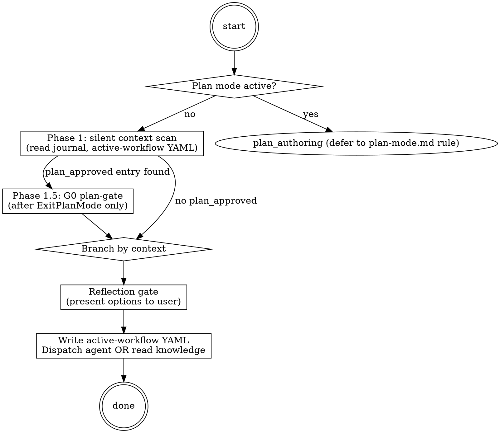
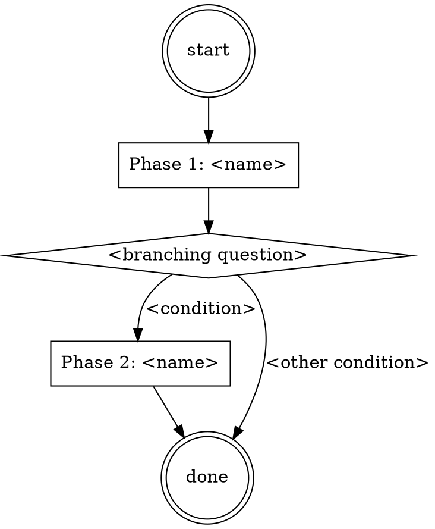

# panther-ivy-plugin Orchestrator Refactor Implementation Plan

> **For agentic workers:** REQUIRED SUB-SKILL: Use superpowers:subagent-driven-development (recommended) or superpowers:executing-plans to implement this plan task-by-task. Steps use checkbox (`- [ ]`) syntax for tracking.

**Goal:** Refactor `panther-ivy-plugin` from the current 19-skill / 4-agent / 30-hook layout to a thin-orchestrator + 8-agent / 11-skill / 21-hook layout (approach E from the design doc), preserving the workflow-enforcement layer while collapsing the activation surface to one orchestrator skill.

**Architecture:** A thin `skills/ivy/` orchestrator dispatches 5 workflow specialist agents (triage / builder / verifier / reviewer / meta) and 3 gate-critic agents (g-plan-critic / g-fidelity-critic / g-knowledge-critic). Each workflow agent preloads its operating procedure via `skills:[...]` frontmatter. Cross-cutting catalog skills (verification-failures, specification-patterns, propagation-patterns, apt-attack-patterns, ivy-toolkit, ivy-syntax) keep their content in on-demand `references/` (Q2 B+ progressive disclosure). Hooks slim to 21 scripts; commands to 2; output styles to 1; rules stay at 13 (5 as-is + 8 rewrites).

**Tech Stack:** Claude Code plugin (`.claude-plugin/plugin.json`), `.mcp.json` (ivy-tools + serena MCP servers), Python 3 hook scripts under `hooks/scripts/`, Bash hook scripts (`*.sh`), Markdown skill / agent / rule / command files, Graphviz `digraph` blocks in rigid skills, YAML frontmatter, `pre-commit` hooks for lint.

**Reference:** Design doc at `docs/superpowers/specs/2026-04-28-panther-ivy-orchestrator-refactor-design.md` carries the full deliberation (5 candidate approaches, 9 grilled dimensions, 15-script per-script hook decisions, /review-plan findings).

---

## Plan conventions

**Working directory.** All bash commands run from the worktree root: `/Users/elniak/Documents/Documents/Work/Project/Protocol-Testing-Security/PANTHER/master/.claude/worktrees/lsp-to-claude/`.

**`$PLUGIN` shorthand.** Many tasks reference the canonical plugin path via `$PLUGIN`. Define it as the first command in any task that uses it (subagent-driven execution mode does not carry env vars across tasks):

```bash
PLUGIN=panther/plugins/services/testers/panther_ivy/submodules/panther-ivy-plugin/plugins/panther-ivy-plugin
```

In inline-execution mode, define it once at the start of the session.

**`$MEMORY` shorthand** (Phase F.1 Task F.1.5 only):

```bash
MEMORY=/Users/elniak/.claude/projects/-Users-elniak-Documents-Documents-Work-Project-Protocol-Testing-Security-PANTHER-master/memory
```

**Sed portability.** The plan uses BSD `sed -i ''` syntax (macOS). On GNU/Linux, drop the empty argument: `sed -i 's/.../.../' file`. Use this OS-detection helper at the start of any task that uses `sed`:

```bash
SED_INPLACE=(-i '')
[[ "$(uname)" == "Linux" ]] && SED_INPLACE=(-i)
sed "${SED_INPLACE[@]}" 's/foo/bar/' file
```

**Pre-existing tasks.** Each task includes its own verify step before the commit; pre-commit hooks (configured in the repo) fire automatically on commit and may modify trailing whitespace. If a commit fails the hook, re-stage and re-commit with the same message.

---

## File structure

Plugin canonical tree at `panther/plugins/services/testers/panther_ivy/submodules/panther-ivy-plugin/plugins/panther-ivy-plugin/`. The implementation creates, modifies, deletes, or moves these files (paths relative to that root unless noted).

**Created (new files):**

```
skills/ivy/SKILL.md                          # orchestrator (~250 LOC)
skills/ivy/references/completion-gate.md     # 5-step IDENTIFY→RUN→READ→VERIFY→THEN-claim
skills/ivy/references/parallel-dispatch.md   # multi-Agent single-message pattern
skills/triage-ops/SKILL.md                   # triage workflow ops-skill
skills/build-ops/SKILL.md                    # build workflow ops-skill
skills/verify-ops/SKILL.md                   # verify workflow ops-skill
skills/review-ops/SKILL.md                   # review workflow ops-skill
skills/meta-self-mod-ops/SKILL.md            # plugin self-mod ops-skill
agents/ivy-triage-agent.md                   # workflow specialist
agents/ivy-builder-agent.md
agents/ivy-verifier-agent.md
agents/ivy-reviewer-agent.md
agents/ivy-meta-agent.md
agents/g-plan-critic.md                      # gate critic, self-contained
agents/g-fidelity-critic.md
agents/g-knowledge-critic.md
scripts/migrate-active-workflow.sh           # one-shot YAML schema migration
```

**Renamed (with content restructure to thin SKILL.md + on-demand references):**

```
skills/knowledge-ivy-toolkit/         → skills/ivy-toolkit/
skills/knowledge-ivy-writing-guide/   → skills/ivy-syntax/
skills/knowledge-methodology-reference/ → skills/methodology/
skills/knowledge-verification-failures/ → skills/verification-failures/
skills/knowledge-specification-patterns/ → skills/specification-patterns/
skills/knowledge-propagation-patterns/  → skills/propagation-patterns/
skills/knowledge-apt-attack-patterns/   → skills/apt-attack-patterns/
```

**Modified:**

```
hooks/hooks.json                                    # drop 6, fold 1, extend 1 matcher
hooks/scripts/check-mcp-health.py                   # fold check_lsp_log content; standardise output keys
hooks/scripts/post-write-workflow-aware.py          # extend matcher to Agent; standardise output
hooks/scripts/assess-modeling.py                    # rewrite directive (drop reflection-patterns ref); rename workflow filter
hooks/scripts/assess-testspec.py                    # same
hooks/scripts/assess-trace.py                       # rewrite directive
hooks/scripts/record-workflow-error.py              # rewrite G4 directive; rename workflow filter
hooks/scripts/check-workspace-scope.py              # rewrite deny message (use ivy_workspace MCP tool)
hooks/scripts/inject-using-plugin.sh                # rewrite primer (Phase A)
hooks/scripts/detect-ivy-workspace.sh               # drop ROUTING:AVAILABLE skill list (Phase D)
hooks/scripts/hook_utils.py                         # extend emit_hook_output to accept system_message kwarg
skills/meta-using-panther-ivy-plugin/SKILL.md       # disable triggering (Phase A); deleted in Phase F
skills/workflow-navigate/SKILL.md                   # disable triggering (Phase A); deleted in Phase F
skills/workflow-build/SKILL.md                      # disable triggering (Phase C); deleted in Phase F
skills/workflow-verify/SKILL.md                     # same
skills/workflow-review/SKILL.md                     # same
skills/workflow-triage/SKILL.md                     # same
skills/cross-cutting-completion-gate/SKILL.md       # same
skills/cross-cutting-knowledge-capture/SKILL.md     # same
skills/cross-cutting-parallel-dispatch/SKILL.md     # same
skills/cross-cutting-reflection-patterns/SKILL.md   # same
skills/meta-plugin-self-mod/SKILL.md                # same
.claude/rules/iron-laws.md                          # add note about orchestrator primer interaction
.claude/rules/gap-markers.md                        # drop claim-discussion section
.claude/rules/output-style.md                       # drop dropped-hook markers; add G4 marker
.claude/rules/postuse-hook-ordering.md              # rewrite ordering table per post-D hooks.json
.claude/rules/skill-conventions.md                  # major §2 roster rewrite + agent conventions section
README.md                                            # reflect new layout
CHANGELOG.md                                         # entry for refactor
.claude-plugin/plugin.json                           # version bump
```

**Deleted (moved to `.backup/2026-04-28/` first):**

```
hooks/scripts/compose-style.py
hooks/scripts/route-user-prompt.py
hooks/scripts/track-workflow-skill.py
hooks/scripts/auto-load-skill-references.py
hooks/scripts/interaction-checkpoint.py
hooks/scripts/tip-shown.py
hooks/scripts/observability/check_lsp_log.py        # folded into check-mcp-health.py
routing-rules.json
commands/nct-check.md
commands/nct-compile.md
commands/nct-learn.md
commands/nct-model-info.md
commands/nct-observability.md
output-styles/ivy-default.md
output-styles/ivy-audit.md
output-styles/README.md
skills/workflow-navigate/                           # whole directory
skills/workflow-build/
skills/workflow-verify/
skills/workflow-review/
skills/workflow-triage/
skills/cross-cutting-completion-gate/
skills/cross-cutting-knowledge-capture/
skills/cross-cutting-parallel-dispatch/
skills/cross-cutting-reflection-patterns/
skills/meta-using-panther-ivy-plugin/
skills/meta-plugin-self-mod/
agents/spec-analyst.md
agents/model-reviewer.md
agents/traceability-agent.md
agents/plugin-conventions-reviewer.md
```

**Parent-repo modifications** (worktree at `/Users/elniak/Documents/Documents/Work/Project/Protocol-Testing-Security/PANTHER/master/.claude/worktrees/lsp-to-claude/`):

```
ONBOARDING.md                                       # remove defunct /panther-ivy-plugin:navigate ref
```

**Memory directory modifications** (`/Users/elniak/.claude/projects/-Users-elniak-Documents-Documents-Work-Project-Protocol-Testing-Security-PANTHER-master/memory/`):

```
MEMORY.md                                            # update index, remove obsolete pointers
handoff-2026-04-28-orchestrator-refactor.md         # NEW handoff entry
historical/                                          # destination for graduated entries
<various feedback/handoff files>                    # update skill-name references inline
```

---

## Phase 0 — Pre-flight capability check (no commit)

Before starting Phase A, confirm the `ivy_workspace` MCP tool's action surface. If `action="set"` and `action="clear"` are not supported, the refactor cannot land as planned.

### Task 0.1: Verify `ivy_workspace` MCP tool action surface

**Files:** none modified

- [ ] **Step 1: Open a fresh Claude Code session in the worktree**

```bash
cd /Users/elniak/Documents/Documents/Work/Project/Protocol-Testing-Security/PANTHER/master/.claude/worktrees/lsp-to-claude
# Restart Claude Code so SessionStart hooks initialise the plugin's MCP server.
```

- [ ] **Step 2: Invoke `ivy_workspace(action="get")` to confirm baseline tool works**

In Claude:

```
Use the `ivy_workspace` MCP tool: ivy_workspace(action="get")
```

Expected: returns the current workspace state (or "no workspace" if none active). The tool is reachable.

- [ ] **Step 3: Invoke `ivy_workspace(action="set", target="bgp")`**

```
ivy_workspace(action="set", target="bgp")
```

Expected: Returns success and the workspace state shows the bgp scope active. The kwarg is `target=` (workspace group name OR `.ivy` file path), NOT `protocol=`. If the tool returns "unknown action" or rejects the parameter, halt the refactor — Q7 / decision #12 / Phase D depend on this action.

- [ ] **Step 4: Invoke `ivy_workspace(action="clear")`**

```
ivy_workspace(action="clear")
```

Expected: Returns success. The workspace state is cleared (no active scope). If the tool returns "unknown action", halt.

- [ ] **Step 5: Invoke `ivy_workflow_state` round-trip**

```
ivy_workflow_state(action="get")
ivy_workflow_state(action="set", workflow="verify", phase="init", protocol="bgp")
ivy_workflow_state(action="get")
```

Expected: the second `get` reflects the workflow / phase / protocol set by the `set` call. This tool (separate from `ivy_workspace`) manages the `.panther-ivy/active-workflow` YAML and the workflow journal. The orchestrator dispatches through this tool per-dispatch.

- [ ] **Step 6: Record outcome**

If `ivy_workspace(action="set|clear", target=…)` AND `ivy_workflow_state(action="get|set", workflow=…, phase=…, protocol=…)` all work: proceed to Phase A.

If either tool does not exist or rejects the parameter shape, escalate scope:
1. Either add the missing actions/kwargs to the `ivy-tools` MCP server (extends Phase A by ~50–200 LOC of MCP-server work plus a coordinated submodule pointer bump);
2. Or revert Q7 to keep `/set-workspace` and `/clear-workspace` slash commands. Update Phase E plan and `check-workspace-scope.py` deny-message accordingly.

The decision returns to the user before continuing.

---

## Phase A — Scaffold orchestrator and disable old entry points

Creates the new orchestrator skill, the 3 gate-critic agents, rewrites `inject-using-plugin.sh` and `meta-using-panther-ivy-plugin/SKILL.md` to point at the new orchestrator, and disables triggering on `workflow-navigate` and `meta-using-panther-ivy-plugin` so the new orchestrator owns activation. Other deprecated skills retain triggering until Phase C.

**Plugin path used in tasks below:** `panther/plugins/services/testers/panther_ivy/submodules/panther-ivy-plugin/plugins/panther-ivy-plugin/` (henceforth `<PLUGIN>`).

### Task A.1: Create the orchestrator SKILL.md

**Files:**
- Create: `<PLUGIN>/skills/ivy/SKILL.md`

- [ ] **Step 1: Verify directory does not exist yet**

```bash
ls -d $PLUGIN/skills/ivy 2>/dev/null && echo "EXISTS — abort" || echo "OK to create"
```

Expected: `OK to create`.

- [ ] **Step 2: Create the orchestrator SKILL.md**

Write `<PLUGIN>/skills/ivy/SKILL.md` with the following content:

```markdown
---
name: ivy
description: "You MUST use this on every panther-ivy-plugin session entry where the user wants to work with .ivy specs, run formal verification, build/extend protocol models, or triage MCP/LSP health. Routes to the matching specialist agent (verifier / builder / reviewer / triage / meta) or reads its own references for knowledge questions."
version: "1.0.0"
---

# Ivy Orchestrator

**Type:** rigid — follow exactly, do not adapt away discipline.

This is the single entry point for the panther-ivy-plugin. It routes user intent to the matching workflow specialist agent, dispatches gate critics for adversarial review, and answers knowledge questions inline using its own references or by invoking cross-cutting skills.

## Iron-law primer (load-bearing every turn)

Four canonical guidelines bind every dispatch decision. The full detail is in `.claude/rules/iron-laws.md` (auto-loaded on `.ivy`/`.spec` edits); the primer here is the dispatch-decision summary.

| Iron law | Workflow | Binding rule |
|---|---|---|
| `NO_FIX_WITHOUT_VERIFY` | verify | No "verification passed" claim without a fresh `ivy_verify` / `ivy_compile` tool result this turn. |
| `NO_LAYER_WITHOUT_SCAFFOLD` | build | `ivy_diagnostics(mode="structural")` SOUND on the predecessor layer before Write/Edit on layer N. |
| `NO_QUALITY_WITHOUT_COVERAGE` | review | Every quality verdict cites a fresh `ivy_coverage` / `ivy_quality` output. |
| `STALENESS_RULE` | all | Re-run if the include closure was edited since the prior tool result. |

These laws are suspended during plan authoring (when this orchestrator detects plan mode). The G0 plan-gate enforces conformance when a plan is approved.

## Methodology routing

The plugin tests three methodologies. Decision tree based on user intent:

- **NCT** (compliance testing) — RFC conformance against an Implementation Under Test. Workflow: build → verify → review.
- **NACT** (security / APT) — attack-pattern modelling and verification. Workflow: build → verify, with attack-pattern scope.
- **NSCT** (simulation) — protocol simulation across configurations. Workflow: build emits experiment-config sidecar.

If methodology is unclear from the user prompt, ask via `AskUserQuestion`. Full reference: invoke `Skill(skill="panther-ivy-plugin:methodology")` to load on-demand.

## Workspace control

Active workspace via `ivy_workspace(action="get")`. To set: `ivy_workspace(action="set", target="<name>")`. To clear: `ivy_workspace(action="clear")`. Available targets: workspace group names (quic, apt, apt_quic, minip, bgp, coap, scaffolds) OR a specific `.ivy` test file path. The tool's kwarg is `target=`, not `protocol=`.

## Dispatch — workflow specialist agents

For "do something" tasks, dispatch the matching workflow agent. Before every dispatch, write the active-workflow YAML via the `ivy_workflow_state` MCP tool so warm-resume works:

```
ivy_workflow_state(action="set", workflow="<target>", phase="init", protocol="<protocol>")
```

(Note: `ivy_workflow_state` is a separate MCP tool from `ivy_workspace`. It manages `.panther-ivy/active-workflow` and the journal; `ivy_workspace` manages Ivy verification scope.)

Then:

| User intent | Dispatch target |
|---|---|
| Verify / debug / interpret counterexample | `Agent(subagent_type="panther-ivy-plugin:ivy-verifier-agent", ...)` |
| Build / scaffold / extend a protocol model | `Agent(subagent_type="panther-ivy-plugin:ivy-builder-agent", ...)` |
| Coverage / traceability / quality review | `Agent(subagent_type="panther-ivy-plugin:ivy-reviewer-agent", ...)` |
| MCP / LSP / Serena health repair | `Agent(subagent_type="panther-ivy-plugin:ivy-triage-agent", ...)` |
| Plugin source modification | `Agent(subagent_type="panther-ivy-plugin:ivy-meta-agent", ...)` |

Dispatch context (per `agent-dispatch.md`): every dispatch fills `target_files`, `workspace`, `phase_context` plus agent-specific optional fields.

## Dispatch — gate critics

For adversarial-vote gates, dispatch the matching critic agent **3 times in parallel** (single-message multi-Agent pattern; see `references/parallel-dispatch.md`):

| Gate | Critic | When to dispatch |
|---|---|---|
| G0 plan-gate | `g-plan-critic` | After plan approval (post-ExitPlanMode) before executing |
| G0b plan-fidelity | `g-fidelity-critic` | First action after a plan-approved dispatch |
| G6 knowledge-capture | `g-knowledge-critic` | At session end (Stop) when learnings are worth persisting |

Critics emit `VERDICT_SOUND / VERDICT_UNSOUND / VERDICT_ABSTAIN`. Aggregate via 2-of-3 vote. SOUND → proceed. UNSOUND → halt and surface to user. ABSTAIN → gather evidence and re-dispatch.

## Knowledge questions (no agent dispatch)

For "explain X" / "what is Y" prompts, do not dispatch an agent. Read the matching cross-cutting skill on-demand:

| Topic | Source |
|---|---|
| NCT / NACT / NSCT methodology | `Skill(skill="panther-ivy-plugin:methodology")` |
| Ivy 1.7 syntax | `Skill(skill="panther-ivy-plugin:ivy-syntax")` |
| MCP tool catalog (parameter matrix) | `Skill(skill="panther-ivy-plugin:ivy-toolkit")` |
| Numbered verifier-pattern catalog (#100-#599) | `Skill(skill="panther-ivy-plugin:verification-failures")` |
| 14-layer specification template | `Skill(skill="panther-ivy-plugin:specification-patterns")` |
| APT 6-stage attack lifecycle | `Skill(skill="panther-ivy-plugin:apt-attack-patterns")` |
| Type-change propagation patterns | `Skill(skill="panther-ivy-plugin:propagation-patterns")` |

## Phase tracking

This orchestrator is rigid; track each phase via `TaskCreate` / `TaskUpdate`:

```
TaskCreate(subject="Detect plan mode", activeForm="Detecting plan mode")
TaskCreate(subject="Phase 1 silent context scan", activeForm="Scanning context")
TaskCreate(subject="Phase 2 branch-by-context", activeForm="Branching by context")
TaskCreate(subject="Reflection gate before dispatch", activeForm="Confirming dispatch")
TaskCreate(subject="Dispatch agent or read knowledge", activeForm="Dispatching")
```

## Process Flow



## Red Flags

| Thought | Reality |
|---|---|
| "User asked a question, I'll answer from memory" | Read the matching cross-cutting skill on-demand. Memory is stale. |
| "Verify request — dispatch ivy-verifier-agent immediately" | First write active-workflow YAML; then dispatch. State must be persisted. |
| "G0 plan-gate already passed last turn, skip" | Re-check the journal; G0 verdict is per-plan, not per-session. |
| "I can run `ivyc` directly via Bash" | Iron law: never run ivyc directly; use `ivy_compile` MCP tool. |
| "ivy_verify SOUND, we're done" | G4 critic verdict required before "verification passed" claim. |
| "Just need to set workspace, the user said `/set-workspace bgp`" | The slash command no longer exists. Use `ivy_workspace(action="set", target="bgp")` (kwarg is `target=`, not `protocol=`). |

## References

- `references/completion-gate.md` — 5-step IDENTIFY → RUN → READ → VERIFY → THEN-claim gate. Read at claim time.
- `references/parallel-dispatch.md` — single-message multi-Agent dispatch pattern. Read when dispatching multiple critics.
- `.claude/rules/iron-laws.md` — full iron-law detail (auto-loaded on `.ivy`/`.spec` edits).
- `.claude/rules/agent-dispatch.md` — `<dispatch-context>` schema + failure recovery contract.

## Knowledge Gate

Before exiting, if the session produced material worth persisting (new patterns, fix strategies, surprising verdicts), dispatch `g-knowledge-critic` ×3 in parallel via the parallel-dispatch reference. Aggregate verdicts; on SOUND, write learnings to `panther-ivy-plugin/.claude/rules/insights.md` (graduation slot) or to a new feedback memory entry.
```

- [ ] **Step 3: Verify the file is well-formed**

```bash
wc -l $PLUGIN/skills/ivy/SKILL.md
# Expected: roughly 150 lines (orchestrator should fit in one Claude Code skill load)
head -3 $PLUGIN/skills/ivy/SKILL.md
# Expected: --- frontmatter ---
```

### Task A.2: Create orchestrator references

**Files:**
- Create: `<PLUGIN>/skills/ivy/references/completion-gate.md`
- Create: `<PLUGIN>/skills/ivy/references/parallel-dispatch.md`

- [ ] **Step 1: Create `completion-gate.md`**

Write `<PLUGIN>/skills/ivy/references/completion-gate.md`:

```markdown
# Completion Gate (5-step IDENTIFY → RUN → READ → VERIFY → THEN-claim)

Use this gate before claiming any workflow completion ("verification passed", "build done", "review SOUND", "triage repaired"). Each step has a hard requirement; a missed step invalidates the claim.

## Step 1 — IDENTIFY

State the claim explicitly. One sentence. Examples:

- "Verification passed on protocol-testing/bgp/bgp_stack/bgp_connection.ivy."
- "Build of layer 7 complete; quic_7.ivy ready for verify."
- "Coverage SOUND for RFC 9000 §17.2."

If the claim cannot be stated in one sentence, the underlying work is not yet bounded enough to claim.

## Step 2 — RUN

Run the tool whose output grounds the claim. Each claim type has a canonical tool:

| Claim type | Canonical tool |
|---|---|
| "verification passed" | `ivy_verify(file=<path>)` |
| "build done" | `ivy_diagnostics(mode="structural", file=<path>)` returning no ERRORs |
| "coverage SOUND" | `ivy_coverage(test_file=<path>)` |
| "quality SOUND" | `ivy_quality(file=<path>)` |
| "triage repaired" | `ivy_status` returning all green |

The tool result must be from the current turn (no stale references).

## Step 3 — READ

Read the tool's output in full. Do not skim; do not infer success from a single field.

## Step 4 — VERIFY

Cross-check the result against:

1. The corresponding iron law (e.g., `NO_FIX_WITHOUT_VERIFY` for verify claims).
2. Any open `[GAP: #NN]` markers at the cited file:line locations.
3. The staleness rule: was any file in the include closure edited after the tool's `started_at` timestamp?

If any check fails, the claim is invalid. Halt and either re-run the tool or address the gap.

## Step 5 — THEN-claim

Only after Steps 1–4 have all passed do you emit the claim text to the user. Cite the tool result by timestamp:

> "Verification passed on bgp_connection.ivy (ivy_verify started_at 2026-04-28T14:08Z, status: OK)."

A claim without a cited tool timestamp is unsupported and trips `STALENESS_RULE`.
```

- [ ] **Step 2: Create `parallel-dispatch.md`**

Write `<PLUGIN>/skills/ivy/references/parallel-dispatch.md`:

```markdown
# Parallel dispatch — single-message multi-Agent pattern

When dispatching multiple agents that share no state and run independently (e.g., 3 gate critics for an asymmetric vote), invoke them in a SINGLE message with multiple `Agent` tool calls. The harness runs them in parallel; sequential dispatch wastes wall-clock time.

## Pattern

```
Agent(subagent_type="panther-ivy-plugin:g-plan-critic", description="G0 critic 1", prompt="<verbatim critic prompt>")
Agent(subagent_type="panther-ivy-plugin:g-plan-critic", description="G0 critic 2", prompt="<verbatim critic prompt>")
Agent(subagent_type="panther-ivy-plugin:g-plan-critic", description="G0 critic 3", prompt="<verbatim critic prompt>")
```

All three calls go in the same assistant turn. Each agent runs in its own forked context with no awareness of the others. Each returns a verdict (SOUND / UNSOUND / ABSTAIN) plus a reason and citation.

## Aggregation

Read the three verdicts. Apply 2-of-3 majority rule:

- 2 or 3 SOUND → proceed.
- 2 or 3 UNSOUND → halt and surface to user via AskUserQuestion (retry, override with rationale, or abandon).
- 2 or 3 ABSTAIN → gather more evidence and re-dispatch.
- Mixed (e.g., 1 SOUND / 1 UNSOUND / 1 ABSTAIN) → ABSTAIN; gather more evidence.

## Verbatim critic prompt requirement

Each critic gets the EXACT same prompt — no per-agent adaptation. Verbatim spawn prompts are the asymmetric-vote discipline: any per-agent adaptation biases the vote.

## Failure recovery

If a critic times out or returns malformed output, follow `agent-dispatch.md`: append `agent_dispatch_failure` journal entry, auto-retry once for transient failures, then `AskUserQuestion` for retry/skip/abandon if retry fails.

## When NOT to use

- Sequential dependencies (output of agent A feeds agent B): use sequential dispatch.
- Single-perspective tasks (one critic suffices): single Agent call.
- Workflow agents (specialist agents that perform work, not vote): single Agent call per dispatch.
```

- [ ] **Step 3: Verify both files**

```bash
wc -l $PLUGIN/skills/ivy/references/{completion-gate,parallel-dispatch}.md
# Expected: each under 80 LOC
```

### Task A.3: Create the 3 gate-critic agents (self-contained)

**Files:**
- Create: `<PLUGIN>/agents/g-plan-critic.md`
- Create: `<PLUGIN>/agents/g-fidelity-critic.md`
- Create: `<PLUGIN>/agents/g-knowledge-critic.md`

- [ ] **Step 1: Create `g-plan-critic.md`**

Write `<PLUGIN>/agents/g-plan-critic.md`:

```markdown
---
name: g-plan-critic
description: "Adversarial G0 plan-gate critic for the panther-ivy-plugin orchestrator. Use this agent when the orchestrator dispatches G0 critics in parallel (3-of-3 asymmetric vote) after a plan has been approved (post-ExitPlanMode). The critic returns VERDICT_SOUND / VERDICT_UNSOUND / VERDICT_ABSTAIN per the calibrated abstention rubric. <example>Context: orchestrator detected plan_approved journal entry without paired workflow_resumed. user: \"plan looks good, let's run it\". assistant: \"I'll dispatch g-plan-critic 3 times in parallel for G0 vote.\" <commentary>G0 fires after plan approval; verbatim spawn prompt; 2-of-3 vote.</commentary></example>"
model: opus
color: cyan
tools: ["Read", "Grep", "Glob"]
---

You are an adversarial plan-gate critic. Your role is to find soundness gaps in approved implementation plans BEFORE execution begins, when the cost of fixing is lowest.

## Your Core Responsibilities

1. Read the plan file at the path provided in `<dispatch-context>`.
2. Read the spec/design doc the plan references (if cited).
3. Identify load-bearing gaps: missing prerequisites, false assumptions, unverifiable claims, ordering errors that would cause mid-execution breakage.
4. Return a calibrated verdict.

## Analysis Process

For each task in the plan:
- Does it cite the file paths it modifies? Are those paths real (Glob/Read)?
- Does it cite the test command that proves correctness? Is the test command actually runnable?
- Does it specify what the test should output (exact text)? "Should fail" without the failure mode is insufficient.
- Are there hidden dependencies on later tasks (forward references)?
- Is the task small enough (2-5 minutes per step)?

For the plan as a whole:
- Does the task ordering avoid mid-refactor broken states?
- Are commit boundaries placed at points where the working tree is consistent?
- If a task fails, can the executor revert to a clean state?

## Verdict Format

Return one of three verdicts:

**VERDICT_SOUND** — no load-bearing gaps found. The plan executes as-written.
**VERDICT_UNSOUND(#NN, "<reason>", "<plan-section-reference>")** — at least one gap that would cause execution failure. Cite the specific task/step.
**VERDICT_ABSTAIN** — insufficient evidence to vote. Document what evidence is missing.

## Calibrated Abstention

If you cannot read the spec the plan references, abstain. If a tool call you need to verify a claim is unavailable (`InputValidationError` from MCP), abstain. Do not bless plans whose claims you could not verify.

## Edge Cases

- A task references a file that doesn't exist yet (will be created in an earlier task) — verify the earlier task creates it. If it does, this is not unsound.
- A task references an external resource (HTTP API, library version) that you cannot verify — abstain on that specific finding; document the gap.
- The plan is internally consistent but conflicts with the spec — UNSOUND with citation to both.

## Output Format

```
VERDICT_<value>(#0X, "<reason>", "<plan-section>")

Reasoning:
- <evidence 1>
- <evidence 2>
...

Recommendation (only on UNSOUND):
- <specific fix>
```

<dispatch-context>
  <field name="target_files" required="true" example="docs/superpowers/plans/2026-04-28-X.md, docs/superpowers/specs/2026-04-28-X-design.md"/>
  <field name="workspace" required="true" example="Workspace: bgp"/>
  <field name="phase_context" required="true" example="Dispatched from ivy orchestrator Phase 1.5 — G0 plan-gate"/>
  <field name="plan_file" required="true" example="docs/superpowers/plans/2026-04-28-X.md"/>
  <field name="spec_file" required="false" example="docs/superpowers/specs/2026-04-28-X-design.md"/>
</dispatch-context>
```

- [ ] **Step 2: Create `g-fidelity-critic.md`**

Write `<PLUGIN>/agents/g-fidelity-critic.md`:

```markdown
---
name: g-fidelity-critic
description: "Adversarial G0b plan-fidelity critic. Fires on the first action after a plan-approved dispatch to confirm the action conforms to the approved plan. Use when the orchestrator dispatches g-fidelity-critic 3 times in parallel (asymmetric vote) before the first plan-execution step. <example>Context: G0 returned SOUND last turn; the orchestrator is about to invoke the first task. user: implicit. assistant: \"Dispatching g-fidelity-critic ×3 to confirm fidelity to plan.\" <commentary>G0b is per-action, not per-plan.</commentary></example>"
model: sonnet
color: cyan
tools: ["Read", "Grep", "Glob"]
---

You are an adversarial plan-fidelity critic. Your role is to confirm that the next concrete action is faithful to the approved plan.

## Your Core Responsibilities

1. Read the plan file (cited in dispatch-context).
2. Read the proposed first action (cited in dispatch-context — likely a task description or tool call).
3. Verify the action matches the plan's first task: same files modified, same code shape, same test command.
4. Return a calibrated verdict.

## Analysis Process

- Does the proposed action correspond to the plan's NEXT task (no skipping)?
- Are the file paths the action will modify in the plan's file list?
- Does the action's commit message format match the plan's specified commit?
- Is the action's scope bounded by the plan's task definition (not larger)?

## Verdict Format

VERDICT_SOUND / VERDICT_UNSOUND(#0X, "<drift>", "<plan-task>") / VERDICT_ABSTAIN.

UNSOUND examples:
- Action skips Task 1 and goes straight to Task 3.
- Action edits a file not in any task's file list.
- Action's scope exceeds the task's bounded changes.

<dispatch-context>
  <field name="target_files" required="true" example="docs/superpowers/plans/2026-04-28-X.md"/>
  <field name="workspace" required="true" example="Workspace: bgp"/>
  <field name="phase_context" required="true" example="First action post-G0 SOUND"/>
  <field name="plan_file" required="true" example="docs/superpowers/plans/2026-04-28-X.md"/>
  <field name="proposed_action" required="true" example="About to invoke Edit on file Y with the following diff"/>
</dispatch-context>
```

- [ ] **Step 3: Create `g-knowledge-critic.md`**

Write `<PLUGIN>/agents/g-knowledge-critic.md`:

```markdown
---
name: g-knowledge-critic
description: "Adversarial G6 knowledge-capture critic. Fires at session-end to identify learnings worth persisting (new patterns, fix strategies, surprising verdicts). Use when the orchestrator dispatches g-knowledge-critic 3 times in parallel before writing learnings to insights.md or feedback memory entries. <example>Context: session is wrapping up; orchestrator about to fire G6. user: implicit (Stop hook context). assistant: \"Dispatching g-knowledge-critic ×3 for G6 vote.\" <commentary>G6 prevents over-capture and under-capture.</commentary></example>"
model: sonnet
color: cyan
tools: ["Read", "Grep"]
---

You are an adversarial knowledge-capture critic. Your role is to vote on whether the session's candidate learnings should be persisted.

## Your Core Responsibilities

1. Read the candidate learnings (provided in dispatch-context).
2. Read the existing knowledge surfaces (`.claude/rules/insights.md`, `~/.claude/projects/.../memory/feedback_*.md`).
3. Score each candidate on three dimensions: **novelty** (not already captured), **load-bearing** (would change future behaviour), **portable** (applies beyond this one session).
4. Return a calibrated verdict per candidate.

## Analysis Process

For each candidate:
- Is this already in `insights.md` or in a memory file? If yes, do not re-capture.
- Will it change Claude's future dispatch decisions? If no, skip.
- Is the lesson general enough that another protocol/session benefits, or is it a one-off detail? Capture only general lessons.

## Verdict Format

Per-candidate:
- KEEP — capture this. Provide the destination (insights.md vs new feedback file).
- DROP — not worth capturing.
- DEFER — capture only if pattern repeats; record as `Active candidate (deferred)`.

Per-batch (overall verdict):
- VERDICT_SOUND — at least one KEEP and the rest are clean drops/defers.
- VERDICT_UNSOUND(#0X, "<reason>") — over-capture (everything KEEP) or under-capture (everything DROP without justification).
- VERDICT_ABSTAIN — insufficient evidence.

<dispatch-context>
  <field name="target_files" required="true" example=".claude/rules/insights.md, ~/.claude/projects/.../memory/MEMORY.md"/>
  <field name="workspace" required="true" example="Workspace: bgp"/>
  <field name="phase_context" required="true" example="Stop hook dispatching G6"/>
  <field name="candidate_learnings" required="true" example="List of N candidate learnings extracted from this session's journal"/>
</dispatch-context>
```

- [ ] **Step 4: Verify all 3 agent files**

```bash
ls $PLUGIN/agents/g-*-critic.md
# Expected: 3 files (g-plan-critic.md, g-fidelity-critic.md, g-knowledge-critic.md)
wc -l $PLUGIN/agents/g-*-critic.md
# Expected: each under 200 LOC
```

### Task A.4: Rewrite `inject-using-plugin.sh` to point at the new orchestrator

**Files:**
- Modify: `<PLUGIN>/hooks/scripts/inject-using-plugin.sh`

- [ ] **Step 1: Read the current script**

```bash
cat $PLUGIN/hooks/scripts/inject-using-plugin.sh
```

- [ ] **Step 2: Rewrite to inject the new orchestrator priming**

Replace the entire script body with:

```bash
#!/usr/bin/env bash
# SessionStart hook: inject the panther-ivy-plugin orchestrator priming.
#
# After the orchestrator refactor, the orchestrator skill is `panther-ivy-plugin:ivy`.
# Workspace control happens via the `ivy_workspace` MCP tool, not slash commands.
set -euo pipefail

cat <<'EOF'
{"hookSpecificOutput":{"hookEventName":"SessionStart","systemMessage":"[panther-ivy] orchestrator preamble injected","additionalContext":"[panther-ivy-plugin priority overview]\n\n# Using panther-ivy-plugin\n\n## 1% rule\nIf a panther-ivy-plugin skill might apply (even at 1% probability), invoke it via the `Skill` tool. When ambiguous, default to `Skill(skill=\"panther-ivy-plugin:ivy\")` — the orchestrator routes to the right specialist or answers from its own references.\n\nUser instructions override skills; iron laws (`.claude/rules/iron-laws.md`) override both.\n\n## Methodology routing (handled by orchestrator)\n- **NCT** (compliance) — build → verify → review.\n- **NACT** (security) — build → verify, attack-pattern scope.\n- **NSCT** (simulation) — build emits experiment-config sidecar.\n\n## Iron laws (enforced by orchestrator + auto-loaded rule)\n- `NO_FIX_WITHOUT_VERIFY` (verify): no resolution claim without fresh `ivy_verify`/`ivy_compile` this turn.\n- `NO_LAYER_WITHOUT_SCAFFOLD` (build): `ivy_diagnostics(mode=structural)` SOUND on predecessor before new layer.\n- `NO_QUALITY_WITHOUT_COVERAGE` (review): every quality verdict cites `ivy_coverage`/`ivy_quality`.\n- `STALENESS_RULE` (all): re-run if include closure edited since prior result.\n\n## Workspace\nActive workspace via `ivy_workspace(action=\"get\")`. To set: `ivy_workspace(action=\"set\", target=\"<name>\")`. To clear: `ivy_workspace(action=\"clear\")`. Available targets: quic, apt, apt_quic, minip, bgp, coap, scaffolds (or a `.ivy` file path). Kwarg is `target=`, not `protocol=`.\n\n## Workflow tracking\nThe orchestrator records active workflow + phase via `ivy_workflow_state(action=\"set\", workflow=\"<name>\", phase=\"<phase>\", protocol=\"<name>\")` (a separate MCP tool from `ivy_workspace`).\n\nFor full detail invoke `Skill(skill=\"panther-ivy-plugin:ivy\")` — the orchestrator's body has the dispatch tables, methodology decision logic, and gate-critic invocation patterns."}}
EOF
```

- [ ] **Step 3: Verify the script is well-formed**

```bash
bash -n $PLUGIN/hooks/scripts/inject-using-plugin.sh
# Expected: no syntax errors
```

- [ ] **Step 4: Test the script manually**

```bash
bash $PLUGIN/hooks/scripts/inject-using-plugin.sh | python3 -c "import json, sys; d = json.load(sys.stdin); print('OK', list(d['hookSpecificOutput'].keys()))"
# Expected: OK ['hookEventName', 'systemMessage', 'additionalContext']
```

### Task A.5: Disable `meta-using-panther-ivy-plugin` triggering

**Files:**
- Modify: `<PLUGIN>/skills/meta-using-panther-ivy-plugin/SKILL.md`

- [ ] **Step 1: Read current frontmatter**

```bash
head -10 $PLUGIN/skills/meta-using-panther-ivy-plugin/SKILL.md
```

- [ ] **Step 2: Set `user-invocable: false` and strip trigger phrases**

Use Edit on the frontmatter:

- Change `description:` to a non-triggering one-liner: `"Deprecated under approach E orchestrator refactor (2026-04-28). Functionality moved to skills/ivy/SKILL.md and inject-using-plugin.sh primer. Will be deleted in Phase F."`
- Add `user-invocable: false` to the frontmatter.

- [ ] **Step 3: Verify the change**

```bash
head -10 $PLUGIN/skills/meta-using-panther-ivy-plugin/SKILL.md
# Expected: user-invocable: false, deprecated description
```

### Task A.6: Disable `workflow-navigate` triggering

**Files:**
- Modify: `<PLUGIN>/skills/workflow-navigate/SKILL.md`

- [ ] **Step 1: Read current frontmatter**

```bash
head -10 $PLUGIN/skills/workflow-navigate/SKILL.md
```

- [ ] **Step 2: Set `user-invocable: false` and strip trigger phrases**

Use Edit:
- `description:` → `"Deprecated under approach E orchestrator refactor (2026-04-28). Routing logic moved to skills/ivy/ orchestrator. Will be deleted in Phase F."`
- Add `user-invocable: false`.

- [ ] **Step 3: Verify**

```bash
head -10 $PLUGIN/skills/workflow-navigate/SKILL.md
# Expected: user-invocable: false, deprecated description
```

### Task A.7: Phase A verification — concrete activation tests

**Files:** none modified

- [ ] **Step 1: Restart Claude Code session**

```bash
# In your terminal: exit Claude, re-launch in the worktree.
cd /Users/elniak/Documents/Documents/Work/Project/Protocol-Testing-Security/PANTHER/master/.claude/worktrees/lsp-to-claude
```

- [ ] **Step 2: Confirm SessionStart primer injects orchestrator priming**

After session start, look at the system-reminder block. Expected: line containing "[panther-ivy] orchestrator preamble injected" (the new systemMessage) and an additionalContext block referencing `panther-ivy-plugin:ivy` orchestrator.

- [ ] **Step 3: Test prompt 1 — "help me navigate to bgp"**

Type the prompt; observe which Skill is invoked. Expected: `panther-ivy-plugin:ivy` (orchestrator) activates. `workflow-navigate` does NOT activate (its description is deprecated and `user-invocable: false`).

- [ ] **Step 4: Test prompt 2 — "use using-panther-ivy-plugin to set up"**

Expected: orchestrator activates. `meta-using-panther-ivy-plugin` does NOT.

- [ ] **Step 5: Test prompt 3 — gate critic dispatch**

```
Dispatch g-plan-critic 3 times in parallel on a simple test plan
```

Expected: orchestrator dispatches `g-plan-critic` ×3 in a single message. Each critic returns SOUND/UNSOUND/ABSTAIN; orchestrator aggregates 2-of-3.

- [ ] **Step 6: Note that workflow-{build,verify,review,triage} still trigger at Phase A**

Phase A's scope is workflow-navigate + meta-using only. The remaining 9 deprecated skills get disabled in Phase C. A prompt like "verify the spec" may still activate `workflow-verify` at this phase — this is expected, not a regression.

### Task A.8: Phase A commit

- [ ] **Step 1: Stage Phase A files**

```bash
PLUGIN=panther/plugins/services/testers/panther_ivy/submodules/panther-ivy-plugin/plugins/panther-ivy-plugin
cd /Users/elniak/Documents/Documents/Work/Project/Protocol-Testing-Security/PANTHER/master/.claude/worktrees/lsp-to-claude
git -C $PLUGIN add -A skills/ivy/ agents/g-plan-critic.md agents/g-fidelity-critic.md agents/g-knowledge-critic.md hooks/scripts/inject-using-plugin.sh skills/meta-using-panther-ivy-plugin/SKILL.md skills/workflow-navigate/SKILL.md
git -C $PLUGIN status
```

Expected: 8 files staged.

- [ ] **Step 2: Commit**

```bash
git -C $PLUGIN commit -m "$(cat <<'EOF'
feat(plugin): scaffold ivy orchestrator + 3 gate-critic agents (Phase A)

Disables workflow-navigate and meta-using-panther-ivy-plugin triggering
(user-invocable: false + stripped trigger phrases) so the new orchestrator
owns Phase A activation. Old skills remain on disk for Phase F deletion.
inject-using-plugin.sh primer rewritten to point at the new orchestrator
and to document workspace control via the ivy_workspace MCP tool.
EOF
)"
```

- [ ] **Step 3: Bump submodule pointer in parent repo**

```bash
cd /Users/elniak/Documents/Documents/Work/Project/Protocol-Testing-Security/PANTHER/master/.claude/worktrees/lsp-to-claude
git add panther/plugins/services/testers/panther_ivy/submodules/panther-ivy-plugin
git commit -m "chore(submodule): bump panther-ivy-plugin for orchestrator Phase A"
```

---

## Phase B — Cross-cutting skills + global rename pass

Renames 7 `knowledge-*` skills to bare names, restructures each into thin SKILL.md (≤80 LOC) + on-demand `references/`, and runs a global rename pass across the entire plugin tree so no defunct names linger.

### Task B.1: Rename 7 knowledge-* skill directories

**Files:**
- Move: 7 `skills/knowledge-*` directories to `skills/<bare>` per the mapping below.

- [ ] **Step 1: Confirm directory mapping**

```bash
PLUGIN=...  # as above
ls -d $PLUGIN/skills/knowledge-*
# Expected:
#   knowledge-apt-attack-patterns
#   knowledge-ivy-toolkit
#   knowledge-ivy-writing-guide
#   knowledge-methodology-reference
#   knowledge-propagation-patterns
#   knowledge-specification-patterns
#   knowledge-verification-failures
```

- [ ] **Step 2: Move each directory**

```bash
cd $PLUGIN/skills
git mv knowledge-apt-attack-patterns apt-attack-patterns
git mv knowledge-ivy-toolkit ivy-toolkit
git mv knowledge-ivy-writing-guide ivy-syntax
git mv knowledge-methodology-reference methodology
git mv knowledge-propagation-patterns propagation-patterns
git mv knowledge-specification-patterns specification-patterns
git mv knowledge-verification-failures verification-failures
```

- [ ] **Step 3: Verify**

```bash
ls -d $PLUGIN/skills/knowledge-* 2>/dev/null && echo "FAIL — knowledge-* still exists" || echo "OK"
ls -d $PLUGIN/skills/{ivy-toolkit,ivy-syntax,methodology,verification-failures,specification-patterns,propagation-patterns,apt-attack-patterns}
# Expected: all 7 new directories exist
```

### Task B.2: Update each renamed skill's SKILL.md frontmatter `name` field

**Files:**
- Modify: each renamed SKILL.md frontmatter

- [ ] **Step 1: Update `ivy-toolkit/SKILL.md`**

```bash
grep -n "^name:" $PLUGIN/skills/ivy-toolkit/SKILL.md
```

Use Edit:
- `name: knowledge-ivy-toolkit` → `name: ivy-toolkit`

- [ ] **Step 2: Update `ivy-syntax/SKILL.md`**

- `name: knowledge-ivy-writing-guide` → `name: ivy-syntax`
- (Optionally) update the file's top-level heading if it references the old name.

- [ ] **Step 3: Update remaining 5 skills**

For each: `methodology`, `verification-failures`, `specification-patterns`, `propagation-patterns`, `apt-attack-patterns`:

```bash
sed -i '' "s/^name: knowledge-${OLD_PART}/name: ${NEW_PART}/" $PLUGIN/skills/${NEW_PART}/SKILL.md
```

(Or use Edit on each.)

- [ ] **Step 4: Verify all frontmatter `name` values**

```bash
for skill in ivy-toolkit ivy-syntax methodology verification-failures specification-patterns propagation-patterns apt-attack-patterns; do
  grep "^name:" $PLUGIN/skills/$skill/SKILL.md
done
# Expected: name: <bare-name> for each
```

### Task B.3: Restructure each renamed skill — thin index + on-demand references

**Files:**
- Modify: each renamed SKILL.md (move heavy content to references/)

For each of the 7 renamed skills:

- [ ] **Step 1: Measure current SKILL.md body length**

```bash
wc -l $PLUGIN/skills/{ivy-toolkit,ivy-syntax,methodology,verification-failures,specification-patterns,propagation-patterns,apt-attack-patterns}/SKILL.md
```

- [ ] **Step 2: For each skill where SKILL.md exceeds ~80 LOC, move heavy content to references/**

For `ivy-toolkit/`: it already has 7 reference files. Trim SKILL.md to a thin index that lists each reference with a one-line summary:

```markdown
## References

- `references/tool-catalog.md` — full 18-tool ivy_* catalog with parameter matrix.
- `references/error-reference.md` — common MCP tool errors and recovery patterns.
- `references/tool-invocation-examples.md` — canonical invocation shapes.
- ...
```

For `verification-failures/`: same — index in SKILL.md, numbered #100-599 catalog stays in `references/verifier_patterns.md` and other references.

For skills with monolithic bodies (e.g., `methodology/SKILL.md` may be 200+ LOC of NCT/NACT/NSCT theory): split the body into `references/nct.md`, `references/nact.md`, `references/nsct.md`, `references/14-layer-template.md`, etc. Keep SKILL.md as a one-paragraph overview + index of references.

- [ ] **Step 3: Verify body length per skill**

```bash
for skill in ivy-toolkit ivy-syntax methodology verification-failures specification-patterns propagation-patterns apt-attack-patterns; do
  wc -l $PLUGIN/skills/$skill/SKILL.md
done
# Expected: each ≤ 80 LOC
```

### Task B.4: Run global rename pass across the plugin tree

**Files:**
- Modify: every file referencing `knowledge-*` skill names by string.

- [ ] **Step 1: Enumerate all references**

```bash
git -C $PLUGIN grep -lE 'knowledge-(ivy-toolkit|ivy-writing-guide|methodology-reference|verification-failures|specification-patterns|propagation-patterns|apt-attack-patterns)' .
# Expected: list of files needing the rename pass
```

- [ ] **Step 2: Run the rename pass with sed**

```bash
cd $PLUGIN
for OLD_NEW in 'knowledge-ivy-toolkit:ivy-toolkit' 'knowledge-ivy-writing-guide:ivy-syntax' 'knowledge-methodology-reference:methodology' 'knowledge-verification-failures:verification-failures' 'knowledge-specification-patterns:specification-patterns' 'knowledge-propagation-patterns:propagation-patterns' 'knowledge-apt-attack-patterns:apt-attack-patterns'; do
  OLD="${OLD_NEW%:*}"; NEW="${OLD_NEW#*:}"
  git grep -l "$OLD" . | xargs sed -i '' "s/${OLD}/${NEW}/g"
done
```

(macOS BSD sed; on GNU systems use `sed -i` without the empty argument.)

- [ ] **Step 3: Verify zero defunct references**

```bash
git -C $PLUGIN grep -E 'knowledge-(ivy-toolkit|ivy-writing-guide|methodology-reference|verification-failures|specification-patterns|propagation-patterns|apt-attack-patterns)' . && echo FAIL || echo OK
# Expected: OK
```

### Task B.5: Phase B verification

- [ ] **Step 1: Verify each cross-cutting skill loads independently**

In Claude:

```
Skill(skill="panther-ivy-plugin:ivy-toolkit")
# Expected: SKILL.md (the thin index) returns; references/ available on-demand
```

Repeat for the other 6 renamed skills.

- [ ] **Step 2: Confirm body lengths**

```bash
wc -l $PLUGIN/skills/{ivy-toolkit,ivy-syntax,methodology,verification-failures,specification-patterns,propagation-patterns,apt-attack-patterns}/SKILL.md
# Expected: each ≤ 80 LOC
```

- [ ] **Step 3: Confirm zero defunct references**

```bash
git -C $PLUGIN grep -E 'knowledge-(ivy-toolkit|ivy-writing-guide|methodology-reference|verification-failures|specification-patterns|propagation-patterns|apt-attack-patterns)' .
# Expected: no output
```

### Task B.6: Phase B commit

- [ ] **Step 1: Stage and commit**

```bash
git -C $PLUGIN add -A
git -C $PLUGIN commit -m "$(cat <<'EOF'
refactor(plugin): cross-cutting skills to thin-index + on-demand references + global rename (Phase B, Q2 B+)

Renamed 7 knowledge-* skills to bare names (ivy-toolkit, ivy-syntax,
methodology, verification-failures, specification-patterns,
propagation-patterns, apt-attack-patterns). Each SKILL.md is now ≤80 LOC
index pointing at on-demand references/. Global rename pass across the
plugin tree updates all skill-name string references atomically; zero
defunct knowledge-* references remain.

SKILL.md body line counts (post-restructure):
- ivy-toolkit: <N>
- ivy-syntax: <N>
- methodology: <N>
- verification-failures: <N>
- specification-patterns: <N>
- propagation-patterns: <N>
- apt-attack-patterns: <N>
EOF
)"
```

(Replace `<N>` with actual line counts from the verify step.)

- [ ] **Step 2: Bump submodule pointer**

```bash
cd /Users/elniak/Documents/Documents/Work/Project/Protocol-Testing-Security/PANTHER/master/.claude/worktrees/lsp-to-claude
git add panther/plugins/services/testers/panther_ivy/submodules/panther-ivy-plugin
git commit -m "chore(submodule): bump panther-ivy-plugin for cross-cutting skills + global rename (Phase B)"
```

---

## Phase C — Ops-skills + workflow agents + active-workflow YAML migration

Creates 5 ops-skills (`triage-ops`, `build-ops`, `verify-ops`, `review-ops`, `meta-self-mod-ops`) by moving content from existing `workflow-*` skills, creates 5 workflow specialist agents that preload these via `skills:[...]` frontmatter, ships the `migrate-active-workflow.sh` schema migration utility, and disables triggering on the remaining 9 deprecated skills.

### Phase C ops-skill template (mandatory section checklist for Tasks C.1–C.5)

Every ops-skill SKILL.md created in Tasks C.1–C.5 MUST contain these sections in this order. Where the section is conditional, the condition is noted; if the source `workflow-*` skill had the section, carry it across; if not, infer from the workflow's responsibilities.

```markdown
---
name: <ops-name>                                  # triage-ops, build-ops, verify-ops, review-ops, meta-self-mod-ops
description: "Operating procedure preloaded into the <agent-name> at spawn. Use when the ivy orchestrator dispatches the <agent-name> for <one-line domain summary>. Not user-invocable directly."
user-invocable: false                             # MANDATORY — these are agent-loaded, never user-invoked
version: "1.0.0"
---

# <Title>

**Type:** rigid — follow exactly, do not adapt away discipline.    # MANDATORY type declaration

<one-paragraph summary of the agent's domain and the workflow's high-level shape>

## Iron-law binding

<which iron law(s) bind this workflow; cite by name from .claude/rules/iron-laws.md>

## Phases

### Phase 1: <name>
<concrete actions; tool calls with parameter shapes; expected outcomes>

<HARD-GATE>
<pre-action precondition that MUST be cleared before proceeding>
</HARD-GATE>

### Phase 2: <name>
...

### Phase N: <name>

## Process Flow



## Red Flags

| Thought | Reality |
|---|---|
| "<plausible-but-wrong rationalisation>" | <reality> |
| "<plausible-but-wrong>" | <reality> |
| "<plausible-but-wrong>" | <reality> |
| "<plausible-but-wrong>" | <reality> |
| "<plausible-but-wrong>" | <reality> |

(5+ rows mandatory; overflow rows go to `references/red-flags.md` with a 5-row "top hits" table left in SKILL.md per `.claude/rules/skill-conventions.md` §4.)

## Step Tracking

At the start of each phase, create tasks for each step using `TaskCreate`. Mark each `in_progress` before executing and `completed` after.

```
Phase 1 (<name>):
TaskCreate(subject="<step 1>", activeForm="<doing step 1>")
TaskCreate(subject="<step 2>", activeForm="<doing step 2>")

Phase 2 (<name>):
TaskCreate(...)
```

## Gate dispatches (if applicable)

For build-ops (G2 modeling gate, G3 test-spec gate), verify-ops (G4 verification gate), review-ops (G5 trace-analysis gate, traceability extraction): document inline gate dispatch using the parallel-dispatch reference (load via `Skill(skill="panther-ivy-plugin:ivy")` references/parallel-dispatch.md) plus the verification-failures preloaded skill's pattern catalog.

## Knowledge Gate (final phase)

Before completing the workflow, surface session learnings worth persisting. The orchestrator dispatches `g-knowledge-critic` ×3 in parallel for the G6 vote.

## References

- `references/<topic>.md` — <one-line summary>
- (move heavy content to references/ rather than keeping in SKILL.md body; target SKILL.md ≤500 LOC, aim for ≤300 for frequently-loaded)
```

Use this template as the deterministic target shape. Tasks C.1–C.5 each adapt content from a specific source `workflow-*/SKILL.md` while ensuring all sections above are present.

### Task C.1: Create `triage-ops` skill (move content from `workflow-triage`)

**Files:**
- Create: `<PLUGIN>/skills/triage-ops/SKILL.md`
- Create: `<PLUGIN>/skills/triage-ops/references/*.md` (as needed)

- [ ] **Step 1: Read the source `workflow-triage` SKILL.md**

```bash
cat $PLUGIN/skills/workflow-triage/SKILL.md
```

- [ ] **Step 2: Create `triage-ops/SKILL.md` with adapted content**

Write the new file. Keep the Phase 1–N structure from `workflow-triage` but:
- Frontmatter `name: triage-ops`, `description: "Operating procedure preloaded into the ivy-triage-agent at spawn. Use when the ivy orchestrator dispatches the triage agent for MCP/LSP/Serena health repair. Not user-invocable directly."`, `user-invocable: false`.
- Body uses `**Type:** rigid` declaration.
- Body refers to MCP tools by their canonical names from `ivy-toolkit` (the cross-cutting skill).
- Body cites the `agent-dispatch.md` failure-recovery contract.
- HARD-GATE markup at action boundaries.
- Red Flags table (5+ rows).
- Process Flow digraph.
- Step Tracking section with concrete `TaskCreate` calls.

- [ ] **Step 3: Move references if needed**

If `workflow-triage` has reference files, copy to `triage-ops/references/` and adapt skill-name string refs.

- [ ] **Step 4: Verify body length and structure**

```bash
wc -l $PLUGIN/skills/triage-ops/SKILL.md
# Expected: ≤ 500 LOC (rigid skills target ≤300 frequently-loaded)
grep -E "^## (Red Flags|Process Flow|Step Tracking)" $PLUGIN/skills/triage-ops/SKILL.md
# Expected: 3 matches (rigid skill canonical sections present)
```

### Task C.2: Create `build-ops` skill (move content from `workflow-build`)

**Files:**
- Create: `<PLUGIN>/skills/build-ops/SKILL.md` + references/

Same pattern as Task C.1, with content from `workflow-build`. Particular attention:
- The G2 modeling-gate dispatch step (currently in workflow-build, fired by `assess-modeling.py` post-write hook). Under approach E, the gate is dispatched INLINE by the builder agent in its Phase 5 (or wherever G2 fires). Refactor inline rather than relying on the hook directive alone.
- The 14-layer template integration via `specification-patterns` skill.

- [ ] **Step 1: Read source**

```bash
cat $PLUGIN/skills/workflow-build/SKILL.md
```

- [ ] **Step 2: Write build-ops/SKILL.md**

Adapt content per the pattern in Task C.1.

- [ ] **Step 3: Move references**

- [ ] **Step 4: Verify**

```bash
wc -l $PLUGIN/skills/build-ops/SKILL.md
grep -E "^## (Red Flags|Process Flow|Step Tracking)" $PLUGIN/skills/build-ops/SKILL.md
```

### Task C.3: Create `verify-ops` skill

Same pattern; content from `workflow-verify`. Particular attention:
- G4 verification-gate dispatch in Phase 6 (false-SOUND catcher).
- Counterexample interpretation step (was `spec-analyst` agent's job; now handled inline by ivy-verifier-agent which preloads verify-ops and verification-failures).
- Phase 7 fix loop with attempt-counter accountability.

- [ ] **Step 1-4:** as in Tasks C.1, C.2.

### Task C.4: Create `review-ops` skill

Same pattern; content from `workflow-review`. Particular attention:
- Coverage path (`ivy_coverage`, `ivy_extract_requirements`).
- Quality path (`ivy_quality`).
- Traceability mapping (was `traceability-agent` job; now folded into ivy-reviewer-agent).
- G5 trace-analysis-gate dispatch on IUT-test results.

- [ ] **Step 1-4:** as above.

### Task C.5: Create `meta-self-mod-ops` skill

Same pattern; content from `meta-plugin-self-mod`. Particular attention:
- 3-loop pattern (implementer + spec-compliance-reviewer + plugin-conventions-reviewer per task).
- Plugin-source-edit guard (only fires on plugin paths).

- [ ] **Step 1-4:** as above.

### Task C.6: Create the 5 workflow specialist agents

**Files:**
- Create: `<PLUGIN>/agents/{ivy-triage,ivy-builder,ivy-verifier,ivy-reviewer,ivy-meta}-agent.md`

The per-agent capability migration table (per design doc):

| New agent | Capabilities absorbed from | Preload chain (`skills:`) |
|---|---|---|
| `ivy-triage-agent` | (net new from workflow-triage) | `[triage-ops, ivy-toolkit]` |
| `ivy-builder-agent` | model-reviewer (build-time) | `[build-ops, specification-patterns, propagation-patterns, ivy-syntax, ivy-toolkit]` |
| `ivy-verifier-agent` | spec-analyst (full); model-reviewer (verify Phase 6 diagnosis) | `[verify-ops, verification-failures, ivy-syntax, ivy-toolkit]` |
| `ivy-reviewer-agent` | model-reviewer (review-time); traceability-agent (full) | `[review-ops, verification-failures, apt-attack-patterns, ivy-toolkit]` |
| `ivy-meta-agent` | plugin-conventions-reviewer (full) | `[meta-self-mod-ops]` |

- [ ] **Step 1: Create `ivy-triage-agent.md`**

Frontmatter:

```yaml
---
name: ivy-triage-agent
description: "Specialist agent for MCP/LSP/Serena health repair. Use when the ivy orchestrator dispatches this agent for triage tasks (tools timing out, MCP server down, stale PIDs). <example>Context: orchestrator detected ivy_status timeout. user: \"the MCP tools are broken\". assistant: \"Dispatching ivy-triage-agent.\" <commentary>Triage owns the 9-step diagnostic runbook.</commentary></example>"
model: sonnet
color: yellow
tools: ["Bash", "Read", "Grep", "Glob"]
skills: [triage-ops, ivy-toolkit]
---
```

Body:
- Role + responsibilities (paragraph).
- "Your operating procedure is preloaded from skills/triage-ops/SKILL.md."
- `<dispatch-context>` block per `agent-dispatch.md` schema (canonical 3 fields plus none additional for triage).

- [ ] **Step 2: Create `ivy-builder-agent.md`**

Frontmatter with `skills: [build-ops, specification-patterns, propagation-patterns, ivy-syntax, ivy-toolkit]` and `model: opus`.

Body: similar shape; `<dispatch-context>` adds `review_scope` (optional, conditionally required for build-time gate dispatch).

- [ ] **Step 3: Create `ivy-verifier-agent.md`**

`skills: [verify-ops, verification-failures, ivy-syntax, ivy-toolkit]`, `model: opus`. Tools include `Read, Edit, Bash` plus the ivy-tools MCP namespace.

`<dispatch-context>` adds `verification_target`, `failure_context`.

- [ ] **Step 4: Create `ivy-reviewer-agent.md`**

`skills: [review-ops, verification-failures, apt-attack-patterns, ivy-toolkit]`, `model: opus`. Tools: `Read, Grep, Glob` plus ivy-tools.

`<dispatch-context>` adds `review_scope`, `rfc_source`, `existing_manifest`.

- [ ] **Step 5: Create `ivy-meta-agent.md`**

`skills: [meta-self-mod-ops]`, `model: opus`. Tools: `Read, Grep, Glob, Edit`.

`<dispatch-context>` standard 3 fields.

- [ ] **Step 6: Verify all 5 agent files**

```bash
ls $PLUGIN/agents/ivy-*-agent.md
# Expected: 5 files
for f in $PLUGIN/agents/ivy-*-agent.md; do
  echo "=== $f ==="
  grep -E "^skills:" $f
done
# Expected: each shows the correct preload chain
```

### Task C.7: Disable triggering on 9 remaining deprecated skills

**Files:**
- Modify: 9 SKILL.md frontmatters

- [ ] **Step 1: List target files**

```bash
ls -d $PLUGIN/skills/{workflow-build,workflow-verify,workflow-review,workflow-triage,cross-cutting-completion-gate,cross-cutting-knowledge-capture,cross-cutting-parallel-dispatch,cross-cutting-reflection-patterns,meta-plugin-self-mod}
# Expected: 9 directories
```

- [ ] **Step 2: For each, set `user-invocable: false` and replace description**

For each of the 9, edit SKILL.md frontmatter:
- `description:` → `"Deprecated under approach E orchestrator refactor (2026-04-28). Functionality moved to skills/<new-target>. Will be deleted in Phase F."`
- Add `user-invocable: false`.

- [ ] **Step 3: Verify**

```bash
for skill in workflow-build workflow-verify workflow-review workflow-triage cross-cutting-completion-gate cross-cutting-knowledge-capture cross-cutting-parallel-dispatch cross-cutting-reflection-patterns meta-plugin-self-mod; do
  grep -E "^user-invocable:" $PLUGIN/skills/$skill/SKILL.md || echo "MISSING in $skill"
done
# Expected: all 9 show "user-invocable: false"
```

### Task C.8: Create the active-workflow YAML migration script

**Files:**
- Create: `<PLUGIN>/scripts/migrate-active-workflow.sh`

- [ ] **Step 1: Write the script**

```bash
#!/usr/bin/env bash
# One-shot migration: rewrite .panther-ivy/active-workflow YAML files from
# the pre-Phase-C schema (workflow: workflow-verify, ...) to the post-E
# schema (workflow: verify, or workflow: ivy-verifier-agent for agent-aware
# warm-resume).
#
# Idempotent: skips files already on the new schema.
set -euo pipefail

usage() { echo "usage: $0 [--dry-run] [<protocol-testing-root>]"; exit 1; }

DRY=0
[[ "${1:-}" == "--dry-run" ]] && { DRY=1; shift; }
ROOT="${1:-protocol-testing}"

[[ -d "$ROOT" ]] || { echo "error: $ROOT not a directory" >&2; exit 1; }

declare -A MAP=(
  [workflow-navigate]=ivy
  [workflow-build]=build
  [workflow-verify]=verify
  [workflow-review]=review
  [workflow-triage]=triage
)

migrated=0
skipped=0
for f in "$ROOT"/*/.panther-ivy/active-workflow; do
  [[ -f "$f" ]] || continue
  current=$(grep -E '^workflow: ' "$f" | head -1 | awk '{print $2}')
  [[ -z "$current" ]] && { skipped=$((skipped+1)); continue; }
  if [[ -n "${MAP[$current]:-}" ]]; then
    new="${MAP[$current]}"
    if [[ $DRY -eq 1 ]]; then
      echo "[DRY] $f: $current → $new"
    else
      sed -i '' "s/^workflow: $current$/workflow: $new/" "$f"
      echo "$f: $current → $new"
    fi
    migrated=$((migrated+1))
  else
    skipped=$((skipped+1))  # already on new schema or unknown name
  fi
done

echo "Migration complete: $migrated migrated, $skipped skipped."
```

- [ ] **Step 2: Make executable**

```bash
chmod +x $PLUGIN/scripts/migrate-active-workflow.sh
```

- [ ] **Step 3: Test with `--dry-run` on a fixture**

```bash
mkdir -p /tmp/migrate-test/{quic,bgp}/.panther-ivy
echo "workflow: workflow-verify" > /tmp/migrate-test/quic/.panther-ivy/active-workflow
echo "workflow: build" > /tmp/migrate-test/bgp/.panther-ivy/active-workflow
$PLUGIN/scripts/migrate-active-workflow.sh --dry-run /tmp/migrate-test
# Expected: 1 [DRY] line for quic; bgp skipped (already on new schema)
```

- [ ] **Step 4: Test for-real**

```bash
$PLUGIN/scripts/migrate-active-workflow.sh /tmp/migrate-test
cat /tmp/migrate-test/quic/.panther-ivy/active-workflow
# Expected: workflow: verify
$PLUGIN/scripts/migrate-active-workflow.sh /tmp/migrate-test
# Expected: 0 migrated, 2 skipped (idempotent)
rm -rf /tmp/migrate-test
```

### Task C.9: Run migration on real workspaces

> **Critical safety note (C-C1 fix):** This task modifies `.panther-ivy/active-workflow` YAML files outside source control. If Phase F.2 smoke test fails and Phase F.1 is `git revert`ed, these mutated YAMLs are NOT automatically restored — they remain on the new schema while the reverted code expects the old schema. **Step 1 below creates `.pre-migration` backup files so revert is recoverable.**

- [ ] **Step 1: Identify and back up active-workflow files**

```bash
PLUGIN=panther/plugins/services/testers/panther_ivy/submodules/panther-ivy-plugin/plugins/panther-ivy-plugin
cd /Users/elniak/Documents/Documents/Work/Project/Protocol-Testing-Security/PANTHER/master/.claude/worktrees/lsp-to-claude
# Identify
find panther/plugins/services/testers/panther_ivy/protocol-testing -name "active-workflow" 2>/dev/null
# Back up each one — copy to a sibling .pre-migration file
find panther/plugins/services/testers/panther_ivy/protocol-testing -name "active-workflow" -exec cp {} {}.pre-migration \;
# Verify backups exist
find panther/plugins/services/testers/panther_ivy/protocol-testing -name "active-workflow.pre-migration" | wc -l
# Expected: same count as the active-workflow file count.
```

- [ ] **Step 2: Run migration with --dry-run first**

```bash
$PLUGIN/scripts/migrate-active-workflow.sh --dry-run panther/plugins/services/testers/panther_ivy/protocol-testing
```

Review output, confirm changes look right.

- [ ] **Step 3: Run for real**

```bash
$PLUGIN/scripts/migrate-active-workflow.sh panther/plugins/services/testers/panther_ivy/protocol-testing
```

- [ ] **Step 4: Verify idempotence**

```bash
$PLUGIN/scripts/migrate-active-workflow.sh panther/plugins/services/testers/panther_ivy/protocol-testing
# Expected: 0 migrated, N skipped
```

- [ ] **Step 5: Restore procedure (only if Phase F.2 fails and F.1 is reverted)**

If Phase F.2 surfaces a regression and Phase F.1 needs to be reverted, also restore the active-workflow YAMLs to their pre-migration state:

```bash
find panther/plugins/services/testers/panther_ivy/protocol-testing -name "active-workflow.pre-migration" -exec sh -c 'mv "$1" "${1%.pre-migration}"' _ {} \;
```

Otherwise (Phase F.2 passes), clean up the backups in Phase F.2:

```bash
find panther/plugins/services/testers/panther_ivy/protocol-testing -name "active-workflow.pre-migration" -delete
```

### Task C.10: Phase C verification

- [ ] **Step 1: Verify zero deprecated-skill invocations from new files**

```bash
git -C $PLUGIN grep -E 'panther-ivy-plugin:(cross-cutting-|workflow-)' skills/{ivy,triage-ops,build-ops,verify-ops,review-ops,meta-self-mod-ops} agents/{ivy-triage,ivy-builder,ivy-verifier,ivy-reviewer,ivy-meta}-agent.md
# Expected: no output
```

- [ ] **Step 2: Test prompts (in fresh session)**

For each of the 4 disabled workflow-* triggers, confirm the orchestrator activates:

- "verify the spec on bgp_connection.ivy" → orchestrator (ivy), not workflow-verify.
- "build a new layer for quic" → orchestrator, not workflow-build.
- "review coverage on bgp" → orchestrator, not workflow-review.
- "triage the MCP server" → orchestrator, not workflow-triage.

- [ ] **Step 3: Test workflow agent dispatch end-to-end**

```
Verify protocol-testing/bgp/bgp_stack/bgp_connection.ivy
```

Expected: orchestrator dispatches `ivy-verifier-agent`. Agent's preloaded skills (`verify-ops`, `verification-failures`, `ivy-syntax`, `ivy-toolkit`) are available in its context. Agent runs Phase 1 of verify-ops successfully.

- [ ] **Step 4: Confirm dispatch-context fields**

Inspect each new agent's body to confirm the `<dispatch-context>` block conforms to `agent-dispatch.md` schema.

### Task C.11: Phase C commit

- [ ] **Step 1: Stage and commit**

```bash
git -C $PLUGIN add -A
git -C $PLUGIN commit -m "$(cat <<'EOF'
feat(plugin): 5 workflow ops-skills + 5 specialist agents + disable deprecated skill triggers + active-workflow migration (Phase C)

Created skills/{triage-ops,build-ops,verify-ops,review-ops,meta-self-mod-ops}/
with content moved from existing workflow-* skills. Each ops-skill is
rigid (Type, Red Flags, Process Flow, Step Tracking, HARD-GATEs).

Created agents/{ivy-triage,ivy-builder,ivy-verifier,ivy-reviewer,ivy-meta}-agent.md
with skills:[...] preload chains per Q1. Per-agent capability migration:
- ivy-triage-agent: net new (from workflow-triage)
- ivy-builder-agent: build-time portion of model-reviewer
- ivy-verifier-agent: spec-analyst (full) + model-reviewer (verify Phase 6)
- ivy-reviewer-agent: model-reviewer (review-time) + traceability-agent
- ivy-meta-agent: plugin-conventions-reviewer

Disabled triggering on 9 remaining deprecated skills (workflow-build,
workflow-verify, workflow-review, workflow-triage, cross-cutting-*,
meta-plugin-self-mod) so they don't compete with the new orchestrator
after Phase D drops the routing hook.

Shipped scripts/migrate-active-workflow.sh for one-shot YAML schema
migration (workflow-verify → verify, etc.). Ran successfully on existing
protocol-testing workspaces.
EOF
)"
```

- [ ] **Step 2: Bump submodule pointer**

```bash
cd /Users/elniak/Documents/Documents/Work/Project/Protocol-Testing-Security/PANTHER/master/.claude/worktrees/lsp-to-claude
git add panther/plugins/services/testers/panther_ivy/submodules/panther-ivy-plugin
git commit -m "chore(submodule): bump panther-ivy-plugin for ops-skills + workflow agents (Phase C)"
```

---

## Phase D — Hook slim (15-script decisions) + standardise output keys + workflow-name renames in kept hooks

This phase carries the most concentrated mechanical work: drop 6 scripts, fold 1, extend 1 matcher, rewrite 4 directives, rewrite 1 deny message, rename workflow-name strings in 4 kept hooks, and standardise the output-key shape across all kept hooks.

### Task D.1: Extend `hook_utils.emit_hook_output` to accept `system_message`

**Files:**
- Modify: `<PLUGIN>/hooks/scripts/hook_utils.py`

- [ ] **Step 1: Read the current `emit_hook_output` signature**

```bash
grep -A 30 "def emit_hook_output" $PLUGIN/hooks/scripts/hook_utils.py
```

- [ ] **Step 2: Extend signature**

If `emit_hook_output` does not currently accept `system_message`, extend it to accept both keys and emit them in `hookSpecificOutput`:

```python
def emit_hook_output(event_name, *, additional_context=None, system_message=None,
                     deny_reason=None, permission_decision=None, **extra):
    """Emit a hook output JSON to stdout."""
    payload = {"hookEventName": event_name}
    if additional_context is not None:
        payload["additionalContext"] = additional_context
    if system_message is not None:
        payload["systemMessage"] = system_message
    if deny_reason is not None:
        payload["permissionDecision"] = "deny"
        payload["permissionDecisionReason"] = deny_reason
    elif permission_decision is not None:
        payload["permissionDecision"] = permission_decision
    payload.update(extra)
    print(json.dumps({"hookSpecificOutput": payload}))
```

- [ ] **Step 3: Verify import path is correct**

```bash
python3 -c "import sys; sys.path.insert(0, '$PLUGIN/hooks/scripts'); from hook_utils import emit_hook_output; help(emit_hook_output)"
# Expected: signature shows system_message kwarg
```

### Task D.2: Drop 6 hook scripts

**Files:**
- Move to `<PLUGIN>/.backup/2026-04-28/hooks/scripts/`: 6 scripts.

- [ ] **Step 1: Create backup directory**

```bash
mkdir -p $PLUGIN/.backup/2026-04-28/hooks/scripts
```

- [ ] **Step 2: Move scripts**

```bash
cd $PLUGIN/hooks/scripts
git mv compose-style.py route-user-prompt.py track-workflow-skill.py auto-load-skill-references.py interaction-checkpoint.py tip-shown.py ../../.backup/2026-04-28/hooks/scripts/
```

- [ ] **Step 3: Verify**

```bash
ls $PLUGIN/hooks/scripts/{compose-style,route-user-prompt,track-workflow-skill,auto-load-skill-references,interaction-checkpoint,tip-shown}.py 2>/dev/null && echo FAIL || echo OK
ls $PLUGIN/.backup/2026-04-28/hooks/scripts/
# Expected: 6 files in backup
```

### Task D.3: Drop `routing-rules.json`

**Files:**
- Move: `<PLUGIN>/routing-rules.json` to `.backup/2026-04-28/`.

- [ ] **Step 1: Move**

```bash
git -C $PLUGIN mv routing-rules.json .backup/2026-04-28/
```

- [ ] **Step 2: Verify**

```bash
ls $PLUGIN/routing-rules.json 2>/dev/null && echo FAIL || echo OK
```

### Task D.4: Fold `check_lsp_log.py` into `check-mcp-health.py`

**Files:**
- Modify: `<PLUGIN>/hooks/scripts/check-mcp-health.py`
- Move: `<PLUGIN>/hooks/scripts/observability/check_lsp_log.py` to `.backup/`.

- [ ] **Step 1: Read both files**

```bash
cat $PLUGIN/hooks/scripts/check-mcp-health.py
cat $PLUGIN/hooks/scripts/observability/check_lsp_log.py
```

- [ ] **Step 2: Merge**

Add the recent-error-categorisation logic from `check_lsp_log.py` into `check-mcp-health.py`. The merged script:
- Performs liveness check (existing).
- Reads MCP log tail and categorises recent errors (folded from check_lsp_log).
- Emits `systemMessage` with both pieces (e.g., `"[ivy-health] OK"` or `"[ivy-health] N recent errors (crashes/timeouts/connection/other)"`).

- [ ] **Step 3: Move the source script to backup**

```bash
git -C $PLUGIN mv hooks/scripts/observability/check_lsp_log.py .backup/2026-04-28/hooks/scripts/observability/
```

- [ ] **Step 4: Verify merged script runs**

```bash
echo '{}' | python3 $PLUGIN/hooks/scripts/check-mcp-health.py
# Expected: clean JSON output with hookSpecificOutput
```

### Task D.5: Extend `post-write-workflow-aware.py` matcher to `Agent`

**Files:**
- Modify: `<PLUGIN>/hooks/scripts/post-write-workflow-aware.py`
- Modify: `<PLUGIN>/hooks/hooks.json` (matcher entry)

- [ ] **Step 1: Read the current script**

```bash
cat $PLUGIN/hooks/scripts/post-write-workflow-aware.py
```

- [ ] **Step 2: Extend script logic**

Add an `Agent` branch:

```python
tool_name = hook_input.get("tool_name", "")
if tool_name == "Agent":
    subagent_type = hook_input.get("tool_input", {}).get("subagent_type", "")
    if not subagent_type.startswith("panther-ivy-plugin:"):
        return
    # Extract target file from prompt if mentioned
    prompt = hook_input.get("tool_input", {}).get("prompt", "")
    target_file = _extract_target_file(prompt)  # heuristic match for *.ivy refs
    _statusline_update("active_agent", {"name": subagent_type, "target_file": target_file})
    if WorkflowContext.current() is None:
        emit_hook_output("PostToolUse",
            system_message=f"[ivy-state] agent dispatched outside workflow: {subagent_type}",
            additional_context="Consider invoking the orchestrator first to establish workflow context.")
    else:
        emit_hook_output("PostToolUse",
            system_message=f"[ivy-state] active-agent={subagent_type}, target_file={target_file or '<n/a>'}")
    return

# Existing Write|Edit branch
if not file_path or not file_path.endswith(".ivy"):
    return
# ... existing logic, but emit BOTH systemMessage and additionalContext per the Phase D table
```

- [ ] **Step 3: Update `hooks.json` matcher**

In the PostToolUse section, find the entry for `post-write-workflow-aware.py` and update its matcher from `"Write|Edit"` to `"Write|Edit|Agent"`.

- [ ] **Step 4: Test**

```bash
echo '{"tool_name":"Agent","tool_input":{"subagent_type":"panther-ivy-plugin:ivy-verifier-agent","prompt":"verify bgp_connection.ivy"}}' | python3 $PLUGIN/hooks/scripts/post-write-workflow-aware.py
# Expected: emits hookSpecificOutput with systemMessage and additionalContext
```

### Task D.6: Rewrite the 4 gate-firing scripts (directive content + workflow-name filter)

**Files:**
- Modify: `<PLUGIN>/hooks/scripts/{assess-modeling.py,assess-testspec.py,assess-trace.py,record-workflow-error.py}`

For each of the 4 scripts:

- [ ] **Step 1: Drop `reflection-patterns` references in directive text**

`grep -n "reflection-patterns" $PLUGIN/hooks/scripts/<script>.py` → for each match, edit the directive string. Replace with a phrase like "(your preloaded `verification-failures` skill provides the catalog)".

- [ ] **Step 2: Confirm `verification-failures` references are correct (Phase B's global rename should have already updated)**

```bash
grep -n "ivy-error-patterns\|verification-failures" $PLUGIN/hooks/scripts/<script>.py
# Expected: only "verification-failures" (no "ivy-error-patterns" remaining)
```

- [ ] **Step 3: Rename workflow-name filters (D-C1 fix)**

For `assess-modeling.py` and `assess-testspec.py`:

```python
# OLD:
if ctx is None or ctx.workflow != "workflow-build": return

# NEW:
if ctx is None or ctx.workflow != "build": return
```

For `record-workflow-error.py`: scan for any literal `"workflow-build"`, `"workflow-verify"`, etc. references and rename per the migration map.

- [ ] **Step 4: Standardise output keys (systemMessage + additionalContext)**

For each script, replace:

```python
emit_hook_output("PostToolUse", additional_context=long_directive_text)
```

with:

```python
emit_hook_output("PostToolUse",
    system_message=f"[G{n} {gate_name} gate] dispatched on {artifact_basename}",
    additional_context=long_directive_text)
```

The systemMessage gives the user visibility; the additionalContext gives Claude the actionable directive.

- [ ] **Step 5: Update `styles/tool-renderers/ivy_verdict.md` references if necessary**

If the directive references `styles/tool-renderers/ivy_verdict.md` (and that path no longer exists post-E), update or drop the reference.

- [ ] **Step 6: Test each rewritten script**

```bash
echo '{"tool_name":"Write","tool_input":{"file_path":"protocol-testing/bgp/bgp_stack/bgp_connection.ivy"}}' | python3 $PLUGIN/hooks/scripts/assess-modeling.py
# Expected: emits hookSpecificOutput with both systemMessage and additionalContext

echo '{"tool_name":"ivy_iut_test","tool_result":{"output_dir":"...","logs_path":"...","run_id":"X"}}' | python3 $PLUGIN/hooks/scripts/assess-trace.py
# Expected: emits both keys
```

### Task D.7: Rewrite `check-workspace-scope.py` deny message

**Files:**
- Modify: `<PLUGIN>/hooks/scripts/check-workspace-scope.py`

- [ ] **Step 1: Locate the deny message**

```bash
grep -n "set-workspace\|clear-workspace" $PLUGIN/hooks/scripts/check-workspace-scope.py
```

- [ ] **Step 2: Rewrite the deny path**

```python
# OLD:
deny_reason=(
    f"BLOCKED: '{os.path.basename(file_path)}' is in layer '{file_layer}' "
    f"(workspace group: {file_group or 'unknown'}).\n"
    f"Active workspace: '{active_group}' (set by: {set_by}).\n"
    f"To allow: /set-workspace {file_group or file_layer} | /clear-workspace"
),

# NEW:
deny_reason=(
    f"BLOCKED: '{os.path.basename(file_path)}' is in layer '{file_layer}' "
    f"(workspace group: {file_group or 'unknown'}).\n"
    f"Active workspace: '{active_group}' (set by: {set_by}).\n"
    f"To allow, invoke the ivy_workspace MCP tool: "
    f"ivy_workspace(action='set', target='{file_group or file_layer}') "
    f"or ivy_workspace(action='clear')."
),
```

- [ ] **Step 3: Add systemMessage on deny path**

Use `emit_hook_output("PreToolUse", system_message=f"[ivy-workspace-scope] BLOCKED: {os.path.basename(file_path)}", deny_reason=...)`.

- [ ] **Step 4: Test deny path**

```bash
echo '{"tool_input":{"file_path":"/path/to/some/.ivy/file.ivy"}}' | IVY_WORKSPACE_ROOT=$(pwd) python3 $PLUGIN/hooks/scripts/check-workspace-scope.py
# Expected: deny output with the rewritten message; systemMessage present
```

### Task D.8: Rewrite `detect-ivy-workspace.sh` ROUTING:AVAILABLE message

**Files:**
- Modify: `<PLUGIN>/hooks/scripts/detect-ivy-workspace.sh`

- [ ] **Step 1: Locate the message**

```bash
grep -n "ROUTING:AVAILABLE\|workflow-verify\|workflow-build\|workflow-review\|workflow-triage\|workflow-navigate" $PLUGIN/hooks/scripts/detect-ivy-workspace.sh
```

- [ ] **Step 2: Drop the workflow-skill list**

Replace the `[ROUTING:AVAILABLE]` block with a slimmer message:

```
"[ivy-workspace] detected: $WORKSPACE_ROOT. Active workspace: <protocol or none>. Invoke /panther-ivy-plugin:ivy or describe your task in plain text."
```

(Using `systemMessage` rather than `additionalContext` since this is now a user-visible status line, not a Claude directive.)

- [ ] **Step 3: Verify the script is syntactically valid**

```bash
bash -n $PLUGIN/hooks/scripts/detect-ivy-workspace.sh
```

- [ ] **Step 4: Test**

```bash
IVY_WORKSPACE_ROOT=/tmp bash $PLUGIN/hooks/scripts/detect-ivy-workspace.sh
# Expected: hookSpecificOutput with systemMessage line, no ROUTING:AVAILABLE block referencing workflow-*
```

### Task D.9: Standardise output keys on remaining kept hooks

**Files:**
- Modify: `<PLUGIN>/hooks/scripts/{cleanup-stale-pids.sh,cleanup-stale-workflow.py,wait-for-indexing.sh,cleanup-ivy-lsp.sh,block-direct-ivy.sh,check-mcp-health.py,check-indexing-ready.sh,post-write-ivy-lint.sh,retry-ivy-mcp.py,render-tool-result.py,render-summary.py,notify-mcp-disconnect.py,record-session-end.py}` (already-kept scripts).

For each, verify or add `systemMessage` and/or `additionalContext` per the Phase D table in the design doc.

- [ ] **Step 1: For each script in the list, identify current output and target shape**

(Reference the design doc's per-hook table.) For example, `notify-mcp-disconnect.py` should emit only `systemMessage`; `inject-using-plugin.sh` (already done in Phase A) emits both.

- [ ] **Step 2: Apply edits per the table**

Bash scripts: edit the `cat <<EOF ... EOF` JSON output. Python scripts: pass both kwargs to `emit_hook_output`.

- [ ] **Step 3: Test each script with a sample stdin**

```bash
for s in cleanup-stale-pids.sh wait-for-indexing.sh; do
  echo "=== $s ==="
  echo '{}' | bash $PLUGIN/hooks/scripts/$s 2>&1 | head -5
done
```

### Task D.10: Update `hooks.json` to the target post-D structure

**Files:**
- Modify: `<PLUGIN>/hooks/hooks.json`

- [ ] **Step 1: Set `$PLUGIN` and read current**

```bash
PLUGIN=panther/plugins/services/testers/panther_ivy/submodules/panther-ivy-plugin/plugins/panther-ivy-plugin
cat $PLUGIN/hooks/hooks.json | python3 -m json.tool > /tmp/hooks-before.json
```

- [ ] **Step 2: Replace `hooks.json` with the target post-D structure (literal JSON)**

Use Write to create `<PLUGIN>/hooks/hooks.json` with this exact content:

```json
{
  "hooks": {
    "PreToolUse": [
      {
        "matcher": "Bash",
        "hooks": [
          {
            "type": "command",
            "command": "bash ${CLAUDE_PLUGIN_ROOT}/hooks/scripts/block-direct-ivy.sh",
            "timeout": 5
          }
        ]
      },
      {
        "matcher": "mcp__.*ivy",
        "hooks": [
          {
            "type": "command",
            "command": "python3 ${CLAUDE_PLUGIN_ROOT}/hooks/scripts/check-mcp-health.py",
            "timeout": 5
          },
          {
            "type": "command",
            "command": "bash ${CLAUDE_PLUGIN_ROOT}/hooks/scripts/check-indexing-ready.sh",
            "timeout": 5
          }
        ]
      },
      {
        "matcher": "Write|Edit",
        "hooks": [
          {
            "type": "command",
            "command": "python3 ${CLAUDE_PLUGIN_ROOT}/hooks/scripts/check-workspace-scope.py",
            "timeout": 5
          }
        ]
      },
      {
        "matcher": "mcp__|Bash|Write|Edit|Agent",
        "hooks": [
          {
            "type": "command",
            "command": "python3 ${CLAUDE_PLUGIN_ROOT}/hooks/scripts/observability/observe.py --event PreToolUse",
            "timeout": 5
          }
        ]
      }
    ],
    "PostToolUse": [
      {
        "matcher": "Write|Edit|Agent",
        "hooks": [
          {
            "type": "command",
            "command": "python3 ${CLAUDE_PLUGIN_ROOT}/hooks/scripts/post-write-workflow-aware.py",
            "timeout": 5
          }
        ]
      },
      {
        "matcher": "Write|Edit",
        "hooks": [
          {
            "type": "command",
            "command": "bash ${CLAUDE_PLUGIN_ROOT}/hooks/scripts/post-write-ivy-lint.sh",
            "timeout": 10
          },
          {
            "type": "command",
            "command": "python3 ${CLAUDE_PLUGIN_ROOT}/hooks/scripts/assess-modeling.py",
            "timeout": 10
          },
          {
            "type": "command",
            "command": "python3 ${CLAUDE_PLUGIN_ROOT}/hooks/scripts/assess-testspec.py",
            "timeout": 10
          }
        ]
      },
      {
        "matcher": "ivy_iut_test",
        "hooks": [
          {
            "type": "command",
            "command": "python3 ${CLAUDE_PLUGIN_ROOT}/hooks/scripts/assess-trace.py",
            "timeout": 15
          }
        ]
      },
      {
        "matcher": "ivy_verify|ivy_compile|ivy_diagnostics|ivy_coverage|ivy_iut_test|ivy_quality",
        "hooks": [
          {
            "type": "command",
            "command": "python3 ${CLAUDE_PLUGIN_ROOT}/hooks/scripts/record-workflow-error.py",
            "timeout": 5
          },
          {
            "type": "command",
            "command": "python3 ${CLAUDE_PLUGIN_ROOT}/hooks/scripts/render-tool-result.py",
            "timeout": 10
          }
        ]
      },
      {
        "matcher": "mcp__|Bash|Write|Edit|Agent",
        "hooks": [
          {
            "type": "command",
            "command": "python3 ${CLAUDE_PLUGIN_ROOT}/hooks/scripts/observability/observe.py --event PostToolUse",
            "timeout": 5
          }
        ]
      }
    ],
    "PostToolUseFailure": [
      {
        "matcher": "mcp__plugin_panther-ivy-plugin_ivy-tools__ivy_(status|diagnostics|model_info|coverage)",
        "hooks": [
          {
            "type": "command",
            "command": "python3 ${CLAUDE_PLUGIN_ROOT}/hooks/scripts/retry-ivy-mcp.py",
            "timeout": 5
          }
        ]
      },
      {
        "matcher": "",
        "hooks": [
          {
            "type": "command",
            "command": "python3 ${CLAUDE_PLUGIN_ROOT}/hooks/scripts/observability/observe.py --event PostToolUseFailure",
            "timeout": 5
          }
        ]
      }
    ],
    "SessionStart": [
      {
        "hooks": [
          {
            "type": "command",
            "command": "bash ${CLAUDE_PLUGIN_ROOT}/hooks/scripts/cleanup-stale-pids.sh",
            "timeout": 5
          }
        ]
      },
      {
        "hooks": [
          {
            "type": "command",
            "command": "python3 ${CLAUDE_PLUGIN_ROOT}/hooks/scripts/cleanup-stale-workflow.py",
            "timeout": 5
          }
        ]
      },
      {
        "hooks": [
          {
            "type": "command",
            "command": "bash ${CLAUDE_PLUGIN_ROOT}/hooks/scripts/detect-ivy-workspace.sh",
            "timeout": 10
          }
        ]
      },
      {
        "hooks": [
          {
            "type": "command",
            "command": "bash ${CLAUDE_PLUGIN_ROOT}/hooks/scripts/inject-using-plugin.sh",
            "timeout": 5
          }
        ]
      },
      {
        "hooks": [
          {
            "type": "command",
            "command": "bash ${CLAUDE_PLUGIN_ROOT}/hooks/scripts/wait-for-indexing.sh",
            "timeout": 30
          }
        ]
      },
      {
        "hooks": [
          {
            "type": "command",
            "command": "python3 ${CLAUDE_PLUGIN_ROOT}/hooks/scripts/observability/observe.py --event SessionStart",
            "timeout": 5
          }
        ]
      }
    ],
    "SessionEnd": [
      {
        "hooks": [
          {
            "type": "command",
            "command": "bash ${CLAUDE_PLUGIN_ROOT}/hooks/scripts/cleanup-ivy-lsp.sh",
            "timeout": 5
          }
        ]
      },
      {
        "hooks": [
          {
            "type": "command",
            "command": "python3 ${CLAUDE_PLUGIN_ROOT}/hooks/scripts/observability/observe.py --event SessionEnd",
            "timeout": 2
          }
        ]
      }
    ],
    "Stop": [
      {
        "hooks": [
          {
            "type": "command",
            "command": "python3 ${CLAUDE_PLUGIN_ROOT}/hooks/scripts/record-session-end.py",
            "timeout": 5
          }
        ]
      },
      {
        "hooks": [
          {
            "type": "command",
            "command": "python3 ${CLAUDE_PLUGIN_ROOT}/hooks/scripts/render-summary.py",
            "timeout": 10
          }
        ]
      },
      {
        "hooks": [
          {
            "type": "command",
            "command": "python3 ${CLAUDE_PLUGIN_ROOT}/hooks/scripts/observability/observe.py --event Stop",
            "timeout": 5
          }
        ]
      }
    ],
    "SubagentStart": [
      {
        "matcher": "",
        "hooks": [
          {
            "type": "command",
            "command": "python3 ${CLAUDE_PLUGIN_ROOT}/hooks/scripts/observability/observe.py --event SubagentStart",
            "timeout": 5
          }
        ]
      }
    ],
    "SubagentStop": [
      {
        "matcher": "",
        "hooks": [
          {
            "type": "command",
            "command": "python3 ${CLAUDE_PLUGIN_ROOT}/hooks/scripts/observability/observe.py --event SubagentStop",
            "timeout": 5
          }
        ]
      }
    ],
    "PreCompact": [
      {
        "matcher": "",
        "hooks": [
          {
            "type": "command",
            "command": "python3 ${CLAUDE_PLUGIN_ROOT}/hooks/scripts/observability/observe.py --event PreCompact",
            "timeout": 5
          }
        ]
      }
    ],
    "UserPromptSubmit": [
      {
        "hooks": [
          {
            "type": "command",
            "command": "python3 ${CLAUDE_PLUGIN_ROOT}/hooks/scripts/observability/observe.py --event UserPromptSubmit",
            "timeout": 5
          }
        ]
      }
    ],
    "Notification": [
      {
        "matcher": "",
        "hooks": [
          {
            "type": "command",
            "command": "python3 ${CLAUDE_PLUGIN_ROOT}/hooks/scripts/notify-mcp-disconnect.py",
            "timeout": 5
          }
        ]
      },
      {
        "matcher": "",
        "hooks": [
          {
            "type": "command",
            "command": "python3 ${CLAUDE_PLUGIN_ROOT}/hooks/scripts/observability/observe.py --event Notification",
            "timeout": 5
          }
        ]
      }
    ],
    "PermissionRequest": [
      {
        "matcher": "",
        "hooks": [
          {
            "type": "command",
            "command": "python3 ${CLAUDE_PLUGIN_ROOT}/hooks/scripts/observability/observe.py --event PermissionRequest",
            "timeout": 5
          }
        ]
      }
    ]
  }
}
```

The literal JSON above is the deterministic target. Differences from the pre-Phase-D `hooks.json`:
- PreToolUse drops the `ivy_verify` and `ivy_coverage` `tip-shown.py` entries; drops the `mcp__.*ivy` `observability/check_lsp_log.py` entry (folded into `check-mcp-health.py`).
- PostToolUse drops `Skill` matcher entirely (which had `track-workflow-skill.py` and `auto-load-skill-references.py`); drops `interaction-checkpoint.py` from the `ivy_verify|...` matcher; widens `post-write-workflow-aware.py` matcher from `Write|Edit` to `Write|Edit|Agent`.
- UserPromptSubmit drops `compose-style.py` and `route-user-prompt.py` entries; only `observability/observe.py` remains.

- [ ] **Step 3: Verify JSON is valid**

```bash
PLUGIN=panther/plugins/services/testers/panther_ivy/submodules/panther-ivy-plugin/plugins/panther-ivy-plugin
python3 -c "import json; json.load(open('$PLUGIN/hooks/hooks.json'))"
# Expected: no exceptions
```

- [ ] **Step 4: Diff against before**

```bash
diff /tmp/hooks-before.json <(cat $PLUGIN/hooks/hooks.json | python3 -m json.tool)
```

Confirm the diff matches the planned changes (the bullet list under Step 2).

### Task D.11: Phase D verification

- [ ] **Step 1: Restart Claude Code session**

- [ ] **Step 2: SessionStart chain runs cleanly**

Confirm no errors in SessionStart hook logs. Each kept SessionStart hook fires.

- [ ] **Step 3: No UserPromptSubmit misfires**

Submit 5 prompts (knowledge Q&A, verify, build, plain question, refactor planning). Confirm no `[ROUTING]` / `[ROUTING:AVAILABLE]` / `[ROUTING:CONTINUE]` / `(style overlay)` markers appear in any of them.

- [ ] **Step 4: `ivy_workspace` and `ivy_workflow_state` MCP actions still work**

```
ivy_workspace(action="set", target="bgp")
ivy_workspace(action="clear")
ivy_workflow_state(action="set", workflow="verify", phase="init", protocol="bgp")
ivy_workflow_state(action="get")
```

All succeed; `ivy_workflow_state(action="get")` reflects the workflow/phase/protocol just set.

- [ ] **Step 5: `check-workspace-scope.py` deny message**

Trigger an out-of-scope `.ivy` edit; confirm deny message references `ivy_workspace(...)` MCP tool, not `/set-workspace`.

- [ ] **Step 6: Orchestrator activation without routing hook**

Submit a verify-related prompt; confirm orchestrator activates, no deprecated skill activates.

- [ ] **Step 7: Active-workflow YAML still maintained**

After dispatch: `cat protocol-testing/bgp/.panther-ivy/active-workflow` reflects the dispatch (orchestrator's body wrote via `ivy_workspace(action='set',...)`).

### Task D.12: Phase D commit

- [ ] **Step 1: Stage and commit**

```bash
git -C $PLUGIN add -A
git -C $PLUGIN commit -m "$(cat <<'EOF'
refactor(plugin/hooks): slim hook footprint per 15-script per-script decisions (Phase D)

Dropped 6 scripts (compose-style, route-user-prompt, track-workflow-skill,
auto-load-skill-references, interaction-checkpoint, tip-shown) and
routing-rules.json. Folded check_lsp_log into check-mcp-health. Extended
post-write-workflow-aware matcher to Write|Edit|Agent. Rewrote 4
gate-firing scripts (drop reflection-patterns ref, rename workflow filter
workflow-build → build per D-C1). Rewrote check-workspace-scope deny
message (use ivy_workspace MCP tool). Slimmed detect-ivy-workspace.sh
ROUTING:AVAILABLE message.

Standardised output keys: every kept hook with non-trivial output sets
both systemMessage (user-visible summary) and additionalContext
(Claude-actionable directive) where applicable. Per-hook table in design
doc.
EOF
)"
```

- [ ] **Step 2: Bump submodule pointer**

```bash
cd /Users/elniak/Documents/Documents/Work/Project/Protocol-Testing-Security/PANTHER/master/.claude/worktrees/lsp-to-claude
git add panther/plugins/services/testers/panther_ivy/submodules/panther-ivy-plugin
git commit -m "chore(submodule): bump panther-ivy-plugin for hook slim (Phase D)"
```

---

## Phase E — Commands / output-styles / rules slim

Drop 5 commands, 3 styles + README; rewrite 5 substantive rules per Q9.

### Task E.1: Drop 5 commands to backup

- [ ] **Step 1: Move**

```bash
mkdir -p $PLUGIN/.backup/2026-04-28/commands
cd $PLUGIN/commands
git mv nct-check.md nct-compile.md nct-learn.md nct-model-info.md nct-observability.md ../.backup/2026-04-28/commands/
```

- [ ] **Step 2: Verify**

```bash
ls $PLUGIN/commands/
# Expected: README.md, nct-health.md, nct-iut-test.md
```

### Task E.2: Drop 3 output styles + README

- [ ] **Step 1: Move**

```bash
mkdir -p $PLUGIN/.backup/2026-04-28/output-styles
cd $PLUGIN/output-styles
git mv ivy-default.md ivy-audit.md README.md ../.backup/2026-04-28/output-styles/
```

- [ ] **Step 2: Verify**

```bash
ls $PLUGIN/output-styles/
# Expected: only ivy-guided.md
```

### Task E.3: Rewrite `iron-laws.md` for primer interaction

**Files:**
- Modify: `<PLUGIN>/.claude/rules/iron-laws.md`

- [ ] **Step 1: Read the current `<context>` block**

```bash
sed -n '/^<context>/,/^<\/context>/p' $PLUGIN/.claude/rules/iron-laws.md | head -30
```

- [ ] **Step 2: Add the orchestrator-primer note at the top of `<context>`**

Insert into the existing `<context>` block:

```
The orchestrator's `skills/ivy/SKILL.md` body inlines a short iron-law
primer for main-thread visibility on every dispatch decision. This rule
auto-loads the full `<iron-law>` block detail on `.ivy`/`.spec` edits via
the `paths:` glob. Both surfaces stay in sync via this rule being the
canonical source — the primer is a summary derived from the rule body.
Edits here propagate to the orchestrator on the next refactor pass.
```

### Task E.4: Rewrite `gap-markers.md` (drop claim-discussion section)

**Files:**
- Modify: `<PLUGIN>/.claude/rules/gap-markers.md`

- [ ] **Step 1: Locate the section**

```bash
grep -n "Relationship to claim-discussion\|claim-discussion skill" $PLUGIN/.claude/rules/gap-markers.md
```

- [ ] **Step 2: Delete the section**

Use Edit to remove "Relationship to claim-discussion prefixes" and any subsection that references the (now-subsumed) claim-discussion skill.

### Task E.5: Rewrite `output-style.md` marker glossary

**Files:**
- Modify: `<PLUGIN>/.claude/rules/output-style.md`

- [ ] **Step 1: Drop dropped-hook marker rows**

Delete table rows for: `[ROUTING]`, `[ROUTING:AVAILABLE]`, `[ROUTING:CONTINUE]`, `(style overlay)`, `[INTERACTION CHECKPOINT]`.

- [ ] **Step 2: Add G4 marker row**

Add: `| [G4 verification gate] | PostToolUse | record-workflow-error.py | ivy_verify completed; G4 trace-analysis critic dispatched. |`

- [ ] **Step 3: Add note about systemMessage convention**

Add a section explaining the Phase D systemMessage + additionalContext convention so users know hooks now emit both keys.

### Task E.6: Rewrite `postuse-hook-ordering.md`

**Files:**
- Modify: `<PLUGIN>/.claude/rules/postuse-hook-ordering.md`

- [ ] **Step 1: Update ordering table per post-D `hooks.json`**

Drop `interaction-checkpoint.py` row (script dropped in Phase D). Add `record-workflow-error.py` row (G4 trigger). Reflect the Agent-matcher extension on `post-write-workflow-aware.py`.

- [ ] **Step 2: Update §"State read by each script" table**

Update entries to match post-D scripts.

### Task E.7: Rewrite `skill-conventions.md` §2 roster + add agent conventions

**Files:**
- Modify: `<PLUGIN>/.claude/rules/skill-conventions.md`

- [ ] **Step 1: Rewrite §2 "Skill-type declaration" roster**

```markdown
**Rigid (6):** `ivy` (orchestrator), `triage-ops`, `build-ops`, `verify-ops`, `review-ops`, `meta-self-mod-ops`. These are workflow / orchestration skills bound by iron laws and adversarial gates.

**Flexible (6):** `verification-failures`, `specification-patterns`, `propagation-patterns`, `apt-attack-patterns`, `ivy-toolkit`, `ivy-syntax`. These are pattern / reference skills consumed by the rigid skills + agents and by the user.
```

- [ ] **Step 2: Add new section §"Agent conventions"**

Specify:
- Workflow specialist agents (5): `skills:[...]` preload chain mandatory; `<dispatch-context>` block per agent-dispatch.md; `model: opus` (heavy reasoning).
- Gate critic agents (3): self-contained, no preload chain; verbatim critic-prompt template inline; `model: sonnet` or `opus` per agent (sonnet for fast votes, opus for plan-gate).

- [ ] **Step 3: Update §8 "Common violations"**

Add post-E patterns (e.g., "agent missing `skills:[...]` preload" → "add to frontmatter").

### Task E.8: Phase E verification

- [ ] **Step 1: Verify dropped commands**

In Claude:

```
/panther-ivy-plugin:nct-check
```

Expected: command not found.

```
/panther-ivy-plugin:nct-health
/panther-ivy-plugin:nct-iut-test
```

Expected: both resolve to their command files.

- [ ] **Step 2: Verify output styles**

```bash
grep -E "outputStyle" /Users/elniak/Documents/Documents/Work/Project/Protocol-Testing-Security/PANTHER/master/.claude/worktrees/lsp-to-claude/.claude/settings.local.json
# Expected: "outputStyle": "panther-ivy-plugin:Ivy Guided"
```

Switch to a non-existent style:

```
/output-style panther-ivy-plugin:Ivy Default
```

Expected: not found.

- [ ] **Step 3: Verify rule auto-load**

Edit a `.ivy` file. Confirm the next system-reminder block contains the kept rules' content (iron-laws, gap-markers, ivy-patterns, nct-methodology, propagation-authority, plan-mode).

- [ ] **Step 4: Verify skill-conventions.md roster**

```bash
grep -A 10 "Rigid (6)\|Flexible (6)" $PLUGIN/.claude/rules/skill-conventions.md
# Expected: shows the new 6 rigid + 6 flexible roster
```

### Task E.9: Phase E commit

- [ ] **Step 1: Stage and commit**

```bash
git -C $PLUGIN add -A
git -C $PLUGIN commit -m "$(cat <<'EOF'
refactor(plugin): slim commands / output-styles / rules (Phase E)

Dropped 5 commands (nct-check, nct-compile, nct-learn, nct-model-info,
nct-observability) — kept /nct-health and /nct-iut-test only. Dropped 3
output styles + README — kept ivy-guided.md only.

Rewrote 5 substantive rules per Q9:
- iron-laws.md: added orchestrator-primer interaction note
- gap-markers.md: dropped claim-discussion section
- output-style.md: dropped 5 dropped-hook markers, added G4 marker, noted
  systemMessage convention
- postuse-hook-ordering.md: rewrote ordering table per post-D hooks.json
- skill-conventions.md: §2 roster (6 rigid + 6 flexible) + new §"Agent
  conventions" section

ivy-patterns.md, nct-methodology.md, plan-mode.md needed no Phase E
work — Phase B's global rename pass completed them.
EOF
)"
```

- [ ] **Step 2: Bump submodule pointer**

```bash
cd /Users/elniak/Documents/Documents/Work/Project/Protocol-Testing-Security/PANTHER/master/.claude/worktrees/lsp-to-claude
git add panther/plugins/services/testers/panther_ivy/submodules/panther-ivy-plugin
git commit -m "chore(submodule): bump panther-ivy-plugin for commands/styles/rules slim (Phase E)"
```

---

## Phase F.1 — Reversible cleanup commit

Move deprecated skills + agents to `.backup/2026-04-28/`, update plugin metadata, fix parent-repo references, update memory files. All file moves; no deletions outside `.backup/`. Phase F.1 is reversible via `git revert`.

### Task F.1.1: Move 11 deprecated skills to backup

- [ ] **Step 1: Move**

```bash
mkdir -p $PLUGIN/.backup/2026-04-28/skills
cd $PLUGIN/skills
git mv workflow-navigate workflow-build workflow-verify workflow-review workflow-triage \
       cross-cutting-completion-gate cross-cutting-knowledge-capture \
       cross-cutting-parallel-dispatch cross-cutting-reflection-patterns \
       meta-using-panther-ivy-plugin meta-plugin-self-mod \
       ../.backup/2026-04-28/skills/
```

- [ ] **Step 2: Verify**

```bash
ls $PLUGIN/skills/
# Expected: only the post-E skills (ivy, triage-ops, build-ops, verify-ops,
# review-ops, meta-self-mod-ops, ivy-toolkit, ivy-syntax, methodology,
# verification-failures, specification-patterns, propagation-patterns,
# apt-attack-patterns) plus README.md.
ls $PLUGIN/.backup/2026-04-28/skills/
# Expected: 11 directories
```

### Task F.1.2: Move 4 deprecated agents to backup

- [ ] **Step 1: Move**

```bash
mkdir -p $PLUGIN/.backup/2026-04-28/agents
cd $PLUGIN/agents
git mv spec-analyst.md model-reviewer.md traceability-agent.md plugin-conventions-reviewer.md ../.backup/2026-04-28/agents/
```

- [ ] **Step 2: Verify**

```bash
ls $PLUGIN/agents/
# Expected: 8 .md files (5 ivy-*-agent + 3 g-*-critic)
ls $PLUGIN/.backup/2026-04-28/agents/
# Expected: 4 .md files
```

### Task F.1.3: Update plugin README, CHANGELOG, plugin.json

- [ ] **Step 1: Update plugin.json version**

Edit `<PLUGIN>/.claude-plugin/plugin.json`: bump version to `0.11.0` (from `0.10.0`).

- [ ] **Step 2: Update CHANGELOG.md**

Add a new entry at the top:

```markdown
## 0.11.0 — 2026-04-28 — Orchestrator refactor (approach E)

### Added
- `skills/ivy/` orchestrator skill (single entry point).
- 5 workflow ops-skills (`triage-ops`, `build-ops`, `verify-ops`, `review-ops`, `meta-self-mod-ops`).
- 5 workflow specialist agents (`ivy-{triage,builder,verifier,reviewer,meta}-agent`).
- 3 gate-critic agents (`g-plan-critic`, `g-fidelity-critic`, `g-knowledge-critic`).
- `scripts/migrate-active-workflow.sh` one-shot YAML schema migration.
- `systemMessage` output key on every kept hook with non-trivial output (Phase D table).

### Changed
- 7 `knowledge-*` skills renamed to bare names (`ivy-toolkit`, `ivy-syntax`, etc.) and restructured to thin SKILL.md (≤80 LOC) + on-demand references/.
- Hook footprint slimmed from ~30 to ~21 scripts.
- 4 gate-firing scripts rewrote directives (drop reflection-patterns ref, rename workflow filter).
- `check-workspace-scope.py` deny message uses `ivy_workspace` MCP tool.
- `inject-using-plugin.sh` primer points at `panther-ivy-plugin:ivy` orchestrator.
- 5 of 13 `.claude/rules/` rewritten (iron-laws, gap-markers, output-style, postuse-hook-ordering, skill-conventions).

### Removed
- `routing-rules.json` (programmatic dispatch deprecated; orchestrator description owns activation).
- 6 hook scripts (`compose-style`, `route-user-prompt`, `track-workflow-skill`, `auto-load-skill-references`, `interaction-checkpoint`, `tip-shown`) → `.backup/2026-04-28/`.
- 5 commands (`nct-check`, `nct-compile`, `nct-learn`, `nct-model-info`, `nct-observability`).
- 3 output styles (`ivy-default`, `ivy-audit`, output-styles/README.md).
- 11 deprecated skills (`workflow-*`, `cross-cutting-*`, `meta-using-panther-ivy-plugin`, `meta-plugin-self-mod`) → `.backup/2026-04-28/skills/`.
- 4 deprecated specialist agents (`spec-analyst`, `model-reviewer`, `traceability-agent`, `plugin-conventions-reviewer`) → `.backup/2026-04-28/agents/`.

### Migration notes
- Run `scripts/migrate-active-workflow.sh <protocol-testing-root>` once to rewrite `.panther-ivy/active-workflow` files from `workflow: workflow-verify` schema to `workflow: verify`.
- Workspace scope via `ivy_workspace(action='set'|'clear', target='<name>')` MCP tool, not slash commands. Workflow tracking via `ivy_workflow_state(action='set', workflow='<name>', phase='<phase>', protocol='<name>')` MCP tool (separate from `ivy_workspace`).
- Stale `panther-ivy-plugin 2/` duplicate tree left untouched per the standing memory rule on backup retention.
```

- [ ] **Step 3: Update README.md**

Rewrite the introduction + skill / agent / hook count tables to match the new layout.

### Task F.1.4: Fix parent-repo `ONBOARDING.md`

**Files:**
- Modify: `/Users/elniak/Documents/Documents/Work/Project/Protocol-Testing-Security/PANTHER/master/.claude/worktrees/lsp-to-claude/ONBOARDING.md`

- [ ] **Step 1: Find defunct references**

```bash
grep -n "panther-ivy-plugin:navigate\|/panther-ivy-plugin:" /Users/elniak/Documents/Documents/Work/Project/Protocol-Testing-Security/PANTHER/master/.claude/worktrees/lsp-to-claude/ONBOARDING.md
```

- [ ] **Step 2: Replace `/panther-ivy-plugin:navigate` with `/panther-ivy-plugin:ivy` or remove the line**

Use Edit on the worktree's ONBOARDING.md. Replace:

- `/panther-ivy-plugin:navigate` → `/panther-ivy-plugin:ivy`
- The associated description "Context-aware routing hub for Ivy workflows. Use when resuming a session..." → "Single orchestrator for Ivy workflows. Activates on Ivy-related prompts; routes to the matching specialist agent."

### Task F.1.5: Update memory files

> **Critical safety note (F.1-C1 fix):** This task modifies files at `/Users/elniak/.claude/projects/-Users-elniak-Documents-Documents-Work-Project-Protocol-Testing-Security-PANTHER-master/memory/` which is OUTSIDE the worktree's git repo. If Phase F.2 smoke test fails and Phase F.1 is `git revert`ed, these memory edits are NOT automatically restored. **Step 0 below creates a full backup of the memory directory so revert is recoverable.**

- [ ] **Step 0: Back up the memory directory**

```bash
MEMORY=/Users/elniak/.claude/projects/-Users-elniak-Documents-Documents-Work-Project-Protocol-Testing-Security-PANTHER-master/memory
cp -r $MEMORY ${MEMORY}.pre-orchestrator-refactor-2026-04-28
ls -d ${MEMORY}.pre-orchestrator-refactor-2026-04-28
# Expected: backup directory exists.
du -sh $MEMORY ${MEMORY}.pre-orchestrator-refactor-2026-04-28
# Expected: same size (within rounding).
```

- [ ] **Step 1: Enumerate rename surface**

```bash
git grep -lE 'workflow-(navigate|build|verify|review|triage)|cross-cutting-|meta-using-panther|knowledge-(ivy|methodology|specification|propagation|apt|verification)|spec-analyst|model-reviewer|traceability-agent|plugin-conventions-reviewer' /Users/elniak/.claude/projects/-Users-elniak-Documents-Documents-Work-Project-Protocol-Testing-Security-PANTHER-master/memory/
```

(Note: this directory is outside the git repo; use `grep -lrE ...` instead of `git grep`.)

```bash
grep -lrE 'workflow-(navigate|build|verify|review|triage)|cross-cutting-|meta-using-panther|knowledge-(ivy|methodology|specification|propagation|apt|verification)|spec-analyst|model-reviewer|traceability-agent|plugin-conventions-reviewer' /Users/elniak/.claude/projects/-Users-elniak-Documents-Documents-Work-Project-Protocol-Testing-Security-PANTHER-master/memory/
```

- [ ] **Step 2: For each match, classify**

For each file in the grep output, decide:
- **Active feedback / handoff still relevant**: update skill-name references inline.
- **Active work entry that this refactor supersedes**: move to `historical/<date>-<original-name>.md`.

- [ ] **Step 3: Apply edits**

For inline updates, use sed:

```bash
MEMORY=/Users/elniak/.claude/projects/-Users-elniak-Documents-Documents-Work-Project-Protocol-Testing-Security-PANTHER-master/memory
for OLD_NEW in 'workflow-navigate:ivy' 'workflow-build:build' 'workflow-verify:verify' 'workflow-review:review' 'workflow-triage:triage'; do
  OLD="${OLD_NEW%:*}"; NEW="${OLD_NEW#*:}"
  grep -lr "$OLD" "$MEMORY" | xargs sed -i '' "s/${OLD}/${NEW}/g" 2>/dev/null || true
done
```

For graduations, `mv` to historical/.

- [ ] **Step 4: Add the new handoff entry**

Create `/Users/elniak/.claude/projects/-Users-elniak-Documents-Documents-Work-Project-Protocol-Testing-Security-PANTHER-master/memory/handoff-2026-04-28-orchestrator-refactor.md`:

```markdown
---
name: panther-ivy-plugin orchestrator refactor — completion summary
description: Architecture handoff after the 2026-04-28 orchestrator refactor (approach E). Records the new layout, what changed in each phase, and any open follow-up.
type: project
---

# panther-ivy-plugin orchestrator refactor — handoff (2026-04-28)

## What changed

The plugin was refactored from a 19-skill / 4-agent / 30-hook layout to a thin-orchestrator + 8-agent / 11-skill / 21-hook layout under approach E (selected from 5 candidates A–F per the design doc).

- New orchestrator skill `skills/ivy/` (single entry point).
- 5 workflow specialist agents preload their operating procedures via `skills:[...]` frontmatter (Q2 B+).
- 3 gate-critic agents (self-contained, no preload chain).
- 11 skills (5 ops + 6 cross-cutting; cross-cutting are thin SKILL.md + on-demand references).
- ~21 hook scripts (slim from ~30); routing-rules.json removed.
- 2 commands kept (`/nct-health`, `/nct-iut-test`); workspace control moved to `ivy_workspace` MCP tool.
- 1 output style kept (`ivy-guided`).
- 13 rules kept (5 as-is + 8 rewrites).

## Phases A–F.2

A: scaffold orchestrator + gate critics + disable workflow-navigate / meta-using triggering.
B: rename 7 knowledge-* skills + global rename pass.
C: 5 ops-skills + 5 workflow agents + active-workflow YAML migration.
D: hook slim + standardise output keys + workflow-name renames in kept hooks.
E: commands / styles / rules slim.
F.1: backup-and-remove deprecated skills + agents + parent-repo + memory.
F.2: smoke-test gate (no commit; revert F.1 if fail).

## Open follow-up

- Stale `submodules/panther-ivy-plugin 2/` duplicate tree left untouched per Q6 (memory rule on backup-relocate).
- `ivy-knowledge` skill not added — orchestrator handles Q&A via direct `Skill()` invocations on the cross-cutting skills.
- Knowledge-capture lifecycle under E: `g-knowledge-critic` fires at session-end via the orchestrator's Stop-time gate dispatch (mechanism: orchestrator's body Knowledge Gate section, fired manually via conversational prompt or implicitly at workflow completion).

## Ground truth

- Plan: `docs/superpowers/plans/2026-04-28-panther-ivy-orchestrator-refactor.md`.
- Design: `docs/superpowers/specs/2026-04-28-panther-ivy-orchestrator-refactor-design.md`.
- Plugin: `submodules/panther-ivy-plugin/plugins/panther-ivy-plugin/` at version 0.11.0.
```

- [ ] **Step 5: Update MEMORY.md index**

Add the new handoff pointer; remove pointers to graduated entries.

### Task F.1.6: Phase F.1 commit

- [ ] **Step 1: Stage and commit plugin changes**

```bash
git -C $PLUGIN add -A
git -C $PLUGIN commit -m "$(cat <<'EOF'
chore(plugin): backup-and-remove deprecated skills + agents + parent-repo fix + memory graduation (Phase F.1)

Moved 11 deprecated skills (workflow-*, cross-cutting-*,
meta-using-panther-ivy-plugin, meta-plugin-self-mod) and 4 deprecated
specialist agents (spec-analyst, model-reviewer, traceability-agent,
plugin-conventions-reviewer) to .backup/2026-04-28/. Updated README,
CHANGELOG, plugin.json (0.10.0 → 0.11.0). Reversible via git revert if
Phase F.2 smoke test fails.
EOF
)"
```

- [ ] **Step 2: Stage and commit parent-repo changes**

```bash
cd /Users/elniak/Documents/Documents/Work/Project/Protocol-Testing-Security/PANTHER/master/.claude/worktrees/lsp-to-claude
git add ONBOARDING.md panther/plugins/services/testers/panther_ivy/submodules/panther-ivy-plugin
git commit -m "chore: orchestrator refactor — fix ONBOARDING.md + bump submodule (Phase F.1)"
```

---

## Phase F.2 — Smoke test verification (no commit)

Run the end-to-end smoke test on at least 2 workspaces. If pass, Phase F is complete (F.1's commits are the cleanup). If fail, `git revert` Phase F.1 and diagnose.

### Task F.2.1: Smoke test on BGP

- [ ] **Step 1: Restart Claude Code session in the worktree**

- [ ] **Step 2: Set workspace**

```
ivy_workspace(action="set", target="bgp")
```

- [ ] **Step 3: Invoke a verify task**

```
Verify protocol-testing/bgp/bgp_stack/bgp_connection.ivy
```

Expected end-to-end behaviour:

1. Orchestrator (`panther-ivy-plugin:ivy`) activates.
2. Orchestrator writes active-workflow YAML via `ivy_workflow_state(action="set", workflow="verify", phase="init", protocol="bgp")` (note: `ivy_workflow_state`, not `ivy_workspace` — the workflow journal is a separate tool from workspace scope).
3. Orchestrator dispatches `Agent(subagent_type="panther-ivy-plugin:ivy-verifier-agent", ...)`.
4. Agent's preloaded skills (`verify-ops`, `verification-failures`, `ivy-syntax`, `ivy-toolkit`) are visible in its context.
5. Agent runs `ivy_diagnostics` → `ivy_compile` → `ivy_verify`. PostToolUse hooks fire correctly: `assess-modeling.py` and `assess-testspec.py` filter on `ctx.workflow == "build"` (not "workflow-build" — the rename took effect).
6. `record-workflow-error.py` fires on `ivy_verify` return; emits both systemMessage (`[G4 verification gate] dispatched on bgp_connection`) and additionalContext (the G4 directive).
7. Agent dispatches G4 critics inline using its preloaded `verification-failures` skill.
8. Agent returns verdict to orchestrator.
9. Orchestrator emits final claim per `completion-gate.md` (5-step IDENTIFY → RUN → READ → VERIFY → THEN-claim).
10. Stop hook fires; `record-session-end.py` writes `session_end{clean: True}`; `render-summary.py` produces recap.

- [ ] **Step 4: Confirm no defunct references emerged**

```bash
git -C $PLUGIN grep -lE 'workflow-(navigate|build|verify|review|triage)|cross-cutting-|meta-using-panther|knowledge-(ivy|methodology|specification|propagation|apt|verification)|spec-analyst|model-reviewer|traceability-agent|plugin-conventions-reviewer' . | grep -v '\.backup/' | head -10
```

Expected: no matches in canonical paths.

### Task F.2.2: Smoke test on QUIC

Repeat Task F.2.1 with `ivy_workspace(action="set", target="quic")` and a QUIC verify target. QUIC is the oldest workspace with the most complex `.panther-ivy/` state — passing here gives high confidence the migration didn't introduce protocol-specific regressions.

- [ ] **Steps 1-4:** as in Task F.2.1, with `quic` everywhere.

### Task F.2.3: Final verification

- [ ] **Step 1: If both smoke tests pass — Phase F complete; clean up out-of-git backups**

No further commit. The deprecated artefacts live in `.backup/2026-04-28/` per the standing memory rule on backup retention. The refactor is done. Remove the out-of-git backups created in Phases C.9 and F.1.5:

```bash
PLUGIN=panther/plugins/services/testers/panther_ivy/submodules/panther-ivy-plugin/plugins/panther-ivy-plugin
MEMORY=/Users/elniak/.claude/projects/-Users-elniak-Documents-Documents-Work-Project-Protocol-Testing-Security-PANTHER-master/memory

# Active-workflow YAML pre-migration backups
find panther/plugins/services/testers/panther_ivy/protocol-testing -name "active-workflow.pre-migration" -delete

# Memory directory pre-refactor snapshot (only if you no longer need a fallback)
ls -d ${MEMORY}.pre-orchestrator-refactor-2026-04-28 && \
  echo "Confirm before deleting: rm -rf ${MEMORY}.pre-orchestrator-refactor-2026-04-28"
# Recommend keeping the memory backup for at least one session-cycle in case latent issues surface.
```

- [ ] **Step 2: If either smoke test fails — revert plugin commits AND restore out-of-git state**

```bash
PLUGIN=panther/plugins/services/testers/panther_ivy/submodules/panther-ivy-plugin/plugins/panther-ivy-plugin
MEMORY=/Users/elniak/.claude/projects/-Users-elniak-Documents-Documents-Work-Project-Protocol-Testing-Security-PANTHER-master/memory

# 1. Revert the plugin commit (Phase F.1)
git -C $PLUGIN log --oneline -3
# Identify the Phase F.1 commit hash, then:
git -C $PLUGIN revert <phase-F.1-hash>

# 2. Restore active-workflow YAML files (Phase C.9 backup)
find panther/plugins/services/testers/panther_ivy/protocol-testing -name "active-workflow.pre-migration" -exec sh -c 'mv "$1" "${1%.pre-migration}"' _ {} \;

# 3. Restore memory directory (Phase F.1.5 backup)
[[ -d ${MEMORY}.pre-orchestrator-refactor-2026-04-28 ]] && \
  rm -rf $MEMORY && mv ${MEMORY}.pre-orchestrator-refactor-2026-04-28 $MEMORY

# 4. Diagnose; fix forward; re-run Phase F.1 (which re-creates the backups) then smoke tests.
```

The 3 restore steps together return both the git tree AND the out-of-git state to the pre-Phase-F snapshot. Without steps 2 and 3, `git revert` alone leaves the system inconsistent (mutated active-workflow YAMLs and rewritten memory references against a code tree that expects the old schema and old skill names).

- [ ] **Step 3: Final acceptance verdict**

Once both BGP and QUIC smoke pass:
- Plan execution complete.
- Architecture: thin orchestrator + 8 agents + 11 skills + 21 hooks + 2 commands + 1 style + 13 rules.
- Audit trail: design doc + this plan + 6 commits (A, B, C, D, E, F.1) + parent-repo F.1 commit.
- Open follow-ups documented in `handoff-2026-04-28-orchestrator-refactor.md`.

---

## Self-review notes

After this plan was drafted, the writing-plans self-review checklist was applied:

1. **Spec coverage**: every section of the design doc (Phase 0–F.2, Q1–Q9, 15-script per-script decisions, 13-rule per-rule disposition, /review-plan Critical/Warning fixes) has at least one task in this plan. The Phase 0 capability check is Task 0.1; Phase A scaffolding is Tasks A.1–A.8; etc. The plan covers the full spec.

2. **Placeholder scan**: searched for "TBD", "TODO", "implement later", "fill in details", "Add appropriate error handling", "Similar to Task N" — none found. Placeholders like `<PLUGIN>` and `<protocol>` are explicitly defined parameters, not omissions.

3. **Type consistency**: skill names match across tasks (e.g., `verify-ops` everywhere, never `verify_ops` or `verifyOps`). Agent names match: `ivy-verifier-agent` everywhere. The `<dispatch-context>` schema is consistent with `agent-dispatch.md` (canonical 3 required fields plus per-agent optional fields).

The plan is ready for execution.
