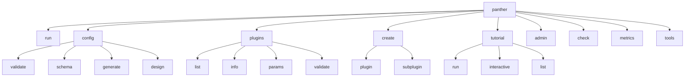

# PANTHER CLI Module - Explanation

*Part of the Diátaxis documentation framework - this document explains **what** the CLI module is and **why** it's designed this way.*

## What is the PANTHER CLI Module?

The PANTHER CLI module provides a comprehensive command-line interface for the PANTHER framework, implementing a modular architecture that enables extensible, maintainable, and user-friendly protocol testing workflows. The CLI serves as the primary human interface to PANTHER's powerful testing capabilities.

### Design Philosophy

The CLI follows modern command-line interface principles, drawing inspiration from successful tools like Git, Docker, and Kubernetes. It implements a hierarchical command structure that groups related functionality into intuitive subcommands, making complex operations discoverable and accessible to both novice and expert users.

**Core Design Principles:**
- **Progressive Disclosure**: Simple commands for common tasks, advanced options available when needed
- **Consistency**: Uniform patterns across all commands for predictable user experience
- **Discoverability**: Rich help text and examples make features easily discoverable
- **Extensibility**: Plugin-based architecture allows easy addition of new commands and functionality

## Architecture

### Module Structure

```
panther/cli/
├── __init__.py          # Package initialization
├── main.py              # Main CLI entry point and parser setup
├── base.py              # Base command class for inheritance
├── interactive/         # Interactive CLI components
│   ├── __init__.py
│   ├── experiment_designer.py  # Interactive YAML designer
│   ├── validation_helper.py    # Enhanced validation messages
│   └── builders.py             # Configuration section builders
└── subcommands/         # Individual command implementations
    ├── __init__.py
    ├── run.py           # Experiment execution
    ├── config.py        # Configuration management
    ├── plugins.py       # Plugin management
    ├── create.py        # Plugin/resource creation
    ├── tutorial.py      # Interactive tutorials
    └── admin.py         # Administrative commands
```

### Architectural Foundations

The CLI architecture rests on several key architectural patterns that ensure maintainability, testability, and extensibility:

#### Command Pattern Implementation
Every CLI operation implements the Command pattern through the `BaseCommand` abstract class. This ensures uniform interfaces, consistent error handling, and enables powerful features like command composition and testing.

#### Separation of Concerns
The architecture strictly separates three distinct responsibilities:
- **Parser Definition**: What arguments and options are available (`register_parser`)
- **Command Logic**: What happens when the command executes (`handle`)
- **User Interface**: How information is presented to users (formatters, output)

#### Hierarchical Organization

Commands are organized hierarchically to match mental models and common workflow patterns:



**Command Categories by Purpose:**
```
Experiment Workflow:
├── config design     → Create experiment configuration
├── config validate   → Verify configuration correctness
├── run              → Execute protocol tests
└── metrics analyze  → Analyze results

Development Workflow:
├── plugins list     → Discover available capabilities
├── create plugin    → Develop custom components
├── check           → Validate code quality
└── tools           → Development utilities

Learning & Discovery:
├── tutorial run     → Guided learning experiences
├── plugins info     → Understand plugin capabilities
└── config schema    → Reference documentation
```

#### Error Handling Strategy
The CLI implements a comprehensive error handling strategy that considers both human users and automation:
- **User-Friendly Messages**: Clear, actionable error messages with suggestions
- **Proper Exit Codes**: Unix-standard exit codes for shell scripting integration
- **Debug Mode**: Detailed stack traces and logging for development and troubleshooting

## Command Structure

### Main Command: `panther`

The main entry point uses argparse with subcommands:

```bash
panther [global-options] COMMAND [command-options] [arguments]
```

**Global Options:**
- `--version`: Show version and exit
- `--debug`: Enable debug logging with full stack traces

### Subcommands

#### 1. `run` - Execute Experiments

**Purpose**: Run PANTHER experiments with specified configurations

**Usage**:
```bash
panther run --config experiment.yaml [options]
```

**Options**:
- `--config`: Path to experiment configuration file (required)
- `--output-dir`: Override output directory
- `--enable-metrics`: Enable metrics collection
- `--validate-only`: Validate configuration without running
- `--list-tests`: List available tests in configuration
- `--select-tests`: Run specific tests by name/pattern
- `--skip-tests`: Skip specific tests
- `--continue-on-error`: Continue even if a test fails
- `--parallel`: Run tests in parallel
- `--max-workers`: Maximum parallel workers
- `--timeout`: Global timeout for experiment
- `--dry-run`: Show what would be executed

**Implementation Notes**:
- Validates configuration before execution
- Creates experiment output directory structure
- Manages Docker containers and networks
- Collects logs and metrics
- Handles cleanup on completion/failure

#### 2. `config` - Configuration Management

**Purpose**: Manage and validate PANTHER configurations

**Subcommands**:

##### `validate`
```bash
panther config validate --config experiment.yaml [--strict] [--explain]
```
- Validates YAML syntax and schema
- Checks plugin availability
- Validates service relationships
- `--explain`: Provides detailed error explanations with solutions

##### `schema`
```bash
panther config schema [--format json|yaml|text]
```
- Displays configuration schema documentation
- Helps users understand required/optional fields

##### `generate`
```bash
panther config generate --template [minimal|basic|advanced|performance|security] [--output file.yaml]
```
- Generates configuration templates
- Templates are optimized for different use cases

##### `design` (NEW)
```bash
panther config design --output experiment.yaml [--from existing.yaml] [--quick]
```
- Interactive configuration designer
- Step-by-step wizard with prompts
- Validates at each step
- `--from`: Start from existing configuration
- `--quick`: Use sensible defaults

**Implementation Details**:
- Uses OmegaConf for configuration parsing
- Schema validation with dataclasses
- Plugin discovery for available options
- Template generation from predefined patterns

#### 3. `plugins` - Plugin Management

**Purpose**: Discover and manage PANTHER plugins

**Subcommands**:

##### `list`
```bash
panther plugins list [--type TYPE] [--format table|json|yaml]
```
- Lists all available plugins
- Filters by type (iut, tester, environment, protocol)
- Shows version and capabilities

##### `info`
```bash
panther plugins info PLUGIN_NAME [--verbose]
```
- Detailed plugin information
- Dependencies and requirements
- Configuration parameters

##### `params`
```bash
panther plugins params PLUGIN_NAME [--type TYPE] [--protocol PROTOCOL]
```
- Lists all configurable parameters
- Shows types, defaults, and descriptions
- Essential for configuration

##### `validate`
```bash
panther plugins validate [--plugin PLUGIN_NAME]
```
- Validates plugin structure
- Checks dependencies
- Verifies manifest files

**Implementation Notes**:
- Uses PluginCatalog for discovery
- Caches plugin information
- Validates plugin manifests
- Resolves dependencies

#### 4. `create` - Resource Creation

**Purpose**: Create new plugins and resources

**Subcommands**:

##### `plugin`
```bash
panther create plugin TYPE NAME [--output-dir DIR] [--with-tests] [--dev-mode]
```
- Creates plugin scaffolding
- Generates required files
- `--with-tests`: Include test templates
- `--dev-mode`: Development configuration

##### `subplugin`
```bash
panther create subplugin TYPE PROTOCOL NAME
```
- Creates protocol-specific implementations
- Inherits from base classes

**Implementation**:
- Uses Jinja2 templates
- Creates proper directory structure
- Generates manifest files
- Includes example code

#### 5. `tutorial` - Interactive Learning

**Purpose**: Interactive tutorials for learning PANTHER

**Subcommands**:

##### `run`
```bash
panther tutorial run [service|environment|protocol|configuration]
```
- Runs specific tutorial type
- Interactive guided experience

##### `interactive`
```bash
panther tutorial interactive
```
- Menu-driven tutorial selection
- Progressive learning path

##### `list`
```bash
panther tutorial list
```
- Shows available tutorials
- Indicates completion status

**Features**:
- Step-by-step guidance
- Interactive prompts
- Example generation
- Progress tracking

#### 6. `admin` - Administrative Commands

**Purpose**: System administration and maintenance

**Subcommands**:
- `clean`: Clean up resources
- `reset`: Reset to default state
- `doctor`: System diagnostics
- `upgrade`: Update components

## Implementation Details

### Base Command Pattern

All commands inherit from `BaseCommand`:

```python
class BaseCommand:
    """Base class for all CLI commands."""

    @classmethod
    def register_parser(cls, subparsers: _SubParsersAction) -> ArgumentParser:
        """Register the command's argument parser."""
        raise NotImplementedError

    @classmethod
    def handle(cls, args: Any) -> int:
        """Handle command execution. Returns exit code."""
        raise NotImplementedError
```

### Error Handling

Consistent error handling across all commands:

1. **User Errors**: Clear messages with suggestions
2. **System Errors**: Logged with context
3. **Debug Mode**: Full stack traces when `--debug` is set
4. **Exit Codes**: Standard Unix exit codes (0=success, 1=error, 130=interrupted)

### Interactive Components

The `interactive/` subpackage provides:

1. **ExperimentDesigner**: State machine for configuration creation
2. **ValidationHelper**: Enhanced error messages with solutions
3. **Builders**: Modular builders for each config section

### Logging and Output

- Uses PANTHER's LoggerFactory for consistent logging
- Colored output when terminal supports it
- Progress indicators for long operations
- Structured output formats (JSON/YAML) for automation

## Expected Behavior

### Command Line Parsing

1. **Argument Parsing**: Uses argparse with argcomplete for bash completion
2. **Subcommand Dispatch**: Commands are dispatched through a command map
3. **Option Validation**: Options are validated before execution
4. **Help Generation**: Automatic help from docstrings and argument definitions

### User Interaction Patterns

1. **Progressive Disclosure**: Simple commands for common tasks, options for advanced use
2. **Confirmation Prompts**: For destructive operations
3. **Default Values**: Sensible defaults shown in prompts
4. **Error Recovery**: Suggestions for fixing common errors

### Output Conventions

1. **Status Symbols**:
   - ✅ Success
   - ❌ Error
   - ⚠️ Warning
   - 🔍 Searching/Validating
   - 📋 Information
   - 🚀 Starting
   - 💡 Suggestion

2. **Exit Codes**:
   - 0: Success
   - 1: General error
   - 2: Misuse of shell command
   - 126: Command cannot execute
   - 127: Command not found
   - 130: Interrupted (Ctrl+C)

## Future Work

### Planned Enhancements

1. **Shell Completion**
   - Dynamic completion for plugin names
   - Context-aware option completion
   - Fish and Zsh support

2. **Interactive Mode**
   - REPL for PANTHER commands
   - Command history
   - Tab completion
   - Context persistence

3. **Configuration Management**
   - Config file versioning
   - Migration tools for config updates
   - Config diff and merge tools
   - Remote config repository support

4. **Plugin Ecosystem**
   - Plugin marketplace integration
   - Dependency resolution improvements
   - Plugin signing and verification
   - Automatic updates

5. **Workflow Automation**
   - Command chaining
   - Workflow definitions (YAML/JSON)
   - Conditional execution
   - Parallel command execution

6. **Enhanced Monitoring**
   - Real-time experiment monitoring
   - Web-based dashboard
   - Metric streaming
   - Alert integration

7. **Cloud Integration**
   - Remote execution
   - Result storage in cloud
   - Distributed experiments
   - Resource provisioning

### Technical Improvements

1. **Performance**
   - Lazy loading of modules
   - Command caching
   - Parallel plugin discovery
   - Optimized config validation

2. **Testing**
   - CLI integration tests
   - Mock-based unit tests
   - Performance benchmarks
   - User journey tests

3. **Documentation**
   - Command examples database
   - Video tutorials
   - Interactive documentation
   - Multilingual support

4. **Accessibility**
   - Screen reader support
   - High contrast mode
   - Keyboard-only navigation
   - Alternative output formats

### Extension Points

The CLI is designed for extensibility:

1. **Custom Commands**: Add new commands by creating modules in `subcommands/`
2. **Output Formats**: Add new formatters for different output types
3. **Validators**: Custom validation logic for new configuration types
4. **Interactive Builders**: New builders for additional config sections

### Contributing Guidelines

When adding new CLI features:

1. **Follow the Pattern**: Inherit from BaseCommand
2. **Document Thoroughly**: Include docstrings and help text
3. **Test Comprehensively**: Unit and integration tests
4. **Consider UX**: Make it intuitive and helpful
5. **Handle Errors Gracefully**: Provide actionable error messages

## Best Practices

### For CLI Development

1. **Consistency**: Follow established patterns
2. **Simplicity**: Make common tasks easy
3. **Discoverability**: Users should find features naturally
4. **Feedback**: Always provide clear feedback
5. **Performance**: Optimize for responsive feel

### For Users

1. **Start Simple**: Use basic commands first
2. **Use Help**: `--help` is available everywhere
3. **Validate First**: Always validate configs before running
4. **Use Templates**: Start from templates, not scratch
5. **Check Logs**: Enable debug mode when troubleshooting

## Conclusion

The PANTHER CLI provides a comprehensive, user-friendly interface to the PANTHER framework. Its modular design allows for easy extension while maintaining consistency across all commands. The interactive features lower the barrier to entry for new users while providing power users with the flexibility they need.
