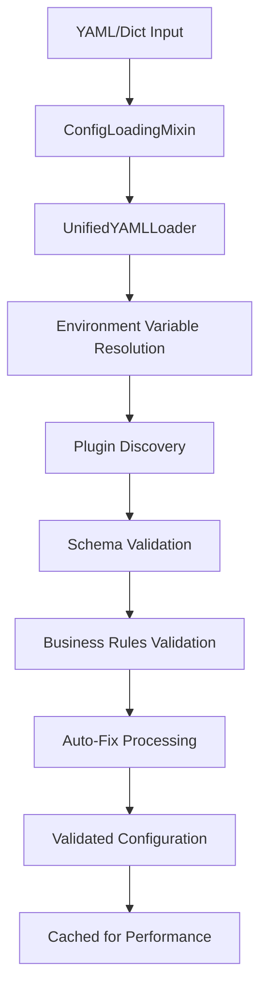

# Configuration Guide — Writing & Validating PANTHER YAML

A **PANTHER configuration** is a single YAML file that defines what to run, where to run it, and how to instrument it. This guide covers the complete configuration system, from basic setups to advanced plugin-specific options.

!!! info "Configuration Purpose"
    **Target Audience:** Newcomers designing tests; plugin authors adding schemas; advanced users optimizing configurations
    **Schema System:** Dynamic plugin-based configuration with OmegaConf validation

---

## Configuration Architecture

!!! warning "Schema Complexity"
    PANTHER's configuration system is highly flexible but can be complex. Start with example configurations in the `experiment-config/` directory before creating custom setups.

PANTHER uses a **hierarchical configuration system** with the following key principles:

1. **Plugin-Based Schemas**: Each plugin contributes its own configuration schema via `config_schema.py`
2. **Dynamic Validation**: Schemas are merged at runtime and validated with OmegaConf
3. **Type Safety**: Strong typing with dataclass-based configuration models
4. **Extensibility**: New plugins automatically extend the configuration space

### Configuration Structure

PANTHER configurations follow a hierarchical structure that combines global settings with test-specific configurations. Below is an annotated example with explanations:

```yaml
# Global settings that apply to all tests
logging:
  level: INFO                    # Set logging verbosity (DEBUG, INFO, WARNING, ERROR, CRITICAL)
  format: "%(asctime)s [%(levelname)s] - %(module)s - %(message)s"  # Custom log format

paths:
  output_dir: "outputs"          # Where results and artifacts will be stored
  log_dir: "outputs/logs"        # Directory for log files
  config_dir: "panther/configs"  # Location of additional configuration files
  plugin_dir: "panther/plugins"  # Directory containing PANTHER plugins

docker:
  force_build_docker_image: false      # Skip Docker image building (use existing images)

# List of tests to run - each test is a complete testing scenario
tests:
  - name: "QUIC Client-Server Communication Test"    # Human-readable test identifier
    description: "Verify that the Picoquic server can communicate with the Picoquic client over Shadow network."
    network_environment:
      type: "docker_compose"     # Use docker-compose for container orchestration
    iterations: 1                # Run this test just once
    execution_environment: []    # No special execution environment settings
    debug_environment: [ ]       # No debugging tools to attach

    # Define the services (containers) involved in this test
    services:
      picoquic_client:           # First service - a QUIC client
        timeout: 100             # Maximum runtime in seconds
        name: "picoquic_client"  # Container name
        implementation:
          name: "picoquic"       # Using the Picoquic implementation
          type: "iut"            # Implementation Under Test (not a tester)
        protocol:
          name: "quic"           # Using the QUIC protocol
          version: "rfc9000"     # QUIC protocol version
          role: "client"         # This service acts as a client
          target: "ivy_server"   # Connect to the ivy_server service
        ports:                   # Port mappings (host:container)
          - "5000:5000"          # Example port mapping
          - "8081:8081"          # Another port mapping
        generate_new_certificates: True  # Generate fresh TLS certificates

      ivy_server:                # Second service - a QUIC server using Ivy for verification
        name: "ivy_server"       # Container name
        timeout: 100             # Maximum runtime in seconds
        implementation:
          type: "testers"        # This is a testing tool, not an IUT
          name: "panther_ivy"    # Using the Ivy formal verification tool
          test: quic_client_test_max  # Specific test to run within Ivy
        protocol:
          name: "quic"           # Using the QUIC protocol
          version: "rfc9000"     # QUIC protocol version
          role: "server"         # This service acts as a server
        ports:                   # Port mappings (host:container)
          - "4443:4443"          # QUIC server port
          - "4987:4987"          # Additional port mapping
          - "8080:8080"          # Health check endpoint
        generate_new_certificates: True  # Generate fresh TLS certificates

    steps:
      wait: 100                  # Wait 100 seconds during test execution before proceeding
```

This configuration defines a test scenario where a Picoquic client communicates with an Ivy-based server over a QUIC connection. The test runs in Docker containers orchestrated by Docker Compose, with specific port mappings and protocol settings.

---

## System Architecture Overview

PANTHER's configuration system implements a sophisticated modular architecture designed for flexibility, type safety, and extensibility. Understanding this architecture helps developers work effectively with the configuration system.

### Core Architecture Components

#### 1. Configuration Foundation (`core/base.py`)

<!-- src: panther/config/core/base.py -->

The `BaseConfig` class provides the foundation combining:
- **Pydantic validation** for type safety and schema enforcement
- **OmegaConf features** for interpolation (`${variable}` syntax) and merging
- **Hybrid model** supporting both dot-notation access and dictionary operations
- **Serialization/deserialization** with automatic format detection

#### 2. Configuration Manager (`core/manager.py`)

<!-- src: panther/config/core/manager.py -->

The `ConfigurationManager` orchestrates all configuration operations through:
- **Mixin composition** inheriting from 9 specialized functionality mixins
- **Multi-stage validation** (schema → business rules → plugin compatibility)
- **Plugin discovery and integration** with automatic schema merging
- **Performance optimization** with intelligent caching and lazy loading

#### 3. Specialized Mixins (`core/mixins/`)

<!-- src: panther/config/core/mixins/config_loading.py, panther/config/core/mixins/validation_ops.py, panther/config/core/mixins/config_operations.py, panther/config/core/mixins/environment_handling.py, panther/config/core/mixins/plugin_management.py, panther/config/core/mixins/caching.py, panther/config/core/mixins/state_management.py, panther/config/core/mixins/logging_features.py -->

**Core operational mixins:**
- `ConfigLoadingMixin` - File/environment loading with hot-reload support
- `ValidationOperationsMixin` - Multi-layered validation with auto-fix capabilities
- `ConfigOperationsMixin` - Deep merging and field operations
- `EnvironmentHandlingMixin` - Environment variable resolution
- `PluginManagementMixin` - Dynamic plugin discovery and integration
- `CachingMixin` - Performance optimization and memory management
- `StateManagementMixin` - Health monitoring and resource lifecycle
- `LoggingFeaturesMixin` - Debug support and comprehensive error reporting

#### 4. Functional Components (`core/components/`)

<!-- src: panther/config/core/components/validators.py, panther/config/core/components/builders.py, panther/config/core/components/loaders.py, panther/config/core/components/merger.py, panther/config/core/components/universal_validators.py -->

**Specialized processing units:**
- `UnifiedValidator` - Combines Pydantic, business rules, and compatibility validation
- `ExperimentBuilder` - Constructs experiment configurations with intelligent auto-fixing
- `UnifiedYAMLLoader` - Advanced YAML parsing with environment interpolation
- `UnifiedMerger` - Sophisticated configuration merging with conflict resolution

#### 5. Type-Safe Models (`core/models/`)

<!-- src: panther/config/core/models/experiment.py, panther/config/core/models/service.py, panther/config/core/models/global_config.py, panther/config/core/models/environment.py, panther/config/core/models/protocol.py, panther/config/core/models/plugin.py, panther/config/core/models/observer.py, panther/config/core/models/command.py, panther/config/core/models/compatibility.py, panther/config/core/models/network_resolution.py, panther/config/core/models/base_model.py -->

**Pydantic model definitions for:**
- `ExperimentConfig` - Complete test experiment specifications
- `ServiceConfig` - Service and protocol configurations
- `GlobalConfig` - System-wide settings and defaults
- `EnvironmentConfig` - Runtime environment specifications
- Plugin-specific configuration schemas

### Configuration Processing Flow



### Advanced Features

#### Port Management System
- **Automatic port assignment** with protocol-aware defaults
- **Conflict detection and resolution** across services
- **Validation rules** ensuring proper port mappings for server/client roles

#### Plugin Architecture
- **Dynamic discovery** of protocol and service implementations
- **Schema contribution** from each plugin for validation
- **Version compatibility** tracking and validation
- **Graceful fallback** when plugins fail to load

#### Configuration Auto-Fixing
- **Common issue detection** (missing ports, invalid formats)
- **Intelligent correction** with user notification
- **Validation guidance** with specific error messages and suggestions

---

## Configuration Sections

### 1. Global Settings

#### Logging Configuration

```yaml
logging:
  level: INFO                    # DEBUG, INFO, WARNING, ERROR, CRITICAL
  format: "%(asctime)s - %(levelname)s - %(message)s"
  file: "./logs/panther.log"     # Optional: log to file
  console: true                  # Enable console output
```

#### Path Configuration

```yaml
paths:
  output_dir: "./outputs"        # Where test results are stored
  temp_dir: "./temp"            # Temporary files directory
  config_dir: "./configs"       # Additional configuration files
  data_dir: "./data"            # Test data and resources
```

#### Docker Configuration

```yaml
docker:
  pull_images: true             # Pull latest images before tests
  cleanup_on_exit: true         # Clean up containers after tests
  registry: "docker.io"         # Custom registry (optional)
  build_timeout: 300            # Build timeout in seconds
  network_name: "panther_net"   # Custom network name
```

### 2. Network Environments

Network environments define where and how containers communicate.

#### Docker Compose Environment

```yaml
network_environment:
  type: "docker_compose"
  config:
    compose_file: "docker-compose.yml"
    project_name: "panther_test"
    services:
      - "quic_server"
      - "quic_client"
    networks:
      - name: "test_network"
        driver: "bridge"
        ipam:
          config:
            - subnet: "172.20.0.0/16"
```

#### Localhost Single Container

```yaml
network_environment:
  type: "localhost_single_container"
  config:
    container_name: "panther_test"
    network_mode: "host"
    exposed_ports:
      - "4433:4433"
      - "8080:8080"
```

#### Shadow Network Simulator

```yaml
network_environment:
  type: "shadow"
  config:
    hosts:
      - name: "server"
        processes:
          - path: "/app/server"
            args: ["--port", "4433"]
      - name: "client"
        processes:
          - path: "/app/client"
            args: ["server", "4433"]
    network:
      topology: "1_gbit_ethernet"
      latency: "10ms"
      bandwidth: "1000mbit"
```

### 3. Execution Environments

Execution environments define the runtime context for services.

#### Docker Container Environment

```yaml
execution_environment:
  type: "docker_container"
  config:
    image: "panther/test-env:latest"
    dockerfile: "./Dockerfile"
    build_context: "./build"
    environment:
      - "DEBUG=1"
      - "RUST_LOG=debug"
    volumes:
      - "./certs:/certs:ro"
      - "./logs:/app/logs:rw"
    capabilities:
      - "NET_ADMIN"
      - "SYS_PTRACE"
```

#### Host Environment

```yaml
execution_environment:
  type: "host"
  config:
    working_dir: "/tmp/panther"
    environment:
      PATH: "/usr/local/bin:$PATH"
      LD_LIBRARY_PATH: "/usr/local/lib"
```

### 4. Services Configuration

Services define the actual implementations being tested or doing the testing.

#### IUT (Implementation Under Test) Services

##### QUIC Implementations

**Quiche Configuration:**

```yaml
services:
  - name: "quiche_server"
    type: "iut"
    implementation: "quiche"
    role: "server"
    config:
      binary:
        path: "/app/quiche-server"
        args: ["--cert", "/certs/cert.pem", "--key", "/certs/key.pem"]
      network:
        port: 4433
        interface: "0.0.0.0"
      protocol:
        alpn: ["h3", "hq-29"]
        version: "draft-29"
        max_packet_size: 1350
      certificates:
        cert_file: "/certs/server.crt"
        key_file: "/certs/server.key"
      logging:
        log_path: "/app/logs/server.log"
        err_path: "/app/logs/server.err"
        level: "debug"
```

**Picoquic Configuration:**

```yaml
services:
  - name: "picoquic_client"
    type: "iut"
    implementation: "picoquic"
    role: "client"
    config:
      binary:
        path: "/app/picoquic_sample"
        args: ["-l", "/app/logs/client.log"]
      target: "quiche_server"
      network:
        port: 4433
      protocol:
        alpn: ["hq-29"]
        initial_version: "ff00001d"
      certificates:
        ca_file: "/certs/ca.pem"
        verify_certificate: false
```

**Aioquic Configuration:**

```yaml
services:
  - name: "aioquic_server"
    type: "iut"
    implementation: "aioquic"
    role: "server"
    config:
      binary:
        path: "/app/http3_server.py"
        interpreter: "python3"
      network:
        port: 4433
        host: "0.0.0.0"
      protocol:
        alpn: ["h3"]
        quic_logger: true
      certificates:
        cert_file: "/certs/cert.pem"
        key_file: "/certs/key.pem"
```

#### Tester Services

##### Panther Ivy Formal Verification

```yaml
services:
  - name: "ivy_verifier"
    type: "tester"
    implementation: "panther_ivy"
    config:
      protocol: "quic"
      ivy_files:
        - "/app/protocols/quic/quic_protocol.ivy"
        - "/app/protocols/quic/quic_tests.ivy"
      test_config:
        seed: 12345
        max_steps: 1000
        timeout: 300
      verification:
        check_safety: true
        check_liveness: true
        bounded_check: true
        bound: 10
      logging:
        log_path: "/app/logs/ivy.log"
        err_path: "/app/logs/ivy.err"
        trace_file: "/app/logs/trace.txt"
```

---

## Configuration Management and Port Handling

PANTHER provides an advanced configuration management system with intelligent validation, auto-fixing, and protocol-aware port management.

### Port Management System

PANTHER automatically manages port configurations with protocol-aware defaults and validation:

#### Automatic Port Assignment

When a server service doesn't specify ports, PANTHER automatically assigns protocol defaults:

```yaml
services:
  server:
    implementation: {name: picoquic, type: iut}
    protocol: {name: quic, version: rfc9000, role: server}
    # No ports specified - PANTHER will auto-assign 4443:4443 for QUIC
    timeout: 60
```

#### Protocol-Based Port Defaults

Different protocols have different default ports defined in their configuration schemas:

- **QUIC**: 4443 (defined in `QuicConfig.get_default_server_port()`)
- **HTTP**: 80
- **HTTPS**: 443
- **Custom protocols**: Can define their own defaults

#### Port Validation Rules

1. **Server services** must have at least one port mapping
2. **Client services** typically don't need port mappings
3. **Port mappings** must be valid (format: "host_port:container_port")
4. **Port conflicts** are automatically detected and resolved

#### Configuration Auto-Fixing

PANTHER can automatically fix common configuration issues:

```bash
# Enable auto-fixing during validation
panther config validate --config experiment.yaml --auto-fix

# Auto-fix saves the corrected configuration
panther config validate --config experiment.yaml --auto-fix --output fixed_config.yaml
```

**Auto-fixes include:**

- Adding default ports to server services
- Resolving port conflicts with alternative ports
- Standardizing port mapping formats
- Adding missing required fields

#### Manual Port Configuration

You can explicitly specify ports to override defaults:

```yaml
services:
  custom_server:
    implementation: {name: picoquic, type: iut}
    protocol: {name: quic, version: rfc9000, role: server}
    ports:
      - "8443:4443"  # Custom host port mapping
      - "8080:8080"  # Additional port for health checks
    timeout: 60
```

#### Port Conflict Resolution

When auto-assigning ports, PANTHER:

1. Checks if the default port is available on the host
2. If unavailable, tries the next available port in range
3. Updates the configuration with the assigned port
4. Logs the port assignment for reference

### Configuration Validation

PANTHER provides comprehensive configuration validation through its schema system:

#### Validation Features

- **Schema-based validation**: Type checking and required field validation
- **Business rule validation**: Protocol-specific and cross-service validation
- **Port validation**: Automatic port conflict detection and resolution
- **Custom validators**: Plugin-specific validation logic
- **Detailed error reporting**: Clear messages with field-level details

#### Validation Commands

```bash
# Basic validation
panther config validate --config experiment.yaml

# Validation with detailed explanations
panther config validate --config experiment.yaml --explain

# Auto-fix validation issues
panther config validate --config experiment.yaml --auto-fix

# Strict validation mode
panther config validate --config experiment.yaml --strict
```

#### Validation Results

<!-- src: panther/config/core/components/validators.py, panther/config/core/validators/universal_validators.py -->

Validation provides structured results:

```python
from panther.config.managers.configuration_validator import ConfigurationValidator

validator = ConfigurationValidator()
result = validator.validate_experiment_config(config)

print(result.get_summary())         # "Validation passed with 2 warnings"
print(result.get_detailed_report()) # Full validation report

# Check specific aspects
if result.is_valid:
    print("Configuration is valid")
for error in result.errors:
    print(f"Error: {error}")
for warning in result.warnings:
    print(f"Warning: {warning}")
```

### Schema Definition

Each plugin defines its configuration schema using Python dataclasses:

```python
# Example: panther/plugins/services/iut/quic/quiche/config_schema.py
from dataclasses import dataclass
from typing import Optional, List

@dataclass
class QuicheBinaryConfig:
    path: str
    args: Optional[List[str]] = None
    dir: str = "/app"

@dataclass
class QuicheNetworkConfig:
    port: int = 4433
    interface: str = "0.0.0.0"

@dataclass
class QuicheProtocolConfig:
    alpn: List[str]
    version: Optional[str] = None
    max_packet_size: int = 1350

@dataclass
class QuicheConfig:
    binary: QuicheBinaryConfig
    network: QuicheNetworkConfig
    protocol: QuicheProtocolConfig
    certificates: CertificateConfig
    logging: LoggingConfig
```

### Validation Process

1. **Schema Discovery**: PANTHER automatically discovers all plugin schemas
2. **Schema Merging**: Schemas are combined into a unified configuration model
3. **Type Validation**: OmegaConf validates types and required fields
4. **Custom Validation**: Plugins can provide custom validation logic
5. **Error Reporting**: Clear error messages with field-level details

### Validation Commands

```bash
# Validate configuration before running
panther --validate-config --experiment-config config.yaml

# Validate and show merged schema
panther --show-schema --experiment-config config.yaml

# Validate specific plugin configuration
panther --validate-plugin quiche --config plugin_config.yaml

# List available parameters for a specific plugin
panther --list-plugin-params quiche  # Plugin type and protocol will be auto-detected
```

### Inspecting Plugin Parameters

To view all available configuration parameters for a specific plugin, use:

```bash
panther --list-plugin-params PLUGIN_NAME [--plugin-type PLUGIN_TYPE] [--protocol PROTOCOL]
```

Where:

- `PLUGIN_NAME` is the name of the plugin (e.g., `quiche`, `docker_compose`)
- `PLUGIN_TYPE` (optional) is one of: `iut`, `tester`, `network_environment`, or `execution_environment`
  - If not provided, PANTHER will auto-detect the plugin type
- `PROTOCOL` (optional) for IUT/tester plugins, specifies the protocol (e.g., `quic`, `http`, `minip`)
  - If not provided, PANTHER will auto-detect the protocol for protocol-specific plugins

This command displays all parameters, their types, default values, whether they're required, and their descriptions:

```text
Parameter           Type                           Default              Required   Description
----------------------------------------------------------------------------------------------------
binary              QuicheBinaryConfig             None                 Yes        Binary configuration
network             QuicheNetworkConfig            None                 Yes        Network settings
protocol            QuicheProtocolConfig           None                 Yes        Protocol parameters
certificates        CertificateConfig              None                 Yes        Certificate settings
logging             LoggingConfig                  None                 Yes        Logging configuration
```

This feature helps you understand exactly what parameters are available and required for each plugin without having to examine the source code directly.

---

## Developer Guide

### Working with the Configuration System

#### Using ConfigurationManager

<!-- src: panther/config/core/manager.py -->

The `ConfigurationManager` is the primary interface for all configuration operations:

```python
from panther.config.core.manager import ConfigurationManager

# Initialize the manager
config_manager = ConfigurationManager()

# Load and validate configuration
config = config_manager.load_and_validate_config("experiment.yaml")

# Access configuration data
print(config.global_config.logging.level)
print(config.tests[0].services[0].name)

# Use auto-fix for common issues
fixed_config = config_manager.load_and_validate_config(
    "experiment.yaml",
    auto_fix=True
)
```

#### Working with BaseConfig

<!-- src: panther/config/core/base.py -->

For custom configuration classes, extend `BaseConfig` to get hybrid Pydantic/OmegaConf features:

```python
from panther.config.core.base import BaseConfig
from dataclasses import dataclass
from typing import Optional

@dataclass
class CustomConfig(BaseConfig):
    name: str
    port: int = 8080
    debug: bool = False

# Create instance with validation
config = CustomConfig(name="test-service", port="${PORT}")

# Access with dot notation
print(config.get_field("name"))

# Convert to OmegaConf for interpolation
omega_config = config.to_omegaconf()
```

#### Creating Custom Validators

<!-- src: panther/config/core/components/validators.py -->

Extend the validation system for domain-specific rules:

```python
from panther.config.core.components.validators import BusinessRulesValidator

class CustomBusinessValidator(BusinessRulesValidator):
    def validate_experiment_config(self, config: ExperimentConfig) -> ValidationResult:
        result = ValidationResult()

        # Custom validation logic
        if len(config.tests) > 10:
            result.add_warning("More than 10 tests may impact performance")

        # Validate service relationships
        for test in config.tests:
            self._validate_service_dependencies(test, result)

        return result
```

#### Implementing Plugin Configuration

For new plugins, create configuration schemas:

```python
# In your plugin's config_schema.py
from dataclasses import dataclass
from typing import List, Optional

@dataclass
class MyPluginBinaryConfig:
    path: str
    args: Optional[List[str]] = None
    working_dir: str = "/app"

@dataclass
class MyPluginConfig:
    binary: MyPluginBinaryConfig
    timeout: int = 60
    retries: int = 3

    @classmethod
    def get_default_server_port(cls) -> int:
        """Return default port for server role"""
        return 9000
```

#### Using Configuration Mixins

<!-- src: panther/config/core/mixins/config_loading.py, panther/config/core/mixins/validation_ops.py -->

Mixins provide focused functionality that can be combined:

```python
from panther.config.core.mixins.config_loading import ConfigLoadingMixin
from panther.config.core.mixins.validation_ops import ValidationOperationsMixin

class MyConfigHandler(ConfigLoadingMixin, ValidationOperationsMixin):
    def process_config(self, config_path: str):
        # Load configuration with hot-reload support
        config = self.load_from_file(config_path, enable_cache=True)

        # Validate with auto-fix
        validation_result = self.validate_experiment_config(
            config,
            auto_fix=True
        )

        if not validation_result.is_valid:
            raise ConfigurationError(validation_result.get_summary())

        return config
```

#### Advanced Configuration Operations

##### Environment Variable Handling

<!-- src: panther/config/core/mixins/environment_handling.py -->

```python
# In YAML configuration
database:
  host: "${DB_HOST:localhost}"     # Default to localhost if DB_HOST not set
  port: "${DB_PORT:5432}"          # Default to 5432
  password: "${DB_PASSWORD}"       # Required environment variable

# In Python code
config_manager = ConfigurationManager()
config = config_manager.load_with_environment(
    "config.yaml",
    env_vars={"DB_HOST": "prod-db", "DB_PORT": "5433"}
)
```

##### Configuration Merging

<!-- src: panther/config/core/components/merger.py, panther/config/core/mixins/config_operations.py -->

```python
# Merge multiple configurations
base_config = config_manager.load_from_file("base.yaml")
override_config = config_manager.load_from_file("override.yaml")

merged = config_manager.merge_configs(
    base_config,
    override_config,
    strategy="deep_merge"  # or "replace", "append"
)
```

##### Caching and Performance

<!-- src: panther/config/core/mixins/caching.py -->

```python
# Enable caching for better performance
config_manager.enable_cache(ttl=300)  # 5-minute TTL

# Warm cache for frequently used configs
config_manager.warm_cache([
    "experiment1.yaml",
    "experiment2.yaml"
])

# Monitor cache statistics
stats = config_manager.get_cache_stats()
print(f"Cache hit rate: {stats.hit_rate}%")
```

### Best Practices

#### Configuration Design

1. **Use type hints**: Leverage Pydantic's type validation for robust configurations
2. **Provide defaults**: Always include sensible defaults for optional parameters
3. **Document schemas**: Use docstrings and field descriptions for clarity
4. **Modular design**: Split large configurations into focused, reusable components

#### Error Handling

1. **Use ValidationResult**: Return structured validation results rather than raising exceptions
2. **Provide context**: Include specific field paths and suggestions in error messages
3. **Enable auto-fix**: Implement auto-fix logic for common configuration issues
4. **Graceful degradation**: Handle plugin loading failures gracefully

#### Performance Optimization

1. **Enable caching**: Use caching for frequently loaded configurations
2. **Lazy loading**: Only load plugin configurations when needed
3. **Validate early**: Catch configuration errors before expensive operations
4. **Monitor performance**: Track validation and loading times

#### Testing Configuration

```python
import pytest
from panther.config.core.manager import ConfigurationManager

class TestConfigurationSystem:
    def test_valid_configuration(self):
        config_manager = ConfigurationManager()
        config = config_manager.load_from_dict({
            "tests": [{
                "name": "test",
                "network_environment": {"type": "docker_compose"},
                "services": [{"name": "server", "protocol": {"role": "server"}}]
            }]
        })
        assert config.tests[0].name == "test"

    def test_auto_fix_missing_ports(self):
        config_manager = ConfigurationManager()
        config_dict = {
            "tests": [{
                "services": [{
                    "name": "server",
                    "protocol": {"name": "quic", "role": "server"}
                    # Missing ports - should be auto-fixed
                }]
            }]
        }

        config = config_manager.load_and_validate_config(
            config_dict,
            auto_fix=True
        )

        # Should have auto-assigned default QUIC port
        assert "4443:4443" in config.tests[0].services[0].ports
```

### Common Patterns

#### Plugin Registration

```python
# Register custom plugin with configuration schema
from panther.config.core.manager import ConfigurationManager

config_manager = ConfigurationManager()
config_manager.register_plugin(
    "my_custom_plugin",
    plugin_type="iut",
    protocol="custom_protocol",
    config_schema=MyPluginConfig
)
```

#### Configuration Inheritance

```python
# Base configuration for common settings
@dataclass
class BaseServiceConfig(BaseConfig):
    timeout: int = 60
    retries: int = 3
    debug: bool = False

# Specialized configuration inheriting common settings
@dataclass
class WebServiceConfig(BaseServiceConfig):
    port: int = 8080
    ssl_enabled: bool = True

@dataclass
class DatabaseConfig(BaseServiceConfig):
    port: int = 5432
    max_connections: int = 100
```

---
