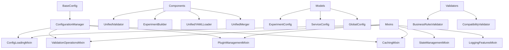

# PANTHER Configuration Core Module

## Purpose and Design Rationale

The `panther.config.core` module implements a sophisticated configuration management system designed for complex network testing scenarios. It combines the type safety of Pydantic with the interpolation capabilities of OmegaConf, creating a hybrid system that handles validation, merging, and plugin integration seamlessly.

### Core Design Principles

1. **Hybrid Configuration Model**: Combines Pydantic's validation with OmegaConf's interpolation
2. **Mixin-Based Architecture**: Composable functionality through specialized mixins
3. **Plugin-Aware Validation**: Dynamic schema discovery and integration
4. **Performance-First**: Intelligent caching and lazy loading optimizations
5. **Developer Experience**: Clear error messages and auto-fix capabilities

## Architecture Overview



## Key Components

### Foundation Layer
- **`base.py`**: `BaseConfig` class providing Pydantic + OmegaConf hybrid functionality
- **`manager.py`**: `ConfigurationManager` orchestrating all configuration operations

### Specialized Components
- **`components/`**: Functional units for validation, building, loading, and merging
- **`mixins/`**: Composable capabilities for specific configuration aspects
- **`models/`**: Type-safe Pydantic models for configuration data
- **`validators/`**: Multi-layered validation framework

## Entry Points

### Primary Interface
```python
from panther.config.core.manager import ConfigurationManager

# Initialize the manager
config_manager = ConfigurationManager()

# Load and validate configuration
config = config_manager.load_and_validate_config("experiment.yaml")
```

### Direct Component Usage
```python
from panther.config.core.base import BaseConfig
from panther.config.core.components.validators import UnifiedValidator

# Custom configuration class
class MyConfig(BaseConfig):
    name: str
    port: int = 8080

# Direct validation
validator = UnifiedValidator()
result = validator.validate_experiment_config(config)
```

## Configuration Processing Flow

1. **Loading**: YAML/JSON files parsed with environment variable interpolation
2. **Plugin Discovery**: Dynamic discovery of configuration schemas from plugins
3. **Schema Merging**: Combine base schemas with plugin-specific schemas
4. **Validation**: Multi-stage validation (schema → business rules → compatibility)
5. **Auto-Fix**: Intelligent correction of common configuration issues
6. **Caching**: Performance optimization for repeated operations

## Dependencies

### Core Dependencies
- **Pydantic**: Type validation and schema enforcement
- **OmegaConf**: Configuration interpolation and merging
- **PyYAML**: YAML parsing and serialization

### Integration Points
- **Plugin System**: Dynamic plugin discovery and schema contribution
- **Metrics Collector**: Performance monitoring and statistics
- **Logger Factory**: Consistent logging patterns across components

## Performance Characteristics

- **Lazy Loading**: Plugin configurations loaded only when needed
- **Intelligent Caching**: TTL-based caching with automatic invalidation
- **Validation Optimization**: Early validation to prevent expensive operations
- **Memory Efficiency**: Streaming YAML parsing for large configurations

## Common Usage Patterns

### Basic Configuration Loading
```python
config_manager = ConfigurationManager()
config = config_manager.load_from_file("experiment.yaml")
```

### Validation with Auto-Fix
```python
config = config_manager.load_and_validate_config(
    "experiment.yaml",
    auto_fix=True
)
```

### Environment-Aware Loading
```python
config = config_manager.load_with_environment(
    "experiment.yaml",
    env_vars={"ENV": "production"}
)
```

### Configuration Merging
```python
merged = config_manager.merge_configs(
    base_config,
    override_config,
    strategy="deep_merge"
)
```

## Thread Safety

The configuration system is designed for thread-safe operation:
- **Immutable Configurations**: Loaded configurations are immutable
- **Thread-Safe Caching**: Cache operations use appropriate locking
- **Plugin Safety**: Plugin loading includes thread-safe discovery

## Error Handling

Comprehensive error handling with context-aware messages:
- **Validation Errors**: Field-level validation with specific error messages
- **Loading Errors**: File parsing errors with line/column information
- **Plugin Errors**: Graceful fallback when plugins fail to load
- **Auto-Fix Suggestions**: Intelligent suggestions for common issues
