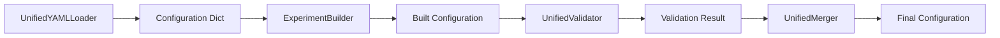

# Configuration Components

## Purpose

The `components` module provides specialized functional units that handle specific aspects of configuration processing. Each component focuses on a single responsibility, creating a modular and testable architecture.

## Design Rationale

Components implement the **Single Responsibility Principle** and are designed for:
- **Testability**: Each component can be tested in isolation
- **Reusability**: Components can be used independently or composed
- **Maintainability**: Clear boundaries between different configuration operations
- **Extensibility**: New components can be added without affecting existing ones

## Component Overview



## Key Components

### Validation Framework (`validators.py`)
- **`UnifiedValidator`**: Orchestrates multi-stage validation
- **`BusinessRulesValidator`**: Domain-specific validation rules
- **`CompatibilityValidator`**: Plugin and version compatibility checks

### Configuration Construction (`builders.py`)
- **`ExperimentBuilder`**: Constructs experiment configurations with auto-fix
- **`ServiceBuilder`**: Handles service configuration and port management
- **`GlobalConfigBuilder`**: Processes global settings with environment resolution

### Configuration Loading (`loaders.py`)
- **`UnifiedYAMLLoader`**: Advanced YAML parsing with interpolation
- **`UnifiedVersionLoader`**: Version-aware configuration loading
- **`PluginConfigLoader`**: Dynamic plugin configuration discovery

### Configuration Merging (`merger.py`)
- **`UnifiedMerger`**: Sophisticated configuration merging
- **Multiple strategies**: Replace, append, deep merge with conflict resolution

## Entry Points

### Direct Component Usage
```python
from panther.config.core.components.validators import UnifiedValidator
from panther.config.core.components.builders import ExperimentBuilder
from panther.config.core.components.loaders import UnifiedYAMLLoader

# Load configuration
loader = UnifiedYAMLLoader()
config_dict = loader.load_from_file("experiment.yaml")

# Build experiment configuration
builder = ExperimentBuilder()
config = builder.build_experiment_config(config_dict)

# Validate configuration
validator = UnifiedValidator()
result = validator.validate_experiment_config(config)
```

### Integrated Usage (Recommended)
```python
from panther.config.core.manager import ConfigurationManager

# Components are used internally by the manager
config_manager = ConfigurationManager()
config = config_manager.load_and_validate_config("experiment.yaml")
```

## Component Interactions

### Validation Pipeline
1. **Schema Validation**: Pydantic type checking and required fields
2. **Business Rules**: Domain-specific constraints and relationships
3. **Compatibility**: Plugin version and feature compatibility
4. **Auto-Fix**: Intelligent correction of common issues

### Building Process
1. **Global Config**: Process system-wide settings
2. **Test Config**: Build individual test configurations
3. **Service Config**: Handle service definitions and port assignments
4. **Validation**: Ensure configuration consistency

### Loading Chain
1. **File Reading**: YAML/JSON parsing with error handling
2. **Environment Resolution**: Variable interpolation and substitution
3. **Plugin Discovery**: Dynamic schema contribution
4. **Caching**: Performance optimization for repeated loads
