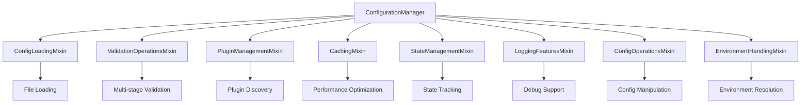

# Configuration Mixins

## Purpose

The `mixins` module implements the **Mixin Pattern** to provide composable functionality for configuration management. Each mixin encapsulates a specific capability that can be combined to create powerful configuration managers.

## Design Rationale

Mixins enable:
- **Separation of Concerns**: Each mixin handles one aspect of configuration
- **Composition over Inheritance**: Flexible capability assembly
- **Testability**: Individual mixins can be tested in isolation
- **Extensibility**: New capabilities added without modifying existing code
- **Multiple Inheritance**: Python's MRO enables controlled capability stacking

## Mixin Architecture



## Core Mixins

### Configuration Loading (`config_loading.py`)
**`ConfigLoadingMixin`** - File and environment loading capabilities
- **Hot-reload support**: Automatic configuration refresh
- **Multiple formats**: YAML, JSON, dictionary sources
- **Error recovery**: Graceful handling of loading failures
- **Caching integration**: Performance optimization for repeated loads

### Validation Operations (`validation_ops.py`)
**`ValidationOperationsMixin`** - Multi-layered validation framework
- **Schema validation**: Pydantic type checking
- **Business rules**: Domain-specific constraints
- **Auto-fix capabilities**: Intelligent error correction
- **Validation reporting**: Detailed error messages with suggestions

### Plugin Management (`plugin_management.py`)
**`PluginManagementMixin`** - Dynamic plugin integration
- **Plugin discovery**: Automatic detection of available plugins
- **Schema contribution**: Dynamic configuration schema extension
- **Version compatibility**: Plugin version tracking and validation
- **Graceful fallback**: Error handling when plugins fail

### Caching (`caching.py`)
**`CachingMixin`** - Performance optimization capabilities
- **TTL-based caching**: Time-based cache invalidation
- **Memory management**: Efficient cache size control
- **Cache warming**: Preload frequently accessed configurations
- **Statistics tracking**: Cache hit/miss metrics

### State Management (`state_management.py`)
**`StateManagementMixin`** - Configuration state tracking
- **Health monitoring**: System health checks and diagnostics
- **Resource lifecycle**: Automatic cleanup and resource management
- **State persistence**: Configuration state saving and restoration
- **Recovery mechanisms**: Error recovery and state restoration

### Configuration Operations (`config_operations.py`)
**`ConfigOperationsMixin`** - Configuration manipulation
- **Deep merging**: Sophisticated configuration combining
- **Field operations**: Dot-notation field access and updates
- **Transformation**: Configuration format conversions
- **Conflict resolution**: Multiple merge strategies

### Environment Handling (`environment_handling.py`)
**`EnvironmentHandlingMixin`** - Environment variable support
- **Variable substitution**: `${VAR}` and `${VAR:default}` syntax
- **Environment selection**: Multi-environment configuration support
- **Context awareness**: Environment-specific configuration loading
- **Path resolution**: Dynamic path construction

### Logging Features (`logging_features.py`)
**`LoggingFeaturesMixin`** - Debug and logging support
- **Feature-level logging**: Configurable logging granularity
- **Debug support**: Comprehensive debugging information
- **Error reporting**: Detailed error context and suggestions
- **Performance metrics**: Operation timing and statistics

## Mixin Composition

### Method Resolution Order (MRO)
The inheritance order is critical for proper functionality:

```python
class ConfigurationManager(
    ConfigLoadingMixin,          # 1. Core loading capabilities
    EnvironmentHandlingMixin,    # 2. Environment variable support
    ValidationOperationsMixin,   # 3. Validation framework
    ConfigOperationsMixin,       # 4. Configuration manipulation
    CachingMixin,               # 5. Performance optimization
    LoggingFeaturesMixin,       # 6. Debug and logging
    PluginManagementMixin,      # 7. Plugin integration
    StateManagementMixin,       # 8. State management
    ErrorHandlerMixin,          # 9. Error handling
):
    pass
```

### Integration Points
Mixins communicate through:
- **Shared state**: Common attributes and configuration data
- **Method chaining**: Methods that build upon each other
- **Event hooks**: Notification mechanisms for cross-mixin coordination
- **Dependency injection**: Shared services and utilities

## Usage Patterns

### Custom Configuration Manager
```python
from panther.config.core.mixins import (
    ConfigLoadingMixin,
    ValidationOperationsMixin,
    CachingMixin
)

class SimpleConfigManager(
    ConfigLoadingMixin,
    ValidationOperationsMixin,
    CachingMixin
):
    """Minimal configuration manager with basic capabilities."""

    def __init__(self):
        super().__init__()
        self.enable_cache(ttl=300)
```

### Selective Mixin Usage
```python
class ValidationOnlyManager(ValidationOperationsMixin):
    """Manager focused only on validation operations."""

    def validate_config_file(self, file_path: str):
        config = self.load_from_dict({"file": file_path})
        return self.validate_experiment_config(config)
```

### Mixin Extension
```python
class CustomCachingMixin(CachingMixin):
    """Extended caching with custom policies."""

    def enable_distributed_cache(self, redis_url: str):
        # Custom caching implementation
        pass
```

## Thread Safety

Mixins are designed for thread-safe operation:
- **Immutable state**: Configuration data is immutable after loading
- **Thread-safe operations**: Caching and state management use appropriate locking
- **Isolated contexts**: Each operation maintains its own context

## Testing Strategy

### Individual Mixin Testing
```python
class TestConfigLoadingMixin:
    def test_file_loading(self):
        mixin = ConfigLoadingMixin()
        config = mixin.load_from_file("test.yaml")
        assert config is not None
```

### Integration Testing
```python
class TestMixinComposition:
    def test_full_pipeline(self):
        manager = ConfigurationManager()
        config = manager.load_and_validate_config("experiment.yaml")
        assert manager.get_cache_stats().hit_rate >= 0
```

## Best Practices

1. **Mixin Order**: Maintain consistent inheritance order for predictable behavior
2. **Single Responsibility**: Each mixin should focus on one capability
3. **Minimal Dependencies**: Reduce coupling between mixins
4. **Error Propagation**: Handle errors gracefully and provide context
5. **Documentation**: Clear docstrings for mixin capabilities and interactions
