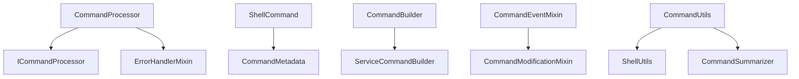

# Command Processor Module

## Overview

The command processor module provides structured command processing capabilities for the PANTHER framework. It handles command parsing, validation, transformation, and adaptation for various execution environments.

## Architecture

The module implements a layered architecture with clear separation of concerns:



### Core Components

#### 1. Command Processing Layer
- **ICommandProcessor**: Interface defining command processing contract
- **CommandProcessor**: Main implementation with validation and transformation logic
- **IEnvironmentCommandAdapter**: Interface for environment-specific adaptations

#### 2. Command Models
- **ShellCommand**: Primary command representation with metadata
- **CommandMetadata**: Rich metadata including execution context and properties

#### 3. Builder Pattern
- **CommandBuilder**: Base builder for command construction
- **ServiceCommandBuilder**: Specialized builder for service commands

#### 4. Utility Layer
- **CommandUtils**: General command manipulation utilities
- **ShellUtils**: Shell-specific parsing and escaping functions
- **CommandSummarizer**: Command analysis and summarization

#### 5. Mixins
- **CommandEventMixin**: Event handling capabilities
- **CommandModificationMixin**: Command modification operations

## Key Features

### Command Processing
- Validates command structure before processing
- Handles multiple command types (pre_run_cmds, run_cmd, post_run_cmds)
- Detects command properties (multiline, function definitions, control structures)
- Combines shell constructs for optimization

### Shell Command Detection
The system automatically detects various shell command types:
- **Function Definitions**: `function name() { ... }` patterns
- **Control Structures**: if/for/while/case statements
- **Variable Assignments**: `VAR=value` patterns
- **Shell Builtins**: echo, cd, export, etc.
- **Control Operators**: &&, ||, |, ;

### Error Handling
- Fast-fail validation with PantherException integration
- Categorized errors (COMMAND_EXECUTION category)
- Severity levels (CRITICAL, HIGH, MEDIUM, LOW)
- Rich error context for debugging

### Logging Strategy
The module implements high-entropy logging:
- **Summary-based logging** instead of verbose command details
- **Debug-level specifics** only when explicitly enabled
- **Command count summaries** for processing overview
- **Error logging** with full context

## Command Structure

Commands are processed as dictionaries with the following structure:

```python
{
    "pre_run_cmds": [list_of_commands],
    "run_cmd": {
        "working_dir": "path",
        "command_binary": "executable",
        "command_args": "arguments",
        "environment": {"VAR": "value"},
        "timeout": 60
    },
    "post_run_cmds": [list_of_commands]
}
```

## Design Patterns

### Fast-Fail Validation
Commands undergo validation before processing to catch structural issues early:
- Type checking for command dictionaries
- Structure validation for run_cmd
- Command list item validation

### Builder Pattern
Command construction uses the builder pattern for flexibility:
- Fluent interface for command building
- Service-specific builders for specialized use cases
- Extensible for new command types

### Mixin Architecture
Functionality is composed through mixins:
- Event handling can be mixed into processors
- Command modification capabilities are optional
- Clean separation of cross-cutting concerns

## Performance Considerations

### Command Combining
The system optimizes shell commands by combining related constructs:
- Function definitions with their bodies
- Control structures with their blocks
- Command sequences with logical operators

### Lazy Loading
- Circular dependency prevention through lazy imports
- On-demand property detection
- Conditional detailed logging

### Memory Efficiency
- Dataclass usage for command metadata
- Field factories for mutable defaults
- Minimal object creation for validation

## Integration Points

### Exception Handling
Integrates with PANTHER's exception system:
- ErrorHandlerMixin for consistent error processing
- PantherException for structured error reporting
- ErrorCategory and ErrorSeverity classification

### Logging
Uses PANTHER's feature logger system:
- Feature-specific logger instances
- Configurable log levels
- Structured log messages

### Constants
Centralized shell constants for consistency:
- SHELL_BUILTINS list
- SHELL_CONTROL_OPERATORS patterns
- REDIRECTION_OPERATORS definitions

## Extensibility

### Adding New Command Types
1. Extend ICommandProcessor interface
2. Implement processing logic in CommandProcessor
3. Add validation rules in _validate_command_structure
4. Update command detection in detect_command_properties

### Environment Adapters
Implement IEnvironmentCommandAdapter for new environments:
- Docker container adaptations
- Kubernetes job adaptations
- Cloud function adaptations

### Custom Builders
Extend CommandBuilder for specialized command construction:
- Domain-specific command types
- Template-based command generation
- Configuration-driven builders
