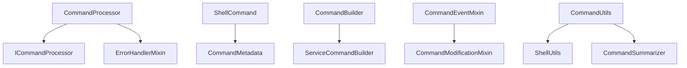

# Command Processor Module

## Overview

The command processor module provides structured command processing capabilities for the PANTHER framework. It handles command parsing, validation, transformation, and adaptation for various execution environments.

## Quick Start

Process a dictionary of commands through the `CommandProcessor`:

```python
from panther.core.command_processor.core.processor import CommandProcessor

processor = CommandProcessor()

commands = {
    "pre_run_cmds": ["export SSLKEYLOGFILE=/tmp/keys.log", "mkdir -p /output"],
    "run_cmd": {
        "working_dir": "/app",
        "command_binary": "picoquic_sample",
        "command_args": "-c server.example.com 4433",
        "environment": {"RUST_LOG": "debug"},
        "timeout": 60,
    },
    "post_run_cmds": ["cp /output/* /shared/"],
}

processed = processor.process_commands(commands, target_format="generic")
# processed["run_cmd"] contains working_dir, command_binary, command_args, ...
# processed["pre_run_cmds"] is a list of ShellCommand.to_dict() results
```

## How-To Guides

### Create a safe shell command

Use `ShellCommand` to wrap a raw command string with validation and metadata:

```python
from panther.core.command_processor.models.shell_command import (
    ShellCommand,
    CommandMetadata,
)

# Basic validated command
cmd = ShellCommand("openssl s_client -connect localhost:4433")
print(cmd.shell_safe_command)  # Escaped for safe shell execution

# Command with metadata
meta = CommandMetadata(is_critical=True, timeout=30, working_directory="/app")
cmd = ShellCommand("iperf3 -s -p 5201", metadata=meta)

# Create from a dictionary (e.g. deserialized config)
cmd = ShellCommand.from_dict({"command": "echo hello", "metadata": {"is_critical": False}})

# Serialize back
as_dict = cmd.to_dict()
# keys: command, raw_command, shell_safe_command, executable, arguments,
#        redirections, metadata
```

### Build complex commands with the builder pattern

`CommandBuilder` provides a fluent interface for assembling command arguments:

```python
from panther.core.command_processor.builders.base_builder import CommandBuilder

builder = CommandBuilder()
args = (
    builder
    .reset()
    .add_argument("picoquic_sample")
    .add_flag("-l", condition=True)          # Add flag conditionally
    .add_option("-p", "4433")                # Add --option value pair
    .add_option("-c", None)                  # Skipped because value is None
    .add_flag("--gso", condition=False)      # Skipped because condition is False
    .add_environment("SSLKEYLOGFILE", "/tmp/keys.log")
    .build_args()
)
env = builder.build_env()
# args == ["picoquic_sample", "-l", "-p", "4433"]
# env  == {"SSLKEYLOGFILE": "/tmp/keys.log"}
```

### Combine split shell constructs

When command lists contain multi-line constructs (for-loops, if-blocks, function
definitions) that were split across list elements, `combine_shell_constructs`
reassembles them:

```python
from panther.core.command_processor.utils.shell_utils import combine_shell_constructs

fragments = [
    "for f in /data/*.pcap",
    "do",
    "  tshark -r $f -T json > ${f}.json",
    "done",
]
combined = combine_shell_constructs(fragments)
# combined is a single-element list with the complete for-loop
```

## Architecture

The module implements a layered architecture with clear separation of concerns:



### Core Components

#### 1. Command Processing Layer

<!-- src: panther/core/command_processor/core/interfaces.py, panther/core/command_processor/core/processor.py, panther/core/command_processor/core/validator.py -->

- **ICommandProcessor**: Interface defining command processing contract
- **CommandProcessor**: Main implementation with validation and transformation logic
- **IEnvironmentCommandAdapter**: Interface for environment-specific adaptations

#### 2. Command Models

<!-- src: panther/core/command_processor/models/shell_command.py, panther/core/command_processor/models/constants.py -->

- **ShellCommand**: Primary command representation with metadata
- **CommandMetadata**: Rich metadata including execution context and properties

#### 3. Builder Pattern

<!-- src: panther/core/command_processor/builders/base_builder.py, panther/core/command_processor/builders/service_builder.py -->

- **CommandBuilder**: Base builder for command construction
- **ServiceCommandBuilder**: Specialized builder for service commands

#### 4. Utility Layer

<!-- src: panther/core/command_processor/utils/command_utils.py, panther/core/command_processor/utils/shell_utils.py, panther/core/command_processor/utils/summarizer.py -->

- **CommandUtils**: General command manipulation utilities
- **ShellUtils**: Shell-specific parsing and escaping functions
- **CommandSummarizer**: Command analysis and summarization

#### 5. Mixins

<!-- src: panther/core/command_processor/mixins/event_mixin.py, panther/core/command_processor/mixins/modification_mixin.py -->

- **CommandEventMixin**: Event handling capabilities
- **CommandModificationMixin**: Command modification operations

## Key Features

### Command Processing

<!-- src: panther/core/command_processor/core/processor.py, panther/core/command_processor/core/validator.py -->

- Validates command structure before processing
- Handles multiple command types (pre_run_cmds, run_cmd, post_run_cmds)
- Detects command properties (multiline, function definitions, control structures)
- Combines shell constructs for optimization

### Shell Command Detection

<!-- src: panther/core/command_processor/models/shell_command.py, panther/core/command_processor/utils/shell_utils.py -->

The system automatically detects various shell command types:
- **Function Definitions**: `function name() { ... }` patterns
- **Control Structures**: if/for/while/case statements
- **Variable Assignments**: `VAR=value` patterns
- **Shell Builtins**: echo, cd, export, etc.
- **Control Operators**: &&, ||, |, ;

### Error Handling
- Fast-fail validation with PantherException integration
- Categorized errors (COMMAND_EXECUTION category)
- Severity levels (CRITICAL, HIGH, MEDIUM, LOW)
- Rich error context for debugging

### Logging Strategy
The module implements high-entropy logging:
- **Summary-based logging** instead of verbose command details
- **Debug-level specifics** only when explicitly enabled
- **Command count summaries** for processing overview
- **Error logging** with full context

## Command Structure

Commands are processed as dictionaries with the following structure:

```python
{
    "pre_run_cmds": [list_of_commands],
    "run_cmd": {
        "working_dir": "path",
        "command_binary": "executable",
        "command_args": "arguments",
        "environment": {"VAR": "value"},
        "timeout": 60
    },
    "post_run_cmds": [list_of_commands]
}
```

## Design Patterns

### Fast-Fail Validation
Commands undergo validation before processing to catch structural issues early:
- Type checking for command dictionaries
- Structure validation for run_cmd
- Command list item validation

### Builder Pattern
Command construction uses the builder pattern for flexibility:
- Fluent interface for command building
- Service-specific builders for specialized use cases
- Extensible for new command types

### Mixin Architecture
Functionality is composed through mixins:
- Event handling can be mixed into processors
- Command modification capabilities are optional
- Clean separation of cross-cutting concerns

## Performance Considerations

### Command Combining
The system optimizes shell commands by combining related constructs:
- Function definitions with their bodies
- Control structures with their blocks
- Command sequences with logical operators

### Lazy Loading
- Circular dependency prevention through lazy imports
- On-demand property detection
- Conditional detailed logging

### Memory Efficiency
- Dataclass usage for command metadata
- Field factories for mutable defaults
- Minimal object creation for validation

## Integration Points

### Exception Handling
Integrates with PANTHER's exception system:
- ErrorHandlerMixin for consistent error processing
- PantherException for structured error reporting
- ErrorCategory and ErrorSeverity classification

### Logging
Uses PANTHER's feature logger system:
- Feature-specific logger instances
- Configurable log levels
- Structured log messages

### Constants

<!-- src: panther/core/command_processor/models/constants.py -->

Centralized shell constants for consistency:
- SHELL_BUILTINS list
- SHELL_CONTROL_OPERATORS patterns
- REDIRECTION_OPERATORS definitions

## Extensibility

### Adding New Command Types
1. Extend ICommandProcessor interface
2. Implement processing logic in CommandProcessor
3. Add validation rules in _validate_command_structure
4. Update command detection in detect_command_properties

### Environment Adapters
Implement IEnvironmentCommandAdapter for new environments:
- Docker container adaptations
- Kubernetes job adaptations
- Cloud function adaptations

### Custom Builders
Extend CommandBuilder for specialized command construction:
- Domain-specific command types
- Template-based command generation
- Configuration-driven builders
