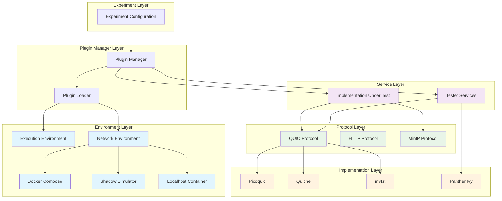
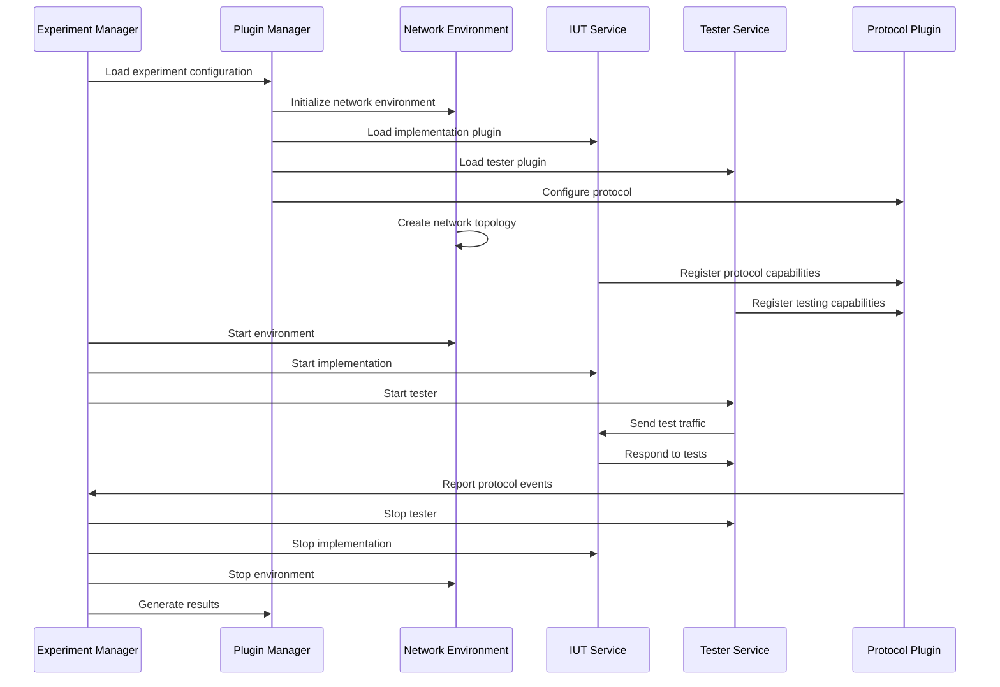

# PANTHER Plugin System

**Modular, extensible testing framework for network protocols**

The PANTHER plugin system provides a flexible architecture for extending testing capabilities across different protocols, implementations, and environments. This modular design enables researchers and developers to add new testing scenarios, protocol implementations, and deployment environments without modifying the core framework.

## Plugin Architecture

PANTHER uses a consistent plugin architecture across all plugin types:

```
plugins/
├── environments/         # Environment plugins
│   ├── execution_environment/
│   ├── network_environment/
│   └── tutorials/        # Environment plugin tutorials
├── protocols/            # Protocol plugins
│   ├── client_server/
│   ├── peer_to_peer/
│   └── tutorials/        # Protocol plugin tutorials
├── services/             # Service plugins
│   ├── iut/
│   ├── testers/
│   └── tutorials/        # Service plugin tutorials
├── plugin_creator.py     # Plugin creation utilities
├── plugin_interface.py   # Base plugin interface
├── plugin_loader.py      # Plugin loading utilities
└── plugin_manager.py     # Plugin lifecycle management
```

### Plugin Hierarchy

PANTHER uses a hierarchical plugin system:

1. **Top-level Plugin Types**:
   - `services`: Implementations and testers
   - `environments`: Network and execution environments
   - `protocols`: Communication protocol implementations

2. **Subplugin Types**:
   - Under `services`: `iut` (Implementation Under Test) and `testers`
   - Under `environments`: `network_environment` and `execution_environment`
   - Under `protocols`: Specific protocol implementations (e.g., `quic`, `http`)

### Plugin Management

The plugin system provides dynamic loading and lifecycle management:

- **[Plugin Loader](panther/plugins/plugin_loader.py)**: Dynamic plugin discovery and loading
- **[Plugin Manager](panther/plugins/plugin_manager.py)**: Plugin lifecycle and dependency management
- **[Plugin Interface](panther/plugins/plugin_interface.py)**: Base interfaces and contracts

## Plugin Categories

PANTHER plugins are organized into three primary categories:

### Services Plugins

Service plugins represent either implementations being tested or testing tools:

| Category | Purpose | Examples |
|----------|---------|----------|
| **IUT (Implementation Under Test)** | Protocol implementations to evaluate | picoquic, minip, HTTP servers |
| **Testers** | Testing and validation tools | ivy_tester, protocol conformance checkers |

**Documentation**: [Services Plugin Guide](panther/plugins/services/README.md)

### Protocol Plugins

Protocol plugins provide testing logic and configuration for specific network protocols:

| Category | Purpose | Examples |
|----------|---------|----------|
| **Client-Server** | Traditional client-server protocols | HTTP, QUIC client-server testing |
| **Peer-to-Peer** | Distributed/P2P protocols | BitTorrent, DHT protocols |

**Documentation**: [Protocol Plugin Guide](panther/plugins/protocols/README.md)

### Environment Plugins

Environment plugins manage where and how tests execute:

| Category | Purpose | Examples |
|----------|---------|----------|
| **Execution Environment** | Performance monitoring and profiling | gperf, strace, memcheck |
| **Network Environment** | Network topology and deployment | docker_compose, shadow_ns |

**Documentation**: [Environment Plugin Guide](panther/plugins/environments/README.md)

## Plugin Ecosystem Architecture

The PANTHER plugin ecosystem follows a layered architecture that enables flexible composition of testing scenarios:



## Plugin Interaction Workflow

The following diagram illustrates how plugins interact during experiment execution:


