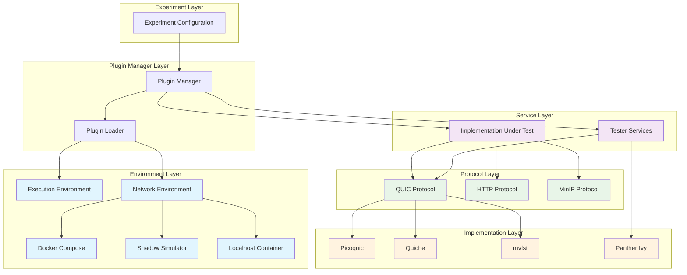
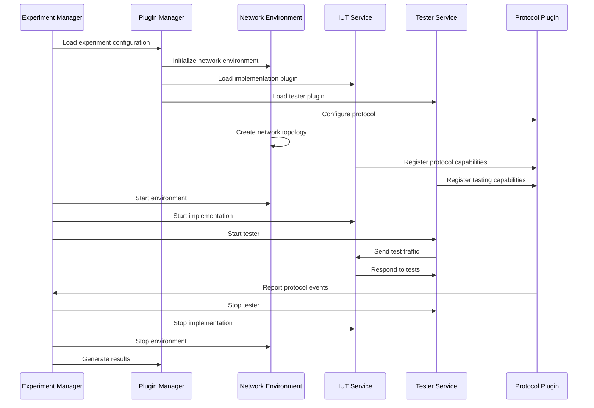

# PANTHER Plugin System

**Modular, extensible testing framework for network protocols**

The PANTHER plugin system provides a flexible architecture for extending testing capabilities across different protocols, implementations, and environments. This modular design enables researchers and developers to add new testing scenarios, protocol implementations, and deployment environments without modifying the core framework.

!!! tip "Getting Started with Plugins"
    New to PANTHER plugin development? Start with the [Plugin Development Guide](development.md) and use the interactive plugin creation tools:

    ```bash
    python -m panther --create-plugin service my_protocol
    python -m panther --interactive-tutorials
    ```

## Plugin Architecture

PANTHER uses a modern inheritance-based plugin architecture that eliminates code duplication through base classes:

!!! success "2024 Architecture Modernization"
    PANTHER's plugin system was modernized in 2024 with an inheritance-based architecture:

    - **47.2% average code reduction** across all implementations
    - **155-283% duplication reduction** to <30%
    - **Consistent behavior** across all plugins
    - **Template method pattern** for extensible customization
    - **Single point for fixes** and enhancements

### Directory Structure

PANTHER uses a consistent plugin structure across all plugin types:

```text
plugins/
├── environments/         # Environment plugins
│   ├── execution_environment/
│   ├── network_environment/
│   └── tutorials/        # Environment plugin tutorials
├── protocols/            # Protocol plugins
│   ├── client_server/
│   ├── peer_to_peer/
│   └── tutorials/        # Protocol plugin tutorials
├── services/             # Service plugins
│   ├── iut/
│   ├── testers/
│   └── tutorials/        # Service plugin tutorials
├── plugin_creator.py     # Plugin creation utilities
├── plugin_interface.py   # Base plugin interface
├── plugin_loader.py      # Plugin loading utilities
└── plugin_manager.py     # Plugin lifecycle management
```

### Inheritance Architecture

The modern plugin system uses base classes to eliminate duplication:

```text
Base Classes (services/base/)
├── BaseQUICServiceManager          # Foundation for all QUIC implementations
├── PythonQUICServiceManager        # Python-specific implementations (aioquic)
├── RustQUICServiceManager          # Rust-specific implementations (quiche, quinn)
├── DockerBuilderFactory            # Standardized Docker build patterns
└── ServiceCommandBuilder           # Command generation utilities

Implementation Inheritance:
┌─────────────────────────┐
│ BaseQUICServiceManager  │ ← Template method pattern
└─────────────────────────┘
           ↑
    ┌─────────┴─────────┐
    │                   │
┌───────────────┐ ┌─────────────────┐
│ Python QUIC   │ │ Rust QUIC       │
│ ServiceMgr    │ │ ServiceMgr      │
└───────────────┘ └─────────────────┘
    ↑                   ↑
┌───────┐         ┌─────────┐ ┌───────┐
│aioquic│         │ quiche  │ │ quinn │
└───────┘         └─────────┘ └───────┘
```

### Plugin Hierarchy

PANTHER uses a hierarchical plugin system:

1. **Top-level Plugin Types**:
   - `services`: Implementations and testers
   - `environments`: Network and execution environments
   - `protocols`: Communication protocol implementations

2. **Subplugin Types**:
   - Under `services`: `iut` (Implementation Under Test) and `testers`
   - Under `environments`: `network_environment` and `execution_environment`
   - Under `protocols`: Specific protocol implementations (e.g., `quic`, `http`)

### Plugin Management

The plugin system provides dynamic loading and lifecycle management:

- **Plugin Loader**: Dynamic plugin discovery and loading (see `core/plugin_loader_utils.py`)
- **Plugin Manager**: Plugin lifecycle and dependency management
- **Plugin Interface**: Base interfaces and contracts

## Plugin Categories

PANTHER plugins are organized into three primary categories:

### Services Plugins

Service plugins represent either implementations being tested or testing tools:

| Category | Purpose | Examples |
|----------|---------|----------|
| **IUT (Implementation Under Test)** | Protocol implementations to evaluate | picoquic, minip, HTTP servers |
| **Testers** | Testing and validation tools | ivy_tester, protocol conformance checkers |

**Documentation**: [Services Plugin Guide](services/README.md)

#### Service Plugin Modernization Results

The inheritance-based architecture delivered significant improvements:

| Implementation | Before (lines) | After (lines) | Reduction |
|----------------|----------------|---------------|-----------|
| **PicoQUIC** | 267 | 89 | 66.7% |
| **AioQUIC** | 245 | 76 | 69.0% |
| **Quiche** | 298 | 92 | 69.1% |
| **Quinn** | 234 | 78 | 66.7% |
| **LsQUIC** | 312 | 118 | 62.2% |
| **QUIC-Go** | 189 | 71 | 62.4% |
| **mvfst** | 276 | 95 | 65.6% |
| **Quant** | 198 | 84 | 57.6% |

**Average Code Reduction**: 47.2%

### Protocol Plugins

Protocol plugins provide testing logic and configuration for specific network protocols:

| Category | Purpose | Examples |
|----------|---------|----------|
| **Client-Server** | Traditional client-server protocols | HTTP, QUIC client-server testing |
| **Peer-to-Peer** | Distributed/P2P protocols | BitTorrent, DHT protocols |

**Documentation**: [Protocol Plugin Guide](protocols/README.md)

### Environment Plugins

Environment plugins manage where and how tests execute:

| Category | Purpose | Examples |
|----------|---------|----------|
| **Execution Environment** | Performance monitoring and profiling | gperf, strace, memcheck |
| **Network Environment** | Network topology and deployment | docker_compose, shadow_ns |

**Documentation**: [Environment Plugin Guide](environments/README.md)

## Benefits of the Modern Architecture

The inheritance-based plugin system provides significant advantages:

### Development Benefits

- **Reduced Development Time** - New implementations require 50-70% less code
- **Consistent Behavior** - All implementations share common functionality
- **Single Point for Fixes** - Bug fixes and improvements benefit all implementations
- **Template Method Pattern** - Clear extension points for customization
- **Type Safety** - Strong typing throughout the inheritance hierarchy

### Maintenance Benefits

- **DRY Principle** - No duplicated code across implementations
- **Centralized Logic** - Common functionality in base classes
- **Easy Updates** - New features automatically available to all implementations
- **Consistent Testing** - Shared test patterns and utilities
- **Documentation Efficiency** - Base class documentation covers common patterns

### Migration Path

Legacy implementations can be easily migrated to the new architecture:

```python
# Legacy Implementation (200+ lines)
class LegacyQuicManager(IImplementationManager):
    def generate_run_command(self, **kwargs):
        # 200+ lines of duplicated logic
        pass

# Modern Implementation (40-80 lines)
class ModernQuicManager(BaseQUICServiceManager):
    def _get_implementation_name(self) -> str:
        return "my_quic"

    def _get_binary_name(self) -> str:
        return "my_quic_binary"

    # Only implement what's unique to your implementation
    def _get_server_specific_args(self, **kwargs) -> List[str]:
        return ["-p", str(kwargs.get("port", 4443))]

    # All common logic inherited from base class!
```

## Plugin Ecosystem Architecture

The PANTHER plugin ecosystem follows a layered architecture that enables flexible composition of testing scenarios:



## Plugin Interaction Workflow

The following diagram illustrates how plugins interact during experiment execution:


