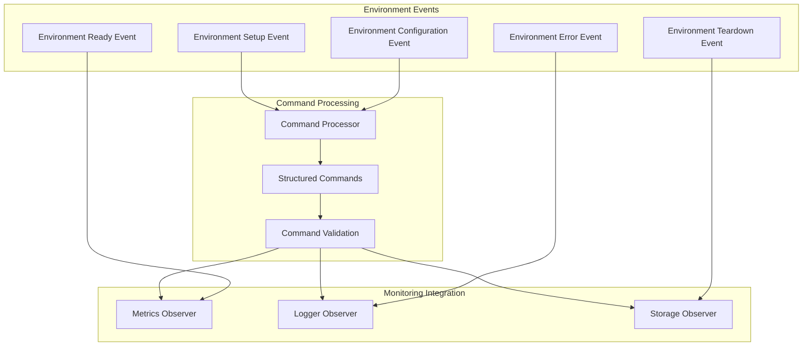
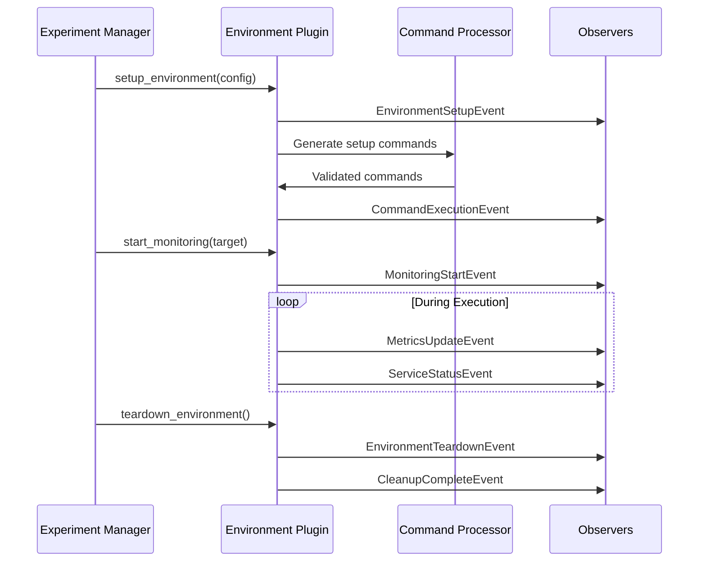

<!-- filepath: /Users/elniak/Documents/Project/PANTHER/panther/plugins/environments/README.md -->
# PANTHER Environment Plugins

**Execution and network environment management for testing**

Environment plugins manage where and how tests execute within PANTHER. They provide abstractions for different deployment scenarios, from localhost testing to containerized environments and network simulation platforms.

!!! info "Environment Types"
    PANTHER supports two main environment categories:

    - **Execution Environments**: Add monitoring, profiling, and analysis during test runs
    - **Network Environments**: Manage network topology, containers, and simulation infrastructure

## Modern Event-Driven Architecture (2024)

!!! success "Event System Integration"
    Environment plugins now integrate seamlessly with PANTHER's event-driven architecture, providing real-time monitoring, command processor integration, and comprehensive lifecycle tracking through typed events.

### Event-Driven Environment Lifecycle



### Command Processor Integration

Environment plugins now use the Command Processor for structured command generation and execution:

```python
# Modern environment command generation
from panther.core.command_processor import ShellCommand
from panther.core.events.environment.events import EnvironmentSetupEvent

class ModernEnvironmentPlugin(EnvironmentInterface):
    def setup_environment(self, config):
        # Emit setup start event
        self.emit_event(EnvironmentSetupEvent(
            environment_name=self.get_name(),
            setup_type="container_deployment"
        ))

        # Generate structured commands through Command Processor
        setup_commands = [
            ShellCommand(
                command="docker-compose",
                args=["-f", config["compose_file"], "up", "-d"],
                working_dir=config.get("working_dir", "."),
                timeout=300
            )
        ]

        # Execute through command processor with validation
        for cmd in setup_commands:
            result = self.command_processor.execute(cmd)

            # Emit command execution event
            self.emit_event(CommandExecutionEvent(
                command=cmd.to_string(),
                exit_code=result.exit_code,
                environment_name=self.get_name()
            ))
```

<!-- src: /panther/plugins/environments/environment_interface.py -->

## Environment Categories

### Execution Environments

Execution environment plugins provide monitoring, profiling, and analysis capabilities during test execution.

| Tool | Purpose | Documentation |
|------|---------|---------------|
| **gperf_cpu** | CPU profiling and performance analysis | [Documentation](panther/plugins/environments/execution_environment/gperf_cpu/README.md) |
| **gperf_heap** | Memory allocation profiling | [Documentation](panther/plugins/environments/execution_environment/gperf_heap/README.md) |
| **strace** | System call tracing | [Documentation](panther/plugins/environments/execution_environment/strace/README.md) |
| **memcheck** | Memory error detection | [Documentation](panther/plugins/environments/execution_environment/memcheck/README.md) |
| **helgrind** | Thread error detection | [Documentation](panther/plugins/environments/execution_environment/helgrind/README.md) |

### Network Environments

Network environment plugins manage network topology, containerization, and simulation infrastructure.

| Environment | Purpose | Documentation |
|-------------|---------|---------------|
| **docker_compose** | Multi-container testing environments | [Documentation](panther/plugins/environments/network_environment/docker_compose/README.md) |
| **shadow_ns** | Network simulation and emulation | [Documentation](panther/plugins/environments/network_environment/shadow_ns/README.md) |
| **localhost_single_container** | Single container deployment on localhost | [Documentation](panther/plugins/environments/network_environment/localhost_single_container/README.md) |

## Quick Start

### Using an Execution Environment

```python
# filepath: example_execution_env.py
from panther.plugins.plugin_loader import PluginLoader

# Load CPU profiling environment
loader = PluginLoader()
gperf_cpu = loader.load_plugin('environments', 'execution_environment', 'gperf_cpu')

# Configure profiling
config = {
    "profile_frequency": 100,
    "output_file": "/tmp/cpu_profile.prof",
    "target_process": "picoquic_server"
}

gperf_cpu.initialize(config)
```

### Using a Network Environment

```python
# filepath: example_network_env.py
from panther.plugins.plugin_loader import PluginLoader

# Load Docker Compose environment
loader = PluginLoader()
docker_env = loader.load_plugin('environments', 'network_environment', 'docker_compose')

# Configure network topology
config = {
    "compose_file": "docker-compose.yml",
    "network_name": "panther_test_net",
    "services": ["quic_server", "quic_client"]
}

docker_env.setup_environment(config)
```

## Directory Structure

```text
environments/
├── README.md                    # This file
├── environment_interface.py    # Base environment interface
├── config_schema.py           # Configuration validation
├── execution_environment/     # Execution monitoring tools
│   ├── README.md
│   ├── config_schema.py
│   ├── execution_environment_interface.py
│   ├── gperf_cpu/            # CPU profiling
│   ├── gperf_heap/           # Memory profiling
│   ├── strace/               # System call tracing
│   ├── memcheck/             # Memory error detection
│   └── helgrind/             # Thread error detection
└── network_environment/       # Network deployment
    ├── README.md
    ├── base_network_environment.py  # Base class for network environments
    ├── network_environment_interface.py  # Network environment interface
    ├── docker_compose/       # Container orchestration
    ├── shadow_ns/            # Network simulation
    └── localhost_single_container/  # Single container localhost deployment
```

## Environment Interfaces

### Base Environment Interface

```python
# filepath: /panther/plugins/environments/environment_interface.py
from panther.plugins.plugin_interface import IPlugin

class EnvironmentInterface(IPlugin):
    """Base interface for environment plugins."""

    def setup_environment(self, config):
        """Setup the testing environment."""
        pass

    def teardown_environment(self):
        """Clean up the testing environment."""
        pass

    def get_environment_status(self):
        """Get current environment status."""
        pass
```

### Execution Environment Interface

```python
# filepath: /panther/plugins/environments/execution_environment/execution_environment_interface.py
from panther.plugins.environments.environment_interface import EnvironmentInterface

class ExecutionEnvironmentInterface(EnvironmentInterface):
    """Interface for execution monitoring environments."""

    def start_monitoring(self, target_process):
        """Start monitoring target process."""
        pass

    def stop_monitoring(self):
        """Stop monitoring and collect results."""
        pass

    def get_monitoring_data(self):
        """Retrieve collected monitoring data."""
        pass
```

## Configuration

### Common Configuration Options

All environment plugins support these base options:

- **environment_name**: Unique identifier for the environment
- **cleanup_on_exit**: Automatically clean up resources when done
- **timeout**: Maximum setup/execution time
- **logging_level**: Environment-specific logging

### Execution Environment Configuration

- **target_process**: Process or service to monitor
- **monitoring_duration**: How long to collect data
- **output_directory**: Where to store monitoring results
- **sampling_rate**: Data collection frequency

### Network Environment Configuration

- **network_topology**: Network layout and connections
- **deployment_target**: Where to deploy (local, cloud, simulation)
- **resource_limits**: CPU, memory, network constraints
- **service_dependencies**: Service startup order and dependencies

### Enhanced Monitoring Capabilities

Modern environment plugins provide comprehensive monitoring through the integrated metrics system:

```python
# Enhanced monitoring with event-driven metrics
class ModernEnvironmentPlugin(EnvironmentInterface):
    def start_monitoring(self, target_process):
        # Start metrics collection
        self.metrics_collector.start_collection()

        # Emit monitoring start event
        self.emit_event(MonitoringStartEvent(
            environment_name=self.get_name(),
            target_process=target_process,
            monitoring_type="execution_profiling"
        ))

        # Configure real-time metrics
        self.setup_real_time_metrics([
            "cpu_usage", "memory_usage", "network_io",
            "disk_io", "process_stats"
        ])

    def get_monitoring_data(self):
        # Collect metrics through observer pattern
        metrics_data = self.metrics_collector.collect_all()

        # Emit metrics collection event
        self.emit_event(MetricsCollectionEvent(
            environment_name=self.get_name(),
            metrics_count=len(metrics_data),
            collection_timestamp=datetime.now()
        ))

        return metrics_data
```

### Environment Service Coordination

Environment plugins coordinate with service managers through events:

```python
# Service coordination through event system
class NetworkEnvironmentPlugin(EnvironmentInterface):
    def deploy_services(self, service_configs):
        for service_config in service_configs:
            # Emit service deployment event
            self.emit_event(ServiceDeploymentEvent(
                service_name=service_config["name"],
                environment_name=self.get_name(),
                deployment_type="container"
            ))

            # Wait for service readiness through event listening
            self.wait_for_service_ready(service_config["name"])

            # Emit service ready confirmation
            self.emit_event(ServiceReadyEvent(
                service_name=service_config["name"],
                environment_name=self.get_name()
            ))
```

## Environment Integration

Environment plugins integrate with the PANTHER experiment lifecycle through modern event-driven patterns:

1. **Setup Phase**: Environment plugins prepare infrastructure with event emission
2. **Execution Phase**: Monitor and manage tests with real-time event tracking
3. **Collection Phase**: Gather results through observer pattern integration
4. **Teardown Phase**: Clean up with comprehensive event logging

### Docker Build Integration

Network environments now use a unified Docker mixin pattern for managing Docker operations:

```python
# Modern environment Docker operations
from panther.core.docker_builder.plugin_mixin.environment_manager_docker_mixing import EnvironmentManagerDockerMixin

class NetworkEnvironment(BaseNetworkEnvironment, EnvironmentManagerDockerMixin):
    def generate_environment_services(self, paths, timestamp):
        # Build base service image
        base_image_tag = self.build_base_service_image(self.plugin_manager)

        # Ensure service images are available
        service_images = self.ensure_service_images_available(self.services_managers)

        # Generate environment-specific files with proper base image
        self.generate_from_template(
            template_name="Dockerfile.jinja",
            additional_param={
                "base_image": base_image_tag,
                "service_images": service_images,
            }
        )

        # Build final environment image
        if self.global_config.docker.force_build_docker_image:
            self.build_environment_image(
                dockerfile_path=self.rendered_dockerfile_path,
                image_name=f"{self.env_name}:latest"
            )
```

### Modern Environment Lifecycle



### Execution Flow

```python
# filepath: example_environment_flow.py
# 1. Setup environment
environment.setup_environment(config)

# 2. Start monitoring (execution environments)
if isinstance(environment, ExecutionEnvironmentInterface):
    environment.start_monitoring(target_process)

# 3. Run tests (handled by core framework)
# ...

# 4. Stop monitoring and collect results
if isinstance(environment, ExecutionEnvironmentInterface):
    monitoring_data = environment.get_monitoring_data()

# 5. Teardown environment
environment.teardown_environment()
```

## Development

For information on creating new environment plugins:

- **[Environment Plugin Development Guide](panther/plugins/environments/development.md)**: Comprehensive development documentation
- **[Execution Environment Development](panther/plugins/environments/execution_environment/development.md)**: Creating monitoring tools
- **[Network Environment Development](panther/plugins/environments/network_environment/development.md)**: Creating deployment environments
