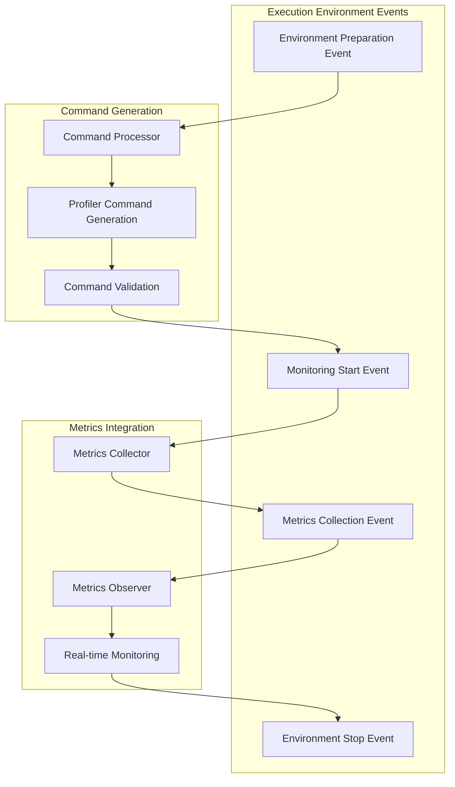

# Execution Environment Modules 🔧

> **Purpose:** Comprehensive guide to PANTHER's execution environments and profiling tools
> **Target:** Developers implementing performance analysis; researchers studying system behavior; DevOps teams optimizing deployments

Execution environments in PANTHER define **where and how** your implementations run during testing. They provide containerized environments, performance profiling, debugging tools, and systematic analysis capabilities.

## Modern Architecture Integration (2024)

!!! success "Command Processor & Event System Integration"
    Execution environments now integrate seamlessly with PANTHER's modern architecture, using the Command Processor for structured command generation, event-driven monitoring, and comprehensive metrics collection through the observer pattern.

### Event-Driven Profiler Integration



### Modern Command Generation for Profilers

Execution environments now use the Command Processor for structured profiler command generation:

```python
# Modern profiler command generation
from panther.core.command_processor import ShellCommand
from panther.core.events.environment.events import ProfilingStartEvent

class ModernGperfCpuEnvironment(IExecutionEnvironment):
    def start_monitoring(self, target_process):
        # Emit profiling start event
        self.emit_event(ProfilingStartEvent(
            environment_name="gperf_cpu",
            target_process=target_process,
            profiling_type="cpu_profiling"
        ))

        # Generate structured profiler commands
        profiler_commands = [
            ShellCommand(
                command="env",
                args=[
                    f"CPUPROFILE=/tmp/cpu.prof",
                    f"CPUPROFILE_FREQUENCY={self.config['frequency']}",
                    target_process
                ],
                timeout=self.config.get('duration', 60),
                capture_output=True
            )
        ]

        # Execute through command processor with validation
        for cmd in profiler_commands:
            result = self.command_processor.execute(cmd)

            # Emit command execution event
            self.emit_event(CommandExecutionEvent(
                command=cmd.to_string(),
                exit_code=result.exit_code,
                environment_name="gperf_cpu",
                output_size=len(result.stdout) if result.stdout else 0
            ))
```

---

## Architecture Overview

PANTHER's execution environments use a **modern event-driven architecture** where each environment type provides:

1. **Isolated Runtime**: Containerized execution with controlled dependencies
2. **Performance Monitoring**: CPU, memory, and system call profiling with real-time events
3. **Debug Capabilities**: Memory leak detection, threading analysis, and tracing
4. **Result Collection**: Automated gathering of metrics through observer pattern
5. **Command Processing**: Structured command generation and validation
6. **Event Integration**: Real-time monitoring and status tracking

### Environment Types

| Environment | Purpose | Use Cases |
|-------------|---------|-----------|
| **GPerf CPU** | CPU performance profiling | Performance optimization, bottleneck analysis |
| **GPerf Heap** | Memory allocation profiling | Memory leak detection, heap analysis |
| **Strace** | System call tracing | Debugging, security analysis |
| **Helgrind** | Thread error detection | Concurrency bug detection |
| **Memcheck** | Memory error detection | Memory safety validation |
| **Iterations** | Repeated execution runs | Statistical analysis, reliability testing |

---

## Available Execution Environments

### 1. Standard Docker Container

**Purpose:** Basic containerized execution environment for consistent testing.

**Configuration:**

```yaml
execution_environment:
  type: "docker_container"
  config:
    image: "panther/test-env:latest"
    dockerfile: "./Dockerfile"
    build_context: "./build"
    environment:
      - "DEBUG=1"
      - "RUST_LOG=debug"
    volumes:
      - "./certs:/certs:ro"
      - "./logs:/app/logs:rw"
    capabilities:
      - "NET_ADMIN"
      - "SYS_PTRACE"
    working_dir: "/app"
    user: "panther"
```

**Features:**

- Environment variable injection
- Volume mounting for data persistence
- Security capability management
- User/permission control

### 2. GPerf CPU Profiling

**Purpose:** Detailed CPU performance analysis using Google Performance Tools.

**Configuration:**

```yaml
execution_environment:
  type: "gperf_cpu"
  config:
    base_image: "panther/profiling:latest"
    profiling:
      frequency: 100  # Samples per second
      duration: 60    # Profiling duration in seconds
      output_format: "callgrind"
    analysis:
      generate_flamegraph: true
      include_kernel: false
      filter_functions: ["malloc", "free"]
```

**Generated Artifacts:**

- CPU profile data (`.prof` files)
- Call graphs and flame graphs
- Function-level timing statistics
- Hot path identification

**Use Cases:**

- Performance optimization
- Bottleneck identification
- Algorithm comparison
- Regression testing

### 3. GPerf Heap Profiling

**Purpose:** Memory allocation and heap usage analysis.

**Configuration:**

```yaml
execution_environment:
  type: "gperf_heap"
  config:
    base_image: "panther/profiling:latest"
    profiling:
      sampling_rate: 524288  # Sample every 512KB
      track_allocations: true
      track_deallocations: true
    analysis:
      generate_heap_dump: true
      detect_leaks: true
      growth_analysis: true
```

**Generated Artifacts:**

- Heap profiles (`.heap` files)
- Memory leak reports
- Allocation pattern analysis
- Memory usage trends

### 4. Strace System Call Tracing

**Purpose:** System call monitoring and debugging.

**Configuration:**

```yaml
execution_environment:
  type: "strace"
  config:
    base_image: "panther/debug:latest"
    tracing:
      trace_children: true
      follow_forks: true
      syscalls: ["network", "file", "process"]
      output_format: "json"
    filtering:
      exclude_syscalls: ["clock_gettime", "gettimeofday"]
      include_only: ["send", "recv", "connect", "bind"]
```

**Generated Artifacts:**

- System call traces
- Timing analysis
- File descriptor tracking
- Network activity logs

### 5. Helgrind Thread Analysis

**Purpose:** Detection of threading errors and race conditions.

**Configuration:**

```yaml
execution_environment:
  type: "helgrind"
  config:
    base_image: "panther/valgrind:latest"
    analysis:
      track_lockorders: true
      check_races: true
      history_level: "full"
    reporting:
      show_reachable: true
      leak_check: "full"
      track_origins: true
```

**Generated Artifacts:**

- Race condition reports
- Deadlock detection
- Lock ordering analysis
- Thread interaction maps

### 6. Memcheck Memory Analysis

**Purpose:** Memory error detection using Valgrind.

**Configuration:**

```yaml
execution_environment:
  type: "memcheck"
  config:
    base_image: "panther/valgrind:latest"
    checks:
      leak_check: "full"
      show_reachable: true
      track_origins: true
      undef_value_errors: true
    suppressions:
      - "/app/suppressions/openssl.supp"
      - "/app/suppressions/system.supp"
```

**Generated Artifacts:**

- Memory leak reports
- Invalid memory access detection
- Uninitialized variable usage
- Memory corruption analysis

### 7. Iterations Environment

**Purpose:** Repeated execution runs for statistical analysis.

**Configuration:**

```yaml
execution_environment:
  type: "iterations"
  config:
    base_environment: "docker_container"
    iterations:
      count: 100
      parallel: 4
      timeout: 300
    statistics:
      collect_timing: true
      collect_metrics: true
      confidence_interval: 0.95
    failure_handling:
      continue_on_failure: true
      max_failures: 10
```

**Generated Artifacts:**

- Statistical summaries
- Performance distributions
- Reliability metrics
- Outlier analysis

---

## Configuration Schema

Each execution environment follows a common configuration schema:

```python
from dataclasses import dataclass
from typing import Optional, List, Dict

@dataclass
class ExecutionEnvironmentConfig:
    type: str
    config: Dict[str, Any]

    # Common options
    timeout: Optional[int] = 300
    retry_count: Optional[int] = 1
    cleanup_on_exit: Optional[bool] = True

    # Resource limits
    memory_limit: Optional[str] = None
    cpu_limit: Optional[float] = None

    # Networking
    network_mode: Optional[str] = "bridge"
    exposed_ports: Optional[List[str]] = None

    # Volumes and mounts
    volumes: Optional[List[str]] = None
    tmpfs: Optional[List[str]] = None
```

---

## Advanced Usage

### Custom Environment Images

Create specialized Docker images for your testing needs:

```dockerfile
# Custom profiling environment
FROM panther/base:latest

# Install profiling tools
RUN apt-get update && apt-get install -y \
    google-perftools \
    valgrind \
    strace \
    gdb

# Add custom tools
COPY tools/ /opt/tools/
RUN chmod +x /opt/tools/*

WORKDIR /app
```

### Environment Chaining

Combine multiple environments for comprehensive analysis:

```yaml
tests:
  - name: "comprehensive_analysis"
    execution_environment:
      - type: "gperf_cpu"
        config:
          duration: 30
      - type: "memcheck"
        config:
          leak_check: "full"
      - type: "strace"
        config:
          syscalls: ["network"]
```

### Performance Comparison

Use iterations for statistical performance comparison:

```yaml
execution_environment:
  type: "iterations"
  config:
    base_environment: "gperf_cpu"
    iterations:
      count: 50
      variants:
        - name: "baseline"
          config: {}
        - name: "optimized"
          config:
            compiler_flags: ["-O3", "-flto"]
```

---

## Output Analysis

### CPU Profiling Results

CPU profiling generates several output formats:

```bash
# View profile in terminal
pprof --text /app/logs/cpu.prof

# Generate call graph
pprof --pdf /app/logs/cpu.prof > callgraph.pdf

# Interactive web interface
pprof --http=:8080 /app/logs/cpu.prof
```

### Memory Analysis

Heap profiling provides detailed memory insights:

```bash
# Show top memory allocators
pprof --top /app/logs/heap.prof

# Memory growth over time
pprof --growth /app/logs/heap.prof

# Interactive analysis
pprof --http=:8081 /app/logs/heap.prof
```

### System Call Analysis

Strace output can be analyzed for patterns:

```python
import json
import pandas as pd

# Load strace JSON output
with open('/app/logs/strace.json') as f:
    calls = json.load(f)

# Analyze syscall patterns
df = pd.DataFrame(calls)
print(df.groupby('syscall')['duration'].describe())
```

---

## Best Practices

### 1. Environment Selection

Choose environments based on testing goals:

- **Development**: Use standard Docker containers
- **Performance**: Use GPerf profiling environments
- **Debugging**: Use Valgrind-based environments
- **Production**: Use iterations for statistical validation

### 2. Resource Management

Configure appropriate resource limits:

```yaml
execution_environment:
  config:
    memory_limit: "2g"
    cpu_limit: 2.0
    timeout: 600
```

### 3. Data Collection

Optimize data collection for analysis needs:

```yaml
execution_environment:
  type: "gperf_cpu"
  config:
    profiling:
      frequency: 1000  # Higher frequency for detailed analysis
      duration: 120    # Longer duration for statistical significance
```

### 4. Clean Execution

Ensure clean execution environments:

```yaml
execution_environment:
  config:
    cleanup_on_exit: true
    remove_volumes: true
    kill_timeout: 30
```

---

## Troubleshooting

### Common Issues

**Environment Build Failures:**

```bash
# Check Docker build logs
docker build --no-cache -t test-env .

# Verify base image availability
docker pull panther/base:latest
```

**Permission Issues:**

```yaml
execution_environment:
  config:
    user: "1000:1000"  # Use numeric UID/GID
    capabilities: ["SYS_PTRACE"]  # Add required capabilities
```

**Memory Constraints:**

```yaml
execution_environment:
  config:
    memory_limit: "4g"  # Increase memory limit
    swap_limit: "4g"    # Configure swap
```

**Profiling Overhead:**

```yaml
execution_environment:
  type: "gperf_cpu"
  config:
    profiling:
      frequency: 10  # Reduce sampling frequency
```

### Debug Mode

Enable debug mode for detailed environment logging:

```bash
export PANTHER_DEBUG_ENV=1
panther --experiment-config config.yaml
```

---

## Integration Examples

### CI/CD Integration

```yaml
# GitHub Actions example
- name: "Performance Regression Test"
  uses: ./panther-action
  with:
    config: |
      execution_environment:
        type: "gperf_cpu"
        config:
          profiling:
            duration: 60
      tests:
        - name: "performance_baseline"
          compare_with: "main"
```

### Custom Metrics Collection

```python
# Custom environment plugin
class CustomProfiling(IExecutionEnvironment):
    def __init__(self):
        self.metrics = []

    def execute(self, command, config):
        start_time = time.time()
        result = super().execute(command, config)
        end_time = time.time()

        self.metrics.append({
            'duration': end_time - start_time,
            'command': command,
            'timestamp': start_time
        })

        return result
```

---

For detailed plugin development information, see [Plugin Development Guide](PLUGIN_GUIDE.md).
For service configuration, see [Service Modules](service_modules.md).
For network environments, see [Network Environment Modules](network_environment_modules.md).
