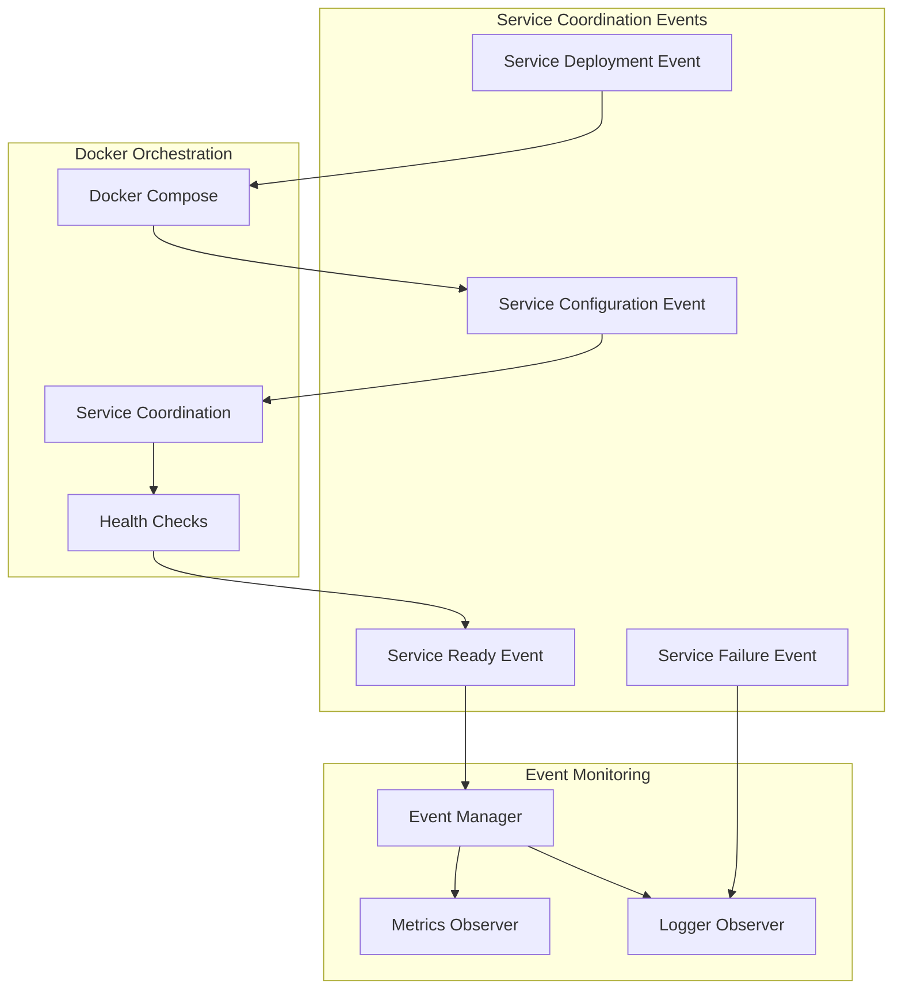

# Network Environment Plugins

!!! info "Network Topology Management"
    Network environment plugins define the network topology, conditions, and characteristics for experiments. They enable realistic network scenarios including containerized environments and network simulation.

> **Plugin Type**: Network Environment

> **Verified Source Location**: `plugins/environments/network_environment/`

## Overview

Network environment plugins define the network topology, conditions, and characteristics for PANTHER experiments. They allow for creating realistic or controlled network scenarios for protocol testing.

## Modern Docker Orchestration & Event Integration (2024)

!!! success "Enhanced Service Coordination"
    Network environments now provide sophisticated Docker Compose orchestration, service coordination through events, and real-time monitoring with comprehensive event tracking for improved reliability and debugging.

### Docker Compose Service Coordination

Modern network environments coordinate service deployment through events:



### Event-Driven Network Environment

```python
# Modern network environment with event integration
from panther.core.events.environment.events import NetworkSetupEvent, ServiceDeploymentEvent
from panther.core.command_processor import ShellCommand

class ModernDockerComposeEnvironment(INetworkEnvironment):
    def deploy_services(self, service_configs):
        # Emit network setup start event
        self.emit_event(NetworkSetupEvent(
            environment_name="docker_compose",
            network_type="container_orchestration",
            service_count=len(service_configs)
        ))

        # Generate docker-compose commands through Command Processor
        compose_commands = [
            ShellCommand(
                command="docker-compose",
                args=["-f", self.compose_file, "up", "-d", "--build"],
                working_dir=self.project_dir,
                timeout=600
            )
        ]

        # Execute with validation and event emission
        for cmd in compose_commands:
            # Emit service deployment event
            self.emit_event(ServiceDeploymentEvent(
                environment_name="docker_compose",
                deployment_type="container",
                command=cmd.to_string()
            ))

            result = self.command_processor.execute(cmd)

            if result.exit_code == 0:
                # Emit success event
                self.emit_event(ServiceReadyEvent(
                    environment_name="docker_compose",
                    services_deployed=len(service_configs)
                ))
            else:
                # Emit failure event
                self.emit_event(ServiceFailureEvent(
                    environment_name="docker_compose",
                    error_message=result.stderr
                ))

    def wait_for_service_ready(self, service_name, timeout=60):
        # Monitor service readiness with events
        start_time = time.time()

        while time.time() - start_time < timeout:
            health_cmd = ShellCommand(
                command="docker",
                args=["exec", service_name, "curl", "-f", "http://localhost:4443/health"],
                timeout=5,
                capture_output=True,
                ignore_exit_code=True
            )

            result = self.command_processor.execute(health_cmd)

            if result.exit_code == 0:
                self.emit_event(ServiceHealthCheckEvent(
                    service_name=service_name,
                    status="healthy",
                    environment_name="docker_compose"
                ))
                return True

            time.sleep(1)

        # Emit timeout event
        self.emit_event(ServiceHealthCheckEvent(
            service_name=service_name,
            status="timeout",
            environment_name="docker_compose"
        ))
        return False
```

<!-- src: /panther/plugins/environments/network_environment/ -->

## Network Resolution Architecture

<!-- src: base_network_resolver.py -->

Network placeholder resolution (e.g., `{{host client decimal}}` in command templates) is handled by a hierarchy rooted in `BaseNetworkResolver`. The base class implements the `INetworkResolver` interface and uses the **Template Method** pattern to share 95% of the resolution workflow across all environment types.

### `BaseNetworkResolver` -- Template Method

`BaseNetworkResolver` is an abstract base class that provides the concrete `_resolve_single_placeholder()` method. This method orchestrates a standardized 4-step resolution pattern:

| Step | Method | Type | Purpose |
|------|--------|------|---------|
| 1. Validate | `_validate_placeholder()` | Concrete (overridable) | Checks that the placeholder has a service name and attribute. Raises `EnvironmentResolutionException` on failure. |
| 2. Ensure service info | `_ensure_service_info()` | Concrete (overridable) | Looks up the service in the `NetworkResolutionContext`; if absent, delegates to `_create_default_service_info()` to create an environment-specific default. |
| 3. Generate resolved value | `_generate_resolved_value()` | **Abstract** | The only step that *must* differ per environment. Produces the actual resolved string (hostname, IP, port, etc.). |
| 4. Create result | `_create_resolution_result()` | Concrete | Wraps the resolved value into a `NetworkResolutionResult` with metadata (resolution method, environment type). |

The public entry point `resolve_network_placeholders()` parses all placeholders from a command template via `PlaceholderParser`, then calls `_resolve_single_placeholder()` for each one.

**Key design note:** `_resolve_single_placeholder()` is concrete, not abstract. Subclasses should only override `_generate_resolved_value()`. Override the full template method only if the entire 4-step pattern is inappropriate for a given environment.

### Abstract Methods Subclasses Must Implement

| Method | Returns | Purpose |
|--------|---------|---------|
| `_get_environment_name()` | `str` | Environment identifier for exceptions and logging (e.g., `"docker_compose"`, `"localhost_single_container"`, `"shadow_ns"`). |
| `_generate_resolved_value(placeholder, service_info)` | `str` | Environment-specific value generation. This is where the real differences live. |
| `_get_resolution_method()` | `str` | Resolution strategy name (e.g., `"docker_compose_runtime"`, `"localhost_calculated"`, `"shadow_static"`). |
| `_create_default_service_info(placeholder)` | `NetworkServiceInfo` | Environment-specific default service info when none is found in the context. |

### Optional Hook Methods

| Method | Default Behavior |
|--------|-----------------|
| `_initialize_environment_specific()` | No-op. Called at the end of `__init__` for subclass-specific setup. |
| `_post_resolution_processing(results)` | Returns results unchanged. Hook for post-processing all results. |
| `_handle_resolution_exception(exception, placeholder)` | Re-raises as `EnvironmentResolutionException`. |

### Resolver Implementations

| Resolver Class | Module | Resolution Strategy |
|----------------|--------|---------------------|
| `DockerComposeNetworkResolver` | `docker_compose/docker_network_resolver.py` | Uses `$(resolve_hostname service_name format)` for Docker DNS runtime resolution. |
| `LocalhostNetworkResolver` | `localhost_single_container/localhost_network_resolver.py` | Returns `127.0.0.1` for hosts; calculates ports via a service registry with base port + offset. |
| `ShadowNetworkResolver` | `shadow_ns/shadow_network_resolver.py` | Assigns static IPs by role (`11.0.0.1` for servers, `11.0.0.2` for clients) following Shadow NS networking patterns. |

### Resolution Flow Diagram

```text
command_template ("--host {{host server decimal}} --port {{port server}}")
    |
    v
PlaceholderParser.parse_placeholders()
    |
    v
[PlaceholderInfo, PlaceholderInfo, ...]
    |
    v  (for each placeholder)
_resolve_single_placeholder()
    |-- 1. _validate_placeholder()
    |-- 2. _ensure_service_info()
    |       |-- context.get_service_info()
    |       |-- (if missing) _create_default_service_info()  [abstract]
    |-- 3. _generate_resolved_value()  [abstract]
    |-- 4. _create_resolution_result()
    v
[NetworkResolutionResult, ...]
```

## Available Plugins

| Plugin | Description | Documentation |
|--------|-------------|---------------|
| docker_compose | Multi-container Docker environments | [Documentation](docker_compose/README.md) |
| shadow_ns | Network namespace-based simulation | [Documentation](shadow_ns/README.md) |
| localhost_single_container | Single container localhost deployment | [Documentation](localhost_single_container/README.md) |

## Common Configuration

Network environment plugins typically share these configuration patterns:

```yaml
environments:
  network:
    - name: "test_network"
      type: "network_environment"
      implementation: "docker_compose"
      config:
        compose_file: "network_setup.yml"
        network_name: "test_net"
```

### Enhanced Monitoring Integration

Network environments now provide comprehensive monitoring through the metrics system:

```python
# Enhanced monitoring for network environments
class MonitoredNetworkEnvironment(INetworkEnvironment):
    def setup_monitoring(self):
        # Start comprehensive network monitoring
        self.metrics_collector.start_collection()

        # Monitor container health
        self.setup_container_health_monitoring()

        # Monitor network traffic
        self.setup_network_traffic_monitoring()

        # Emit monitoring setup event
        self.emit_event(NetworkMonitoringEvent(
            environment_name=self.get_name(),
            monitoring_types=[
                "container_health", "network_traffic",
                "resource_usage", "service_coordination"
            ]
        ))

    def collect_network_metrics(self):
        # Collect comprehensive network metrics
        metrics = {
            "container_stats": self.get_container_stats(),
            "network_traffic": self.get_network_traffic_stats(),
            "service_health": self.get_service_health_status(),
            "resource_usage": self.get_resource_usage()
        }

        # Emit metrics collection event
        self.emit_event(NetworkMetricsEvent(
            environment_name=self.get_name(),
            metrics_data=metrics,
            collection_timestamp=datetime.now()
        ))

        return metrics

    def teardown_with_monitoring(self):
        # Collect final metrics before teardown
        final_metrics = self.collect_network_metrics()

        # Emit teardown start event
        self.emit_event(NetworkTeardownEvent(
            environment_name=self.get_name(),
            teardown_type="graceful_shutdown",
            final_metrics=final_metrics
        ))

        # Execute teardown commands
        teardown_cmd = ShellCommand(
            command="docker-compose",
            args=["-f", self.compose_file, "down", "--volumes"],
            timeout=120
        )

        result = self.command_processor.execute(teardown_cmd)

        # Emit teardown complete event
        self.emit_event(NetworkTeardownCompleteEvent(
            environment_name=self.get_name(),
            success=result.exit_code == 0
        ))
```

## Integration Points

Network environment plugins integrate comprehensively with:

1. **Service plugins**: Provide network context with event-driven service coordination
2. **Protocol plugins**: Enable testing protocol behavior under various network conditions
3. **Event System**: Real-time monitoring and status tracking through typed events
4. **Metrics System**: Comprehensive performance and health monitoring
5. **Command Processor**: Structured command generation and validation
6. **Observer Pattern**: Event-driven communication with all framework components
7. **Docker Builder**: Unified Docker operations through EnvironmentManagerDockerMixin

### Docker Build Architecture

Network environments use a unified Docker mixin pattern for consistent Docker operations:

- **Base Image Building**: All environments build from `panther/plugins/services/Dockerfile`
- **Service Image Verification**: Ensures required service images are available
- **Multi-stage Builds**: Supports complex Dockerfile generation with service staging
- **Environment-specific Operations**: Separate from service-specific Docker operations

```python
# Example of modern Docker integration
class NetworkEnvironment(BaseNetworkEnvironment, EnvironmentManagerDockerMixin):
    def generate_environment_services(self, paths, timestamp):
        # Build base image once per experiment
        base_image_tag = self.build_base_service_image(self.plugin_manager)

        # Verify service images
        service_images = self.ensure_service_images_available(self.services_managers)

        # Generate Dockerfile with proper parameters
        self.generate_from_template(
            template_name="Dockerfile.jinja",
            additional_param={
                "base_image": base_image_tag,
                "service_images": service_images
            }
        )
```

## Development

To create a new network environment plugin, see the Adding Network Environment guide.
