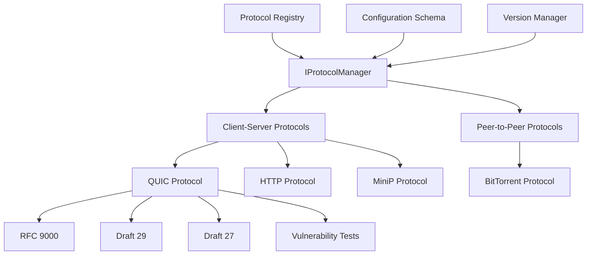

# Protocol Plugins

## Overview

The PANTHER protocol plugins provide a modular framework for testing and validating network protocols. This system enables comprehensive protocol testing across different versions, implementations, and configurations while maintaining consistency and extensibility.

Protocol plugins define testing logic, validation rules, and configurations for specific network protocols. They work together with service plugins to provide comprehensive protocol testing capabilities across different protocol versions and implementations.

<!-- src: /panther/plugins/protocols/protocol_interface.py -->

## Architecture

### Core Components



### Design Principles

1. **Protocol Agnostic**: Framework supports any network protocol through common interfaces
2. **Version Management**: Each protocol can support multiple versions and variants
3. **Configuration Driven**: Protocol behavior controlled through declarative schemas
4. **Extensible**: New protocols added through simple plugin registration
5. **Testing Focused**: Built specifically for protocol conformance and interoperability testing

## Protocol Categories

### Client-Server Protocols (`client_server/`)

Traditional client-server protocol testing where one endpoint initiates connections and the other responds.

| Protocol | Description | Status | Documentation |
|----------|-------------|--------|---------------|
| **QUIC** | Modern transport protocol with encryption | ✅ Active | [QUIC README](client_server/quic/README.md) |
| **HTTP** | Hypertext Transfer Protocol | 🚧 Planned | [HTTP README](client_server/http/README.md) |
| **MiniP** | Minimal protocol for basic testing | ✅ Active | [MiniP README](client_server/minip/README.md) |

### Peer-to-Peer Protocols (`peer_to_peer/`)

Distributed protocols where endpoints can act as both clients and servers.

| Protocol | Description | Status | Documentation |
|----------|-------------|--------|---------------|
| **BitTorrent** | P2P file sharing protocol | 🚧 Planned | [BitTorrent README](peer_to_peer/bittorrent/README.md) |

## Quick Start

### Using a Protocol Plugin

```python
# Load and configure a QUIC protocol instance
from panther.plugins.protocols.client_server.quic import QUICProtocol

# Initialize protocol manager
protocol = QUICProtocol()

# Load default configuration
config = protocol.load_config()

# Get version-specific parameters
rfc9000_params = protocol.get_version_parameters('rfc9000')
print(f"Initial version: {rfc9000_params['initial_version']}")

# Get default ports
server_port = protocol.get_default_server_port()  # 4443
client_port = protocol.get_default_client_port()  # 0 (ephemeral)
```

### Protocol Registration

Protocols use decorators to declare metadata and configuration schemas:

```python
@register_protocol(
    name="quic",
    type="client_server",
    versions=["rfc9000", "draft29", "draft27", "draft27-vuln1", "draft27-vuln2"],
    default_version="rfc9000",
    capabilities=["0-rtt", "connection-migration", "stream-multiplexing"],
    config_schema={
        "initial_max_data": {
            "type": "integer",
            "default": 10485760,
            "description": "Initial maximum data limit for the connection"
        },
        "alpn_protocols": {
            "type": "array",
            "items": {"type": "string"},
            "default": ["h3", "hq-interop"]
        }
    }
)
class QUICProtocol(IProtocolManager):
    ...
```

## Directory Structure

```text
protocols/
├── README.md                    # This file - Overview and architecture
├── DEVELOPER_GUIDE.md          # Development guide (see below)
├── api_reference.md            # API reference (see below)
├── __init__.py                 # Package initialization
├── protocol_interface.py       # Base protocol interface (IProtocolManager)
├── client_server/             # Client-server protocols
│   ├── README.md              # Client-server protocol overview
│   ├── __init__.py            # Package initialization
│   ├── client_server.py       # Base client-server implementation (empty)
│   ├── quic/                  # QUIC protocol implementation
│   │   ├── README.md          # QUIC-specific documentation
│   │   ├── __init__.py        # QUIC package initialization
│   │   └── quic.py           # QUICProtocol implementation
│   ├── minip/                 # MiniP protocol implementation
│   │   ├── README.md          # MiniP-specific documentation
│   │   ├── __init__.py        # MiniP package initialization
│   │   └── minip.py          # MiniPProtocol implementation
│   └── http/                  # HTTP protocol (planned)
│       ├── README.md          # HTTP-specific documentation
│       └── __init__.py        # HTTP package initialization
└── peer_to_peer/             # Peer-to-peer protocols
    ├── README.md              # P2P protocol overview
    ├── __init__.py            # Package initialization
    ├── peer_to_peer.py        # Base P2P implementation (empty)
    └── bittorrent/           # BitTorrent protocol (planned)
        ├── README.md          # BitTorrent-specific documentation
        ├── __init__.py        # BitTorrent package initialization
        └── config_schema.py   # BitTorrent configuration (empty)
```

## Protocol Interface

All protocol plugins inherit from `IProtocolManager` and implement these core methods:

```python
from panther.plugins.protocols.protocol_interface import IProtocolManager

class MyProtocol(IProtocolManager):
    """Custom protocol implementation."""

    def __init__(self, service_type: str):
        """Initialize protocol manager with service type configuration."""
        pass

    def validate_config(self):
        """Validate the loaded protocol configuration."""
        pass

    def load_config(self) -> dict:
        """Load protocol configuration from YAML file or decorator metadata."""
        pass

    def get_version_parameters(self, version: str) -> dict:
        """Get version-specific protocol parameters."""
        pass

    @classmethod
    def get_default_server_port(cls) -> int:
        """Get the default server port for this protocol."""
        pass

    @classmethod
    def get_default_client_port(cls) -> int:
        """Get the default client port for this protocol."""
        pass
```

## Configuration

### Common Configuration Options

All protocol plugins support these base options:

- **protocol_name**: Protocol identifier (e.g., "quic", "http")
- **version**: Protocol version to test
- **test_scenarios**: List of test scenarios to execute
- **timeout**: Test execution timeout
- **validation_rules**: Rules for test result validation

### Protocol-Specific Options

Each protocol plugin defines additional configuration options:

#### QUIC Protocol

- **connection_timeout**: QUIC connection establishment timeout
- **initial_max_data**: Initial flow control limit
- **max_packet_size**: Maximum packet size for testing

#### HTTP Protocol

- **http_version**: HTTP version (1.1, 2, 3)
- **request_methods**: HTTP methods to test
- **response_codes**: Expected response codes

## Test Scenarios

Protocol plugins define standard test scenarios:

### Conformance Testing

- **Basic Handshake**: Protocol connection establishment
- **Data Transfer**: Reliable data transmission
- **Error Handling**: Protocol error response behavior
- **Connection Termination**: Clean connection closure

### Performance Testing

- **Throughput**: Maximum data transfer rate
- **Latency**: Round-trip time characteristics
- **Connection Setup Time**: Time to establish connections
- **Resource Usage**: Memory and CPU consumption

### Interoperability Testing

- **Version Negotiation**: Protocol version compatibility
- **Extension Support**: Optional feature negotiation
- **Error Recovery**: Handling of network issues

## Development

For information on creating new protocol plugins:

- **[Protocol Plugin Development Guide](development.md)**: Comprehensive development documentation
