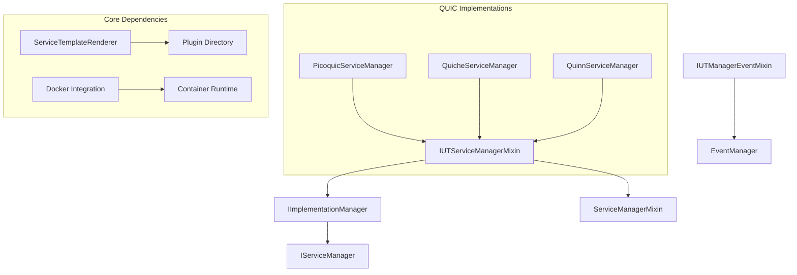

# Implementation Under Test (IUT) Plugins

> **Plugin Type**: IUT Service
> **Verified Source Location**: `plugins/services/iut/`

## Overview

Implementation Under Test (IUT) plugins represent the actual protocol implementations being evaluated within the PANTHER framework. These implementations can be tested for standards conformance, performance characteristics, or security vulnerabilities.

IUT plugins provide a standardized interface for testing network protocol implementations in isolated container environments, enabling PANTHER to test various implementations without requiring local installation of implementation dependencies.

## Architecture

### Design Principles

1. **Container Isolation**: Each implementation runs in its own Docker container to prevent environment conflicts
2. **Template-Based Configuration**: Uses Jinja2 templates for generating implementation-specific configurations
3. **Event-Driven Architecture**: Emits structured events during test execution for monitoring and debugging
4. **Role-Based Testing**: Supports both client and server role testing with dynamic role assignment
5. **Version Management**: Automatic discovery and validation of protocol version configurations

### Core Components



### Key Classes

- **`IImplementationManager`**: Abstract base class defining the core contract for all IUT implementations
- **`IUTServiceManagerMixin`**: Provides common initialization patterns and Docker integration
- **`IUTManagerEventMixin`**: Handles event emission and monitoring during test execution

<!-- src: /panther/plugins/services/iut/ -->

## Available Plugins

### QUIC Protocol Implementations

All QUIC implementations inherit from `BaseQUICServiceManager` or specialized subclasses:

| Implementation | Language | Base Class | Description | Documentation |
|---------------|----------|------------|-------------|---------------|
| **picoquic** | C | BaseQUICServiceManager | Mature, RFC-compliant implementation | [Documentation](quic/picoquic/README.md) |
| **aioquic** | Python | PythonQUICServiceManager | Async/await, HTTP/3 support | [Documentation](quic/aioquic/README.md) |
| **quiche** | Rust | RustQUICServiceManager | Memory safety, performance | [Documentation](quic/quiche/README.md) |
| **quinn** | Rust | RustQUICServiceManager | Modern async implementation | [Documentation](quic/quinn/README.md) |
| **lsquic** | C | BaseQUICServiceManager | LiteSpeed optimized | [Documentation](quic/lsquic/README.md) |
| **quic_go** | Go | BaseQUICServiceManager | Goroutine-based | [Documentation](quic/quic_go/README.md) |
| **mvfst** | C++ | BaseQUICServiceManager | Facebook's implementation | [Documentation](quic/mvfst/README.md) |
| **quant** | C | BaseQUICServiceManager | Research-focused | [Documentation](quic/quant/README.md) |
| **picoquic_shadow** | C | BaseQUICServiceManager | Shadow NS integration | [Documentation](quic/picoquic_shadow/README.md) |

See the [QUIC implementations overview](quic/README.md) for detailed comparison.

### Other Protocol Implementations

| Plugin | Protocol | Base Class | Description | Documentation |
|--------|----------|------------|-------------|---------------|
| **ping_pong** | MINIP | BaseMinipServiceManager | Simple ping-pong service for basic testing | [Documentation](minip/ping_pong/README.md) |

## Common Configuration

IUT plugins typically share these configuration patterns:

```yaml
services:
  - name: "quic_implementation"
    type: "iut"
    implementation: "quic/picoquic"
    config:
      binary_path: "/usr/local/bin/picoquicdemo"
      server_port: 4443
      certificate_file: "cert.pem"
      private_key_file: "key.pem"
```

## Integration Points

IUT plugins integrate with:

1. **Protocol plugins**: They implement specific protocol versions/behaviors
2. **Environment plugins**: They run within specific execution and network environments
3. **Tester plugins**: They are validated by tester plugins

## Development

To create a new IUT plugin, see the [Adding IUT](development.md) guide.
