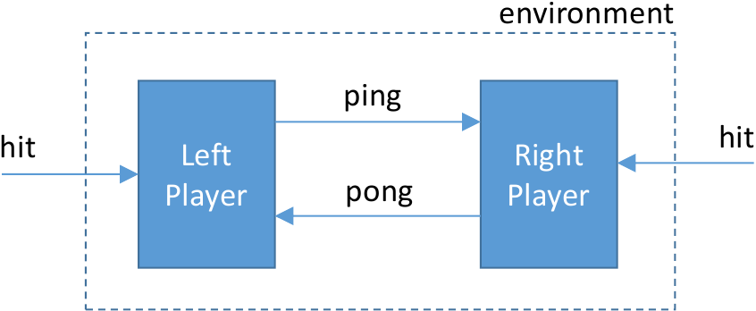
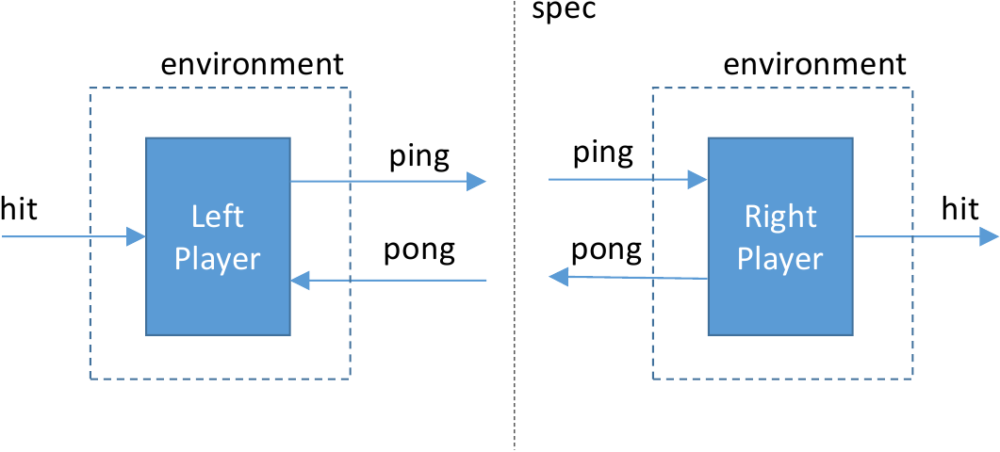

# Table of content

1. Ivy Documentation

2. Network-centric Compositional Testing (NCT)

3. Protocol Formal Verification (PFV) 

4. Request For Comments (RFCs)

5. Scientific papers

# Ivy Documentation

All protocol formal specifications are written in Ivy code version 1.7.
The website https://kenmcmil.github.io/ivy/ and its subpages also give more information on Ivy.

## Ivy

Ivy is a tool for specifying, modeling, implementing and verifying
protcols. Ivy is intended to allow interactive development of
protocols and their proofs of correctness and to provide a platform
for developing and experimenting with automated proof techniques. In
particular, Ivy provides interactive visualization of automated
proofs, and supports a use model in which the human protocol designer
and the automated tool interact to expose errors and prove
correctness.

Ivy has two primary design goals: to be as *transparent* as possible,
and to produce *design artifacts* that are useful even to engineers
who may lack the skills or resources needed to construct formal
proofs.

### Transparency

The research community has developed many impressive automated tools
for formal proof. For example, SMT solvers such as [Microsoft's
Z3](https://github.com/Z3Prover/z3) can check the validity of formulas
in various logics and can even generate inductive invariants. Because
these tools are heuristic in nature, however, they fail in ways that
are unpredictable and often not understandable by a human user.  To
reduce this problem, Ivy relies on interactive visualization, 
decidable logics and modularity

#### Interactive visualization

Ivy constructs inductive invariants interactively, using visualization
techniques. When there is a problem in the proof, it searches for a
simple scenario to explain the problem and displays it graphically,
highlighting possibly relevant facts. Users can combine their
intuition with automated generalization techniques to refine the
proof. This approach can greatly reduce the *human time* needed to
construct a proof.

#### Decidable logics and modularity

A logic is *decidable* if there is a algorithm that can determine the
truth of any formula. In practice, using decidable logics makes proof
automation more reliable and repeatable. It also makes it possible to
give transparent explanations of proof failures.

Ivy's language is designed to make it practical to reduce all proof
obligations to statements in decidable logics. It provides primitives
to support modeling in decidable logics, and also modular refinement
techniques the makes it possible to separate the verification effort
into local, decidable problems. For example, we can verify a protocol
at a high level assuming that a given abstract type is totally
ordered, then implement that abstract type using bit vectors or
integers.

### Design artifacts

Another key focus of Ivy is to produce composable specifications that
can be used as a reference by designers and for rigorous testing of
designs. Ivy supports specifications that are both composable and
temporal. This means that if all components locally satisfy their
specifications, we know that the system as a whole correctly
implements its high-level semantics. Moreover, each component’s
specification can be used independently to test and verify that
component.

From composable specifications, Ivy can generate test benches and
tests oracles that can be used to test design components rigorously
against their specifications. Such testers can reveal latent bugs
in component implementations that do not appear in integration tests or
ad-hoc unit testing.

## Ivy's language

Ivy's language is designed to let you to specify and implement systems
in a way that is both convenient and conducive to automated
verification. Technically, this means that important verification
problems like invariant checking and bounded model checking fall
within a [decidable fragment][df] of first-order logic.

[df]: decidiability.html

For this reason, the Ivy language has certain unusual features. Ivy
divides the world into three categories of things:

- Data values,
- Function values and
- Procedures.

Data values are the kinds of things that can be printed out, stored in
files, transmitted over the internet and so on. These are sometimes
refered to as POD types for "plain old data". Function values are pure
mathematical functions. They can be evaluated on arguments to produce
deterministic results, and they have no side effects. In other words,
evaluating a function does not modify the value of any variable. On
the other hand, a procedure, when called, has an *effect*. In addition
to returning values, it may also modify the values of variables.

Data values and function values can be stored in variables and passed
as arguments. That is, data and functions are "first class" values. On
the other hand, procedures cannot be stored in variables or passed as
arguments.

A particularly unusual aspect of the Ivy language is that there are
*no references*. Two distinct variables are never "aliases" for the
same underlying "object". Modifying variable `a` never has an effect
on the value of variable `b`. Ivy's philosophy is that references are a
low-level optimization that should be used by compilers to avoid
copying, but should never appear in high-level programs. The absense
of aliases enormously simplifies the analysis, testing and
verification of programs.

Another unusual aspect of the Ivy language is that it is *synchronous*. This means that:

- All actions occur in reaction to input from the environment, and
- all actions are *isolated*, that is, they appear to occur
instantaneously, with no interruption.

This aspect of Ivy's semantics greatly simplifies reasoning about
concurrent and distributed systems.

We will now consider the basic elements of an Ivy program.

### The language specifier

Every Ivy file begins with a line like the following:

    #lang ivy1.7

This tells Ivy what version of the language we are using. This is
important because in successive version of the language, certain
features may be changed or deprecated. Providing the language version
allows old programs to keep working. They current version of the Ivy
language is 1.7. Changes between versions of the language are listed
at the end of this document.

### State and actions

An Ivy program describes *objects* that have state and
provide *actions* that operate on state. State variables may hold
either plain old data or mathematical relations and functions (much as
in the [Alloy][al] language, but with important differences that we
will discuss later).

[al]: http://alloy.mit.edu/alloy/

#### Types and declarations 

Suppose we have a network consisting of nodes, with pair-wise links
between the nodes. We can model the structure of the network with a
relation `link` like this:

    type node

    relation link(X:node,Y:node)

This says that `node` is a POD type, but tells us nothing yet about
how values of type `node` are represented. At this point, we say that
`node` is an *uninterpreted* type. Further, we declared 
that `link` is a set of pairs (*X*,*Y*) where *X* and *Y*
are nodes.

In Ivy, as in [Prolog][pl], identifiers beginning with capital letters
are logical variables, or place-holders. These are not to be confused
with program variables, which hold the program state.  The colons
introduce type annotations. In the above declaration, the variables
*X* and *Y* are just taking up space, telling us what sort of relation
`link` is (that is, for every *X* and *Y* of type `node`, `link(X,Y)`
is a Boolean value.

[pl]: https://en.wikipedia.org/wiki/Prolog

We could equivalently have written the relation declaration as:

    function link(X:node,Y:node) : bool

Either way, we create a variable `link` that holds a function value, in particular
a function from pairs of `node` to `bool`.

As another example, here is a declaration of a function that gives an
ID to each node:

    type id

    function node_id(X:node) : id

A variable that holds just a node value can be declared like this:

    individual root:node

#### Enumerated types

The type `node` declared above is an *uninterpreted* type. This means
it can be any set with at least one element. Often it is useful to
define a type *in extension*, that is, by enumerating its elements
explicitly. An example of an enumerated type in Ivy would be:

    type color = {red,green,blue}

This declares a type with exactly three distinct values, and also declares
individuals `red`, `green` and `blue` as its elements.

#### Actions

An *action* is Ivy's notion of a procedure that mutates the values of
state variables. For example, here is a declaration of an action that
adds a link between two nodes:

    action connect(x:node, y:node) = {
        link(x,y) := true
    }

The action `connect` is defined in terms of one of Ivy's primitive
actions: an assignment. An assignment modifies the value of a
variable.  In this case, the single pair (*x*,*y*) is added to the
relation `link` (or put another way, the value of the expression
`link(x,y)` is set to true, without otherwise modifying
`link`). Because there is no aliasing in Ivy,  the values of all other
variables remain unchanged by the assignment.

We can use place-holders to make larger modifications to a relation. For
example, here is an action that removes all links from a given node *x*:

    action clear(x:node) = {
        link(x,Y) := false
    }

The effect of the assignment with variable *Y* is to simultaneously
assign `link(x,Y)` for all nodes *Y*. We don't have to give a type
annotation for *Y* because it can be inferred from context.

We can be a little more selective by giving a Boolean expression in
the assignment. For example, this action removes links from *x* to all
nodes in the set `failed`:

    action clear_failed(x:node) = {
        link(x,Y) := link(x,Y) & ~failed(Y)
    }

If there are no parameters, we don't use parentheses. For example:

    action flip = {
        bit := ~bit
    }

In fact, you will never see a pair of empty parentheses in IVY. An action can also have return parameters. For example:

    action swap(a:t,b:t) returns (c:t,d:t) = {
        c := b;
        d := a
    }

### Control

#### Sequential execution

We can execute two actions sequentially by separating them with
semicolon. For example, this action removes all links from *x*, then
links *x* to *y*:

    action connect_unique(x:node, y:node) = {
        link(x,Y) := false;
        link(x,y) := true
    }

The semicolon is a sequential composition operator in Ivy, not a
statement terminator. However, an extra semicolon is allowed before an
ending brace `}` to make editing sequences of statements easier. In
this case, we could have written the sequence of two assignments
equivalently as:

    link(x,Y) := Y = y

#### Calling actions

We could also have written `connect_unique` by *calling* `clear` and `connect`:

    action connect_unique(a:node, b:node) = {
        call clear(a);
        call connect(a,b)
    }
    
Ivy uses the
[call-by-value][cbv] convention. That is, when we call `clear(a)` a
local variable *x* is created during the execution of `clear` and
assigned the value *a*. This means that, as in the [C programming
language][cpl], modifying the value of *x* in `clear` would not result
in modifying the value of *a* in `connect_unique`.

[cbv]: https://en.wikipedia.org/wiki/Evaluation_strategy#Call_by_value
[cpl]: https://en.wikipedia.org/wiki/C_(programming_language)

The return values of an action can be obtained like this:

    call x,y := swap(x,y)

An action with a single return value can be called within an expression.
For example, if `sqrt` is an action, then:

    x := y + sqrt(z)

is equivalent to

    call temp := sqrt(z)
    x := y + temp

If there is more than one call within an expression, the calls are
executed in left-to-right order. Calls inside conditional operators
occur whether or not the condition is true. For example, the statement:

    x := sqrt(y) if c else z
    
is equivalent to:

    call temp := sqrt(y);
    x := temp if c else z

Parentheses are not used when calling an action with no parameters. 
For example, if we have:

    action next returns (val:t) = {
        current := current + 1;
        val := current
    }

then we would write:

    x := y + next

The lack of parentheses introduces no ambiguity, since the action
`next` is not a value and cannot itself be passed as an argument to
the function `+`. An advantage of this convention is that we don't have
to remember whether `next` is an action or a variable, and we can
easily replace a variable by an action without modifying all references
to the variable.

#### Conditionals

Conditionals in Ivy are much as in any procedural programming
language. For example, the following code clears the incoming links to
node *y* if *y* is in the failed set:

    if failed(y) {
        link(X,y) := false
    }

The curly brackets around the assignment are required. No parentheses
are need around the condition.  A conditional can have an associated else
clause, for example:

    if failed(y) {
        link(X,y) := false
    } else {
        link(y,z) := true
    }

Because brackets are required, there is no ambiguity as to which 'if'
an 'else' belongs to.

The following syntax can be used to find a element of a type that
satisfies some condition:

    if some x:t. f(x) = y {
        z := x + y
    }
    else {
        z := y
    }        

Here, if there is any value `x` of type `t` such that `f(x) = y`, then
such a value is assigned to `x` and the assignment `z := x + y` is
executed. If there is more than one such value, the choice is
non-deterministic. If there is no such value, the `else` clause is
executed. The symbol `x` is only in scope in the `if` clause. It acts
like a local variable and is distinct from any `x` declared in an
outer scope. 

It is also possible to choose a value of `x` minimizing some function
of `x`. For example, we can find an element of a set `s` with the least key like this:

    if some x:t. s(x) minimizing key(x) {
       ...
    }

This is logically equivalent to the following:

    if some x:t. s(x) & ~exists Y. s(Y) & key(Y) < key(x) {
       ...
    }

Besides being more concise, the `minimizing` syntax can be more
efficiently compiled and is easier for Ivy to reason about (see the
[decidability](decidability.html) discussion). The keyword
`maximizing` produces the same result with the direction of `<` reversed.

#### Loops

Loops are discouraged in Ivy. Often, the effect of a loop can be
described using an assignment or an `if some` conditional. 

For example, instead of something like this:

    for y in type {
        link(x,y) := false
    }

we can write this:

    link(x,Y) := false

When a loop is needed, it can be written like this:

    sum := 0;
    i := x;
    while i > 0
    {
        sum := sum + f(i);
        i := i - 1
    }

This loop computes the sum of `f(i)` for `i` in the range `(0,x]`.
A loop can be decorated with a invariants, like this:

    while i > 0
    invariant sum >= 0
    {
        sum := sum + f(i);
        i := i - 1
    }

The invariant `sum >= 0` is a special assertion that is applied
on each loop iteration, before the evaluation of the condition.
Invariants are helpful in proving properties of programs with loops.

In some situations we need to guarantee that a loop always terminates. We can do this
with ranking function that is supplied by the keyword `decreases`, like this:

    while i > 0
    invariant sum >= 0
    decreases i
    {
        sum := sum + f(i);
        i := i - 1
    }

The argument of `decreases` is an expression whose value must decrease
with every loop iteration and such that the loop is never entered when
the expression is less than `0`.

### Non-deterministic choice

The asterisk "*" can be used to represent non-deterministic choice in Ivy in
two situations. First, on the right-hand side of an assignment:

    x := *

This cause *x* to be assigned non-deterministically to any value of its type.
We can use variables in non-deterministic assignments, so for example:

    link(x,Y) := *

causes *x* to be linked to an arbitrary set of nodes.

Further, we can use an asterisk in a conditional to create a
non-deterministic branch:

    if * {
        link(x,y) := true
    } else {
        link(x,z) := true
    }

Non-deterministic choice also occurs when we create a local variable (see below).
On entry to an action the values of return parameters are non-deterministically chosen.

### Expressions

Expressions in Ivy are terms or formulas in [first-order logic][fol]
with equality. Ivy provides the following built-in operators: `~`
(not), `&` (and), `|` (or), `->` (implies), `<->` (iff) `=`
(equality). There is also a built-in conditional operator `X if C else
Y` that returns `X` if the Boolean condition `C` is true and `Y`
otherwise. The if/else operator binds most strongly, followed by
equality, not, and, or. The weakest binding operators are `<->` and
`->`, which have equal precedence.

[fol]: https://en.wikipedia.org/wiki/First-order_logic

The binary and ternary operators are left-associating (i.e., they bind
more strongly on the left). For example, `x if p else y if q else z`
is equivalent to `(x if p else y) if q else z` and `p -> q -> r` is
equivalent to `(p -> q) -> r`. *Warning*: in the case of if/else and
`->`, this is non-standard and is due to an error in the parser. This
will change in a future version of the language. In the interim it is
best to always parenthesize expressions with multiple uses if if/else
and `->`.

Expressions may also use logical quantifiers. For example, this formula says that
there exists a node *X* such that for every node *Y*, *X* is linked to *Y*:

    exists X. forall Y. link(X,Y)

In this case, the variables do not need type annotations, since we can infer that
both *X* and *Y* are nodes. However, in some cases, annotations are needed. For example,
this is a statement of the transitivity of equality:

    forall X,Y,Z. X=Y & Y=Z -> X=Y

We can determine from this expression that *X*, *Y* and *Z* must all
be of the same type, but not what that type is. This means we have to
annotate at least one variable, like this:

    forall X:node,Y,Z. X=Y & Y=Z -> X=Y

### Assume, require and ensure

The primitive actions `require` and `ensure` allow us to write
specifications. These actions fail if the associated condition
is false. For example, suppose we wish the `connect` action to handle
only the case where the node *y* is not in the failed set. We could
write

    action connect(x:node, y:node) = {
        require ~failed(y);
        link(x,y) := true
    }

If the condition `~failed(y)` is true, control passes through the
`require` and this action behaves in the same way as the original.  If
the condition `~failed(y)` is false, however, the `require` action
fails.  This means that whenever we use `connect` we must prove that
the *y* argument is not in the failed set.

The `ensure` action is similar, except it is the responsibility of the action
itself to ensure the truth of the formula. For example:

    action increment(x:node) returns (y:node) = {
        y := x + 1;
        ensure y > x
    }

The semantics of `require` and `ensure` are the same, except for the
assignment of blame when they fail. With `require`, the onus of
guaranteeing the truth of the formula falls on the action's caller,
while with `ensure` it falls on the action itself. We will refer to
`require` and `ensure` actions collectively as *assertions*.

On the other hand, the `assume` action does not allow control to pass
through if the associated condition is false. A typical application of
`assume` is to make a temporary modeling assumption that we wish later
to remove. For example, this action non-deterministically chooses a
non-failed node and connects *x* to it:

    action connect_non_failed(x:node) = {
        y := *;
        assume ~failed(y);
        link(x,y) := true
    }

Of course, if all the nodes are failed, this action cannot
terminate. There is some degree of risk in using assumptions when
modeling, since assumptions can eliminate behaviors in unexpected
ways. Ideally, a finished program will not contain any occurrence of
`assume`.

In `require`, `ensure` and `assume` actions, any [free variables][fv] are treated
as universally quantified. For example, if we want to connect *x* to a
node that is not currently linked to any node, we could change the
assumption above to

     assume ~link(y,Z)

[fv]: https://en.wikipedia.org/wiki/Free_variables_and_bound_variables

### Initialization

Normally, we expect a system to start in some well-defined state, or
at least for some specified conditions to hold initially. In Ivy, we use an
`after init` declaration for this purpose. For example:

    after init {
        link(X,Y) := false
    }

This provides an action that executes at initialization, before the
environment calls any other actions. Multiple `after init` actions are
executed in the order in which they are declared in the program.

### Local variables

The above example of a guarded command action assumes that *y* is a
declared program variable of type `node`. We can also declare *y* locally
within the action, like this:

    action connect_non_failed(x:node) = {
        var y:node;
        assume ~failed(y);
        link(x,y) := true
    }

This creates a fresh *y* that is in scope only within the action (or generally to the
end of the most tightly enclosing pair of brackets). We don't need a non-deterministic assignment
to *y* since the value of *y* is already non-deterministic at the point where it is declared.
We can create a local variable and assign it in the same statement, like this:

    var y:node := x

or, if the type of `y` can be inferred, just this:

    var y := x

### Modelling interleaving concurrency in Ivy

Actions in an Ivy program execute only in response to calls from the
program's environment. Ivy makes the synchronous hypothesis: when the
environment calls an action, it waits for the action to complete
before issuing another call. Put another way, Ivy actions appear to
execute in zero time. At first blush, it might seem that this
eliminates the possibility of concurrency. In fact, the synchronous
hypothesis is intended to make the implementation of concurrent and
distributed systems simpler. The key idea is that only the
*appearance* of synchronicity is required. In practice actions can
execute concurrently, provided that to an outside observer they appear
to have executed sequentially.

For now, we will leave aside the question of how to enforce the
synchronous hypothesis in practice. Instead, we will consider how to
use the synchronous IVY language to model a distributed protocol at an
abstract level using *interleaving* concurrency. In an interleaving
model, processes take turns executing actions in isolation (that is,
in apparently zero time) in a non-deterministic order. 

An Ivy program exports a set of actions to its environment. Each of
these actions can be used to model a single isolated step of a
process.  Since the environment is allowed to call these actions in an
arbitrary order, the Ivy program can be used to model arbitrary
interleaving of process actions.

#### An abstract interface model

The following is a very abstract model of an interface that establishes
connections between clients and servers. Each server has a semaphore
that is used to guarantee that at any time at most one client can be
connected to the server.

    #lang ivy1.5

    type client
    type server

    relation link(X:client, Y:server)
    relation semaphore(X:server)

    after init {
        semaphore(W) := true;
        link(X,Y) := false
    }

    action connect(x:client,y:server) = {
      require semaphore(y);
      link(x,y) := true;
      semaphore(y) := false
    }

    action disconnect(x:client,y:server) = {
      require link(x,y);
      link(x,y) := false;
      semaphore(y) := true
    }

    export connect
    export disconnect

This program declares two types `client` and `server`. The state of
the protocol model consists of two relations. The relation `link`
tells us which clients are connected to which servers, while
`semaphore` tells us which servers have their semaphore "up".  The
`link` and `semaphore` components aren't "real". They are abstractions
that represent the interface user's view of the system.

The program exports two actions to the environment: `connect` and
`disconnect`. The `connect` actions creates a link from client `x` to
server `y`, putting the server's semaphore down. Notice that `connect`
requires that server's semaphore be up on entry. The `disconnect`
action removes a link and puts the semaphore up. The two `export`
declarations at the end tell us that the environment may call
`connect` and `disconnect` in arbitrary sequence, though it must obey
the stated requirements.

### Safety and invariants

A program is *safe* if it cannot fail, so long as in the past all
requirements of the environment have been satisfied (that is, it is safe if 
any failure of the program can be blamed on the environment).

There are various ways to use assertions to specify desired safety
properties of a program. A simple one is to add a test action that
asserts some property of the program state. In the client/server
example above, we might specify that no two distinct clients can be
connected to a single server using the following test action:

    action test = {
      ensure ~(X ~= Z & link(X,Y) & link(Z,Y))
    }

    export test

The assertion is implicitly universally quantified over (distinct)
clients `X` and `Z` and server `Y`. To help Ivy to prove that this
assertion always holds, we can suggest facts that might be useful in
constructing an inductive invariant. For example:

    invariant X = Z | ~link(X,Y) | ~link(Z,Y)
    invariant link(X,Y) -> ~semaphore(Y)

Here, we state that no two clients are connected to the same server
(which is just the property we want to prove) and additionally that
when a client is connected to a server, its semaphore is down. These
facts are *inductive* in the sense that they are initially true, and
each of our three actions preserves them. Moreover, they are
sufficient to guarantee that our test assertion is true. Thus, Ivy can
use these invariants to prove safety of the program.

An invariant is asserted to hold at all times after initialization
when an exported action is *not* executing. In particular, the
invariant is not guaranteed to hold when the program calls back to the
environment (see `import` below) or when it calls one of its own
actions.

### Axioms and background theories

The built-in types and operators provided by Ivy are fairly
impoverished. We have only uninterpreted types, the Boolean type
`bool`, enumerated types and the basic operators of first-order
logic. This is by design. By introducing richer data types, or
*theories*, we would quickly make our verification problems
undecidable, meaning we would sacrifice reliability of automated
verification. In practice, before introducing, say, the integers into
a model, we should make sure that the power of the integers is really
needed. It may be, for example, that all we require is a totally
ordered set.

Ivy allows us to introduce background theories in the form of logical
axioms. This in turn allows us to avoid using unnecessarily powerful
theories. As an example, consider defining an ordering relation over 
our node ID's:

    relation (I:id < J:id)

This is an example of an *infix* symbol. The symbol `<` is no
different than other relational symbols, except that Ivy pre-defines
it as having infix syntax. 

We can ensure that `<` is a total order by writing axioms:

    axiom X:id < Y & Y < Z -> X < Z
    axiom ~(X:id < X)
    axiom X:id < Y | X = Y | Y < X

These axioms say, respectively, that `<` is
[transitive](https://en.wikipedia.org/wiki/Transitive_relation),
[anti-symmetric](https://en.wikipedia.org/wiki/Antisymmetric_relation)
and [total](https://en.wikipedia.org/wiki/Total_relation). As in other
cases, the free variables are universally quantified. 

Of course, axioms are assumptions and assumptions are dangerous.  We
want to make sure that our axioms are consistent, that is, that they
have at least one [model](https://en.wikipedia.org/wiki/Logic_model). The Ivy tool can be helpful in
determining this.

#### Overloaded operators.

In Ivy the equality operator is *overloaded* in the sense that it
applies to any pair of arguments so long as they are of the same
type. One way to think of this is that there is really a distinct
equality operator pre-declared for each type, but that we use `=` as a
short-hand for all of them. It is useful to be able to declare other
such overloaded operators to avoid, for example, having to invent a
new "less than" symbol for every ordered type, or adding type
annotations to operators. 

Ivy provides for this in a limited way. Certain symbols, such as `<`,
`+` and `0` are always overloaded. This allows use the same symbol
with different type signatures disambiguate these uses based on type
inference.

To make type inference stronger, the overloaded operators also come
with type constraints. In functional language terms, `<` has type
`alpha * alpha -> bool` and `+` has type `alpha * alpha -> alpha`.

#### Numerals

Numerals are a special case of overloaded symbols. A numeral is any
symbol beginning with a digit, for example `0`, or `0xdeadbeef`. The
types of numerals are inferred from context. For example, if `x` has
type `foo`, then in the expression `x+1`, the numeral `1` is inferred
to have type `foo`.

Numerals are special symbols in the sense that they do not have to be
explicitly declared. However, Ivy gives them no special
interpretation. Ivy does not even assume that distinct numerals have
distinct values. This means that `0 = 2` is not necessarily false.  In
fact, this equation might be true in a type representing the integers
mod 2.

Section [Interpretations] describes how to give concrete
interpretations to Ivy types, so that symbols like `+` and `0` have
specific meanings.

#### Quoted symbols

A quoted symbol is a possibly-empty sequence of characters enclosed in
double quote characters (and not containing a double quote character).
An example would be `"ab$c"`. Quoted symbols are similar to numerals:
their type is inferred from context. 

### Modules

A *module* in Ivy is a group of declarations that can be instantiated.
In this way it is similar to a template class in an object-oriented
programming language. Besides defining classes of objects, modules can be
used to capture a re-usable theory, or structure a modular proof.

Here is a simple example of a module representing an up/down counter
with a test for zero:

    module counter(t) = {

        individual val : t
        after init {
            val := 0
        }

        action up = {
            val := val + 1
        }

        action down = {
            val := val - 1
        }

        action is_zero returns(z : bool) = {
            z := (val = 0)
        }
    }

This module takes a single parameter `t` which is the type of the
counter value `val`. We can create an instance of the module like this:

     type foo

     instance c : counter(foo)

This creates an *object* `c` with members `c.val`, `c.up`, `c.down`
and `c.is_zero`. 

Any Ivy declaration can be contained in a module. This includes
axioms, invariants, instances and modules. As an example, here is a
module representing a theory of partial orders:

    module po(t,lt) = {
        axiom lt(X:t,Y) & lt(Y,Z) -> lt(X,Z)
        axiom ~(lt(X:t,Y) & lt(Y,X))
    }

This module takes a type `t` and a relation `lt` over `t`. It provides
axioms stating that `lt` is transitive and antisymmetric. We might instantiate it
like this:

    type foo

    instantiate po(foo,<)

Since we didn't give an object name, the members of `po` are created
within the current object (which in this case is the global
object). Notice that we passed the overloaded infix symbol `<` as a
parameter. Any symbol representing a type, function, relation, action
or object can be passed as a module parameter.

Like a class in an object-oriented programming language, a module can
contain references to symbols declared outside the module. However, a
declaration inside the module takes precedence. For example, consider this
code:

    relation r,s

    module m = {
        relation r
        axiom s -> r
    }

    instance c : m

The axiom in `c` is equivalent to:

    axiom s -> c.r

That is, the local declaration of `r` shadows the global one.

#### Singleton objects

We can create a module with just one instance like this:

    object foo = {
        relation bit
        after init {
            bit := false
        }
        action flip = {
            bit := ~bit
        }
    }

This creates a single object `foo` with members `foo.bit` and
`foo.flip`, exactly as if we had created a module and instantiated it
once.

#### This

The special symbol `this` refers to the innermost surrounding object
or module. For example:

    object foo = {
        relation bit
        after init {
            this.bit := false
        }
    }
    
Here `this.bit` refers to `foo.bit`. In the outermost scope `this`
refers to the root object, which contains the entire program.

#### Type objects

A type may have the same name as an object. This makes it possible
to define types with *traits*. For example:

    object num = {
        type this
        function next(N:this) : this
        function plus(X:this,Y:this) : this
    }
    
This declares a type `num` and also a function `num.next` from type
`num` to type `num` and am  function `plus` that takes two arguments of type `num`
and returns a `num`. The function `num.next` can be applied using
a special syntax. That is, if `x` is of type `num`, then the expression
`x.next` is a shorthand for `num.next(x)`. Similarly, `x.plus(y)` is a shorthand
for `num.next(x,y)`. Actions can similary be traits of types. For example:

    object num = {
        type this
        action plus(x:this,y:this) returns (z:this) = {
            z := x + y;
        }
    }
    
In this case, `x.plus(y)` is a shorthand for the action call `num.plus(x,y)`. 

#### Parameterized objects

An array of instances of the same module can be created like this:

    type foo
    type bar

    instance c(X:bar) : counter(foo)

This creates one instance `c(X)` of module `counter` for for every
element of type `bar`. Since we haven't said how many elements there
are in type `bar`, we have effectively created a collection of objects
of arbitrary but fixed size.

If `x` is of type `bar`, we can treat `c(x)` as we would any object,
for example:

    call c(x).down;
    if c(x).is_zero {
        call c(x).up
    }

The parameter `X` can also be passed to the module being instantiated.
This is useful to create a collection of objects with unique identifiers.
For example:

    type id_t

    module thing(id) = {
       action my_id returns (x:id_t) = {
            x := id
       }
    }

    instance c(X:id_t) : thing(X)

In this case, calling `c(id).my_id` will return `id`.

An alternative way to write the above would be:

    type id_t

    object c(id:id_t) = {
       action my_id returns (x:id_t) = {
            x := id
       }
    }

Notice that the object parameter is given as a logical constant rather
than a place-holder. This constant can be referred to in the body of the
object.

Types in Ivy are never parameterized. For example, if we write:

    object foo(self:t) = {
        type t
    }

this creates a single type called `foo.t`, not a collection of types
`foo.t(self)` for all values of `self`.

### Monitors

While embedding assertions in code is a useful way to write
specifications, there are good reasons to separate a specification
from the object being specified. For example, this allows you to
re-use specifications, to construct modular proofs and to refine
specifications into implementations.

The Ivy language supports these goals using *monitors*. A monitor is
an ordinary object, except that its actions are synchronized with the
actions of other objects. For example, suppose that in the
client/server example above, we want to specify that callers to
`connect` do not request a connection to a server whose semaphore is
down. We could express this property as a monitor like this:

    object mon = {
        action pre_connect(x:client,y:server) = {
            require semaphore(y)
        }        
        execute pre_connect before connect
    }

The `execute` declaration says that whenever `connect` is called,
action `pre_connect` should be executed first, with the same
parameters. If any caller tries to connect a client to a busy server,
the assertion will fail. Notice we used `require` here, so the
blame for the failure is on the caller of `connect`.

Monitors can also check the return values of actions. For example:

    action post_incr(inp:t) returns(out:t) = {
        ensure inp < out
    }

    execute post_incr after incr

Here, we have an action `incr` that is supposed to increment a value,
and we specify that the output must be greater than the input. Here,
we use `ensure`, so the blame for any failure falls in the
implementation of action `incr`.

As a shorthand, we can write our monitor action like this:

    after c.post(inp:t) returns(out:t) {
        ensure inp < out
    }

This creates a monitor action called `post.after` that is executed after `c.post`.
Similarly, we can write:

    before connect(x:client,y:server) {
        require semaphore(y)
    }        

If we drop the input or output parameters, they are inherited from the monitored action.
For example:

    after c.post {
        ensure inp < out
    }

This is a useful shorthand when the declaration of `c.post` is nearby,
but should probably be avoided otherwise.

We can write this:

    around foo {
        stmts1
        ...
        stmts2
    }

as a shorthand for this:

    before foo {
        stmts1
    }

    after foo {
        stmts2
    }

At present, local variables declared in `stmts1` cannot be referenced
in `stmts2`, but the intention is to make this possible, to reduce the
need to use `old` in after monitors.

#### Monitor state

Usually, monitors contain state components that allow them to remember
some of the history of past events. For example, here is a monitor specifying a 
property of `counter` objects. It requires that immediately after a call to `up`,
the `is_zero` action cannot return true:

    module counter_prop(c) = {

        relation was_up
        after init {
            was_up := false
        }

        after c.up {
            was_up := true
        }

        after c.down {
            was_up := false
        }

        after c.is_zero returns (z:bool) {
            ensure was_up -> ~z
        }
    }

This module is parameterized on `c`, the counter being specified. This
makes the specification re-usable. It has a single state component
`was_up` that remembers whether the last counting action was
`up`. This is accomplished by the actions `up` and `down` that
synchronize with actions of counter `c` (in this case it doesn't make
any difference whether it is before or after). The action `is_zero`
executes after calls for the counter's `is_zero` action and asserts a
fact about the return value: if the last action was `up` the result
cannot be true. 

### Action implementations

It is often useful to separate the declaration of an action from its
implementation. We can declare an action like this:

    action incr(x:t) returns(y:t)

and then give its implementation separately like this:

    implement incr {
        y := x + 1
    }

### Initializers

As noted above, an initializer is a special action that is executed
once initially, before any exported actions are called. For example:

    var bit : bool

    after init {
        bit := false
    }

This behaves like a monitor after a special internal action called
`init`. Initializers are executed once in the order they are declared.

Initializers may call other actions. For example, suppose we have a
module `collection` representing a set of objects that is initially
empty.  If we wanted a set that initially contained the value zero, we
could use an initializer like this:

    type t

    object foo = {
        instance myset : collection(t)

        after init {
            call myset.add(0)
        }
    }

This action is called exactly once after `myset` is initialized.

Parameterized objects can also have initializers. For example, we may
want to have a collection of objects that each contain a bit, where initially
only the bit of object 0 is true:

    type t

    object foo(self:t) = {
        var bit : bool

        after init {
            bit := (self = 0)
        }
    }

There are some restrictions in initializers of parameterized objects,
however. These are:

- Conditions of `if` statements may not refer to the parameter, and

- In assignments, the left-hand side must contain the parameter if the right-hand side does.

For example, this initializer would not be legal:

    type t

    var bit : bool

    object foo(self:t) = {
        after init {
            bit := (self = 0)
        }
    }

This is because the component `bit` being assigned is not
parameterized.  This means it is in effect being assigned a different
value for each value of `self`.  The restrictions guarantee that the
result of the initializer does not depend on the order in which it is
called for different parameter values.

### Definitions

We can define the value of a previously declared function like this:

    function square(X:t):t

    definition square(X) = X * X

Notice we don't have to give the type of X in the definition, since it
can be inferred from the type of `square`. Logically, the definition
is equivalent to writing:

    axiom square(X) = X * X

However, definitions have several advantages. Primarily, they are safer,
since definitions are guaranteed to be consistent. In addition they can be
computed. If we use an axiom, the only way that Ivy can compile the
function `square` is to compile a table of squares. On the other hand,
Ivy can compile the definition of `square` into a procedure. 

Ivy doesn't (currently) allow recursive definitions. So, for example,
this is not allowed:

    definition factorial(X) = X * factorial(X-1) if X > 0 else 1

#### Macro definitions

A macro is a definition that is only "unfolded" when it is used.  For
example, let's say we want to define a predicate `rng` that is true of
all the elements in range of function `f`. We could write it like
this:

    definition rng(X) = exists Y. f(Y) = X

The corresponding axiom might be problematic, however. Writing it out
with explicit quantifiers, we have:

    axiom forall X. (rng(X) <-> exists Y. f(Y) = X)

This formula has an alternation of quantifiers that might result in
verification conditions that Ivy can't decide (see the
[decidability](decidability.html) discussion). Suppose though, that we only need
to know the truth value of `rng` for some specific arguments. We can instead
write the definition like this:

    definition rng(x:t) = exists Y. f(Y) = x

Notice that the argument of `rng` is a constant `x`, not a place-holder
`X`. This definition acts like a macro (or an axiom *schema*) that can be
instantiated for specific values of `x`. So, for example, if we have an assertion
to prove like this:

    ensure rng(y)

Ivy will instantiate the definition like this:

    axiom rng(y) <-> exists Y. f(Y) = y

In fact, all instances of the macro will be alternation-free, since
Ivy guarantees to instantiate the macro using only ground terms for
the constant arguments.  A macro can have both variables and constants
as arguments. For example, consider this definition:

    definition g(x,Y) = x < Y & exists Z. Z < x

Given a term `g(f(a),b)`, Ivy will instantiate this macro as:

    axiom g(f(a),Y) = f(a) < Y & exists Z. Z < f(a)

#### Choice functions

Suppose we want to define a function `finv` that is
the inverse of function `f`. We can write the definition like this:

    definition finv(X) = some Y. f(Y) = X in Y

This special form of definition says that `finv(X)` is `Y` for *some*
`Y` such that `f(Y) = X`. If there is no such `Y`, `finv(X)` is left
undefined. The corresponding axiom is:

    axiom forall X. ((exists Y. f(Y) = X) -> f(finv(X)) = X)

With this definition, `finv` is a function, but it isn't fully
specified.  If a given element `Y` has two inverses, `finv` will yield
one of them. This isn't a non-deterministic choice, however. Since `f`
is a function, it will always yield the *same* inverse of any given
value `Y`.

If we want to specify the value of `finv` in case there is no inverse,
we can write the definition like this:

    definition finv(X) = some Y. f(Y) = X in Y else 0

The `else` part gives us this additional axiom:

    axiom forall X. ((~exists Y. f(Y) = X) -> finv(X) = 0)

Notice that this axiom contains a quantifier alternation. If this
is a problem, we could use a macro instead:

    definition finv(x) = some Y. f(Y) = x in Y else 0

The axiom we get is

    axiom (~exists Y. f(Y) = x) -> finv(x) = 0)

which is alternation-free.

### Interpreted types and theories

The normal way of using Ivy is to declare uninterpreted types and to
give the necessary axioms over those types to prove desired properties
of a system. However, it is also possible in Ivy to associate types
with sorts that are interpreted in the underlying theorem prover. 

For example:

    type idx

    interpret idx -> int

This says that Ivy type `idx` should be interpreted using sort `int`
of the theorem prover. This does not mean that `idx` is equated with
the integers. If we also interpret type `num` with `int`, we still
cannot compare values of type `idx` and type `num`. In effect, these
two types are treated as distinct copies of the integers.

When we declare `idx` as `int`, certain overloaded functions and
relations on `idx` are also automatically interpreted by the
corresponding operators on integers, as are numerals of that
type. So, for example, `+` is interpreted as addition and `<` as
'less than' in the theory of integers. Numerals are given their normal
interpretations in the theory, so `0:idx = 1:idx` would be false.

Concrete sorts that are currently available for interpreting Ivy types
are:

- int: the integers
- nat: the non-negative integers
- {*X*..*Y*}: the subrange of integers from *X* to *Y* inclusive
- {*a*,*b*,*c*}: an enumerated type
- bv[*N*]: bit vectors of length *N*, where *N* > 0

Arithmetic on `nat` is saturating. That is, any operation that would yield
a neagtive number instead gives zero. 

An arbitrary function or relation symbol can be interpreted. This is useful
for symbols of the theory that have no pre-defined overloaded symbol in Ivy.
For example:

    type t
    type s
    function extract_lo(X:t) : s
    
    interpret t -> bv[8]
    interpret s -> bv[4]
    interpret extract_lo -> bfe[3][0]

Here `bfe[3][0]` is the bit field extraction operator the takes the
low order 4 bits of a bit vector.

### Parameters

A *parameter* is a value supplied by the environment before
initialization. A parameter is declared like this:

    parameter p : t

where *p* is the parameter name and *t* is the type. Parameters may be
declared anywhere in the object hierarchy. Except for the fact that it
is initialized by the environment, a parameter is identical to an
individual. The manner in which parameters are supplied is dependent
on the compiler. For example, if a program is compiled to an
executable file, the parameter values are supplied on the command
line. If it is compiled to a class in C++, parameters are supplied as
arguments to the constructor. In either case, the order of parameters
is the same as their order of declaration in the program.

### Imported actions

An imported action is an action whose implementation is provided by
the environment. For example:

    action callback(x:nat) returns (y:nat)
    import callback
    
or simply:

    import action callback(x:nat) returns (y:nat)

Like any action, the imported action may be given preconditions and
postconditions.  For example:

    before callback {
        require x > 0;
    }
    
    after callback {
        ensure y = x - 1;
    }
    
The `require` in this case is guarantee for the program and an
assumption for the environment. Similarly, the `ensure` is an
assumption for the program and a guarantee for the environment.  The
environment is assumed to be non-interfering, that is, Ivy assumes
that the call to `callback` has no visible side effect on the program.
An imported action may not be implemented by the program.

### Assume/guarantee reasoning

Ivy doesn't require us to prove all at once that a program is safe.
Instead, we can break the proof down into smaller proofs using the
*assume/guarantee* approach. 

For example, suppose we have the following program with two objects:

    #lang ivy1.7

    object num = {
        type this

        interpret this -> nat

        function even(X:this) = (X / 2 * 2 = X)
        function odd(X:this) = ~even(X)
    }

    object evens = {
        var number : num
        after init {
            number := 0
        }

        action step = {
            call odds.put(number + 1)
        }

        action put(n:num) = {
            number := n;
        }

        invariant number.even

    }

    object odds = {
        var number : num
        after init {
            number := 1
        }

        action step = {
            call evens.put(number + 1)
        }

        action put(n:num) = {
            number := n;
        }

        invariant number.odd

    }

    export evens.step
    export odds.step

Each object stores a natural number when its `put` action is called
and sends this number plus one to the other object when its `step`
action is called by the environment. We want to prove the invariants
that `evens.number` remains even, and `odds.number` remains odd.
Moreover, we would like to prove these invariants by reasoning about
`evens` and `odds` in isolation.  To do this, we use an
assume/guarantee specification.

Here is the `evens` object with separate specification and implementation:

    isolate evens = {

        action step
        action put(n:num)

        specification {
            before put {
                require n.even
            }
        }

        implementation {

            var number : num
            after init {
                number := 0
            }

            implement step {
                call odds.put(number + 1)
            }

            implement put(n:num) {
                number := n;
            }

            invariant number.even
        }
    }
    with odds,num

An *isolate* is a special kind of object that acts as a unit of
verification.  It generally has three parts. It starts with a
declaration of the *interface* of the object. This usually consists of
types, functions and actions that are provided by the object. The next
section is the *specification*. This usually consists of variables,
properties and monitors that are *visible* outside the
isolate. Finally, we have the *implementation*.  It usually consists
of variables, function definitions and action implementations that are
*hidden*. An isolate may depend on the visible parts of other objects.
This is declares using the keyword `with`. In this case `evens`
depends on `odds` and `nat`.

The isolate for `odds` is similar:

    isolate odds = {

        action step
        action put(n:num)

        specification {
            before put {
                require n.odd
            }
        }

        implementation {

            var number : num
            after init {
                number := 1
            }

            implement step {
                call evens.put(number + 1)
            }

            implement put {
                number := n;
            }

            invariant number.odd

        }
    }
    with evens,num

Effectively, this breaks the proof that the two assertions always hold
into two parts. In the first part, we assume the object `evens` gets
correct inputs and prove that it always sends correct outputs to
`odds`. In the second part, we assume the object `odds` gets correct
inputs and prove that it always sends correct outputs to `evens`.

This argument seems circular on the surface. It isn't, though, because
when we prove one of the assertion holds, we are only assuming that
the other assertion has always held *in the past*. So what we're
really proving is that neither of the two objects is the first to
break the rules, and so the rules always hold.

In the first isolate, we prove the assertion that `evens`
guarantees. We do this using the visible part of `odds`, but we forget
about the hidden state of the `odds` object (in particular, the
variable `odss.number`). To model the call to `evens.put` in the
hidden part of `odds`, Ivy exports `evens.put` to the environment.
The `requires` statement in the specification `even.put` thus becomes a
guarantee of the environment. That is, each isolate only guarantees those assertions for
which it receives the blame. The rest are assumed.

When we verifiy isolate `evens`, the result is as if we had actually entered the following program:

    #lang ivy1.7

    object nat {
        ...
    }

    object evens = {
        var number : nat
        after init {
            number := 0
        }

        action step = {
            call odds.put(number + 1)
        }

        action put(n:nat) = {
            require even(nat)
            number := n;
        }

        invariant number.even
    }

    object odds = {

        action put(n:nat) = {
            require odd(nat)
        }
    }

    export evens.step
    export evens.put

Notice the implementation of `odds.put` has been eliminated, and what
remains is just the assertion that the input value is odd (Ivy
verifies that the eliminated side effect of `odds.put` is in fact
invisible to `evens`). The assertion that inputs to `evens` are even
has in effect become an assumption. We can prove this isolate is safe
by showing that `even.number` is invariantly even, which means that
`odds.put` is always called with an odd number.

The other isolate, `odds`, looks like this:

    #lang ivy1.7

    object nat {
        ...
    }

    object evens = {

        action put(n:nat) = {
            require even(nat)
        }
    }

    object odds = {
        var number : nat
        after init {
            number = 1
        }

        action step = {
            call evens.put(number + 1)
        }

        action put(n:nat) = {
            require odd(nat)
            number := n;
        }

        invariant number.odd
    }

    export odds.step
    export odds.put

If both of these isolates are safe, then we know that neither
assertion is the first to fail, so the original program is safe.

The general rule is that a `require` assertion is a guarantee for the
calling isolate and and assumption for the called isolate, while an `ensure` action is
a guarantee for the called isolate and an assumption for the callinf isolate. When we
verify an isolate, we check only those assertions that are gurantees
for actions in the isolate.

### Changes between Ivy language versions

#### New in version 1.2

- Keywords: returns, mixin, before, after, isolate, with, export, import, delegate, include

#### Deprecated in version 1.2

- Keywords: state, set, null, match

#### New in version 1.5

- Keywords: function, class, object, method, execute, destructor, 
  some, maximizing, maximizing, private, implement, using, property, while, invariant,
  struct, definition, ghost, alias, trusted, this, var, attribute, scenario, proof, named, fresh

#### New in version 1.6

- Keywords: variant, of, globally, eventually, temporal

#### New in version 1.7

- Keywords: decreases, specification, implementation, require, ensure, around, parameter
- The `iterable` module is added the standard library file `order`. This makes it possible
to declare a type that is finite and iterable, and whose size is a parameter.
- Due to an error, the `->` and `<->` operators changed from right-associating to left-associating.

#### Deprecated in version 1.7

- The init declation (only 'after init' is now supported for initialization)

## Decidability

Automated provers can substantially increase productivity in the
formal verification of complex systems. However, the unpredictability
of automated provers presents a major hurdle to usability of these
tools. To be usable in large proofs, the performance of proof
automation must be:

1. Predictable, for example not diverging on small problems,
2. Continuous, that is, not highly sensitive to small input changes, and
3. Transparent, that is, providing actionable feedback when proof fails.

These issues are particularly acute in case of provers that handle
undecidable logics, for example, first-order logic with quantifiers.

On the other hand, there is a long history of work on *decidable*
logics or fragments of logics. Generally speaking, decision procedures
for these logics perform more predictably and fail more transparently
than provers for undecidable logics. In particular, in the case of a
false proof goal, they usually can provide a concrete counter-model to
help diagnose the problem.

Ivy is designed to support the user in reducing the proof of
correctness of a system to lemmas expressed in a decidable fragment of
the logic. The lemmas checked by the decision procedure are also
called *verification conditions*. If a verification condition falls outside
the decidable fragment, Ivy produces an explanation for this in terms
of specific formulas appearing in the program or its proof. The user then
has a variety of options available for correcting the problem.

When specifying and implementing a system in Ivy, it's important to
understand the decidable fragment, and also how verification
conditions are produced. This understanding will help to plan a
specification in advance to achieve decidable verification conditions,
and also to correct problems as they arise.

### Verification conditions

Proofs of programs can be couched in terms of the calculus of *weakest
liberal preconditions*. If *S* is a program statement and *R* is a some
condition on the program state, `wlp(S,R)` is the weakest condition *P*
such that, if *P* holds before the execution of *S* and if *S* terminates,
then *R* holds after the execution of *S*.

As an example, consider the following Ivy code:

    type t
    interpret t -> nat

    action decr(x:t) returns (y:t) = {
        require x > 0;
        y := x - 1;
        ensure y < x;
    }

    export decr

The verification condition for this program can be written as:

    x > 0 -> wlp(y := x - 1, y < x)

That is, the precondition `x > 0` has to imply that after executing
`y := x - 1`, the postcondition `y < x` holds (assuming the theory
of the natural numbers holds for type `t`).

One of the rules of the wlp calculus is this:

    wlp(y := e,R) = R[e/y]

That is to get the weakest liberal precondition of *R* with respect
the the assignment `y := e`, we just substitute *e* for *y* in *R*.
In our example above, the verification condition can therefore
be written as:

    x > 0 -> x - 1 < x

Since this formula is valid over the natural numbers, meaning it holds
true for any natural number *x*, we conclude that the program is
correct. 

In fact, we can check the validity of this formula automatically.
Technically, the way this is done is by *negating* the formula,
then passing it to an tool called an [SMT solver](https://en.wikipedia.org/wiki/Satisfiability_modulo_theories) to determine
if it is *satisfiable*. In this case, the negated verification condition
is:

   ~(x > 0 -> x - 1 < x)

which is logically equivalent to:

   x > 0 & x - 1 >= x

We can easily see that this is unsatisfiable, in the sense that there
is no natural number *x* that makes it true.

Moreover, a typical SMT solver can determine definitely whether this
formula is satisfiable, since it is expressed in the form of affine
constraints over the natural numbers without quantifiers. Solving
constraints of this kind is an NP-complete problem. This means that all
known solution algorithms use exponential time in the worst case,
but in practice we can almost always solve problems that have a moderate
number of variables.

More generally, a typical SMT solver can handle a theory called QFLIA,
which stands for "quantifier-free linear integer arithmetic" and
allows us to form arbitrary combinations of affine constraints with
"and", "or" and "not". We can easily reduce formulas with
natural-number variables to formulas using only integer variables, so
the solver doesn't need a special theory for natural numbers.

If the negated verification condition has a solution, it means that
the verification condition is not valid, so something is wrong with
our proof. Suppose, for example, we change the precondition of action
`decr` from `x > 0` to `x < 42`. The negated verification condition
becomes:

    x < 42 & x - 1 >= x

In Ivy's natural number theory, we have `0 - 1 = 0`. That means that
the above formula is actually true for `x = 0`. The assignment `x = 0`
is called a *model* of the formula, that is, it describes a possible
situation in which the formula is true. That means the assignment `x =
0` is also a *counter-model* for the verification condition: it shows
why the proof doesn't work.

Counter-models are extremely important from the point of view of
transparency.  That is, if our proof fails, we need a clear
explanation of the failure so we can correct the system or its
specification.

The wlp calculus provides us with rules to cover all of the basic
programming constructs in the Ivy language. For example, another way
to look at the above example is to consider `requires` and `ensures`
as program statements that have a semantics in terms of wlp.
When verifying action `decr`, Ivy treats the `requires` statement
as an *assumption* and the `ensures` statement as a *guarantee*.
This means the program statement we must verify is really:

    assume x > 0;
    y := x - 1;
    assert y < x

The semantics of the `assume` and `assert` statements are given by:

    wlp(assume Q, R) = (Q -> R)
    wlp(assert Q, R) = (Q & R)

That is, we treat `assume Q` as a statement that only terminates if
*Q* is true, and `assert Q` as a statement that only succeeds if *Q*
is true (that is, if `Q` is false, it does not even satisfy the
postcondition `true`). 

We can compute the wlp of a sequential composition of statements like this:

    wlp(S;T, R) = wlp(S,wlp(T,R))

To show that our action `decr` satisfies its guarantees, assuming its assumptions,
we compute the wlp of `true`. Computing this for our example using the above rule,
we have:

    wlp(assert y < x, true) = (y < x)
    wlp(y := x -1, y < x) = (x - 1 < x)
    wlp(assume x > 0, x - 1 < x) = (x > 0 -> x - 1 < x)

which is just what we got before. Carrying on, we have this rule for conditionals:

    wlp(if C {T} {E}, R) = ((C -> wlp(T,R)) & (~C -> wlp(E,R)))

For a while loop with invariant I, the wlp is defined as:

    wlp(while C invariant I {B}, R) = I
                                      & forall mod(B). I & C -> wlp(B,I)
                                      & forall mod(B). I & ~C -> R

Where `mod(B)` is the list of variables modified in the loop body
*B*. This says, essentially, that the invariant must initially hold,
that the loop body must preserve the invariant if the entry condition
holds, and that otherwise the invariant implies the postcondition.

Finally a program (or an isolate) maintains its invariant *I* if its
initializer establishes *I* and if each exported action preserves 
*I*. Thus, the verification condition for a program is:

    wlp(init,I)

where `init` is the initializer, and, for each exported action *a*:

    I -> wlp(a,I)

Notice we haven't dealt with procedure calls here, but for present
purposes we can consider that all calls are "in-lined" when verifying
the program.

Verification conditions for even moderately complex programs are big
messy formulas that are hard to read. Fortunately, from the point of
view of decidability, we need not be concerned with the exact form of
the VC. Rather, for each formula occurring in the program or its
specifications, we will be concerned with whether the formula
occurs *positively* in the VC, or *negatively* or both. 

A positive occurrence is one under an even number of negations,
while a negative occurrence is under an odd number. For example,
in the following formula:

    ~(~P | Q)

*P* occurs positively and *Q* occurs negatively. In the formula
`P -> Q`, *P* occurs negatively and *Q* positively, since this
is equivalent to `~P | Q`. In the formula `P <-> Q`, *P* and *Q*
occur *both* positively and negatively, since this is equivalent
to `(P -> Q) & (Q -> P)`.

In the negated verification conditions, generally speaking, an
assumption occurs positively, while a guarantee occurs
negatively. Assignments in the code behave like assumptions.  To see
this, we can rewrite the semantics of assignment using a quantifier,
like this:

    wlp(y := e, R) = R[e/y]
                   = forall y. y = e -> R

Using this method, and converting to [prenex normal form](https://en.wikipedia.org/wiki/Prenex_normal_form), the
negated VC for our example becomes a conjunction of the following
three formulas:

    x > 0
    y = x - 1
    ~(x < y)

We can see that the assumption `x > 0` occurs positively, the assignment
`y = x - 1` occurs positively as an equation, and the guarantee `x < y`
occurs negatively. 

On the other hand, as noted above, the VC's for a program invariant
*I* have this form: `I -> wlp(a,I)`. This means that the invariant *I*
occurs both positively and negatively (or put another way, it is both
an assumption and a guarantee). 

Understanding which formulas occur positively and negatively in the negated VC
will be important in understanding why the VC is or is not in the decidable
fragment.

#### The decidable fragment 

Ivy defines a subset of first-order formulas as its *decidable
fragment*. Whether a formula is in the fragment can depend on which
theories are in use. The decidable fragment has the property that,
given enough time and memory, the SMT solver Z3 that underlies Ivy can
always determine whether a formula in the fragment is satisfiable, and
if it is, give a model of the formula. In practice, Z3 behaves in a
much more predictable, continuous and transparent manner than it does
for formulas outside the fragment. Generally speaking, it will succeed
on small formulas, its performance will not be greatly effected by
small changes in the formula, and it can always effectively explain why
the VC is invalid by giving a counter-model. Outside the fragment, Z3
can easily diverge on a small formula, or because of a slight change
in the formula syntax, and it does not give reliable counter-models.

The main issue in defining the decidable fragment is the instantiation
of quantifiers. In fact, all the quantifier-free formulas are in the decidable
fragment. Suppose, as an example, that we have the following
assumption in the program:

    forall X. f(X) > X

This formula will occur positively as one conjunct of the negated VC.
The way Z3 handles this formula is by plugging in [ground terms](https://en.wikipedia.org/wiki/Ground_expression) for
the universally quantified variable *X*. This is called *instantiating*
the quantifier. For example, if there is some constant `y` in the program
of the appropriate type, we could create the following instantiation:

    f(y) > y

Clearly, if the VC is unsatisfiable using just this instantiation,
then it is unsatisfiable in general. In fact, the method of using
ground instances is complete in the sense that if a first-order logic
formula is unsatisfiable, then some finite set of instances of the
formula is unsatisfiable (this is a consequence of [Herbrand's
theorem](https://en.wikipedia.org/wiki/Herbrand%27s_theorem)).

Unfortunately, the fact that some instantiation is satisfiable tells
us nothing in general. Z3 might go on forever generating ground
instances without ever constructing a model of the formula. For example,
we might generate `f(y) > y`, then `f(f(y)) > f(y)`, then `f(f((y))) > f(f(y))`
and so on, *ad infinitum*.

In the decidable fragment, however, we can show that there is always a
*finite* set of ground instances such that, if these are satisfiable,
then the formula is satisfiable. As you may imagine, this set depends
strongly on the way that function symbols and quantifiers are used.

### Effectively propositional formulas

For the moment, we will consider just the formulas with the EA quantifier
structure. That means the in prenex normal form, they have this form:

    exists X1,...,XN. forall Y1,...,YM. p(X1,...,XN,Y1,...,YM)

From the point of view of satisfiability of the formula, the initial
existential quantifiers don't matter. That is, `exists X.p(X)` is
satisfiable exactly when `p(X)` is satisfiable. So in the following we
will assume any initial existential quantifiers have been dropped,
leaving only universal quantifiers.

If the predicate `p` contains no function symbols, we say the formula
is in the [effectively propositional](https://en.wikipedia.org/wiki/Bernays%E2%80%93Sch%C3%B6nfinkel_class) fragment (EPR). Since we can only
generate a finite set of instances of such a formula (by plugging in
constants for the universal variables) it follows that this fragment
is decidable.

Though this fragment seems fairly limited, we can still do some useful
reasoning about relations with is, especially about orders. For example,
suppose we take the axioms of a partial order as assumptions:

    forall X,Y,Z. X < Y & Y < Z -> X < Z
    forall X,Y. ~(X < Y & Y < Z)

Notice these are in EPR. The VC for the following program is also in
EPR:

    require forall X,Y. r(X,Y) -> X > Y;
    if r(x,y) & r(y,z) {
        r(x,z) := true
    };
    ensure forall X,Y. r(X,Y) -> X > Y;

To see this, let's expand it out to the conjunction of the following formulas
in prenex normal form:

    forall X,Y. r(X,Y) -> X > Y
    r(x,y) & r(y,z) -> (r'(x,z) & forall X,Y. X ~= x | Y ~= y | r'(X,Y) = r(X,Y))
    ~(r(x,y) & r(y,z)) -> r'(X,Y) = r(X,Y))
    exists X,Y. ~(r'(X,Y) -> X > Y)

The first of these formulas says that the precondition holds. The second says
that if we take the "if" branch, then *r* is updated so that `r(x,z)` holds
and otherwise it remains unchanged. The third says that if we take the "else"
branch, *r* is unchanged. The last says that, finally, the guarantee is false.
Notice that a fresh symbol *r*' was introduced. Technically, this symbol
was introduced to allow us to move a universal quantifier on *r* to prenex
position without 'capturing' other occurrences of *r*. However, we can think
of it as just the "next" value of *r*, after the assignment.

We can see that the precondition and the constraint defining the
semantics of assignment both occur positively. These formulas are in
EPR, and so the corresponding conjuncts of the negated VC also are.
The guarantee formula occurs negatively as `exists X,Y. ~(r'(X,Y) -> X > Y)`.
That is, when we see `~forall X. p(X)`, we convert it to the
equivalent `exists X. ~p(X)` in prenex form. This formula is also in
EPR. In fact, Ivy will convert it to `~(r'(a,b) -> a > b)`, where *a*
and *b* are fresh constant symbols.

In general, if we don't use function symbols, and if all of our assumptions
and guarantees are A formulas, then the negated VC will be in EPR.

### Stratified function symbols

EPR is a very restrictive logic, since in effect it only allows us to say
that something exists if it has an explicit name. We can go a bit further
by adding *stratified* function symbols. For example, suppose we define
the following vocabulary of functions and constants:

    individual x : t
    function f(X:t) : u
    function g(Y:u) : v

Using this vocabulary, we can only generate three ground terms: `x,
f(x), g(f(x))`. This means the EA formulas using this vocabulary are
decidable. In general, suppose we construct a directed graph `(V,E)`
where the vertices *V* are the types, and we have an edge `(t,u)` in
`E` whenever there is a function from `... * t * ...` to *u*. The
function symbols are *stratified* if there is no cycle in this graph
(including trivial cycles from *t* to *t*). Stratified EA formulas are
in the decidable fragment. Since the axioms of equality are in EPR,
the equality symbol is also allowed.

Using stratified function symbols is an important strategy for keeping
verification conditions in the decidable fragment. When planning the
specification of a system, it is useful to carefully choose an order
on the types, so that it is possible to use only functions from lesser
to greater types. When a functions from types *t* to *u* and *u* to
*t* are both needed, the best practice is to separate these function
symbols by confining them to different isolates.

### Stratified quantifier alternations

Ultimately we need to be able to write formulas in AE form. That is,
we want to say things like "for every epoch E there exists a leader
L". When these formulas occur positively (as assumptions) they are not
in EPR. However, the decidable fragment still contains a limited
subset of such formulas.

To see this, we need to understand how AE formulas are handled when
determining satisfiability. This is done using a transformation called
[skolemization](https://en.wikipedia.org/wiki/Skolem_normal_form). The formula `forall X. exists Y. p(X,Y)` is
satisfiable if and only if `forall X. p(X,f(X))` is satisfiable for a
fresh function symbol *f* called a *Skolem function*. This means that
we can always eliminate all of the existential quantifiers from the
negated VC. However, the Skolem functions must also be considered with
regard to decidability. That is, if the set of all function symbols, 
*including* Skolem functions, is stratified, then the formula is in
the decidable fragment. Another way to think of this is that
the quantifier sequence  `forall X:t. exists Y:u` induces an arc
from *t* to *u* in the type graph. 

In fact, we can be a little more liberal than this. Consider the
formula:

    forall X:t,Y:u. q(X,Y) -> exists Z:v. p(X,Z)

There is no arc induced from type *u* to type *v*, since the variable
*Y* does not occur under the existential quantifier, and thus the
Skolem function does not depend on it.

Because of stratified quantifier alternations, the negated VC of
the following program is in the decidable fragment:

    require forall X:t. exists Y:u. r(X,Y);
    if f(x) = y {
        r(x,y) := true
    };       
    ensure forall X:t. exists Y:u. r(X,Y)

The precondition occurs positively, so in introduces an arc from *t*
to *u*. The postcondition occurs negatively, so it is an EA formula.
Since there are no other arcs in the type graph, it is acyclic, so the
negated VC is stratified.

### Relevant vocabularies

We can take the decidable fragment further by considering the set of
ground instances needed for the proof in greater detail.

Following [Ge and de Moura](http://leodemoura.github.io/files/ci.pdf),
we will define a *relevant vocabulary* for every universal quantifier
and for each argument of every uninterpreted function or predicate
symbol. The idea is that, if we instantiate each universal quantifier
with just the ground terms in its relevant vocabulary, then any model
of these instances can be converted to a model of the original
formula. If the relevant vocabulary is finite, the formula is in the
decidable fragment.

To determine the relevant vocabularies, we have a set of rules that
depend on the formula. We will say that `V[X]` is the relevant
vocabulary of universally quantified variable `X` and `V[f,i]` is the
relevant vocabulary of argument *i* of uninterpreted function or
predicate symbol *f*.  The rules are in one of two forms:

- If vocabulary V contains term t then vocabulary W contains term u, or
- Vocabulary V equals vocabulary U.

The relevant vocabularies are the least ones that satisfy all the
rules. To express the rules, we use `t[X1...XN]` to stand for a term
with free variables `X1...XN` (so if N=0, it is a ground term). We
use `t[V1...VN]` to stand for any instantiation of *t* using the
vocabularies `V1...VN`.

For first-order logic, we have the following rules:

- if `t[X1...XN]` is the *i*th argument of *f*, every instance
  `t[V[X1],...,V[X1]]` is in V[f,i]

- if universal variable *X* is the *i*th argument of *f*, then `V[X] =
  V[f,i]`.

As an example, consider the conjunction of the following formulas:

    r(f(a),c)
    forall X. r(f(X),X)

The relevant vocabularies are:

    V[f,1] = {a,c}
    V[r,1] = {f(a),f(c)}
    V[r,2] = {a,c}
    V[X] = {a,c}

We can arrive at this result by just applying the rules until we reach
a fixed point. From the first rule, we have `V[f,1] = {a}` and `V[r,2]
= {c}`. Then, from the second rule, because *X* occurs in argument
position 1 of *f* and 2 of *r*, we have `V[f,1] = V[r,2] = V[X] =
{a,c}`.  The first rule then gives us `V[r,1] =
{f(a),f(c)}` and we have reached a fixed point.

Since the relevant vocabularies are finite, this conjunction is in the
decidable fragment.

To handle equality, we introduce a vocabulary `V[t]` for each type *t*
and add these rules:

- If `X:u = e` or `e = X:u` occurs, then `V[X] = V[u]`,

- If `t[X1...XN]:u = e` or `e = t[X1...XN]:u`  occurs then every instance
`t[V[X1],...,V[XN]]` is in `V[u]`.

As an example, suppose *f* is a function from *u* to *u* and we have
this conjunction:

    f(a) = c
    forall X. r(f(X),X)

The relevant vocabularies are:

    V[u] = {f(a),c}
    V[f,1] = {a}
    V[r,1] = {f(a)}
    V[r,2] = {a}
    V[X] = {a}

That is, even though the function *f* is not stratified, we still need
only a finite instantiation to determine satisfiability of this
formula. It is easy seen, however, that all the stratified formulas
have finite relevant vocabularies.

To determine if the relevant vocabulary is finite, we don't need to
compute it. It suffices to determine if the rules create a cycle that
can generate an infinite set of terms.  To do this, we build a graph
whose nodes are vocabularies and whose arcs are defined by the
following rules:

| term                 |  arc(s)         |
|----------------------|-----------------|
| f(..,X,..)           | V[X] <-> V[f,i] |
| f(..,t[..,X,..],..)  | V[X] -> V[f,i]  |
| X:u = e              | V[X] <-> V[u]   |
| t[...,X:u,...] = e   | V[X] -> V[u]    |
|                      |                 |

where *i* is the relevant argument position in *f* and `x = y` is
considered equivalent to `y = x`.

Ivy constructs this graph for each negated VC. If the graph has a
cycle, Ivy reports the sequence of terms that induced the cycle (and
gives references to line numbers in the Ivy program). This information
can be used to determine the source of the problem and and correct it.

As an example, consider the following formula:

    forall X. r(X,a) -> r(f(X),X)

There is a cycle `V[X] -> V[f,1] -> V[r,1] -> V[X]` induced by these terms:

    f(X)
    r(f(X),X)
    r(X,a)

### The finite essentially uninterpreted fragment

Thus far we haven't dealt with theories.  If we have symbols that are
interpreted by theories (for example, integer arithmetic) then
additional rules apply. For example, the following conditions
suffice for a formula with interpreted symbols to be in the decidable fragment:

- The relevant vocabularies are finite
- Universal variables appear only as arguments of uninterpreted symbols

This set of formulas is called *finite essentially uninterpreted*, or
FEU. As an example, this set of formulas is in the FEU fragment, 
where *f*, *g* and *h* are functions over integers:

    g(X, Y) = 0 | h(Y) = 0
    g(f(X), b) + 1 <= f(X)
    h(b) = 1
    f(a) = 0

The equality predicate on integers is also considered interpreted here.
Since *X* and *Y* occur only under uninterpreted functions *f*,*g*,*h*
(and as the reader can confirm, the relevant vocabularies are finite)
the conjunction of these formulas is in FEU.

Ivy checks this condition and will report cases of variables occurring
under interpreted operators (with one exception described in the next
section).

### The finite almost interpreted fragment

We can go a little further than FEU while still requiring only finite
instantiation, allowing some use of universal variables under
arithmetic operators. We say an *arithmetic* literal is of the form `X
< Y`, `X < t`, `t < X` or `X = t` where *X* and *Y* are universal
variables and *t* is a ground term, all of integer type. We allow only
arithmetic literals that occur positively.  However, a negative
occurrence of `x < y` can be converted to `~(x = y | y < x)`, while a
negative occurrence of `x = t` can be eliminated by a method called
"destructive equality resolution".

For arithmetic literals, we add the following rule to the construction
of the relevant vocabulary graph:

| positive term          | arc(s)              |
|------------------------|---------------------|
| X < Y                  | V[X] <-> V[Y]       |
|                        |                     |

The *finite almost interpreted* fragment (FAU) consists of formulas satisfying
the following conditions:

- the relevant vocabularies are finite, and

- universal variables occur only as arguments to uninterpreted symbols
  *or* arithmetic literals

For example, the following formula is in FAU but not FEU:

    forall X. 0 <= X & X < m - 1 -> p(X)

Arithmetic literals can be useful, for example, when reasoning about
the contents of an array indexed by the integers. On the other hand, in
Ivy it is more typical to treat array indices as an uninterpreted
totally ordered type.

### Definitions in verification conditions

A definition can be seen as simply an equality constraint. For
example, if we write:

    definition r(X,Y,Z) = (X = Y - Z);

this could be treated as an assumption:

    forall X,Y,X. r(X,Y,Z) <-> X = Y - Z

However, it is easily seen that such a formula will take us outside
FAU.  Instead of this, if a definition is not recursive, we can simply
unfold it. For example, suppose we have this program:

    require r(x,y,z);
    y := y + 1;
    z := z + 1;
    ensure r(x,y,z);

This gives us the following negated VC:

    forall X,Y,X. r(X,Y,Z) <-> X = Y - Z
    r(x,y,z)
    y' = y + 1
    z' = z + 1
    ~r(x,y',z')

Unfolding the definition of *r* gives us the equivalent:

    x = y - z
    y' = y + 1
    z' = z + 1
    ~(x = y' - z')

This is not only in FAU, it is actually quantifier-free.

#### The fragment checker

Ivy's decidable fragment consists of all the formulas that are in FAU
after full unfolding of all the non-recursive definitions.

However, Ivy's check for this is somewhat conservative. That is, since
fully unfolding all of the definitions could be exponential, Ivy
over-approximates the set of terms that might occur under an instance
of a defined symbol in a
[context-insensitive](https://en.wikipedia.org/wiki/Data-flow_analysis)
way.  This means Ivy may occasionally report arcs in the relevant
vocabulary graph that would not occur if the analysis were fully
precise.

When a verification condition is not in the decidable fragment, Ivy
refuses to check it, and instead produces an error message explaining
the problem. This explanation is generally in the form of a list of
terms that induce a cycle in the relevant vocabulary graph, or an
instance of an interpreted symbol applied to universal variable that
is not an arithmetic literal.

There are several approaches to correcting such a problem. For
example, we can change the encoding of the state of the system to use
relations instead of functions. Alternatively, we can use modularity
to hide a function symbol or theory that is problematic, or we can
apply proof tactics to transform the property to be proved. We will see
examples of all of these approaches in the following chapters.

## Specifications

Formal verification is primarily about establishing relationships
between specifications at differing levels of abstraction. 

Consider, for example, a network protocol, such as the [TCP
protocol](https://en.wikipedia.org/wiki/Transmission_Control_Protocol)
that is widely used to communicate streams of data over the Internet.
At a high level of abstraction, TCP is a *service*, providing methods
for establishing connections, and sending or receive data. This
service provides guarantees to its users of reliable in-order
transmission of streams of bytes. At a lower level of abstraction, TCP
can be seen as a *protocol*. The protocol is a set of rules (laid out
in [RFC 675](https://tools.ietf.org/html/rfc675) and later documents)
that implements service guarantees of TCP by exchanging datagrams
over an unreliable network.

The service and protocol specifications of TCP are views of the same
process observed at different interfaces. That is, TCP is sandwiched
between a higher-level application (say, a web browser and web server)
and the lower-level datagram protocol (typically the IP protocol) as shown below:

The TCP service specification describes the events we observe at the
interface between the application layer and the transport layer.  The
IP service specification describes the events we observe at the
interface between the transport layer and the network layer.  The TCP
protocol specification describes the *relation* between events at this
interface and the lower-level interface between transport and network
layers.

If we were develping the TCP protocol specification, we would like to
verify that the IP service and the TCP protocol together implement the
TCP service specification. That is, if events at the transport/network
interface are consistent with the IP service specification, and if we
execute the TCP protocol according to its specification, then events
at the application/transport interface should be consistent with the TCP
service specification. From the point of view of the TCP protocol, we
say that the IP service specification is an *assumption*, while the
TCP service specification is a *guarantee*. 

Ivy has features that allow us to perform this kind of reasoning. It allows us to:

- Define objects with interfaces
- Write specifications about interfaces
- Prove assume/guarantee relationships between these specifications

In Ivy, interfaces and specifications are objects. An interface is
object with unimplemented actions (a bit like an instance of an
abstract class in C++). A specification is a special object that
monitors the calls and returns across an interface.

#### Monitors as specifications

To specify services such as TCP, we need to make statements about the
*sequences* of events that can occur at an interface. For example, in
TCP, we need to make statements relating the sequences of send and
receive events to abstract data streams that are transmitted between
clients. Specifications about sequences of events in time are often
referred to as *temporal* specifications.

A common approach to tempral specification is to define a specialized
logical notation called a [*temporal
logic*](http://plato.stanford.edu/entries/logic-temporal). These
notations make it possible to write succinct temporal specifications,
and also us to do some proofs in a fully automated way using [model
checking](http://www.loria.fr/~merz/papers/mc-tutorial.pdf).

For reasons we will discuss shortly, Ivy takes a different approach.
Temporal specifications in Ivy are defined using special objects
called *monitors*. A monitor is an object that synchronizes its
actions with calls and returns across an interface. This allows the
monitor to record information about the history of the interface in
its local state, and to assert facts that should be true about
inteface events based on the history of previous events.

As an example, here is a definition of an interface for a rediculously
simple network service:
 
    #lang ivy1.7
    type packet

    object intf = {
        action send(x:packet)
        action recv(x:packet)
    }

The actions in an interface object don't have definitions. These will
be filled in by other objects that implement the different roles in
the interface. We don't know yet what these objects actually do, but
we can write a service specification that tells us something about the
temporal behavior at the interface:

    specification {

        relation sent(X:packet)

        after init {
            sent(X) := false
        }

        before intf.send {
            sent(x) := true
        }

        before intf.recv {
            require sent(x)
        }
    }

The `specification` section contains a monitor. This is imaginary code that is not
normally executed (often referred to as "ghost" code).
The monitor has one local state
component `sent` that records the set of packets that have been sent
so far. This information is recorded by inserting an action *before*
every call to `intf.send`. This is done using a new declaration
`before`. Notice that the inserted action can refer to the parameters
of `intf.send` and it can update the monitor state.  In addition, the
monitor inserts an assertion before every call to `intf.recv`. This
assertion is introduced with the `require` statement. This means that
the calling environment of `inft.recv` must guarantee that the
condition `sent(x)` holds before the call to `intf.send`. That is, the
received packet `x` must previously have been sent.

In effect, our service specification describes a channel that can
re-order and duplicate packets, but cannot corrupt packets. If any
corrupted packet is received, the assertion will fail.

Now let's consider some possible implementations of this very simple
specification. Here is the most trivial one:

    implementation {
        implement intf.send {
            call intf.recv(x)
        }
    }

The `implementation` section provides the implementation of action `intf.send`
using a new declaration `implement`. This declaration provides the
missing body of the action `intf.send`. The implementation simply calls `intf.recv`
on the sent packet `x`. The assertion in the monitor is always
true, since before calling `intf.send`, the packet `x` is added to the
relation `sent`. That is, our implementation trivially satisfies the
specification "receive only sent packets".

To verify our implementation, we need to put it in a suitable
environment. The following statements tell us that the environment
will implement `intf.recv` and will call `intf.send`:

    import intf.recv
    export intf.send

Now, saving this text in the file `trivnet.ivy`, we can check that our
"protocol" satisfies its service specification like this:

    $ ivy_check trivnet.ivy

    Isolate this:

        The following action implementations are present:
            trivnet.ivy: line 6: implementation of intf.recv
            trivnet.ivy: line 28: implementation of intf.send

        The following action monitors are present:
            trivnet.ivy: line 21: monitor of intf.recv
            trivnet.ivy: line 17: monitor of intf.send

        The following initializers are present:
            trivnet.ivy: line 13: init[after1]

        Any assertions in initializers must be checked ... PASS

        The following program assertions are treated as guarantees:
            in action intf.recv when called from intf.send:
                trivnet.ivy: line 21: guarantee ... PASS

    OK

For the moment, ignore the mysterious heading 'Isolate this:'. 
Ivy checked that the precondition of `intf.recv` is true whenever it
is called by `intf.send`. We don't even need an inductive invariant in
this case, because the assertion is true when `intf.send` is executed
in any context.

To get a better idea of what is happening with `before` and
`implements`, we can print out the program that results from inserting
the monitor actions and interface implementations:

    $ ivy_show trivnet.ivy

    type packet
    relation sent(V0:packet)

    after init {
        sent(X) := false
    }
    action intf.recv(x:packet) = {
        assert sent(x)
    }
    action intf.send(x:packet) = {
        {
            sent(x) := true;
            call intf.recv(x)
        }
    }
    export intf.send

Notice that the `before` actions of the monitor have been inserted at
the beginning of these actions, and the `implement` action of
`protocol` has been used as the body of `intf.send`. Notice also that
the `require` statement in the monitor has become `assert`. This means
that when `intf.recv` is called by our implementation, we have to
*prove* that the condition holds. 

Of course, we might consider a (slightly) less trivial implementation,
such as this one that implements the service specification with a
one-place buffer:

    implementation {

        individual full : bool
        individual contents : packet

        after init {
            full := false;
        }

        implement intf.send {
            full := true;
            contents := x
        }

        action async = {
            if full {
                full := false;
                call intf.recv(contents)
            }
        }
    }

This implementation has an action `async` that needs to be called by the
environment, so we add:

    export async

When `async` is called, if there is a message in the buffer, the message
is received. 
To verify this implementation, we also need one invariant conjecture:

    invariant full -> sent(contents)

That is, to show that when `async` executes, the received packet has
been sent, we need to know that the packet in the buffer has been
sent. The reader might want to try to produce this invariant using the
[interactive invariant generation
techniques](client_server_example.html) supported by Ivy.

#### Assume-Guarantee reasoning in Ivy

In the previous example, we saw that a service specification is a kind
of abstraction. It hides details of the underlying imlementation,
telling us only what we need to know to use the service. Abstractions
are crucial in reasoning about complex systems. They allow us to
develop one component of a system without thinking about the details
of the implementation of other components. For example, when
developing a network application based on TCP, we don't have to read
RFC 675. We just rely on the simple service guarantee that TCP
provides (reliable, in-order delivery). The service specification
allows us to think about our application in *isolation* from the
network protocol stack.

Ivy provides a mechanism to do just this when proving correctness of
system components. That is, we can isolate a single object in our
system and prove its correctness using only the service specifications
of its interfaces.

As an example, let's build a system of two components that plays a
highly simplified game of ping-pong. Here is the interface definition:

    #lang ivy1.5

    object intf = {
        action ping
        action pong
    }

Here is the interface specification:

    type side_t = {left,right}

    specification {
        individual side : side_t
        after init {
            side := left
        }

        before intf.ping {
            require side = left;
            side := right
        }

        before intf.pong {
            require side = right;
            side := left
        }
    }

The specification section has a single state component `side` that keeps track
of whether the ball is on the left- or right-hand side of the
table. When the ball is on the left, a `ping` action is allowed,
sending the ball to the right-hand side.  When the ball is on the
right, a `pong` is allowed, sending the ball to the left again.  A
failure to alternate `ping` and `pong` would cause one of the
preconditions to fail.

Now let's implement the left-hand player:

    implementation {
        isolate left_player = {
            individual ball : bool
            after init {
                ball := true
            }

            action hit = {
                if ball {
                    call intf.ping;
                    ball := false
                }
            }

            implement intf.pong {
                ball := true
            }

            invariant ball -> side = left
        } with this
    }

The left player is a special kind of object called an `isolate`. An
isolate is verified in isolation.  The player has a Boolean state
variable `ball` that indicates the ball is in the player's court. We
assume the left player serves, so `ball` is initially true. If the
left player has the ball, the `hit` action will call `ping`, sending
the ball to the right, and set `ball` to false.  The left player
implements `ping` by setting `ball` to true (for the moment, ignore
the invariant, and also the declaration `with this`).

The right-hand player implementation is similar, except that it
reverses the roles of `ping` and `pong`, and initially its `ball`
variable is false:

    implementation {
        isolate right_player = {
            individual ball : bool
            after init {
                ball := false
            }

            action hit = {
                if ball {
                    call intf.pong;
                    ball := false
                }
            }

            implement intf.ping {
                ball := true
            }

            invariant ball -> side = right
        } with this
    }

Let's export the `hit` actions to the environment, so the players
will do something:

    export left_player.hit
    export right_player.hit

At this point we could easily enough verify the assertions using the
given invariant conjectures. However, by using `isolate` declarations,
we separate the reasoning about the left and right players, using the
top-level specification.  The top-level program is also an isolate,
called `this`. Each player isolate draws its assumptions and
guarantees from the the top-level specification. For this reason, each
is given a declaration `with this`.

We now have two separate proof problems, one for each player isolate.
We can see what the left player isolate looks like as
follows:

    $ ivy_show isolate=left_player pingpong.ivy

    type side_t = {left,right}
    individual side : {left,right}
    relation left_player.ball

    invariant [left_player.invar6] left_player.ball -> side = left

    after init {
        side := left
    }
    after init {
        left_player.ball := true
    }
    action intf.ping = {
        assert side = left;
        side := right
    }
    action left_player.hit = {
        if left_player.ball {
            call intf.ping;
            left_player.ball := false
        }
    }
    action intf.pong = {
        {
            assume side = right;
            side := left;
            left_player.ball := true
        }
    }
    export intf.pong
    export left_player.hit

Several interesting things have happened here. First, notice the the
action `intf.ping`. We see that the code inserted by the monitor is
present, but the implementation provided by `right_player` is missing.
In effect, the right player has been abstracted away: we see neither
its state nor its actions.  Further, notice that the action `pong` has
been exported to the environment. It contains the monitor code from
the top-level specification and also the left player's implementation of `pong`. There is a
crucial change, however: the `require` in the specification of `pong`
has changed to `assume`.

This is an example of assume-guarantee reasoning. The left player
*guarantees* to call `ping` only when the ball is on the
left. However, it *assumes* that the right player only calls `ping`
when the ball is on the right. This is a very common situation in protocols. 
Each participant in the protocol guarantees correctness of its outputs,
but only so long as its inputs are correct.

Finally, notice that the isolate contains only the left player's invariant
conjecture. Using this invariant, we can prove the correctness of `ping`:

    $ ivy_check isolate=left_player pingpong.ivy

    Isolate left_player:

        ...

        The following set of external actions must preserve the invariant:
            (internal) ext:intf.pong
                pingpong.ivy: line 45: left_player.invar6 ... PASS
            (internal) ext:left_player.hit
                pingpong.ivy: line 45: left_player.invar6 ... PASS

        The following program assertions are treated as assumptions:
            in action intf.pong when called from the environment:
                pingpong.ivy: line 22: assumption

        The following program assertions are treated as guarantees:
            in action intf.ping when called from left_player.hit:
                pingpong.ivy: line 17: guarantee ... PASS

    OK

We've shown only some interesting parts of Ivy's ouput. Notice first
that Ivy verifies that the two exported actions of the left player
isolate preserve the invariant conjecture of `left_player`. These are `intf.pong` and
`left_player.hit`. In addition, notice that Ivy treated the
precondition of `intf.pong` as an *assumption*, and the precondition
of `intf.ping` as a *guarantee*. It checked the guarantee given the
assumption and printed PASS to indicate the the guarantee holds.

Now let's look at the other isolate:

    $ ivy_show isolate=right_player pingpong.ivy

    type side_t = {left,right}
    individual side : {left,right}
    relation right_player.ball

    invariant [right_player.invar9] right_player.ball -> side = right

    after init {
        side := left
    }
    after init {
        right_player.ball := false
    }
    action intf.pong = {
        assert side = right;
        side := left
    }
    action right_player.hit = {
        if right_player.ball {
            call intf.pong;
            right_player.ball := false
        }
    }
    action intf.ping = {
        {
            assume side = left;
            side := right;
            right_player.ball := true
        }
    }
    export intf.ping
    export right_player.hit

This is similar, but now `pong` is verified and `ping` is assumed to be correct.
The state and actions of the left player are compeltely abstracted away. 

We can check the whole proof using Ivy like this:

    $ ivy_check pingpong.ivy 

    ...

    Isolate right_player:

        ...

        The following set of external actions must preserve the invariant:
            (internal) ext:intf.ping
                pingpong.ivy: line 65: right_player.invar9 ... PASS
            (internal) ext:right_player.hit
                pingpong.ivy: line 65: right_player.invar9 ... PASS

        The following program assertions are treated as assumptions:
            in action intf.ping when called from the environment:
                pingpong.ivy: line 17: assumption

        The following program assertions are treated as guarantees:
            in action intf.pong when called from right_player.hit:
                pingpong.ivy: line 22: guarantee ... PASS

    ...
    
    OK

Notice here, the assume/guarantee relation is reversed. We assume the
precondition of `intf.ping` when proving the precondition of
`intf.pong`.

### Is this really a proof?

In creating the two isolates `left_player` and `right_player`, we
reduced a proof goal to two simpler sub-goals. In theorem provers,
this kind of reduction is called a *tactic*.  We must take care that
our tactics are logically sound. That is, is the two sub-goals are
provable, then the original goal must also be provable.

Let's try informally to justify the soundness of our tactic. Ivy
performed two transformations to produce each isolate: it changed some
requiremens to assumptions or assertions, and it deleted the code of
one of the two players.

## Pseudo-circular proofs

At first blush, changing assertions to assumptions seems to be unsound
because of a logical circularity. That is, we assumed `ping` to prove
`pong` and `pong` to prove `ping`. This apparent circularity is broken
by the fact that when proving `ping`, we only assume `pong` has been
correct *in the past*.  When verifying `left_player`, we show that the
assertion about `ping` is not the first assertion to fail. When
verifying `right_player`, we show that the assertion about `pong` is not the
first assertion to fail. Since no assertion is the first to fail, we
know no assertion ever fails.

## Abstraction

In isolating the left player, Ivy deleted all the actions and state
components of the right player. This is a form of abstraction known as
*localization*.  The idea is that the truth of some assertions does not
depend on certain components of the system. But in what cases is this
a sound abstraction? That is, when can we infer that an assertion is true
from the fact that it is true in the abstracted system? A sufficient
condition is that the abstracted actions can have no side effect that
is visible to the remaining actions. We will call this condition
*non-interference*.

Ivy uses a fairly simple analysis to check non-interference. As an example,
suppose the right player tries to cheat by putting the ball back in 
the left player's court without hitting it:

    isolate right_player = {

        ...

        implement intf.ping {
            left_player.ball := true
        }

        ...
    }

Here's what happens when when we try to verify this version:

    ivy_check interference.ivy

    Isolate left_player:
    interference.ivy: line 30: error: Call out to intf.ping may have visible effect on left_player.ball

Ivy can't abstract away the right player's implementation of
`intf.ping` because of the possible side effect on `left_player.ball`.
Ivy's analysis of interference is based only on which state components
are referenced and assigned. It's easy to construct an example where
two objects share a variable, but do not actually interfere, for
example, because they reference disjoint elements of an array. Ivy
will flag this as an error, since its analysis is not precise enough
to show non-interference. Ivy is designed to reason about objects that
share interfaces, but not variables.

## Coverage

To be sound, our tactic must also ensure that every assertion in the
program is verified in some isolate. Ivy checks this for us. Suppose, for example, we remove the
`with this` declaration from the `right_player` isolate.
Here is what happens when we try to verify the program:

    ivy_check coveragefail.ivy
    coveragefail.ivy: line 20: error: assertion is not checked
    coveragefail.ivy: line 5: error: ...in action intf.pong
    coveragefail.ivy: line 49: error: ...when called from right_player.hit
    error: Some assertions are not checked

Ivy is telling us that the precondition of `pong` assertion isn't checked, because we
haven't declared the top-level specification as a dependency of `right_player`.

### The isolate declaration

Now let's look at the `isolate` declaration in more detail. Here is the declaration
of the `left_player` isolate:

    isolate left_player = {
        ...
    } with this

This creates an isolate named `left_player` in whose guarantees are
checked in contect of the top-level isolate's specification.
In this process, the actions of all isolates except for `left_player` and
`this` are erased (assuming they are non-interfering). If we
didn't include `this` in the `with` part of the declaration, then
`this` would be abstracted away, and no assertions would be checked
(leading to an error message similar to the one above).

The remaining question is how Ivy decides which assertions are
guarantees for `left_player` and which are assumptions. The default
rules are as follows.

A *guarantee* for a given isolate is:

- a `require` assertion in another isolate it calls into, or
- an `ensure` assertion of the isolate itself.

An *assumption* for a given object is:

- a `require` assertion of the isolate itself, or
- a `ensure` assertion of an isolate it calls into.

(`after` monitors and `ensure` assertions will be introduced in the next section).

This roughly corresponds to the intuition that an object makes
assumptions about its inputs and guarantees about its outputs.

### What we prove

If all isolates are verified, and if Ivy's non-interference and
coverage checks succeed, then we can infer that all assertions in the
program are true at all times in all executions of the program.  In this case, `ivy_check` prints `OK`.

# Network-centric Compositional Testing (NCT)

All protocol formal specifications follow the Network-centric Compositional Testing (NCT) methodology.

## Introduction

Modular specifications have uses other than verification. Imagine that
we have formal interface specifications of all of the components of a
system. A formal argument tells us that, if all the component
implementations satisfy their specifications, then the system as a
whole satisfies its specification. However, we don't yet have formal
proofs that the component implementations are correct.

In this scenario we can use *compositional testing* to improve our
confidence in the system's correctness. We test each
component rigorously against its formal specification. If we have high
confidence in the correctness of all of the components, this
confidence transfers to the system as a whole because of our formal
proof. Put another way, if the system as a whole fails to satisfy its
specification, then necessarily one of its components fails its
specification and we can discover this fact by component testing.

The question is, how can we test the components rigorously in a way
that will give us high confidence of their correctness? One
possibility is to use a *constrained random* approach. That is, we
automatically generate test inputs for the component in a way that
satisfies its interface assumptions. We then check that the component's outputs
satisfy its interface guarantees. The purpose of randomness is to avoid bias
that might creep into a manually generated test suite or testbench.

Ivy can do just that. It can extract a component and a randomized test
environment for that component.  The test environment generates inputs
for the component, calling its exported actions with input parameters
that satisfy the component's assumptions. It also checks that all the
component outputs satisfy the component's guarantees.

This sort of rigorous component-based testing combines the advantages
of unit testing and integration testing. Like informal unit testing,
the method has the advantage that the component's inputs can be
controlled directly. This gives us much more flexibility to cover the
component's "corner cases" and to expose design errors. Unlike
informal unit testing, however, the method uses only the component's
specification, eliminating the possibility of human bias, and giving a
definitive reference for evaluating the test results. Like integration
testing, compositional testing allows us to gain confidence in the
correctness of the system as a whole. Compositional testing can be
much faster, however, because it takes many fewer steps to stimulate a
component bug through the component's interface rather than through
the system's interface. In addition, of course, we do not have to
execute the entire system to test it compositionally.

In the next few sections, we'll run through the same examples we
looked at with [compositional formal verification](specification.md), but instead we'll
use compositional testing.

## Specifications

Formal verification is primarily about establishing relationships
between specifications at differing levels of abstraction. The same
can be said of compositional testing. The difference is that in the
compositional testing approach, we combine formal proof with
specification-based testing to increase our confidence in the
correctness of a system.

Consider, for example, a network protocol, such as the [TCP
protocol](https://en.wikipedia.org/wiki/Transmission_Control_Protocol)
that is widely used to communicate streams of data over the Internet.
At a high level of abstraction, TCP is a *service*, providing methods
for establishing connections, and sending or receiving data. This
service provides guarantees to its users of reliable in-order
transmission of streams of bytes. At a lower level of abstraction, TCP
can be seen as a *protocol*. The protocol is a set of rules (laid out
in [RFC 675](https://tools.ietf.org/html/rfc675) and later documents)
that implements service guarantees of TCP by exchanging datagrams over
an unreliable network.

The service and protocol specifications of TCP are views of the same
process observed at different interfaces. That is, TCP is sandwiched
between a higher-level application (say, a web browser and web server)
and the lower-level datagram protocol (typically the IP protocol) as shown below:

The TCP service specification describes the events we observe at the
interface between the application layer and the transport layer.  The
IP service specification describes the events we observe at the
interface between the transport layer and the network layer.  The TCP
protocol specification describes the *relation* between events at this
interface and the lower-level interface between transport and network
layers.

If we were developing the TCP protocol specification, we would like to
verify that the IP service and the TCP protocol together implement the
TCP service specification. That is, if events at the transport/network
interface are consistent with the IP service specification, and if we
execute the TCP protocol according to its specification, then events
at the application/transport interface should be consistent with the TCP
service specification. From the point of view of the TCP protocol, we
say that the IP service specification is an *assumption*, while the
TCP service specification is a *guarantee*. 

IVy has features that allow us to combine testing with formal
verification to perform this kind of reasoning. It allows us to:

- Define objects with interfaces
- Write specifications about interfaces
- Test assume/guarantee relationships between these specifications

In IVy, interfaces and specifications are objects. An interface is
an object with unimplemented actions (a bit like an instance of an
abstract class in C++). A specification is a special object that
monitors the calls and returns across an interface and makes assertions
about their correctness.

#### Monitors as specifications

To specify services such as TCP, we need to make assertions about the
*sequences* of events that can occur at an interface. For example, in
TCP, we need to make statements relating the sequences of send and
receive events to abstract data streams that are transmitted between
clients. Specifications about sequences of events in time are often
referred to as *temporal* specifications.

A common approach to temporal specification is to define a specialized
logical notation called a [*temporal
logic*](http://plato.stanford.edu/entries/logic-temporal). These
notations make it possible to write succinct temporal specifications,
and also us to do some proofs in a fully automated way using [model
checking](http://www.loria.fr/~merz/papers/mc-tutorial.pdf).

IVy takes a different approach.  Temporal specifications in IVy are
defined using special objects called *monitors*. A monitor is an
object that synchronizes its actions with calls and returns across an
interface. This allows the monitor to record information about the
history of the interface in its local state, and to assert facts that
should be true about interface events based on the history of previous
events.

As an example, here is a definition of an interface for a ridiculously
simple network service:
 
    #lang ivy1.6
    type packet

    object intf = {
        action send(x:packet)
        action recv(x:packet)
    }

The type `packet` is an example of an [*uninterpreted type*](../../language.html#declarations). We don't
yet know want the contents of a packet are, but we can fill in the
definition of `packet` later.

The actions in an interface object don't have definitions. These will
be filled in by other objects that implement the different roles in
the interface. We don't know yet what these objects actually do, but
we can write a service specification that tells us something about the
temporal behavior at the interface:

    object spec = {
        relation sent(X:packet)

        after init {
            sent(X) := false
        }

        before intf.send {
            sent(x) := true
        }

        before intf.recv {
            assert sent(x)
        }
    }

Object `spec` is a monitor. It has one local state component `sent`
that records the set of packets that have been sent so far.  The
`after init` declaration says that, initially, no packet `X` has been sent.
In [the Ivy language](../../language.html), symbols beginning with
capital letters are logical variables. Unbound variables are
implicitly universally quantified.

Information about sent packets is recorded by inserting an action
*before* every call to `intf.send`. This is done using a `before`
declaration in the specification. Notice that the inserted action can
refer to the parameters of `intf.send` and it can update the monitor
state.  In addition, the monitor inserts an assertion before every
call to `intf.recv`. This assertion states that the received packet
`x` has previously been sent.

In effect, our service specification describes a channel that can
re-order and duplicate packets, but cannot corrupt packets. If any
corrupted packet is received, the assertion will fail.

Now let's consider some possible implementations of this very simple
specification. Here is the most trivial one:

    object protocol = {
        implement intf.send {
            call intf.recv(x)
        }
    }

Object `protocol` provides the implementation of action `intf.send`
using an `implement` declaration. This declaration provides the
missing body of the action `intf.send`. The implementation simply calls `intf.recv`
on the sent packet `x`. The assertion in monitor `spec` is always
true, since before calling `intf.send`, the packet `x` is added to the
relation `sent`. That is, our implementation trivially satisfies the
specification "receive only sent packets".

To verify our implementation, we need to put it in a suitable
environment. The following statements tell us that the environment
will implement `intf.recv` and will call `intf.send`:

    import intf.recv
    export intf.send

In order to test our program, we need to give a concrete interpretation to
the abstract type `packet`. It doesn't much matter what this interpretation is.
This statement tells IVy to represent packets using 16-bit binary numbers:

    interpret packet -> bv[16]

Now, let's do some verification. The IVy compiler can translate our
program into C++, and also generate a randomized tester that takes the
role of the environment. We save the above text to the file
`trivnet.ivy`, then compile like this:

    $ ivy_to_cpp target=test build=true trivnet.ivy
    g++ -I $Z3DIR/include -L $Z3DIR/lib -g -o trivnet trivnet.cpp -lz3

The command line options tell `ivy_to_cpp` to generate a test environment
and to use the C++ compiler to generate an executable file. When we run the
executable, the output looks like this:

    ./trivnet
    > intf.send(61468)
    < intf.recv(61468)
    > intf.send(49878)
    < intf.recv(49878)
    > intf.send(18736)
    < intf.recv(18736)
    > intf.send(41051)
    < intf.recv(41051)
    ...

The output lines beginning with `>` represent calls from the test
environment into the system, while lines beginning with `<` are calls
from the system into the environment. The specification monitor is
checking that every call to `intf.recv` corresponds to some previous
call to `intf.send`. This input values are just random 16-bit
numbers. Since our implementation is correct, no errors are flagged.

To get a better idea of what is happening with `before` and
`implements`, we can print out the program that results from inserting
the monitor actions and interface implementations. Here is part of the output:

    $ ivy_show trivnet.ivy

    type packet
    relation spec.sent(V0:packet)

    after init {
        spec.sent(X) := false
    }
    action intf.recv(x:packet) = {
        assert spec.sent(x)
    }
    action intf.send(x:packet) = {
        spec.sent(x) := true;
        call intf.recv(x)
    }

Notice that the `before` actions of `spec` have been inserted at the
beginning of these actions, and the `implement` action of `protocol`
has been used as the body of `intf.send`.

Of course, we might consider a (slightly) less trivial implementation,
such as this one that implements the service specification with a
one-place buffer:

    object protocol = {
        individual full : bool
        individual contents : packet
        after init {
            full := false
        }

        implement intf.send {
            full := true;
            contents := x
        }

        action async = {
            if full {
                full := false;
                call intf.recv(contents)
            }
        }
    }

This implementation has an action `async` that needs to be called by the
environment, so we add:

    export protocol.async

The output from the tester looks like this:

    ./trivnet2
    > intf.send(59132)
    > intf.send(18535)
    > protocol.async()
    < intf.recv(18535)
    > intf.send(11708)
    > intf.send(15030)
    > protocol.async()
    < intf.recv(15030)
    > intf.send(64574)
    > intf.send(23863)
    > intf.send(63393)
    > protocol.async()
    < intf.recv(63393)

The tester is calling `intf.send` and `protocol.async` uniformly at
random (with a probability of 0.5 for each). We can see that some
packets (for example the first) are dropped.

Let's put a bug in the protocol to see what happens. The action
`bug` below corrupts the packet buffer:

        action bug(p:packet) = {
            contents := p
        }

    ...
 
    export protocol.bug

Here's a test run:

    ./trivnet3
    > protocol.async()
    > protocol.async()
    > intf.send(18535)
    > protocol.bug(61184)
    > intf.send(31188)
    > intf.send(18749)
    > protocol.async()
    < intf.recv(18749)
    > protocol.bug(6178)
    > intf.send(28724)
    > protocol.bug(45283)
    > protocol.bug(6070)
    > protocol.bug(2590)
    > protocol.bug(10158)
    > protocol.async()
    trivnet3.ivy: line 22: : assertion failed

At some point, the environment calls `bug` then `async` causing the
protocol to deliver a wrong packet value. We can see that the
specification monitor is in fact running, and it gives an error
message pointing to the line in the code where an assertion failed.

#### Assume-Guarantee reasoning in IVy

In the previous example, we saw that a service specification is a kind
of abstraction. It hides details of the underlying implementation,
telling us only what we need to know to use the service. Abstractions
are crucial in reasoning about complex systems. They allow us to
develop one component of a system without thinking about the details
of the implementation of other components. For example, when
developing a network application based on TCP, we don't have to read
RFC 675. We just rely on the simple service guarantee that TCP
provides (reliable, in-order delivery). The service specification
allows us to think about our application in *isolation* from the
network protocol stack.

IVy provides a mechanism to do just this when proving correctness of
system components. That is, we can isolate a single object in our
system and prove its correctness using only the service specifications
of its interfaces.

As an example, let's build a system of two components that plays a
highly simplified game of ping-pong. Here is the interface definition:

    #lang ivy1.6

    object intf = {
        action ping
        action pong
    }

Here is the interface specification:

    type side_t = {left,right}

    object spec = {
        individual side : side_t
        after init {
            side := left
        }

        before intf.ping {
            assert side = left;
            side := right
        }

        before intf.pong {
            assert side = right;
            side := left
        }
    }

The specification has a single state component `side` that keeps track
of whether the ball is on the left- or right-hand side of the
table. When the ball is on the left, a `ping` action is allowed,
sending the ball to the right-hand side.  When the ball is on the
right, a `pong` is allowed, sending the ball to the left again.  A
failure to alternate `ping` and `pong` would cause one of the
assertions to fail.

Now let's implement the left-hand player:

    object left_player = {
        individual ball : bool
        after init {
            ball := true
        }

        action hit = {
            if ball {
                call intf.ping;
                ball := false
            }
        }

        implement intf.pong {
            ball := true
        }

    }

The player has a Boolean `ball` that indicates the ball is in the
player's court. We assume the left player serves, so `ball` is
initially true. If the left player has the ball, the `hit` action
will call `ping`, sending the ball to the right, and set `ball` to false.  The
left player implements `ping` by setting `ball` to true.

The right-hand player is similar:

    object right_player = {
        individual ball : bool
        after init {
            ball := false
        }

        action hit = {
            if ball {
                call intf.pong;
                ball := false
            }
        }

        implement intf.ping {
            ball := true
        }

    }

Let's export the `hit` actions to the environment, so the players
will do something:

    export left_player.hit
    export right_player.hit

Here is the call graph of the system we have defined:

Now what we want to do is to generate testers for the left and right
players in isolation. That is, we want the tester for the left player
to act as its environment. This means the tester has to call both
`left_player.hit` and `intf.pong`. Similarly, the tester for the right
player has to call `right_player.hit` and `intf.ping`. 

To generate these testers, we use `isolate` declarations:

    isolate iso_l = left_player with spec
    isolate iso_r = right_player with spec

The first says to isolate the left player using the interface
specification `spec`.  The second says to do the same thing with the
right player. This reduces the system verification problem to two
separate verification problems called "isolates".

Here's the call graph for the left player isolate `iso_l`:

We can see what the first isolate looks like textually as follows (leaving a few
things out):

    $ ivy_show isolate=iso_l pingpong.ivy

    individual spec.side : side_t
    relation left_player.ball

    action ext:left_player.hit = {
        if left_player.ball {
            call intf.ping;
            left_player.ball := false
        }
    }

    action intf.ping = {
        assert spec.side = left;
        spec.side := right
    }

    action ext:intf.pong = {
        assume spec.side = right;
        spec.side := left;
        left_player.ball := true
    }

Several interesting things have happened here. First, notice the
action `intf.ping`. We see that the code inserted by `spec` is
present, but the implementation provided by `right_player` is missing.
In effect, the right player has been abstracted away: we see neither
its state nor its actions.  Further, notice that the action `pong` has
been exported to the environment. It contains the monitor code from
`spec` and also the left player's implementation of `pong`. There is a
crucial change, however: the `assert` in the specification of `pong`
has changed to `assume`.

This is an example of *assume-guarantee* reasoning. The left player
*guarantees* to call `ping` only when the ball is on the
left. However, it *assumes* that the right player only calls `pong`
when the ball is on the right. This is a very common situation in protocols. 
Each participant in the protocol guarantees correctness of its outputs,
but only so long as its inputs are correct.

Let's start by testing the left player. First, we compile a tester:

    $ ivy_to_cpp isolate=iso_l target=test build=true pingpong.ivy 
    g++ -I $Z3DIR/include -L $Z3DIR/lib -g -o pingpong pingpong.cpp -lz3

Notice we specified the isolate `iso_l` on the command line.  Now
let's run `pingpong`:

    $ ./pingpong
    > left_player.hit()
    < intf.ping
    > left_player.hit()
    > intf.pong()
    > left_player.hit()
    < intf.ping
    > left_player.hit()
    > intf.pong()
    > left_player.hit()
    < intf.ping
    ...

We can see that the environment (the calls marked with `>`) is
respecting the assumption of the left player that `pong` occurs only
when the ball is on the right, that is, after a `ping`. The tester is
sampling uniformly out of just the actions that satisfy the isolate's
assumptions. You may notice that sometimes the environment calls `hit`
when the left player doesn't have the ball. This is not a problem,
since a `hit` has no effect in this case. What if we neglected to test whether the left player in fact has the ball in the implementation?
Let's try it. That is, let's use this version of the left player's `hit` action:

    action hit = {
        call intf.ping;
        ball := false
    }

Here's what we get:

    $ ./pingpong_bad
    > left_player.hit()
    < intf.ping
    > left_player.hit()
    pingpong_bad.ivy: line 15: : assertion failed

The left player hits when it shouldn't and causes a failure of the
precondition of `ping`.

Now let's consider try right player. We compile and run a tester for
the isolate `iso_r`:

    $ ivy_to_cpp isolate=iso_r target=test build=true pingpong.ivy 
    g++ -I $Z3DIR/include -L $Z3DIR/lib -g -o pingpong pingpong.cpp -lz3
    $ ./pingpong
    > right_player.hit
    > right_player.hit
    > right_player.hit
    > intf.ping
    > right_player.hit
    < intf.pong
    > right_player.hit
    > intf.ping
    > right_player.hit
    < intf.pong
    > intf.ping

Here we see that the testing environment is generating calls to `ping`
and right_player.hit. The `ping` calls satisfy the precondition of
`ping`, that is, `ping` is only called when the ball is on the left
side. The specification monitor is checking that the `pong` calls
generated by the right player satisfy the precondition of `pong`.

So what have we done so far? We've verified by randomized testing the
the left player guarantees correct pings assuming correct pongs. We've
also verified by testing that the right player guarantees correct pongs
given correct pings. Since neither the pings nor the pongs can be the
first to fail, we can conclude that all pings and pongs are correct
according to the specification.

We can ask IVY to check this conclusion for us:

    $ ivy_check trusted=true pingpong.ivy 
    Checking isolate iso_l...
    Checking isolate iso_r...
    OK

The option `trusted=true` tells IVy to trust that the specified
isolates are correct, facts that we have tested, but not formally
verified. IVy says it can prove based on this assumption that all of
our assertions are true at all times.

### Is this really a proof?

In creating the two isolates `iso_l` and `iso_r`, we reduced a proof
goal to two simpler sub-goals. In theorem provers, this kind of
reduction is called a *tactic*.  We must take care that our tactics
are logically sound. That is, is the two sub-goals are provable, then
the original goal must also be provable.

Let's try informally to justify the soundness of our tactic. Ivy
performed two transformations to produce each isolate: it changed some
assertions to assumptions, and it deleted the actions and state components of
one of the two players.

## Pseudo-circular proofs

At first blush, changing assertions to assumptions seems to be unsound
because of a logical circularity. That is, we assumed `ping` to prove
`pong` and `pong` to prove `ping`. This apparent circularity is broken
by the fact that when proving `ping`, we only assume `pong` has been
correct *in the past*.  When verifying `iso_l`, we show that the
assertion about `ping` is not the first assertion to fail. When
verifying `iso_r`, we show that the assertion about `pong` is not the
first assertion to fail. Since no assertion is the first to fail, we
know no assertion ever fails (this is an argument by [induction](https://en.wikipedia.org/wiki/Mathematical_induction) over time).

## Abstraction

In isolating the left player, IVy deleted all the actions and state
components of the right player. This is a form of abstraction known as
*localization*.  The idea is that the truth of some assertions does not
depend on certain components of the system. But in what cases is this
a sound abstraction? That is, when can we infer that an assertion is true
from the fact that it is true in the abstracted system? A sufficient
condition is that the abstracted actions can have no side effect that
is visible to the remaining actions. We will call this condition
*non-interference*.

IVy uses a fairly simple analysis to check non-interference. As an example,
suppose the right player tries to cheat by putting the ball back in 
the left player's court without hitting it:

    object right_player = {

        ...

        implement intf.ping {
            left_player.ball := true
        }

        ...
    }

Here's what happens when when we try to verify this version:

    $ ivy_check trusted=true interference.ivy 
    Checking isolate iso_l...
    interference.ivy: line 30: error: Call out to right_player.intf_ping[implement] may have visible effect on left_player.ball
    interference.ivy: line 37: referenced here
    interference.ivy: line 20: referenced here
    interference.ivy: line 30: referenced here
    interference.ivy: line 27: referenced here

IVy can't abstract away the right player's implementation of
`intf.ping` because of the possible side effect on `left_player.ball`.
IVy's analysis of interference is based only on which state components
are referenced and assigned. It's easy to construct an example where
two objects share a variable, but do not actually interfere, for
example, because they reference disjoint elements of an array. IVy
will flag this as an error, since its analysis is not precise enough
to show non-interference. IVy is designed to reason about objects that
share interfaces, but not variables.

## Coverage

To be sound, our tactic must also ensure that every assertion in the
program is verified in some isolate. IVy checks this for us. Suppose, for example, we remove this
isolate declaration from our ping-pong program:

    isolate iso_r = right_player with spec

Here is what happens when we try to verify [the program](coveragefail.ivy):

    $ ivy_check trusted=true  coveragefail.ivy
    coveragefail.ivy: line 20: error: assertion is not checked
    coveragefail.ivy: line 5: error: ...in action intf.pong
    coveragefail.ivy: line 49: error: ...when called from right_player.hit
    error: Some assertions are not checked

IVy is telling us that the precondition of action `pong` isn't checked
when it's called from `right_player`, because we haven't created an
isolate for `right_player`.

### The isolate declaration

Now let's look at the `isolate` declaration in more detail. Here is the declaration
that isolates the left player:

    isolate iso_l = left_player with spec

This creates an isolate named `iso_l` in which the guarantees of `left_player` are
checked. The actions of all objects except for `left_player` and
`spec` are abstracted away (assuming they are non-interfering). If we
didn't include `spec` in the `with` part of the declaration, then
`spec` would be abstracted away, and no assertions would be checked
(leading to an error message similar to the one above).

The remaining question is how IVy decides which assertions are
guarantees for `left_player` and which are assumptions. The default
rules are as follows.

A *guarantee* for a given object is any assertion occurring in:

- An implementation provided by the object
- A `before` monitor of an action called by the object
- An `after` monitor of an implementation provided by the object

An *assumption* for a given object is any assertion occurring in:

- A `before` monitor of an implementation provided by the object
- An `after` monitor action called by the object

(`after` specifications will be introduced in the next section).

This roughly corresponds to the intuition that an object makes
assumptions about its inputs and guarantees about its outputs.

### So what have we proved?

If all isolates are correct, and if IVy's non-interference and
coverage checks succeed, then we can infer that all assertions in the
program are true at all times in all executions of the program. In
this case, `ivy_check` prints `OK`. Of course, we only verified the
isolates by randomized testing. This means there is a risk that we
missed a bug in a system component. Because IVy checked our
assume/guarantee proof, however, we know that if the whole system has
a bug, then one of the isolates must have a bug. If we test the
isolates long enough, we will eventually find it without testing the
system as a whole. 

## Layered protocols

We just saw a very simple example of compositional testing of a
peer-to-peer interface. It's also possible to use compositional
testing at the interface between layers in a layered protocol stack.

As an example, let's look at the very simple leader election protocol,
introduced in [this paper](http://dl.acm.org/citation.cfm?id=359108)
in 1979.

In this protocol we have a collection of distributed processes
organized in a ring. Each process can send messages to its right
neighbor in the ring and receive message from left neighbor. A process
has a unique `id` drawn from some totally ordered set (say, the
integers). The purpose of the protocol is to discover which process
has the highest `id` value. This process is elected as the "leader".

This protocol itself is trivially simple. Each process transmits its
own `id` value. When it receives a value, it retransmits the value,
but only if it is *greater than* the process' own `id` value. If a
process receives its own `id`, this value must have traveled all the
way around the ring, so the process knows its `id` is greater than all
others and it declares itself leader.

## Interface specifications

We'll start with a service specification for this protocol:

    object asgn = {

        function pid(X:node.t) : id.t
        axiom [injectivity] pid(X) = pid(Y) -> X = Y
    }

    object serv = {

        action elect(v:node.t)

        object spec = {
            before elect {
                assert asgn.pid(v) >= asgn.pid(X)  
            }
        }
    }

The abstract type `node.t` represents a reference to a process in our
system (for example, its network address). The `asgn` object defines
an assignment of `id` values to nodes, represented by the function
`pid`.  The fact that the `id` values are unique is guaranteed by the
axiom `injectivity`.

The service specification `serv` defines one action `elect` which is
called when a given node is elected leader. Its specification says
that only the node with the maximum `id` value can be elected.

Our protocol consists of a collection of concurrent process layered on
top of two services: a network service and a timer service:

Let's consider now the two intermediate interfaces.  The specification
for the network service is quite simple and comes from IVy's standard
library:

    module ip_simple(addr,pkt) = {

        import action recv(dst:addr,v:pkt)
        export action send(src:addr,dst:addr,v:pkt)

        object spec = {
            relation sent(V:pkt, N:addr)
            after init {
                sent(V, N) := false
            }

            before send {
                sent(v,dst) := true
            }
            before recv {
                assert sent(v,dst)
            }
        }
    }

The interface is a module with two parameters: the type `addr` of
network addresses, and the type `pkt` of packets.  It has two actions,
`recv` and `send`.  The relation `sent` tells us which values have been sent to which
nodes.  Initially, nothing has been sent. The interface provides two
actions `send` and `recv` which are called, respectively, when a value
is sent or received. The `src` and `dst` parameters respectively give the source
and desitination addresses of the packets.

The specification says that a value is marked as sent when `send`
occurs and a value must be marked sent before it can be received.
This describes a network service that can duplicate or re-order
messages, but cannot corrupt messages.

The specification of the timer service is also quite simple and comes
from the standard libarary:

    module timeout_sec = {

        import action timeout

    }

The timer service simply calls `timeout` from time to time, with no
specification as to when.

## Protocol implementation

Now that we have the specificaitons of all the interfaces, let's
define the protocol itself:

    instance net : ip_simple(node.t,id.t)
    instance timer(X:node.t) : timeout_sec

    object proto = {

        implement timer.timeout(me:node.t) = {
            call trans.send(node.next(me),asgn.pid(me))
        }

        implement net.recv(me:node.t,v:id.t) {
            if v = asgn.pid(me) {       ## Found a leader!
                call serv.elect(me)
            }
            else if v > asgn.pid(me)  { ## pass message to next node
                call trans.send(node.next(me),v)
            }
        }

    }

We create one instance of the network module, and one timer for each
node.  The protocol implements the interface actions `timer.timeout`
and `net.recv`. When a node times out, it transmits the node's `id` to
the next process in the ring, defined by the the action
`node.next` (which we'll define shortly).

When a node receives an id value `v`, it checks whether `v`
is its own id according to the id assignment `asgn`. If so, the
process knows it is leader and calls `serv.elect`. Otherwise, if the
received value is greater, it calls `net.send` to send the value on to
the next node in the ring.

With our protocol implemented, we still need to provide concrete types
for `node` and `id`. If we were formally verifying the protocol, we
would probably treat these as abstract datatypes with specified
mathematical properties. For testing, though, we just need some
concrete types.  Here is one possiblity:

    object node = {
        type t
        interpret t -> bv[1]

        action next(x:t) returns (y:t) = {
            y := x + 1
        }
    }

    object id = {
        type t
        interpret t -> bv[8]
    }

That is, node addresses are one-bit binary numbers (meaning we have just two
nodes, and id's are 8-bit numbers. Often it's a good idea to start testing
with small datatypes. In the case of the leader election ring, more nodes
would increase the amount of time needed to see an election event.

### Compositionally testing the leader election protocol

We're going to divide the system into three isolates, one for each of
its major components. Here is what the three isolates will look like:

Here are the isolate definitions:

    trusted isolate iso_p = proto with serv,node,id,asgn,net,timer
    trusted isolate iso_t = timer
    trusted isolate iso_n = net with node,id

We added the keyword `trusted` to these isolates to indicate to IVy
that they will be verified informally by testing. Notice that the
isolate for `proto` contains its service specification as well as the
specifications of all of the other components. We need to test that
`proto` lives up to its guarantees at all of its interfaces, provided
that all of its assumptions hold. On the other hand, `net` needs only
the specifications of `node` and `id` (the `net` object contains its
own service specification).

We can now use IVy to compile test environments for each of the isolates,
based on the interface specifications. Let's start with the high-level protocol:

    $ ivy_to_cpp isolate=iso_p target=test build=true leader_election_ring.ivy
    g++ -I $Z3DIR/include -L $Z3DIR/lib -g -o leader_election_ring leader_election_ring.cpp -lz3

We run the tester:

    $ ./leader_election_ring
    > timer.timeout(1)
    < net.send(1,0,170)
    > net.recv(0,170)
    < net.send(0,1,170)
    > net.recv(0,170)
    < net.send(0,1,170)
    > net.recv(0,170)
    < net.send(0,1,170)
    > timer.timeout(0)
    < net.send(0,1,149)
    > timer.timeout(0)
    < net.send(0,1,149)
    > timer.timeout(0)
    < net.send(0,1,149)
    > net.recv(0,170)

    ...

    > net.recv(0,170)
    < net.send(0,1,170)
    > timer.timeout(0)
    < net.send(0,1,149)
    > net.recv(1,170)
    < serv.elect(1)

In this run, process 1 times out and sends its id 170 to process
0. Process 0 receives this id and forwards it back to process 1
(meaning process 0's id must be less than 170). Later, process 0 times
out and sends its id 149 to process 1. Eventually, the network decides
to deliver to process 1 the message with its own id, causing process
1 to be elected. When this happens, the assertion monitor checkes that in 
fact process 1 has the highest id.

The important point here is that there is no actual network. The
tester is simulating the network by randomly selecting actions
consistent with the history of actions at the interface. In practice,
this means that the tester stores the relation `sent` (the state of
the network interface specification) and only calls `net.recv` with
packets that have been previously sent. When there are multiple
choices, the tester makes an effort to select uniformly.  This is a
hard problem in general, however. In practice the distribution will be
non-uniform.  If you look at the calls to `net.recv`, you can see that
there is some duplication of sent packets, as we would expect.

We can see here a major advantage of compositional testing over
integration testing. If we used a real network to test our protocol,
we might have to wait a long time for a packet duplication to occur
(in fact, this might never occur unless we take care to stress the
network appropriately). The resilience of our protocol to packet
duplication would not be well tested, as it is here. Similarly, our
protocol might have unintended dependences on timing. Since timeout
events are being generated randomly here, and not based on wall clock
time, we can see timings that might occur rarely in the actual system,
perhaps only under very heavy load.

Now let's turn to the network isolate. We compile and run:

    $ ivy_to_cpp isolate=iso_n target=test build=true leader_election_ring.ivy
    g++ -I $Z3DIR/include -L $Z3DIR/lib -g -o leader_election_ring leader_election_ring.cpp -lz3

    ./leader_election_ring
    > net.send(0,0,168)
    < net.recv(0,168)
    > net.send(0,0,243)
    < net.recv(0,243)
    > net.send(0,0,13)
    < net.recv(0,13)
    > net.send(1,0,108)
    > net.send(0,0,84)
    > net.send(0,0,78)
    < net.recv(0,108)
    < net.recv(0,84)
    < net.recv(0,78)
    > net.send(1,0,17)
    < net.recv(0,17)
    > net.send(0,1,167)
    < net.recv(1,167)
    > net.send(1,0,3)
    > net.send(0,1,13)
    ...

The object `net` is actually just a wrapper around the operating
system's networking API.  Therefore, when we test `net`, we are
actually testing the operating system's networking stack. Fortunately,
testing reveals no errors. Notice though, that the tester is
generating a wider variety of packets than the protocol could
actually generate. In fact, it's simply generating packet values
uniformly at random. In this sense, the network stack is also being
better tested than it would be if composed with the actual protocol.

Finally, we can test the timer:

    $ ivy_to_cpp isolate=iso_t target=test build=true leader_election_ring.ivy
    g++ -I $Z3DIR/include -L $Z3DIR/lib -g -o leader_election_ring leader_election_ring.cpp -lz3

    ./leader_election_ring
    < timer.timeout(0)
    < timer.timeout(1)
    < timer.timeout(0)
    < timer.timeout(1)
    < timer.timeout(0)
    < timer.timeout(1)
    < timer.timeout(0)
    < timer.timeout(1)
    < timer.timeout(0)
    ...

Not very interesting, but it shows both timeouts occurring once every
second, which is what we expect. Again, we are really testing the
operating system here (and also IVy's run time scheduler, which 
uses the operating system API).

## Running the protocol

Now that we've tested the components, we can compile the whole system
and run it as a collection of independent processes. Our protocol is an
example of a [parameterized object](../leader.html). Ivy can decompose it
into a collection of processes based on the parameter `me`.  Each
value of the parameter becomes an individual process. This
transformation is called *parameter stripping*.

To do this, we use the following declaration:

    extract iso_impl(me:node.t) = proto(me),net(me),timer(me),node,id,asgn

This describes a special kind of isolate called an `extract`. Extracts
are intended to be run in production and don't include the
specification monitors. In the extract declaration, `me` is a symbolic
constant that represents the first parameter of of each action and
state component in the object. This parameter is "stripped" by
replacing it with the symbolic constant `me`.

Before thinking about this too hard, let's just run it to see what
happens. We compile as usual, with one difference: we use the option
`target=repl`.  Instead of generating a test environment, IVy provides
a read-eval-print loop as the environment:

    $ ivy_to_cpp target=repl isolate=iso_impl build=true leader_election_ring.ivy
    g++ -I $Z3DIR/include -L $Z3DIR/lib -g -o leader_election_ring leader_election_ring.cpp -lz3

This produces an executable that takes one parameter `me` on the
command line. Let's create two terminals A and B to run process 0 and
process 1 respectively:

    A: $ ./leader_election_ring 0
    A: >

    B: $ ./leader_election_ring 1
    B: >

    A: < serve.elect
    A: < serve.elect
    A: < serve.elect
    ...

Notice that nothing happens when we start node 0. It is sending packets
once per second, but they are being dropped because no port is yet
open to receive them. After we start node 1, it forwards node 0's
packets, which causes node 0 to be elected (and to continues to be
elected once per second).

# Protocol Formal Verification (PFV)

All protocol formal specifications are tested using the Protocol Formal Verification (PFV) tool.

PFV harnesses cutting-edge techniques in network protocol verification, merging the capabilities of the Shadow network simulator with the Ivy formal verification tool. This powerful combination facilitates the examination of time properties in network protocols. A specialized time module enhances Ivy, enabling it to handle complex quantitative-time properties with greater precision. PFV's effectiveness is highlighted through its application to the QUIC protocol. By refining QUIC's formal specification in Ivy, the tool not only verifies essential aspects of the protocol but also exposes real-world implementation errors, demonstrating its practical utility. This innovative integration paves the way for more thorough, efficient, and precise protocol testing and verification.

## PFV tool

The project can be found at https://github.com/ElNiak/PFV/tree/production or in PFV.zip

The documentation can be found at https://github.com/ElNiak/PFV/blob/production/README.md

The PFV project is organized into the following key directories:
PFV/
└── data/ # Data directory for storing results and logs.
└── src/
    ├── Protocols-Ivy/ # Core of protocol specifications and testing.
    │   ├── protocol-testing/
    │   │   ├── quic/
    │   │   ├── minip/
    │   │   ├── coap/
    │   │   └── [other protocols]
    │   └── ivy/[ivy core in python files]
    ├── implementations/ # Various protocols implementation modules.
    │   ├── quic-implementations/
    │   │       ├── picoquic/
    │   │       ├── aioquic/
    │   │       ├── lsquic/
    │   │       └── [protocol implementations]
    │   └── [other protocols]
    ├── containers/ # Dockerfile definitions for different environments.
    │   └── [Dockerfile definitions]
    └── pfv/ #  Main PFV module.
        ├── pfv.py
        ├── pfv_runner/ [test preparation]
        ├── ...
        ├── pfv_tester/ [test execution]
        └── configs/
            └── [configuration files]

## Shadow network simulator

Shadow is a scientific experimentation tool that simplifies research, development, testing, and evaluation of real networked applications by connecting them through an internally simulated distributed network. 

The documentation can be found at https://shadow.github.io/

The code can be found at https://github.com/shadow/shadow

The following scientific papers describe Shadow:
* "Shadow: Running Tor in a Box for Accurate and Efficient Experimentation" by Rob Jansen and Nicholas Hopper in the Symposium on Network and Distributed System Security, 2012. https://www.ndss-symposium.org/wp-content/uploads/2017/09/09_3.pdf
* "Co-opting Linux Processes for High Performance Network Simulation" by Rob Jansen, Jim Newsome, and Ryan Wails in the USENIX Annual Technical Conference, 2022. https://www.usenix.org/system/files/atc22-jansen.pdf

# Request for Comments (RFC)

Internet protocols specifications are defined in Request For Comments (RFCs) and other documents. 
The RFCs are defined at https://www.rfc-editor.org/rfc-index.html and RFC-all.zip

# Scientific papers

The protocol formal specifications also used concept in the following scientific papers: 
* Modular specification and verification of a cache-coherent interface (Kenneth L. McMillan), In 2016 Formal Methods in Computer-Aided Design, FMCAD 2016, Mountain View, CA, USA, October 3-6, 2016, 2016. https://doi.org/10.1109/FMCAD.2016.7886668
* Ivy: safety verification by interactive generalization (Oded Padon and Kenneth L. McMillan and Aurojit Panda and Mooly Sagiv and Sharon Shoham), In Proceedings of the 37th ACM SIGPLAN Conference on Programming Language Design and Implementation, PLDI 2016, Santa Barbara, CA, USA, June 13-17, 2016, 2016. http://doi.acm.org/10.1145/2908080.2908118
* Temporal Prophecy for Proving Temporal Properties of Infinite-State Systems (Oded Padon and Jochen Hoenicke and Kenneth L. McMillan and Andreas Podelski and Mooly Sagiv and Sharon Shoham), In 2018 Formal Methods in Computer Aided Design, FMCAD 2018, Austin, TX, USA, October 30 – November 2, 2018 (Nikolaj Bjørner, Arie Gurfinkel, eds.), IEEE, 2018. http://mcmil.net/pubs/FMCAD18.pdf
* Modularity for decidability of deductive verification with applications to distributed systems (Marcelo Taube and Giuliano Losa and Kenneth L. McMillan and Oded Padon and Mooly Sagiv and Sharon Shoham and James R. Wilcox and Doug Woos), In Proceedings of the 39th ACM SIGPLAN Conference on Programming Language Design and Implementation, PLDI 2018, Philadelphia, PA, USA, June 18-22, 2018, 2018. http://doi.acm.org/10.1145/3192366.3192414
* Deductive Verification in Decidable Fragments with Ivy (Kenneth L. McMillan and Oded Padon), In Static Analysis – 25th International Symposium, SAS 2018, Freiburg, Germany, August 29-31, 2018, Proceedings (Andreas Podelski, ed.), Springer, volume 11002, 2018 http://mcmil.net/pubs/SAS18.pdf
* Formal specification and testing of QUIC (Kenneth L. McMillan and Lenore D. Zuck), In Proceedings of ACM Special Interest Group on Data Communication (SIGCOMM’19), ACM, 2019. http://mcmil.net/pubs/SIGCOMM19.pdf 
Read them.