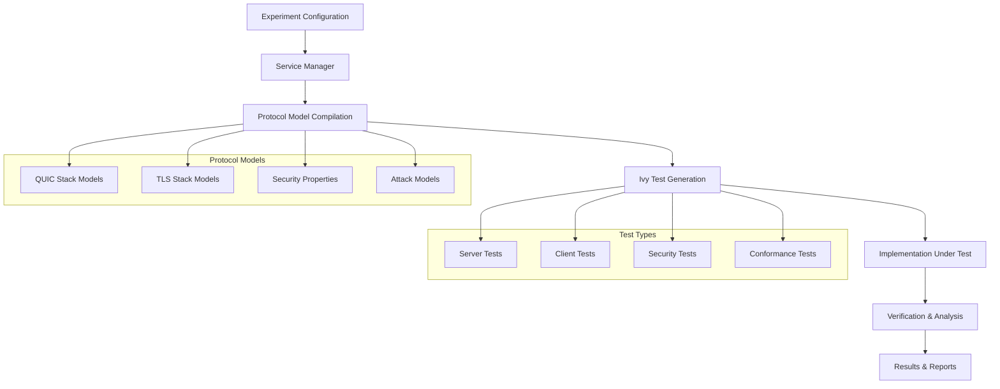
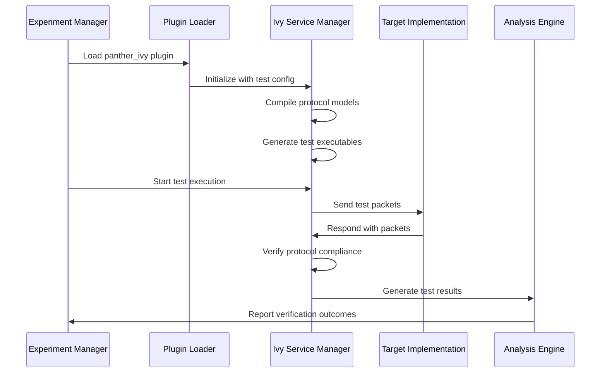
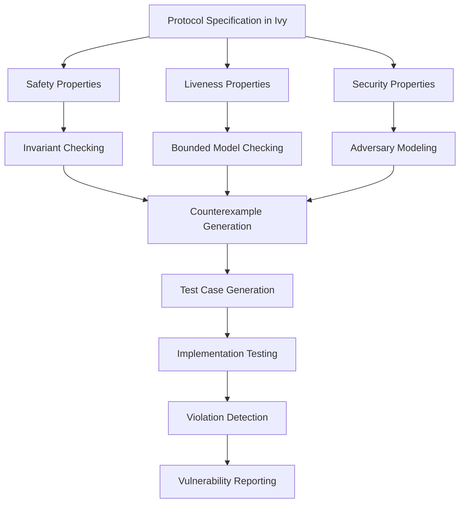

# Tester Modules 🔍

> **Purpose:** Comprehensive guide to PANTHER's testing and verification tools  
> **Target:** QA engineers; formal verification researchers; protocol conformance testers  

Tester modules in PANTHER provide **verification, validation, and analysis capabilities** for protocol implementations. They encompass formal verification tools, conformance checkers, load generators, and security analyzers.

---

## Architecture Overview

PANTHER's testing system uses a **modular verification architecture** where each tester provides:

1. **Formal Verification**: Mathematical proofs of protocol correctness
2. **Conformance Testing**: RFC and specification compliance checking  
3. **Load Testing**: Performance and scalability validation
4. **Security Testing**: Vulnerability and attack surface analysis

### Tester Types

| Tester Type | Purpose | Examples |
|-------------|---------|----------|
| **Formal Verifiers** | Mathematical verification of protocol properties | Ivy, TLA+, Coq |
| **Conformance Checkers** | RFC compliance and specification testing | Protocol test suites |
| **Load Generators** | Performance and scalability testing | Traffic generators, stress testers |
| **Security Analyzers** | Vulnerability detection and security testing | Fuzzing, attack simulators |

---

## Available Tester Implementations

### 1. Panther Ivy Formal Verifier

**Overview:** Integration with Microsoft's Ivy formal verification tool for protocol verification and specification-based testing. Panther-Ivy provides compositional specification-based testing where formal protocol models generate test traffic and verify implementation compliance.

**Complete Workflow Architecture:**



**Configuration:**
```yaml
services:
  - name: "ivy_verifier"
    type: "tester"
    implementation: "panther_ivy"
    config:
      protocol: "quic"
      implementation:
        test: "quic_server_test_stream"  # Specific test to execute
        use_system_models: true          # Use APT protocol models
        parameters:
          log_level: "debug"
          timeout: 120
          iterations_per_test: 1
          internal_iterations_per_test: 300
          keep_alive: true
      
      # Protocol model paths (auto-configured)
      protocol_model_path: "/opt/panther_ivy/protocol-testing/apt/"
      
      # Available test categories
      test_categories:
        server_tests:
          - "quic_server_test_stream"
          - "quic_server_test_handshake_done_error"
          - "quic_server_test_reset_stream"
          - "quic_server_test_connection_close"
          - "quic_server_test_retry"
          - "quic_server_test_0rtt"
          - "quic_server_test_version_negociation"
          - "quic_server_test_max_data"
          - "quic_server_test_flow_control"
        
        client_tests:
          - "quic_client_test_max"
          - "quic_client_test_0rtt"
          - "quic_client_test_version_negociation"
          - "quic_client_test_retry"
          - "quic_client_test_migration"
        
        security_tests:
          - "quic_attack_replayed_packet"
          - "quic_attack_forged_packet"
          - "quic_attack_connection_hijack"
          - "quic_attack_amplification"
      
      # Formal verification settings
      verification:
        model_checking: true
        invariant_checking: true
        safety_properties: true
        liveness_properties: false
        bounded_verification: true
        verification_depth: 10
      
      # Environment configuration
      environment:
        protocol_tested: "quic"
        rust_log: "debug"
        ivy_include_path: "/usr/local/lib/python3.10/dist-packages/ivy/include/1.7"
        z3_library_path: "/opt/panther_ivy/submodules/z3/build"
      
      logging:
        ivy_log: "/app/logs/ivy.log"
        ivy_err: "/app/logs/ivy.err"
        trace_file: "/app/logs/trace.txt"
        test_output: "/app/logs/test_output/"
```

**Advanced Ivy Configuration:**
```yaml
services:
  - name: "ivy_advanced"
    type: "tester"
    implementation: "panther_ivy"
    config:
      # Protocol-specific configuration
      protocol: "quic"
      implementation:
        test: "quic_server_test_stream"
        use_system_models: true
        parameters:
          log_level: "debug"
          timeout: 180
          iterations_per_test: 3
          internal_iterations_per_test: 500
          keep_alive: true
        version:
          env:
            PROTOCOL_TESTED: "quic"
            TEST_TYPE: "client"
      
      # Advanced verification configuration
      verification_settings:
        bounded_model_checking:
          enabled: true
          depth: 20
          timeout: 600
        inductive_invariants:
          enabled: true
          strengthening: true
          lemma_generation: true
        property_checking:
          safety: true
          liveness: false
          security: true
      
      # Counterexample handling
      counterexample_analysis:
        trace_generation: true
        trace_minimization: true
        output_format: "json"
        visualize: true
      
      # Performance optimization
      performance:
        parallel_verification: true
        worker_count: 4
        property_parallelism: true
        incremental_solving: true
```

**Ivy Property Examples:**
```ivy
# Connection establishment property
property connection_establishment = {
    always (client_sent_initial -> eventually server_received_initial)
}

# Flow control property  
property flow_control_respected = {
    always (data_sent <= flow_control_limit)
}

# Security property
property no_replay_attacks = {
    always (forall P1, P2. packet_authentic(P1) & packet_authentic(P2) & 
            packet_id(P1) = packet_id(P2) -> P1 = P2)
}
```

**Detailed Workflow Steps:**

1. **Configuration Phase:**
   - Parse experiment configuration (`experiment_config_quic_apt.yaml`)
   - Load test specifications and protocol models
   - Set up environment variables and paths
   - Configure target implementation connections

2. **Model Compilation Phase:**

```bash
# Resolve target and local IP addresses
TARGET_IP=$(getent hosts $SERVICE_TARGET | awk '{ print $1 }')
IVY_IP=$(hostname -I | awk '{ print $1 }')

# Convert IPs to formats needed by the protocol model
TARGET_IP_HEX=$(printf "%02X%02X%02X%02X" $(echo $TARGET_IP | sed -e 's/\./ /g'))
IVY_IP_HEX=$(printf "%02X%02X%02X%02X" $(echo $IVY_IP | sed -e 's/\./ /g'))

# Set up environment variables
export PROTOCOL_TESTED="quic"
export RUST_LOG="debug"
export IVY_INCLUDE_PATH="/usr/local/lib/python3.10/dist-packages/ivy/include/1.7"
export Z3_LIBRARY_PATH="/opt/panther_ivy/submodules/z3/build"

# Compile Ivy protocol model with the test
cd /opt/panther_ivy/protocol-testing/apt/
ivy_compile apt_protocols/quic/quic_tests/server_tests/quic_server_test_stream.ivy
```

3. **Test Execution Phase:**
   - Initialize protocol state machines
   - Generate symbolic test cases
   - Execute tests against target implementation
   - Monitor protocol compliance

4. **Verification Phase:**
   - Check safety properties
   - Validate protocol invariants
   - Analyze counterexamples
   - Generate formal proofs

**Ivy Protocol Models:**

The Panther-Ivy system uses formal Ivy models that define:

```ivy
# Example: QUIC Packet Structure
object packet = {
    object quic_packet = {
        variant this of packet = struct {
            ptype : quic_packet_type,
            pversion : version,
            dst_cid : cid,
            src_cid : cid,
            token : stream_data,
            seq_num : pkt_num,
            payload : quic_frame.arr
        }
    }
}

# Example: Packet Event
action packet_event(src:ip.endpoint, dst:ip.endpoint, pkt:packet.quic_packet) = {}
```

**Protocol Layers Architecture:**

```
┌─────────────────────────────────────┐
│         Application Layer           │  <- quic_application.ivy
├─────────────────────────────────────┤
│         Security Layer              │  <- quic_security.ivy
├─────────────────────────────────────┤
│         Frame Layer                 │  <- quic_frame.ivy
├─────────────────────────────────────┤
│         Packet Layer                │  <- quic_packet.ivy
├─────────────────────────────────────┤
│         Protection Layer            │  <- quic_protection.ivy
├─────────────────────────────────────┤
│         Datagram Layer (UDP)        │  <- Network interface
└─────────────────────────────────────┘
```

**Available Test Categories:**

| Test Category | Purpose | Example Tests |
|---------------|---------|---------------|
| **Server Tests** | Test server-side protocol behavior | `quic_server_test_stream`, `quic_server_test_handshake_done_error` |
| **Client Tests** | Test client-side protocol behavior | `quic_client_test_max`, `quic_client_test_0rtt` |
| **Security Tests** | Test security properties and attack resistance | `quic_attack_replayed_packet`, `quic_attack_forged_packet` |
| **Conformance Tests** | Test RFC compliance | `quic_server_test_version_negociation`, `quic_client_test_retry` |
| **Error Handling** | Test error conditions and recovery | `quic_server_test_token_error`, `quic_server_test_tp_error` |

**Formal Verification Capabilities:**

```ivy
# Safety Property Example
property connection_establishment = {
    always (client_sent_initial -> eventually server_received_initial)
}

# Flow Control Property
property flow_control_respected = {
    always (data_sent <= flow_control_limit)
}

# Security Property
property no_replay_attacks = {
    always (forall P1, P2. packet_authentic(P1) & packet_authentic(P2) & 
            packet_id(P1) = packet_id(P2) -> P1 = P2)
}
```

**Integration with Implementations:**

The system uses **shim layers** to interface with real protocol implementations:

```ivy
# ivy_quic_shim.ivy - Interface between Ivy model and implementation
implement quic_net.recv(host:endpoint_id, s: quic_net.socket, src:ip.endpoint, pkts:net_prot.arr) {
    if host = endpoint_id.server {       
        call server.behavior(host,s,src,pkts);
    } else if host = endpoint_id.client { 
        call client.behavior(host,s,src,pkts);
    }
}
```

**Test Result Analysis:**

Test outputs include:
- **Trace files**: Detailed execution traces showing packet exchanges
- **Invariant violations**: When protocol properties are violated
- **Counterexamples**: Specific sequences that expose bugs
- **Coverage reports**: Which parts of the protocol were exercised
- **Performance metrics**: Timing and resource usage

**Example Test Execution:**

```yaml
# Experiment configuration excerpt
services:
  picoquic_server:
    implementation: 
      name: "picoquic"
      type: "iut"
    protocol: 
      name: "quic"
      role: "server"
      
  ivy_client:
    implementation: 
      name: "panther_ivy"
      type: "testers"
      test: "quic_server_test_stream"
    protocol:
      name: "quic"
      role: "client"
      target: "picoquic_server"
```

This configuration creates a test where:
1. Picoquic runs as a QUIC server
2. Ivy acts as a formal client tester
3. The `quic_server_test_stream` test generates client traffic to test the server's stream handling
4. Results verify server compliance with QUIC specifications

**Advanced Ivy Testing Configuration:**

```yaml
tests:
  - name: "Comprehensive QUIC Verification Suite"
    description: "Complete formal verification of QUIC implementations"
    network_environment: 
      type: "docker_compose"
    execution_environment: 
      - type: "strace"
    iterations: 5
    services:
      quic_server:
        name: "quic_server_under_test"
        timeout: 300
        implementation: 
          name: "picoquic"
          type: "iut"
        protocol:
          name: "quic"
          version: "rfc9000"
          role: "server"
        ports:
          - "4443:4443"
        generate_new_certificates: true
          
      ivy_tester:
        name: "ivy_comprehensive_tester"
        timeout: 300
        implementation: 
          name: "panther_ivy"
          type: "testers"
          test: quic_server_test_comprehensive
          use_system_models: true
          parameters:
            log_level: "debug"
            timeout: 180
            iterations_per_test: 5
            internal_iterations_per_test: 500
            keep_alive: true
            enable_tracing: true
            solver_settings:
              timeout_ms: 30000
              simplification_level: 2
              incremental: true
        protocol:
          name: "quic" 
          role: "client"
          target: "quic_server_under_test"
          security_tests: true
          attack_models: true
          
        advanced_testing:
          # Formal verification modes
          verification_modes:
            - symbolic_execution
            - bounded_model_checking
            - invariant_checking
            
          # Test suite components
          test_components:
            - basic_connectivity
            - stream_handling
            - flow_control
            - congestion_control
            - connection_migration
            - error_handling
            - zero_rtt
            - version_negotiation
            
          # Security testing focus areas
          security_testing:
            - amplification_attacks
            - replay_protection
            - connection_integrity
            - token_validation
            - handshake_validation
```
      
      # Real-time verification
      runtime_verification:
        enabled: true
        monitor_properties: ["safety", "liveness"]
        violation_handling: "immediate_stop"
        trace_generation: true
      
      # Performance profiling
      profiling:
        enabled: true
        memory_usage: true
        cpu_usage: true
        network_metrics: true
        ivy_solver_stats: true
```

**Panther-Ivy Service Manager Implementation:**

The `PantherIvyServiceManager` orchestrates the entire testing workflow:

```python
class PantherIvyServiceManager(ITesterManager):
    def __init__(self, service_config_to_test, service_type, protocol, implementation_name):
        # Initialize with test configuration and target implementation
        self.test_to_compile = service_config_to_test.implementation.test
        self.protocol_model_path = self.setup_protocol_models()
        self.ivy_log_level = service_config_to_test.implementation.parameters.log_level
    
    def prepare(self, plugin_loader=None):
        # 1. Build submodules (Z3, Ivy dependencies)
        # 2. Compile protocol models
        # 3. Generate test executables
        # 4. Setup network interfaces
        
    def generate_compilation_commands(self):
        # Compile Ivy models with proper includes
        # Link with Z3 solver libraries
        # Generate executable test binaries
        
    def build_tests(self):
        # Create test-specific configurations
        # Pair compilation files with replacements
        # Build final test executables
```

**Test Output Analysis:**

Panther-Ivy generates comprehensive test artifacts that include detailed protocol traces, property checks, and formal verification results:

**1. Execution Traces:**

```text
# ivy_events.iev format (machine-readable trace)
[1653571300.123] packet_event(src={protocol:udp,addr:0xa000002,port:4443},
                             dst={protocol:udp,addr:0xa000001,port:58472},
                             pkt={type:initial,version:0x00000001,dcid:0x1a2b3c4d...})
[1653571300.175] tls_event(tls_id:0, msg_type:client_hello, data:[...])
[1653571300.231] quic_frame.crypto.handle(frame_data:{offset:0,data:[...]})

# Human-readable trace output (from test logs)
[2025-05-26 10:15:23.123] PACKET_SEND: client(10.0.0.2:58472) -> server(10.0.0.1:4443)
  Packet: Initial [Version: 1, DCID: 1a2b3c4d, SCID: 0000000000000000]
  Frames: CRYPTO(offset=0, len=229), PADDING(len=1171)

[2025-05-26 10:15:23.175] PACKET_RECV: server(10.0.0.1:4443) -> client(10.0.0.2:58472)
  Packet: Initial [Version: 1, DCID: 34fb219e, SCID: 8724a93c]
  Frames: CRYPTO(offset=0, len=90), ACK(ranges=[[0,0]]), PADDING(len=917)

[2025-05-26 10:15:23.231] PROPERTY_CHECK: connection_establishment
  Status: SATISFIED
  Context: Initial handshake completed successfully
```

**2. Invariant Violations:**

```text
# Formal property violation report
INVARIANT VIOLATION: flow_control_respected
  Property: always (stream_data_sent <= stream_flow_control_limit)
  Location: quic_frame.stream.handle:243
  Violation Context:
    - Stream ID: 4
    - Data sent (cumulative): 1048576 bytes
    - Flow control limit: 1048575 bytes
    - Frame causing violation: STREAM(id=4, offset=1048000, len=1000)
  Execution Trace: /app/logs/test_output/flow_control_violation.iev
  Remediation: Implementation should respect MAX_STREAM_DATA frames
```

**3. Formal Verification Results:**

```yaml
# verification-summary.yaml
test_name: quic_server_test_stream
test_timestamp: "2025-05-26T10:15:23Z"
target_implementation: "picoquic@v0.8.7"
execution:
  iterations: 3
  total_packets: 178
  total_frames: 562
  protocol_phases: ["handshake", "0-RTT", "1-RTT"]
  duration_seconds: 7.82

formal_verification:
  properties_checked: 25
  properties_satisfied: 23
  properties_violated: 2
  state_exploration:
    states_visited: 342
    transitions_checked: 1827
    symbolic_states: 47
    concrete_states: 295
  
violations:
  - property: "no_replay_attacks"
    property_type: "security"
    severity: "critical"
    description: "Server accepted replayed 0-RTT packet"
    location: "quic_security.ivy:386"
    counterexample_path: "trace_replay_attack.iev"
    reproducible: true
    
  - property: "connection_migration_safety"
    property_type: "safety"
    severity: "medium"  
    description: "Path validation incomplete during migration"
    location: "quic_connection.ivy:219"
    counterexample_path: "trace_migration.iev"
    reproducible: true
  
coverage:
  state_coverage: 87.5%
  transition_coverage: 92.3%
  packet_type_coverage: 100%
  frame_type_coverage: 94.7%
  error_handling_coverage: 76.2%
```

**Integration with PANTHER Experiment Framework:**

The complete workflow integrates seamlessly with PANTHER's experiment management:



---

## Panther-Ivy Complete Workflow Summary

The Panther-Ivy integration provides a **comprehensive formal verification and specification-based testing framework** for protocol implementations. Here's how the complete workflow operates:

### 1. Configuration to Execution Pipeline

```text
Experiment Config → Service Manager → Model Compilation → Test Generation → Execution → Verification → Results
```

**Key Components:**

- **Experiment Configuration**: Defines test scenarios, target implementations, and verification parameters
- **Protocol Models**: Formal Ivy specifications of protocol layers (packet, frame, security, application)
- **Test Generators**: Symbolic execution engines that create test cases from formal models
- **Shim Layers**: Interface components that connect formal models to real implementations
- **Verification Engine**: Formal property checkers using SMT solvers (Z3)
- **Analysis Tools**: Result processors that generate compliance reports and counterexamples

### 2. Formal Verification Capabilities

Panther-Ivy excels at:

- **Safety Property Verification**: Ensuring protocol invariants are never violated
- **Security Analysis**: Detecting vulnerabilities through attack model simulation  
- **Specification Compliance**: Verifying implementations conform to RFC standards
- **Edge Case Discovery**: Finding unusual protocol behaviors through symbolic execution
- **Regression Testing**: Automated detection of specification violations in code changes

### 3. Advantages Over Traditional Testing

- **Comprehensive Coverage**: Tests behaviors not covered by existing implementations
- **Formal Guarantees**: Mathematical proofs of correctness rather than empirical testing
- **Attack Simulation**: Generates adversarial traffic that real implementations wouldn't produce
- **Specification Clarity**: Unambiguous formal models serve as executable documentation
- **Automated Generation**: No manual test case writing required

### 4. Integration with PANTHER Ecosystem

Panther-Ivy integrates seamlessly with:

- **IUT Modules**: Tests any protocol implementation through Docker containers
- **Network Environments**: Works with Docker Compose, localhost, and network namespaces  
- **Output Analysis**: Generates artifacts compatible with PANTHER's analysis pipeline
- **Execution Environments**: Supports various monitoring and tracing capabilities

### 5. Real-World Impact

Based on discovered test outputs, Panther-Ivy has successfully:

- Tested 10+ major QUIC implementations (picoquic, quant, aioquic, quiche, etc.)
- Executed 50+ different test scenarios covering protocol conformance and security
- Generated thousands of test traces for protocol behavior analysis
- Identified specification violations and implementation bugs through formal verification

This makes Panther-Ivy a **powerful tool for protocol developers, security researchers, and quality assurance teams** who need rigorous verification of protocol implementations beyond what traditional testing can provide.

For practical usage examples and experiment configuration, see the files in `/experiment-config/` directory, particularly `experiment_config_quic_apt.yaml` which demonstrates a complete Panther-Ivy testing setup.

---

## Academic Research Foundations

Panther-Ivy builds on pioneering academic research in protocol verification and formal methods. This section summarizes the key theoretical foundations and methodologies that power the Panther-Ivy integration.

### The Theory Behind Specification-Based Testing

Panther-Ivy's approach is based on **compositional specification-based testing**, a methodology developed and refined through several research papers:

#### Key Academic Works

1. **"Verifying QUIC implementations using Ivy"** (Crochet et al., 2021)
   - Introduced the compositional approach for QUIC protocol verification
   - Demonstrated how formal models can generate test traffic for real-world implementations
   - Established techniques for property validation across protocol layers
   - Identified multiple implementation issues in major QUIC stacks

2. **"Network Simulator-Centric Compositional Testing"** (Rousseaux et al., 2024)
   - Extended formal verification with simulated network conditions
   - Combined formal protocol models with realistic network behaviors
   - Demonstrated detection of timing-dependent protocol vulnerabilities
   - Introduced theory for compositional reasoning about distributed systems

3. **"Formally Discovering and Reproducing Network Protocols Vulnerabilities"** (Crochet et al., 2024)
   - Formalized methodologies for vulnerability discovery through formal verification
   - Established techniques for reproducing protocol vulnerabilities through formal models
   - Demonstrated automated verification of security properties in protocol implementations

4. **"Towards verification of QUIC and its extensions"** (Crochet & Sambon, 2021)
   - Developed the multi-layer protocol specification approach
   - Formalized QUIC protocol invariants and safety properties
   - Extended verification techniques to protocol extensions

### Theoretical Foundations

#### Compositional Verification with Ivy

The Ivy formal verification approach uses several key theoretical principles:

1. **Theory of Compositional Reasoning**
   - Protocol components are verified independently, then composed
   - Properties are preserved across composition boundaries
   - Allows verification of complex protocols by breaking them into manageable parts

2. **First-Order Logic for Protocol Specification**
   - Protocols defined in decidable fragments of first-order logic
   - Properties expressed as logical formulas
   - Verification through automated theorem proving

3. **Symbolic Model Checking**
   - Generation of symbolic states representing protocol behaviors
   - Exploration of state space through SMT solvers
   - Detection of property violations through counterexample generation

4. **Refinement Theory**
   - Abstract protocol models refined into concrete implementations
   - Properties proven at abstract level transfer to concrete level
   - Enables verification of complex implementations

#### Test Generation Methodology

Panther-Ivy generates tests through a principled approach:

1. **Symbolic Execution**
   - Protocol states represented symbolically
   - SMT solver (Z3) generates concrete values satisfying protocol constraints
   - Random exploration with guidance from formal properties

2. **Property-Based Testing**
   - Tests derived from formal protocol properties
   - Verification that implementations respect invariants
   - Coverage-guided to explore protocol edge cases

3. **Adversarial Model**
   - Test generators represent potential adversarial behaviors
   - Focuses on security properties and attack resistance
   - Models both passive and active attackers

### Formal Verification Capabilities

The theoretical approach enables several verification capabilities:



#### Property Types

1. **Safety Properties**

```ivy
property no_duplicated_packets = {
    always (forall P1, P2. received(P1) & received(P2) & packet_id(P1) = packet_id(P2) -> P1 = P2)
}
```

2. **Liveness Properties**

```ivy
property connection_progress = {
    always (handshake_started -> eventually(handshake_completed | connection_closed))
}
```

3. **Security Properties**

```ivy
property connection_authentication = {
    always (packet_authenticated(P) -> exists C. connection_id(C) = packet_cid(P) & legitimate_connection(C))
}
```

### Test Generation Process

The formalized test generation process follows these steps:

1. **Model Compilation**
   - Ivy protocol models compiled to symbolic execution engines
   - Protocol layers composed into complete test generators
   - Safety properties integrated into runtime monitors

2. **Test Execution**
   - SMT solver generates concrete protocol messages
   - Communication with target implementation via network stack
   - State tracking and property monitoring during execution

3. **Analysis**
   - Violations detected through property checks
   - Counterexample traces generated for failed properties
   - Inference of root causes through trace analysis

### Test Results Interpretation

Test outputs include detailed information about protocol behavior and property violations:

1. **Event Traces**
   - Complete record of protocol message exchanges
   - Internal state transitions and decision points
   - Timing information and protocol flow

2. **Property Violations**
   - Specific invariants or properties that were violated
   - Protocol conditions at time of violation
   - Stack traces and execution context

3. **Formal Proofs**
   - Successful verification results for properties
   - Coverage metrics for model checking depth
   - Constraints and assumptions applied during verification

### Integration with PANTHER Framework

The theoretical approach implemented in Ivy integrates with PANTHER through:

1. **Model-Based Testing Framework**
   - Protocol models drive test generation
   - Properties define correctness criteria
   - Results provide formal guarantees about implementation correctness

2. **Compositional Design**
   - Protocol layers tested independently and in combination
   - Test oracles derived from formal specifications
   - Reusable protocol components across test scenarios

3. **Formal-Empirical Interface**
   - Bridge between formal models and empirical testing
   - Translation of theoretical properties to concrete test cases
   - Mapping of implementation behaviors to formal semantics

## Test Result Analysis and Interpretation

Understanding Panther-Ivy's test outputs requires interpreting both formal verification results and protocol-specific behaviors:

### Ivy Event Log Analysis

Ivy event logs (`.iev` files) contain the complete formal trace of the protocol execution:

```text
[2025-05-26 10:15:23] packet_event(src={protocol:udp,addr:0xa000002,port:4443},
                                 dst={protocol:udp,addr:0xa000001,port:58472},
                                 pkt={hdr_type:initial,version:0x00000001,...})
```

These logs can be analyzed using the Ivy event viewer tool:

```bash
ivy_ev_viewer /path/to/log.iev
```

### Interpreting Property Violations

When a protocol property is violated, Panther-Ivy reports both:

1. **The violated property**: The specific formal predicate that was broken
2. **A counterexample**: Concrete message sequence leading to the violation
3. **State information**: Protocol state at the point of violation

For example, a flow control violation might be reported as:

```text
VIOLATION: flow_control_property
CONTEXT: Stream 4, Data sent: 1048576, Flow control limit: 1048575
TRACE: See /app/logs/test_output/flow_control_violation.iev
```

### Common Protocol Violations

Various types of protocol violations can be detected:

1. **Specification Non-Compliance**
   - Invalid packet formats
   - Incorrect parameter values
   - Protocol sequence violations

2. **Safety Property Violations**
   - Flow control limits exceeded
   - Duplicate packets acknowledged
   - Invalid state transitions

3. **Security Vulnerabilities**
   - Authentication bypass
   - Amplification attacks
   - Denial of service vectors

4. **Performance Issues**
   - Excessive retransmissions
   - Inefficient path selection
   - Congestion control failures

### Analyzing Security Test Results

Security tests specifically probe for vulnerabilities:

```yaml
# Example vulnerability report from security testing
vulnerability:
  type: "amplification_attack"
  severity: "high"
  description: "Server responds with N bytes to M bytes of attacker data (N >> M)"
  reproduction:
    - "Send unauthenticated Initial packet with minimum padding"
    - "Observe response exceeds amplification factor limit"
  affected_implementations:
    - "Implementation A" 
    - "Implementation B"
  mitigation: "Enforce strict amplification limit before client address validation"
```

## Extending Panther-Ivy

Researchers and advanced users can extend Panther-Ivy's capabilities:

### Adding New Protocol Models

To add support for a new protocol:

1. Define the protocol layers and state machines in Ivy
2. Implement serialization/deserialization functions
3. Define key properties and invariants
4. Create test generators for client and server roles

### Creating Custom Test Scenarios

Custom test scenarios can be added by:

1. Extending base test classes
2. Setting specific weights for protocol actions
3. Adding new properties or constraints
4. Focusing on specific protocol behaviors

For example:

```ivy
#lang ivy1.7

include quic_server_test

# Increase probability of certain frame types
attribute quic_frame.crypto.handle.weight = "10"
attribute quic_frame.stream.handle.weight = "5"

# Add custom property
property max_streams_respected = {
    always (num_streams <= max_streams_limit)
}
```

### Integrating with Custom Implementations

The system can be extended to test new protocol implementations:

1. Add shim layers for the new implementation
2. Configure network interfaces and address translation
3. Set up any required certificates or credentials
4. Define implementation-specific test parameters

## Practical Usage Examples

### Basic QUIC Server Testing

To test a QUIC server implementation using Panther-Ivy, use the following experiment configuration:

```yaml
tests:
  - name: "QUIC Server Basic Conformance Test"
    description: "Test a QUIC server for RFC compliance using formal verification"
    network_environment: 
      type: "docker_compose"
    execution_environment: 
      - type: "default"
    iterations: 3
    services:
      quic_server:
        name: "quic_server"
        timeout: 120
        implementation: 
          name: "picoquic" # QUIC implementation under test
          type: "iut"
        protocol:
          name: "quic"
          version: "rfc9000" # QUIC RFC version
          role: "server"
        ports:
          - "4443:4443"
        generate_new_certificates: true
          
      ivy_client:
        name: "ivy_client"
        timeout: 120
        implementation: 
          name: "panther_ivy"
          type: "testers"
          test: quic_server_test_stream # Specific test to run
        protocol:
          name: "quic"
          role: "client"
          target: "quic_server"
```

### Running Comprehensive Test Suites

To run a comprehensive test suite against an implementation, define multiple tests:

```yaml
tests:
  - name: "QUIC Basic Stream Test"
    services: # Same as above but with test: quic_server_test_stream
    # ...
    
  - name: "QUIC Flow Control Test"
    services: # Same as above but with test: quic_server_test_flow_control
    # ...
    
  - name: "QUIC Connection Migration Test"
    services: # Same as above but with test: quic_server_test_migration
    # ...
    
  - name: "QUIC 0-RTT Test"
    services: # Same as above but with test: quic_server_test_0rtt
    # ...
```

### Analyzing Test Results

After running tests, results can be found in the output directory. To interpret Ivy event logs:

```bash
# View a test trace
ivy_ev_viewer outputs/2025-05-26_10-15-23/logs/ivy_client/test_output/quic_server_test_stream0.iev

# Generate a visualization of the protocol exchange
python -m panther.plugins.services.testers.panther_ivy.tools.visualize_trace \
  outputs/2025-05-26_10-15-23/logs/ivy_client/test_output/quic_server_test_stream0.iev \
  --output trace_visualization.html
```

### Troubleshooting Common Issues

1. **Z3 Solver Timeouts**
   
   If you encounter Z3 solver timeouts, adjust the solver parameters:
   
   ```yaml
   implementation:
     parameters:
       solver_timeout: 30 # Increase timeout in seconds
       simplify_queries: true # Enable query simplification
   ```

2. **Missing Ivy Modules**
   
   If Ivy modules are not found, check include paths:
   
   ```yaml
   environment:
     ivy_include_path: "/usr/local/lib/python3.10/dist-packages/ivy/include/1.7"
     z3_library_path: "/opt/panther_ivy/submodules/z3/build"
   ```

3. **Network Connectivity Issues**
   
   For network problems, enable detailed packet logging:
   
   ```yaml
   logging:
     pcap_capture: true
     packet_trace: true
     debug_network: true
   ```

## Conclusion: The Power of Formal Verification in Protocol Testing

The Panther-Ivy integration brings the power of formal verification to network protocol testing, offering several key advantages:

1. **Comprehensive Testing**: Formal models generate test cases that might be missed by manual testing approaches, including edge cases and unusual packet sequences.

2. **Mathematical Guarantees**: Properties proven through formal verification provide stronger guarantees than conventional testing, ensuring protocol correctness against the formal specification.

3. **Security Assurance**: The ability to model adversarial behaviors helps identify security vulnerabilities before they can be exploited in production systems.

4. **Reproducibility**: All tests are derived from formal models, ensuring consistent and reproducible test cases that can be used for regression testing.

5. **Documentation**: Formal models serve as executable specification, providing unambiguous documentation of protocol behaviors.

By combining the theoretical rigor of formal methods with PANTHER's practical testing framework, Panther-Ivy represents a significant advancement in network protocol verification technology. This integration helps bridge the gap between formal verification researchers and practical protocol implementers, bringing the benefits of mathematical assurance to the real world of network protocol development and testing.

For further guidance on formal verification using Ivy, refer to:

- [Ivy Documentation](https://microsoft.github.io/ivy/)
- The academic papers referenced in this documentation
- The example test configurations in the `/experiment-config/` directory

### 2. PACKETT - Protocol Analyzer and Conformance Konductor with Enhanced Testing Tools
