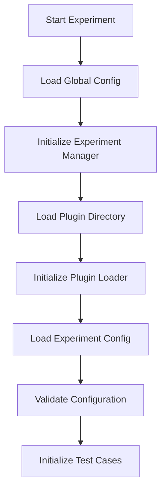
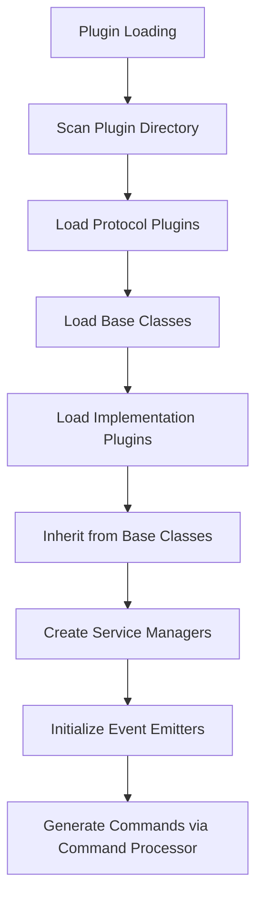
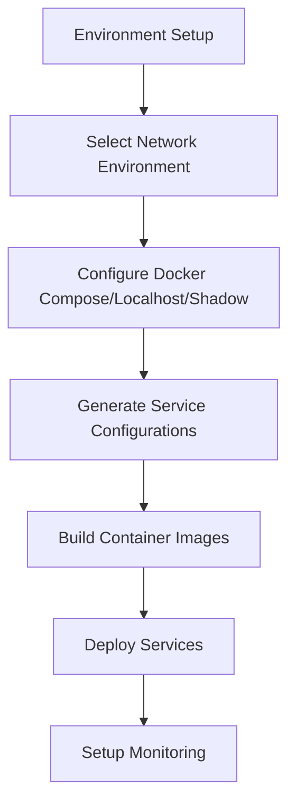
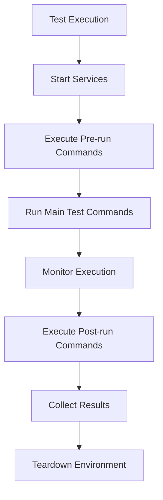
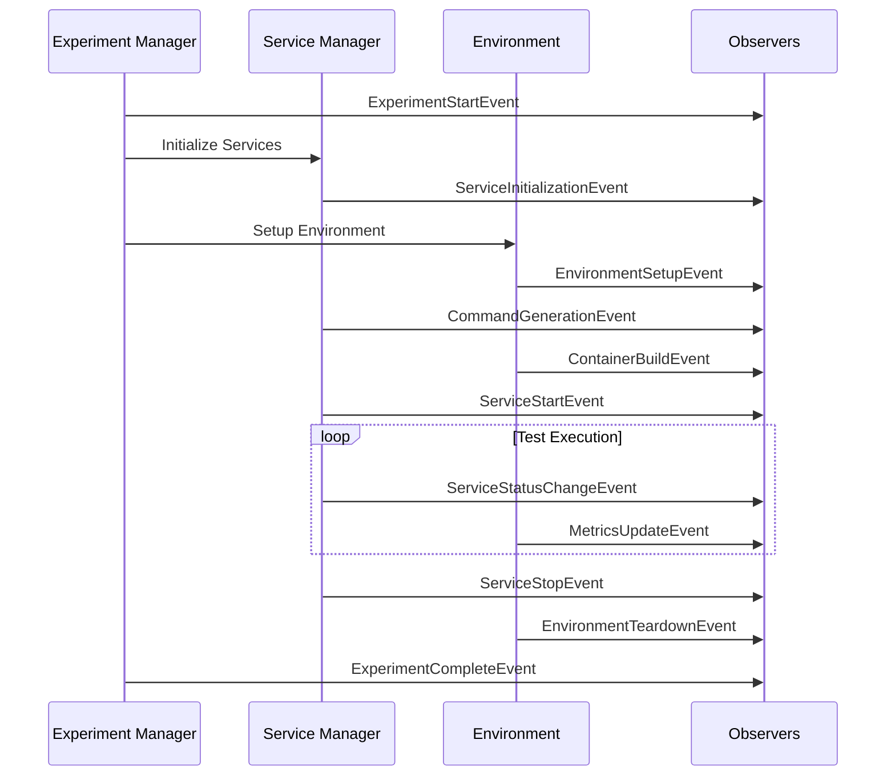

# PANTHER Workflows Documentation

## Overview

PANTHER (Protocol Analysis and Testing Harness for Extensible Research) is a comprehensive testing framework for protocol implementations, particularly network protocols like QUIC. This document covers the core architecture and execution model.

> [!NOTE]
> "Audience"
> For getting started, see the [Quick Start Guide](QUICK_START.md). This document is for developers and contributors who need to understand internal architecture.

## Architecture Overview

PANTHER follows a modular, plugin-based architecture:

- **Experiment Manager**: Orchestrates the testing workflow
- **Plugin System**: Manages loading and instantiation of components
- **Service Managers**: Handle protocol implementations (IUT) and testers
- **Environment Plugins**: Manage network and execution environments
- **Event System**: Typed events with observer-based monitoring
- **Command Processor**: Structured command generation with validation
- **Configuration System**: OmegaConf + Pydantic hybrid configuration

## Four-Phase Execution Model

### Phase 1: Initialization



1. **Global Configuration Loading**: Load system-wide settings
2. **Experiment Manager Creation**: Initialize with global config
3. **Plugin Directory Setup**: Prepare plugin loading infrastructure
4. **Experiment Configuration**: Load and validate test-specific configs
5. **Test Case Initialization**: Create TestCase objects for each test

### Phase 2: Plugin Loading and Service Setup



Service managers inherit from specialized base classes (e.g., `BaseQUICServiceManager`) that provide common functionality through the template method pattern. This achieves 47.2% average code reduction across implementations.

### Phase 3: Environment Setup and Deployment



The Docker Compose environment generates `docker-compose.yml` with service definitions, volume mappings, network configuration, and rendered Jinja2 command templates.

### Phase 4: Test Execution



## Plugin System Architecture

### Plugin Types

1. **Service Plugins** (`panther/plugins/services/`): IUT implementations and testers
2. **Environment Plugins** (`panther/plugins/environments/`): Network (Docker Compose, localhost, Shadow) and execution environments (profiling, monitoring)
3. **Protocol Plugins** (`panther/plugins/protocols/`): Protocol-specific configurations

### Inheritance-Based Loading

Implementations inherit from specialized base classes:

```text
BaseQUICServiceManager              # Core QUIC functionality
├── PythonQUICServiceManager       # Python-specific (aioquic)
├── RustQUICServiceManager         # Rust-specific (quiche, quinn)
└── Direct inheritance             # C/Go implementations (picoquic, lsquic)
```

Only implementation-specific methods need overriding — base classes handle common command generation, event emission, Docker integration, and error handling.

## Event-Driven Architecture

PANTHER uses a typed event system where each component emits structured events processed by specialized observers.



### Observer Types

| Observer | Purpose |
|----------|---------|
| **Logger** | Structured logging with entity-specific formatting |
| **Experiment** | Lifecycle tracking, timing, state management |
| **Metrics** | System/application metrics, resource monitoring |
| **Storage** | Event persistence, result collection |
| **GUI** | Real-time visualization and dashboards |

### Event Categories

- **Experiment**: Start, Complete, Error, StateChange
- **Service**: Initialization, Start, StatusChange, Error, Stop
- **Environment**: Setup, ContainerBuild, NetworkConfig, Teardown
- **Test**: Start, Step, Complete, Failure
- **Plugin**: Load, Initialization, Error
- **Command**: Generation, Execution, Completion

## Service Management

Each implementation provides a service manager implementing:

- `prepare()`: Build Docker images and setup requirements
- `generate_deployment_commands()`: Render Jinja2 templates with runtime parameters
- `generate_run_command()`: Build execution commands via Command Processor
- Pre/post-run command generation for setup and cleanup

The Command Processor provides structured `ShellCommand` objects with validation, proper escaping, timeout management, and event integration.

## Network Environments

| Environment | Use Case |
|-------------|----------|
| **Docker Compose** | Container orchestration with inter-service networking |
| **Localhost** | Direct process execution for local testing |
| **Shadow NS** | Network simulation with bandwidth/latency control |

Docker Compose handles service coordination (Ivy tester synchronization), volume management (logs, certificates, shared data), and automatic packet capture via tshark.

## Result Collection

Experiments produce:
- Service execution logs
- Packet captures (`.pcap`)
- Performance metrics
- JSON and Markdown experiment reports (auto-generated)

Reports are stored in `outputs/<date>/<experiment_id>/` and provide immediate insights into pass/fail status and failure analysis.

## Configuration

PANTHER uses hierarchical configuration with OmegaConf:

1. **Global**: System-wide settings (logging, paths, Docker)
2. **Experiment**: Test definitions and orchestration
3. **Service**: Implementation and protocol settings
4. **Runtime**: Dynamic parameters resolved at execution

See the `panther.config` module docstring for architecture details.

## Troubleshooting

| Issue | Check |
|-------|-------|
| Plugin loading failures | Directory structure, class naming, proper inheritance |
| Container build failures | Dockerfile syntax, dependency availability |
| Service communication | Network config, port availability, firewall |
| Test execution failures | Timeout settings, service dependencies, error logs |

Enable verbose logging with `logging.level: DEBUG` in your config. Use `panther plugins list` to verify plugin discovery.
