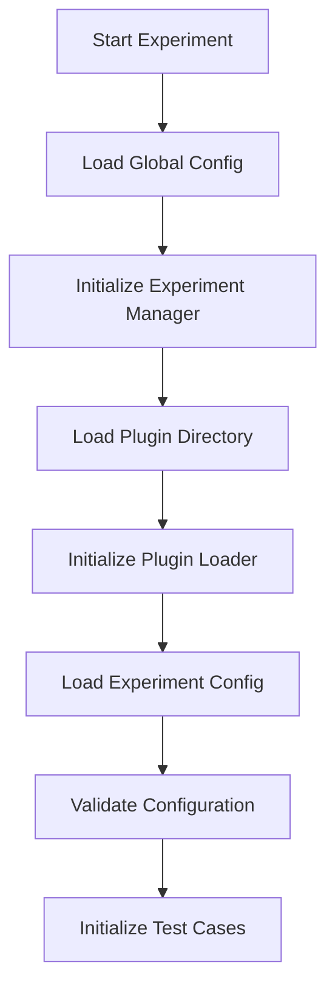
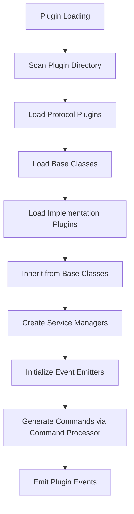
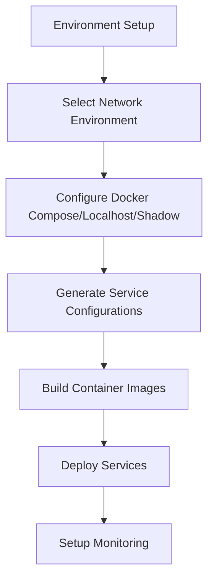
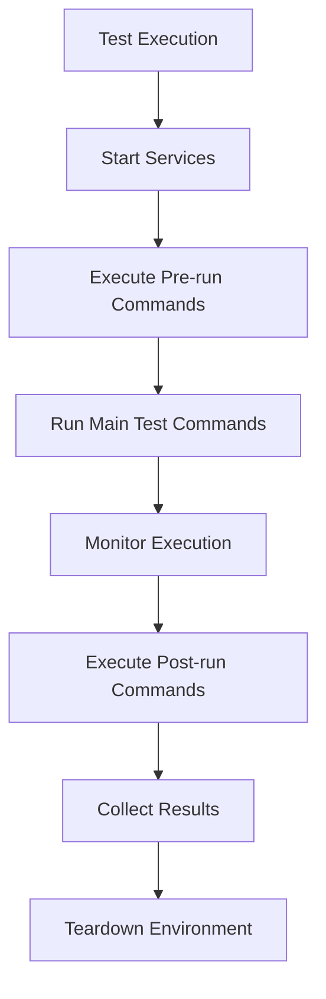
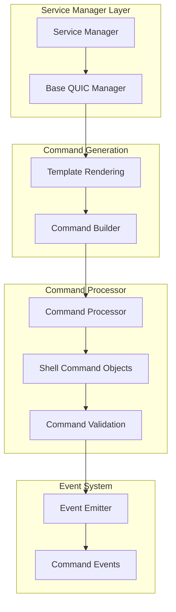
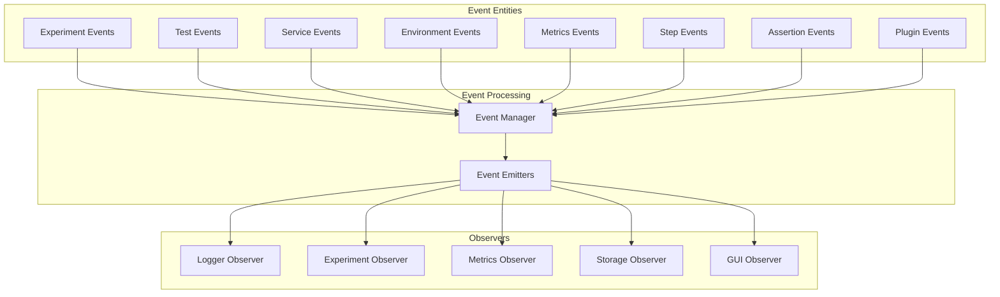
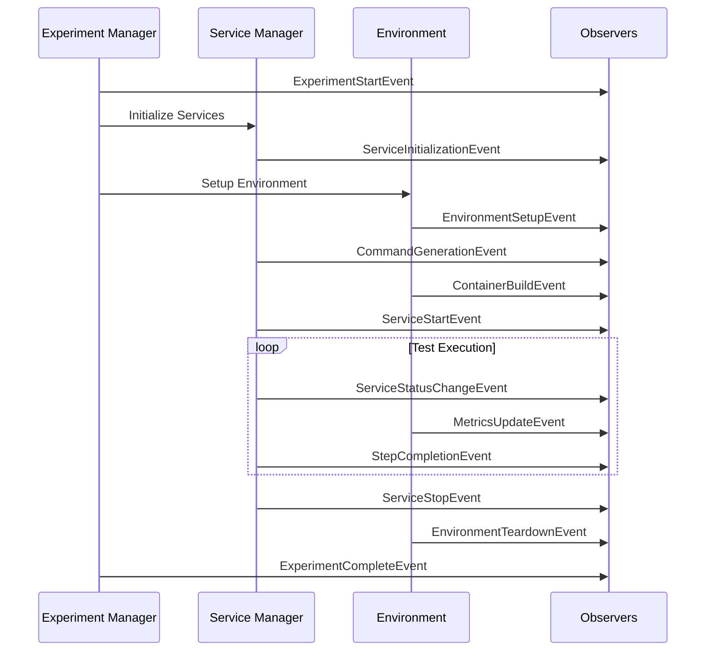

# PANTHER Workflows Documentation

## Overview

PANTHER (Protocol Analysis and Testing Harness for Extensible Research) is a comprehensive testing framework designed for protocol implementations, particularly focusing on network protocols like QUIC. This document provides a detailed explanation of PANTHER's workflows, including container building processes, experiment execution, and overall system architecture.

!!! info "Documentation Purpose"
    This document is intended for developers and contributors who need to understand PANTHER's internal architecture and workflows. For getting started with using PANTHER, see the [Quick Start Guide](QUICK_START.md).

## Table of Contents

1. [Architecture Overview](#architecture-overview)
2. [Core Workflow Components](#core-workflow-components)
3. [Experiment Execution Workflow](#experiment-execution-workflow)
4. [Container Building and Deployment](#container-building-and-deployment)
5. [Plugin System Architecture](#plugin-system-architecture)
6. [Service Management Workflow](#service-management-workflow)
7. [Network Environment Setup](#network-environment-setup)
8. [Result Collection and Analysis](#result-collection-and-analysis)
9. [Event-Driven Architecture](#event-driven-architecture)
10. [Configuration Management](#configuration-management)

## Architecture Overview

!!! warning "Development Architecture"
    The architecture described here reflects the current implementation. Some components may change as the framework evolves. Always refer to the source code for the most current implementation details.

PANTHER follows a modular, plugin-based architecture that enables testing of various protocol implementations across different network environments. The framework consists of several key components:

- **Experiment Manager**: Orchestrates the entire testing workflow
- **Plugin System**: Manages loading and instantiation of various components
- **Service Managers**: Handle individual protocol implementations (IUT - Implementation Under Test)
- **Environment Plugins**: Manage network and execution environments
- **Observer System**: Provides event-driven monitoring and logging
- **Configuration System**: Handles experiment and global configurations
- **Command Processor**: Structured command generation with validation and safe execution
- **Event-Driven Architecture**: Comprehensive event system with typed events and state management

## Core Workflow Components

### 1. Experiment Manager (`panther/core/experiment_manager.py`)

The Experiment Manager is the central orchestrator that:

- Initializes plugins and configurations
- Creates and manages test cases
- Coordinates experiment execution
- Handles logging and output generation

**Key Methods:**

- `initialize_experiments()`: Sets up plugins, environment, and validates configuration
- `run_tests()`: Executes all test cases with progress tracking
- `_initialize_test_cases()`: Creates TestCase instances from configuration

### 2. Plugin Manager (`panther/plugins/plugin_manager.py`)

Responsible for:

- Loading plugin modules dynamically
- Creating service manager instances
- Managing environment plugin instantiation
- Providing a registry of available plugins

### 3. Test Case (`panther/core/test_cases/test_case.py`)

Each test case:

- Manages a specific test scenario
- Coordinates service managers and environment plugins
- Handles result collection
- Implements observer pattern for event management

## Experiment Execution Workflow

### Phase 1: Initialization

!!! tip "Understanding the Initialization Flow"
    The initialization phase is critical for proper experiment setup. Each step must complete successfully before proceeding to the next phase. Monitor the logs during this phase to identify any configuration issues early.



1. **Global Configuration Loading**: Load system-wide settings
2. **Experiment Manager Creation**: Initialize with global config and experiment name
3. **Plugin Directory Setup**: Prepare plugin loading infrastructure
4. **Experiment Configuration**: Load test-specific configurations
5. **Test Case Initialization**: Create TestCase objects for each test

### Phase 2: Plugin Loading and Service Setup

!!! info "Modern Inheritance-Based Architecture"
    PANTHER now uses an inheritance-based plugin architecture with base classes that eliminate code duplication. Service managers inherit from specialized base classes (e.g., BaseQUICServiceManager) that provide common functionality through the template method pattern.



1. **Plugin Discovery**: Scan plugin directories for available components
2. **Base Class Loading**: Load specialized base classes (BaseQUICServiceManager, PythonQUICServiceManager, etc.)
3. **Service Manager Creation**: Instantiate managers inheriting from appropriate base classes
4. **Event System Integration**: Initialize event emitters for each service manager
5. **Command Generation**: Use Command Processor for structured command generation
6. **Event Emission**: Emit plugin lifecycle events for monitoring
7. **Environment Preparation**: Setup network and execution environments with event integration

### Phase 3: Environment Setup and Deployment



### Phase 4: Test Execution



## Container Building and Deployment

!!! warning "Docker Requirements"
    Container building requires Docker to be running and accessible. Ensure your user has proper Docker permissions and that sufficient disk space is available for image builds.

### Docker Compose Environment Workflow

The Docker Compose environment (`panther/plugins/environments/network_environment/docker_compose/docker_compose.py`) manages:

#### 1. Container Image Building

```python
# Service preparation phase
def prepare(self, plugin_loader: PluginLoader):
    # Build base service image
    plugin_loader.build_docker_image_from_path(
        Path("panther/plugins/services/Dockerfile"),
        "panther_base",
        "service"
    )

    # Build implementation-specific image
    plugin_loader.build_docker_image(
        self.get_implementation_name(),
        self.service_config_to_test.implementation.version
    )
```

#### 2. Docker Compose File Generation

The system generates `docker-compose.yml` files with:

- **Service Definitions**: Each implementation becomes a service
- **Volume Mappings**: Logs, certificates, and shared data
- **Network Configuration**: Container networking setup
- **Environment Variables**: Runtime configuration
- **Command Templates**: Rendered Jinja2 templates for execution

#### 3. Service Coordination

**Synchronization Mechanisms:**

- **Ivy Tester Coordination**: Special handling for Ivy testers with ready signals
- **Shared Volumes**: `/app/sync_logs` for inter-service communication
- **Wait Conditions**: Services wait for dependencies to be ready

**Network Monitoring:**

- **Packet Capture**: Automatic tshark recording for each service
- **Timeout Management**: Configurable execution timeouts
- **Log Collection**: Centralized logging to `/app/logs/`

### Modern Command Generation Workflow

!!! success "Command Processor Integration"
    PANTHER now uses a dedicated Command Processor system that provides structured command generation, validation, and safe execution. Commands are represented as typed objects with proper escaping and error handling.

#### Command Processor Architecture



Each service manager generates multiple command types through the Command Processor:

#### 1. Pre-compile Commands

```python
# Generated via Command Processor with structured validation
from panther.core.command_processor import ShellCommand

pre_compile_cmds = [
    ShellCommand(
        command="apt-get update && apt-get install -y build-essential",
        is_critical=True,
        timeout=300
    ),
    ShellCommand(
        command="openssl req -x509 -newkey rsa:2048 -nodes -keyout key.pem -out cert.pem",
        working_dir="/app/certs",
        is_critical=True
    )
]
```

- Environment setup with structured commands
- Dependency installation with timeout management
- Certificate generation with proper working directories

#### 2. Compile Commands

```python
# Base class provides common patterns, implementations customize
compile_cmds = self._build_compile_commands(
    binary_name=self._get_binary_name(),
    build_args=self._get_build_specific_args()
)
```

- Build application binaries using inheritance patterns
- Setup runtime environment through base class methods
- Implementation-specific customization via template methods

#### 3. Post-compile Commands

- Final configuration with command validation
- Service readiness signals via event system
- Monitoring setup (packet capture) with structured commands

#### 4. Run Commands

```python
# Modern run command generation using Command Processor
def generate_run_command(self, **kwargs) -> dict:
    # Extract common parameters via base class
    params = self._extract_common_params(**kwargs)

    # Build command using template method pattern
    command_args = self._build_server_args(params) if params.get('role') == 'server' else self._build_client_args(params)

    # Process through Command Processor
    run_cmd = {
        "command_binary": self._get_binary_name(),
        "command_args": command_args,
        "working_dir": "/app",
        "environment": params.get('environment', {}),
        "timeout": params.get('timeout', 60)
    }

    # Emit command generation event
    self.emit_event(CommandGenerationEvent(
        service_name=self.service_name,
        command_type="run",
        command_data=run_cmd
    ))

    return run_cmd
```

#### 5. Post-run Commands

- Result collection with structured file operations
- Artifact preservation using safe command execution
- Cleanup operations with proper error handling

#### Command Processor Features

- **Structured Commands**: ShellCommand objects with validation
- **Safe Execution**: Proper escaping and timeout management
- **Error Handling**: Comprehensive error reporting and recovery
- **Event Integration**: Command lifecycle events for monitoring

## Plugin System Architecture

### Plugin Types

1. **Service Plugins** (`panther/plugins/services/`)
   - Implementation Under Test (IUT) plugins
   - Tester plugins (e.g., Ivy)
   - Protocol-specific implementations

2. **Environment Plugins** (`panther/plugins/environments/`)
   - Network environments (Docker Compose, localhost, Shadow)
   - Execution environments (performance monitoring, resource limiting)

3. **Protocol Plugins** (`panther/plugins/protocols/`)
   - Protocol-specific configurations
   - Parameter definitions

### Modern Plugin Loading Mechanism

!!! info "Inheritance-Based Architecture"
    The modern plugin system leverages inheritance to eliminate code duplication. Implementations inherit from specialized base classes that provide common functionality through the template method pattern.

#### Base Class Hierarchy

```python
# Base class inheritance structure
from panther.plugins.services.base.quic_service_base import BaseQUICServiceManager
from panther.plugins.services.base.python_quic_base import PythonQUICServiceManager
from panther.plugins.services.base.rust_quic_base import RustQUICServiceManager

# Example: Modern QUIC implementation
class PicoquicServiceManager(BaseQUICServiceManager):
    def _get_implementation_name(self) -> str:
        return "picoquic"

    def _get_binary_name(self) -> str:
        return "picoquicdemo"

    # Only implement what's unique - base class handles common logic
    def _get_server_specific_args(self, **kwargs) -> List[str]:
        return ["-p", str(kwargs.get("port", 4443))]
```

#### Dynamic Loading with Base Classes

```python
# Enhanced plugin loading with inheritance support
service_manager_path = implementation_dir / f"{implementation.name}.py"
spec = importlib.util.spec_from_file_location(service_module_name, service_manager_path)
module = importlib.util.module_from_spec(spec)
spec.loader.exec_module(module)

# Class instantiation with base class validation
class_name = PluginLoader.get_class_name(implementation.name, suffix="ServiceManager")
service_manager_class = getattr(module, class_name, None)

# Verify inheritance from appropriate base class
if not issubclass(service_manager_class, BaseQUICServiceManager):
    logger.warning(f"Plugin {implementation.name} should inherit from BaseQUICServiceManager")

# Initialize with event emitter injection
service_manager = service_manager_class(
    event_emitter=event_manager.create_emitter()
)
```

#### Benefits of Inheritance Architecture

- **47.2% Code Reduction**: Average reduction across all implementations
- **Consistent Behavior**: Common functionality shared via base classes
- **Single Point for Fixes**: Updates benefit all implementations
- **Template Method Pattern**: Clear extension points for customization
- **Event Integration**: Built-in event emission for all implementations

## Service Management Workflow

### Service Manager Interface

Each implementation provides a service manager that implements:

```python
class IImplementationManager:
    def prepare(self, plugin_loader: PluginLoader) -> None
    def generate_deployment_commands(self) -> str
    def generate_run_command(self) -> dict
    def generate_pre_run_commands(self) -> list
    def generate_post_run_commands(self) -> list
```

### Command Lifecycle

1. **Preparation Phase**:
   - Build Docker images
   - Setup implementation-specific requirements

2. **Deployment Command Generation**:
   - Render Jinja2 templates with runtime parameters
   - Include protocol-specific arguments
   - Configure network and logging parameters

3. **Execution Phase**:
   - Execute pre-run commands
   - Start main service process
   - Monitor execution
   - Execute post-run commands

### Template Rendering

Service managers use Jinja2 templates for flexible command generation:

```python
def render_commands(self, params: dict, template_name: str) -> str:
    template_path = self.get_implementation_dir() / "templates" / template_name
    with open(template_path, 'r') as file:
        template = Template(file.read())
    return template.render(**params)
```

## Network Environment Setup

### Docker Compose Environment

#### Service Configuration Generation

```python
def generate_environment_services(self, paths: dict, timestamp: str):
    # Setup execution plugins
    self.setup_execution_plugins(timestamp)

    # Create log directories for each service
    for service in self.services_managers:
        self.create_log_dir(service)

    # Handle Ivy tester synchronization
    if "ivy" in service.service_name:
        # Add wait conditions for other services
        # Setup shared volume for synchronization

    # Add packet capture to all services
    for service in self.services_managers:
        service.run_cmd["post_compile_cmds"].append(
            f"tshark -a duration:{service.timeout} -i any -w /app/logs/{service.service_name}.pcap"
        )

    # Resolve environment variables
    for service in self.services_managers:
        service.environments = self.resolve_environment_variables(service.environments)
```

#### Volume Management

- **Log Volumes**: Service-specific logging directories
- **Shared Volumes**: Inter-service communication
- **Certificate Volumes**: TLS certificate sharing
- **Data Volumes**: Test data and artifacts

### Localhost Environment

For local testing without containerization:

- Direct process execution
- Local network interfaces
- File-based result collection

### Shadow Network Simulator

For network simulation scenarios:

- Virtual network topologies
- Bandwidth and latency simulation
- Scalability testing

## Result Collection and Analysis

### Result Collector System

```python
class ResultCollector:
    def collect_service_results(self, service_manager: IServiceManager)
    def collect_environment_results(self, environment: IEnvironmentPlugin)
    def generate_summary_report(self)
    def export_results(self, format: str)
```

### Collected Artifacts

1. **Log Files**: Service execution logs
2. **Packet Captures**: Network traffic analysis
3. **Performance Metrics**: Execution time, resource usage
4. **Error Reports**: Failure analysis
5. **Configuration Files**: Test setup documentation

### Storage Handler

```python
class StorageHandler:
    def store_logs(self, service_name: str, logs: str)
    def store_packet_capture(self, service_name: str, pcap_file: Path)
    def store_metrics(self, service_name: str, metrics: dict)
    def create_experiment_archive(self)
```

### Automatic Report Generation

!!! info "New in 2024-06"
    PANTHER now includes automatic experiment report generation that creates comprehensive summaries of experiment results, test statuses, and failure analysis.

The reporting system activates during experiment cleanup and generates:

1. **JSON Report** (`experiment_summary.json`):
   - Machine-readable format for CI/CD integration
   - Complete test results with pass/fail/skip status
   - Fast-fail analysis and termination reasons
   - Resource usage metrics

2. **Markdown Report** (`EXPERIMENT_REPORT.md`):
   - Human-readable format with visual indicators
   - Test results summary with success rates
   - Individual test details with error messages
   - Direct links to relevant log files

```python
class ExperimentReporter:
    def generate_reports(self) -> Dict[str, bool]
    def generate_quick_summary(self) -> str

class StatusCollector:
    def collect_experiment_summary(self) -> ExperimentSummary
    def _collect_test_results(self) -> List[TestResult]
    def _extract_fast_fail_info(self) -> FastFailInfo
```

Reports are automatically generated in the experiment output directory and provide immediate insights into experiment results without manual log analysis.

## Modern Event-Driven Architecture

!!! success "Comprehensive Event System"
    PANTHER features a sophisticated event-driven architecture with typed events, entity-specific state management, and comprehensive event flow tracking. Each component emits structured events that are processed by specialized observers.

### Entity-Specific Event Architecture



### Typed Event System Implementation

```python
# Modern typed event system
from panther.core.events.base.event_base import BaseEvent
from panther.core.events.experiment.events import ExperimentStartEvent
from panther.core.events.service.events import ServiceStatusChangeEvent

# Example: Service status change with typed event
event = ServiceStatusChangeEvent(
    service_name="picoquic_server",
    old_status=ServiceState.INITIALIZING,
    new_status=ServiceState.RUNNING,
    metadata={
        "port": 4443,
        "implementation": "picoquic",
        "protocol": "quic"
    }
)

# Emit through event manager
event_manager.publish(event)
```

### Event Flow During Experiment Execution



### Observer Types with Enhanced Capabilities

1. **Logger Observer** (`panther/core/observer/impl/logger_observer.py`):
   - Handles all logging events with correlation tracking
   - Structured logging with entity-specific formatting
   - Real-time log streaming and filtering

2. **Experiment Observer** (`panther/core/observer/impl/experiment_observer.py`):
   - Tracks complete experiment lifecycle
   - Performance timing and milestone tracking
   - Experiment state management and validation

3. **Metrics Observer** (`panther/core/observer/impl/metrics_observer.py`):
   - System and application metrics collection
   - Real-time performance monitoring
   - Resource usage tracking and alerting

4. **Storage Observer** (`panther/core/observer/impl/storage_observer.py`):
   - Event persistence and archival
   - Result collection and organization
   - Data compression and retention management

5. **GUI Observer** (`panther/core/observer/impl/gui_observer.py`):
   - Real-time experiment visualization
   - Interactive monitoring dashboards
   - Progress tracking and status updates

### Comprehensive Event Types

#### Experiment Events (`panther/core/events/experiment/`)

- **ExperimentStartEvent**: Experiment initialization
- **ExperimentCompleteEvent**: Successful completion
- **ExperimentErrorEvent**: Error conditions and recovery
- **ExperimentStateChangeEvent**: State transitions

#### Service Events (`panther/core/events/service/`)

- **ServiceInitializationEvent**: Service setup
- **ServiceStartEvent**: Service activation
- **ServiceStatusChangeEvent**: Runtime status updates
- **ServiceErrorEvent**: Service failures and recovery
- **ServiceStopEvent**: Service termination

#### Environment Events (`panther/core/events/environment/`)

- **EnvironmentSetupEvent**: Environment preparation
- **ContainerBuildEvent**: Docker image building
- **NetworkConfigurationEvent**: Network setup
- **EnvironmentTeardownEvent**: Cleanup operations

#### Test Events (`panther/core/events/test/`)

- **TestStartEvent**: Individual test initiation
- **TestStepEvent**: Test step execution
- **TestCompleteEvent**: Test completion
- **TestFailureEvent**: Test failures and diagnostics

#### Plugin Events (`panther/core/events/plugin/`)

- **PluginLoadEvent**: Plugin loading and validation
- **PluginInitializationEvent**: Plugin setup
- **PluginErrorEvent**: Plugin failures

#### Command Events

- **CommandGenerationEvent**: Command creation
- **CommandExecutionEvent**: Command execution tracking
- **CommandCompletionEvent**: Execution results

### Event State Management

Each event entity maintains state transitions:

```python
# Service state management example
class ServiceState(Enum):
    INITIALIZING = "initializing"
    READY = "ready"
    RUNNING = "running"
    STOPPING = "stopping"
    STOPPED = "stopped"
    ERROR = "error"

# Valid state transitions
VALID_TRANSITIONS = {
    ServiceState.INITIALIZING: [ServiceState.READY, ServiceState.ERROR],
    ServiceState.READY: [ServiceState.RUNNING, ServiceState.ERROR],
    ServiceState.RUNNING: [ServiceState.STOPPING, ServiceState.ERROR],
    ServiceState.STOPPING: [ServiceState.STOPPED, ServiceState.ERROR],
    ServiceState.STOPPED: [ServiceState.INITIALIZING],
    ServiceState.ERROR: [ServiceState.INITIALIZING]
}
```

## Configuration Management

### Configuration Schema

PANTHER uses OmegaConf for structured configuration:

```python
@dataclass
class ExperimentConfig:
    name: str
    description: str
    tests: List[TestConfig]

@dataclass
class TestConfig:
    name: str
    services: List[ServiceConfig]
    environment: EnvironmentConfig

@dataclass
class ServiceConfig:
    name: str
    implementation: ImplementationConfig
    protocol: ProtocolConfig
    timeout: int
```

### Configuration Validation

- **Schema Validation**: Ensure configuration structure
- **Parameter Validation**: Verify parameter values
- **Dependency Checking**: Validate plugin availability
- **Resource Validation**: Check system requirements

### Configuration Hierarchy

1. **Global Configuration**: System-wide settings
2. **Experiment Configuration**: Test-specific settings
3. **Service Configuration**: Implementation-specific settings
4. **Runtime Configuration**: Dynamic parameters

## Error Handling and Recovery

### Error Management Strategy

1. **Graceful Degradation**: Continue execution when possible
2. **Retry Logic**: Automatic retry for transient failures
3. **Fallback Mechanisms**: Alternative execution paths
4. **Error Reporting**: Comprehensive error logging

### Timeout Management

- **Service Timeouts**: Individual service execution limits
- **Test Timeouts**: Overall test case limits
- **Environment Timeouts**: Setup and teardown limits

## Performance Optimization

### Parallel Execution

- **Concurrent Test Cases**: Multiple tests in parallel
- **Asynchronous Operations**: Non-blocking I/O
- **Resource Management**: CPU and memory optimization

### Caching Mechanisms

- **Image Caching**: Docker image reuse
- **Plugin Caching**: Loaded plugin instances
- **Configuration Caching**: Parsed configurations

## Troubleshooting Guide

!!! danger "Common Failure Points"
    Most PANTHER issues occur during plugin loading, container builds, or service communication. Always check these areas first when troubleshooting failed experiments.

### Common Issues

1. **Plugin Loading Failures**
   - Check plugin directory structure
   - Verify class naming conventions
   - Ensure proper inheritance

2. **Container Build Failures**
   - Verify Dockerfile syntax
   - Check dependency availability
   - Review build context

3. **Service Communication Issues**
   - Check network configuration
   - Verify port availability
   - Review firewall settings

4. **Test Execution Failures**
   - Check timeout settings
   - Verify service dependencies
   - Review error logs

### Debugging Tools

1. **Verbose Logging**: Enable detailed logging
2. **Container Inspection**: Docker container analysis
3. **Network Analysis**: Packet capture review
4. **Performance Profiling**: Resource usage analysis

## Best Practices

### Best Practices - Configuration Management

1. Use structured configuration files
2. Validate configurations before execution
3. Document configuration parameters
4. Version control configurations

### Plugin Development

1. Follow naming conventions
2. Implement proper error handling
3. Provide comprehensive logging
4. Include unit tests

### Best Practices - Performance Optimization

1. Use appropriate timeout values
2. Implement resource limits
3. Monitor system resources
4. Optimize container images

### Result Analysis

1. Collect comprehensive metrics
2. Implement result validation
3. Provide clear error reporting
4. Archive results properly

## Conclusion

PANTHER provides a comprehensive framework for protocol testing with flexible plugin architecture, robust container management, and sophisticated workflow orchestration. The event-driven design and modular architecture enable easy extension and customization for various testing scenarios.

The framework's strength lies in its ability to coordinate complex multi-service testing scenarios while providing detailed monitoring, result collection, and error handling capabilities. The Docker Compose environment management ensures reproducible testing conditions while supporting various network topologies and execution environments.
