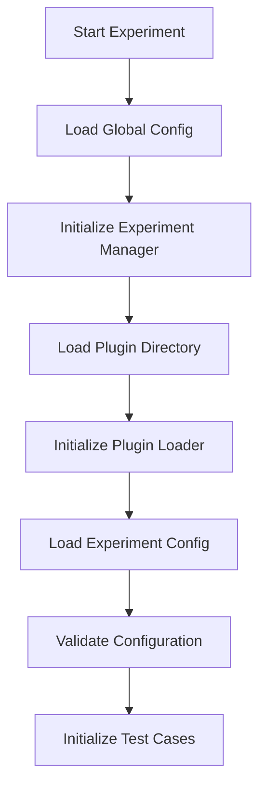
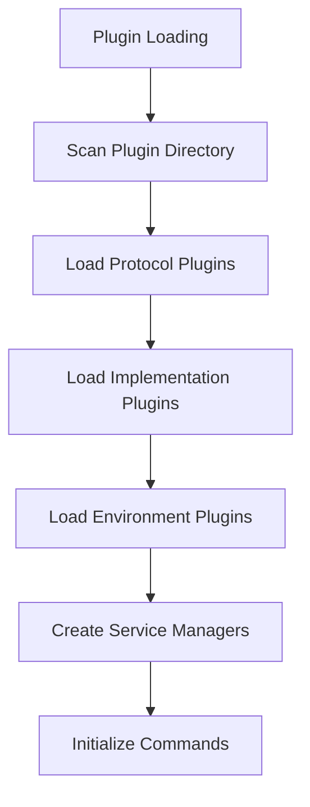
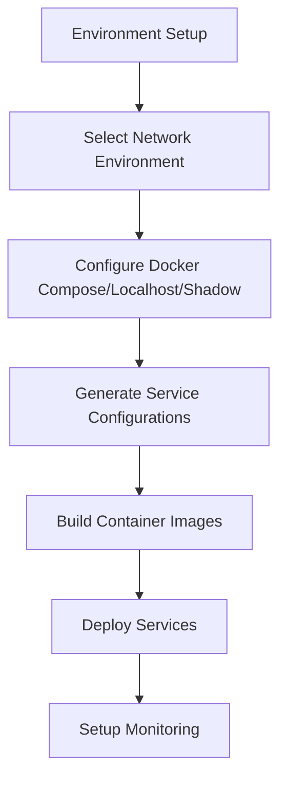
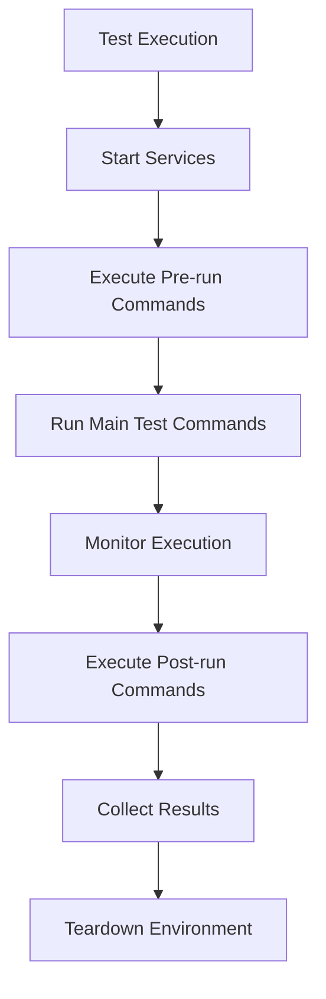

# PANTHER Workflows Documentation

## Overview

PANTHER (Protocol Analysis and Network Testing Framework) is a comprehensive testing framework designed for protocol implementations, particularly focusing on network protocols like QUIC. This document provides a detailed explanation of PANTHER's workflows, including container building processes, experiment execution, and overall system architecture.

## Table of Contents

1. [Architecture Overview](#architecture-overview)
2. [Core Workflow Components](#core-workflow-components)
3. [Experiment Execution Workflow](#experiment-execution-workflow)
4. [Container Building and Deployment](#container-building-and-deployment)
5. [Plugin System Architecture](#plugin-system-architecture)
6. [Service Management Workflow](#service-management-workflow)
7. [Network Environment Setup](#network-environment-setup)
8. [Result Collection and Analysis](#result-collection-and-analysis)
9. [Event-Driven Architecture](#event-driven-architecture)
10. [Configuration Management](#configuration-management)

## Architecture Overview

PANTHER follows a modular, plugin-based architecture that enables testing of various protocol implementations across different network environments. The framework consists of several key components:

- **Experiment Manager**: Orchestrates the entire testing workflow
- **Plugin System**: Manages loading and instantiation of various components
- **Service Managers**: Handle individual protocol implementations (IUT - Implementation Under Test)
- **Environment Plugins**: Manage network and execution environments
- **Observer System**: Provides event-driven monitoring and logging
- **Configuration System**: Handles experiment and global configurations

## Core Workflow Components

### 1. Experiment Manager (`panther/core/experiment_manager.py`)

The Experiment Manager is the central orchestrator that:

- Initializes plugins and configurations
- Creates and manages test cases
- Coordinates experiment execution
- Handles logging and output generation

**Key Methods:**
- `initialize_experiments()`: Sets up plugins, environment, and validates configuration
- `run_tests()`: Executes all test cases with progress tracking
- `_initialize_test_cases()`: Creates TestCase instances from configuration

### 2. Plugin Manager (`panther/plugins/plugin_manager.py`)

Responsible for:
- Loading plugin modules dynamically
- Creating service manager instances
- Managing environment plugin instantiation
- Providing a registry of available plugins

### 3. Test Case (`panther/core/test_cases/test_case.py`)

Each test case:
- Manages a specific test scenario
- Coordinates service managers and environment plugins
- Handles result collection
- Implements observer pattern for event management

## Experiment Execution Workflow

### Phase 1: Initialization



1. **Global Configuration Loading**: Load system-wide settings
2. **Experiment Manager Creation**: Initialize with global config and experiment name
3. **Plugin Directory Setup**: Prepare plugin loading infrastructure
4. **Experiment Configuration**: Load test-specific configurations
5. **Test Case Initialization**: Create TestCase objects for each test

### Phase 2: Plugin Loading and Service Setup



1. **Plugin Discovery**: Scan plugin directories for available components
2. **Service Manager Creation**: Instantiate managers for each implementation
3. **Command Generation**: Generate deployment, run, and post-run commands
4. **Environment Preparation**: Setup network and execution environments

### Phase 3: Environment Setup and Deployment



### Phase 4: Test Execution



## Container Building and Deployment

### Docker Compose Environment Workflow

The Docker Compose environment (`panther/plugins/environments/network_environment/docker_compose/docker_compose.py`) manages:

#### 1. Container Image Building

```python
# Service preparation phase
def prepare(self, plugin_loader: PluginLoader):
    # Build base service image
    plugin_loader.build_docker_image_from_path(
        Path("panther/plugins/services/Dockerfile"),
        "panther_base",
        "service"
    )

    # Build implementation-specific image
    plugin_loader.build_docker_image(
        self.get_implementation_name(),
        self.service_config_to_test.implementation.version
    )
```

#### 2. Docker Compose File Generation

The system generates `docker-compose.yml` files with:

- **Service Definitions**: Each implementation becomes a service
- **Volume Mappings**: Logs, certificates, and shared data
- **Network Configuration**: Container networking setup
- **Environment Variables**: Runtime configuration
- **Command Templates**: Rendered Jinja2 templates for execution

#### 3. Service Coordination

**Synchronization Mechanisms:**
- **Ivy Tester Coordination**: Special handling for Ivy testers with ready signals
- **Shared Volumes**: `/app/sync_logs` for inter-service communication
- **Wait Conditions**: Services wait for dependencies to be ready

**Network Monitoring:**
- **Packet Capture**: Automatic tshark recording for each service
- **Timeout Management**: Configurable execution timeouts
- **Log Collection**: Centralized logging to `/app/logs/`

### Command Generation Workflow

Each service manager generates multiple command types:

#### 1. Pre-compile Commands
- Environment setup
- Dependency installation
- Certificate generation

#### 2. Compile Commands
- Build application binaries
- Setup runtime environment

#### 3. Post-compile Commands
- Final configuration
- Service readiness signals
- Monitoring setup (packet capture)

#### 4. Run Commands
Generated from Jinja2 templates with parameters:
```jinja
{{ certificates.cert_param }} {{ certificates.cert_file }}
{{ certificates.key_param }} {{ certificates.key_file }}
{{ protocol.alpn.param }} {{ protocol.alpn.value }}
-p {{ network.port }} > {{ logging.log_path }} 2> {{ logging.err_path }}
```

#### 5. Post-run Commands
- Result collection
- Artifact preservation
- Cleanup operations

## Plugin System Architecture

### Plugin Types

1. **Service Plugins** (`panther/plugins/services/`)
   - Implementation Under Test (IUT) plugins
   - Tester plugins (e.g., Ivy)
   - Protocol-specific implementations

2. **Environment Plugins** (`panther/plugins/environments/`)
   - Network environments (Docker Compose, localhost, Shadow)
   - Execution environments (performance monitoring, resource limiting)

3. **Protocol Plugins** (`panther/plugins/protocols/`)
   - Protocol-specific configurations
   - Parameter definitions

### Plugin Loading Mechanism

```python
# Dynamic plugin loading
service_manager_path = implementation_dir / f"{implementation.name}.py"
spec = importlib.util.spec_from_file_location(service_module_name, service_manager_path)
module = importlib.util.module_from_spec(spec)
spec.loader.exec_module(module)

# Class instantiation
class_name = PluginLoader.get_class_name(implementation.name, suffix="ServiceManager")
service_manager_class = getattr(module, class_name, None)
```

## Service Management Workflow

### Service Manager Interface

Each implementation provides a service manager that implements:

```python
class IImplementationManager:
    def prepare(self, plugin_loader: PluginLoader) -> None
    def generate_deployment_commands(self) -> str
    def generate_run_command(self) -> dict
    def generate_pre_run_commands(self) -> list
    def generate_post_run_commands(self) -> list
```

### Command Lifecycle

1. **Preparation Phase**:
   - Build Docker images
   - Setup implementation-specific requirements

2. **Deployment Command Generation**:
   - Render Jinja2 templates with runtime parameters
   - Include protocol-specific arguments
   - Configure network and logging parameters

3. **Execution Phase**:
   - Execute pre-run commands
   - Start main service process
   - Monitor execution
   - Execute post-run commands

### Template Rendering

Service managers use Jinja2 templates for flexible command generation:

```python
def render_commands(self, params: dict, template_name: str) -> str:
    template_path = self.get_implementation_dir() / "templates" / template_name
    with open(template_path, 'r') as file:
        template = Template(file.read())
    return template.render(**params)
```

## Network Environment Setup

### Docker Compose Environment

#### Service Configuration Generation

```python
def generate_environment_services(self, paths: dict, timestamp: str):
    # Setup execution plugins
    self.setup_execution_plugins(timestamp)

    # Create log directories for each service
    for service in self.services_managers:
        self.create_log_dir(service)

    # Handle Ivy tester synchronization
    if "ivy" in service.service_name:
        # Add wait conditions for other services
        # Setup shared volume for synchronization

    # Add packet capture to all services
    for service in self.services_managers:
        service.run_cmd["post_compile_cmds"].append(
            f"tshark -a duration:{service.timeout} -i any -w /app/logs/{service.service_name}.pcap"
        )

    # Resolve environment variables
    for service in self.services_managers:
        service.environments = self.resolve_environment_variables(service.environments)
```

#### Volume Management

- **Log Volumes**: Service-specific logging directories
- **Shared Volumes**: Inter-service communication
- **Certificate Volumes**: TLS certificate sharing
- **Data Volumes**: Test data and artifacts

### Localhost Environment

For local testing without containerization:
- Direct process execution
- Local network interfaces
- File-based result collection

### Shadow Network Simulator

For network simulation scenarios:
- Virtual network topologies
- Bandwidth and latency simulation
- Scalability testing

## Result Collection and Analysis

### Result Collector System

```python
class ResultCollector:
    def collect_service_results(self, service_manager: IServiceManager)
    def collect_environment_results(self, environment: IEnvironmentPlugin)
    def generate_summary_report(self)
    def export_results(self, format: str)
```

### Collected Artifacts

1. **Log Files**: Service execution logs
2. **Packet Captures**: Network traffic analysis
3. **Performance Metrics**: Execution time, resource usage
4. **Error Reports**: Failure analysis
5. **Configuration Files**: Test setup documentation

### Storage Handler

```python
class StorageHandler:
    def store_logs(self, service_name: str, logs: str)
    def store_packet_capture(self, service_name: str, pcap_file: Path)
    def store_metrics(self, service_name: str, metrics: dict)
    def create_experiment_archive(self)
```

## Event-Driven Architecture

### Observer Pattern Implementation

PANTHER implements an observer pattern for event management:

```python
class EventManager:
    def register_observer(self, event_type: str, observer: IObserver)
    def notify_observers(self, event: Event)
    def emit_event(self, event_type: str, data: dict)
```

### Observer Types

1. **Logger Observer**: Handles logging events
2. **Experiment Observer**: Tracks experiment lifecycle
3. **Performance Observer**: Monitors resource usage
4. **Result Observer**: Collects test results

### Event Types

- **Experiment Events**: Start, end, error
- **Service Events**: Service start, stop, failure
- **Environment Events**: Environment setup, teardown
- **Test Events**: Test start, completion, failure

## Configuration Management

### Configuration Schema

PANTHER uses OmegaConf for structured configuration:

```python
@dataclass
class ExperimentConfig:
    name: str
    description: str
    tests: List[TestConfig]

@dataclass
class TestConfig:
    name: str
    services: List[ServiceConfig]
    environment: EnvironmentConfig

@dataclass
class ServiceConfig:
    name: str
    implementation: ImplementationConfig
    protocol: ProtocolConfig
    timeout: int
```

### Configuration Validation

- **Schema Validation**: Ensure configuration structure
- **Parameter Validation**: Verify parameter values
- **Dependency Checking**: Validate plugin availability
- **Resource Validation**: Check system requirements

### Configuration Hierarchy

1. **Global Configuration**: System-wide settings
2. **Experiment Configuration**: Test-specific settings
3. **Service Configuration**: Implementation-specific settings
4. **Runtime Configuration**: Dynamic parameters

## Error Handling and Recovery

### Error Management Strategy

1. **Graceful Degradation**: Continue execution when possible
2. **Retry Logic**: Automatic retry for transient failures
3. **Fallback Mechanisms**: Alternative execution paths
4. **Error Reporting**: Comprehensive error logging

### Timeout Management

- **Service Timeouts**: Individual service execution limits
- **Test Timeouts**: Overall test case limits
- **Environment Timeouts**: Setup and teardown limits

## Performance Optimization

### Parallel Execution

- **Concurrent Test Cases**: Multiple tests in parallel
- **Asynchronous Operations**: Non-blocking I/O
- **Resource Management**: CPU and memory optimization

### Caching Mechanisms

- **Image Caching**: Docker image reuse
- **Plugin Caching**: Loaded plugin instances
- **Configuration Caching**: Parsed configurations

## Troubleshooting Guide

### Common Issues

1. **Plugin Loading Failures**
   - Check plugin directory structure
   - Verify class naming conventions
   - Ensure proper inheritance

2. **Container Build Failures**
   - Verify Dockerfile syntax
   - Check dependency availability
   - Review build context

3. **Service Communication Issues**
   - Check network configuration
   - Verify port availability
   - Review firewall settings

4. **Test Execution Failures**
   - Check timeout settings
   - Verify service dependencies
   - Review error logs

### Debugging Tools

1. **Verbose Logging**: Enable detailed logging
2. **Container Inspection**: Docker container analysis
3. **Network Analysis**: Packet capture review
4. **Performance Profiling**: Resource usage analysis

## Best Practices

### Best Practices - Configuration Management

1. Use structured configuration files
2. Validate configurations before execution
3. Document configuration parameters
4. Version control configurations

### Plugin Development

1. Follow naming conventions
2. Implement proper error handling
3. Provide comprehensive logging
4. Include unit tests

### Best Practices - Performance Optimization

1. Use appropriate timeout values
2. Implement resource limits
3. Monitor system resources
4. Optimize container images

### Result Analysis

1. Collect comprehensive metrics
2. Implement result validation
3. Provide clear error reporting
4. Archive results properly

## Conclusion

PANTHER provides a comprehensive framework for protocol testing with flexible plugin architecture, robust container management, and sophisticated workflow orchestration. The event-driven design and modular architecture enable easy extension and customization for various testing scenarios.

The framework's strength lies in its ability to coordinate complex multi-service testing scenarios while providing detailed monitoring, result collection, and error handling capabilities. The Docker Compose environment management ensures reproducible testing conditions while supporting various network topologies and execution environments.
